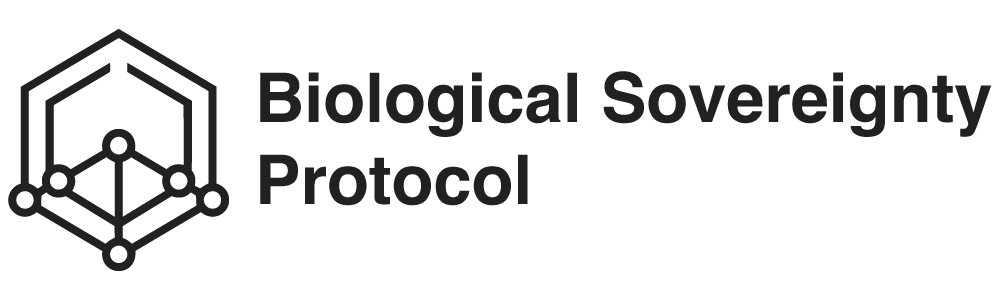

<p align="center">
  
</p>

<h3 align="center">BSP Website</h3>

<p align="center">
  Official website for the Biological Sovereignty Protocol.<br/>
  Documentation, specification, guides & community hub.
</p>

<p align="center">
  <a href="https://biologicalsovereigntyprotocol.com"><strong>biologicalsovereigntyprotocol.com</strong></a>
</p>

<p align="center">
  <a href="https://biologicalsovereigntyprotocol.com"></a>
  <a href="https://github.com/Biological-Sovereignty-Protocol/bsp-website/blob/main/LICENSE"></a>
  <a href="https://github.com/Biological-Sovereignty-Protocol/bsp-spec"></a>
  
  
</p>

---

## About

This is the official website for the **Biological Sovereignty Protocol (BSP)** — an open standard that gives individuals cryptographic ownership of their biological data.

The site serves as the central hub for protocol documentation, technical specification, developer guides, use cases, and community resources.

## Features

- Full protocol documentation (BEO, BioRecord, Exchange, Taxonomy)
- Developer guides with SDK references and code examples
- Interactive architecture diagrams
- Use case library
- Community hub with BIPs (BSP Improvement Proposals)
- Multilingual support (English, Portuguese, Spanish)
- Dark/light mode
- Mobile-first responsive design
- SEO-optimized with structured data

## Tech Stack

- [VitePress](https://vitepress.dev/) — Static site generator
- [Vue 3](https://vuejs.org/) — Custom components
- [Arweave](https://arweave.org/) — Protocol storage layer

## Getting Started

```bash
# Clone the repository
git clone https://github.com/Biological-Sovereignty-Protocol/bsp-website.git
cd bsp-website

# Install dependencies
npm install

# Start development server
npm run dev

# Build for production
npm run build

# Preview production build
npm run preview
```

## Project Structure

```
bsp-website/
├── .vitepress/
│   ├── components/     # Vue components (PremiumLanding, CustomFooter, etc.)
│   ├── theme/          # Custom theme, CSS, 404 page
│   └── config.js       # VitePress configuration (nav, sidebar, i18n)
├── architecture/       # Architecture documentation
├── developers/         # Developer guides, SDK reference, tutorials
├── getting-started/    # Quickstart, FAQ, onboarding
├── specification/      # Full protocol specification
│   └── taxonomy/       # Biomarker taxonomy (L1–L4)
├── use-cases/          # Use case documentation
├── pt/                 # Portuguese translations
├── es/                 # Spanish translations
├── public/             # Static assets (images, robots.txt)
└── package.json
```

## Contributing

We welcome contributions from the community. Here's how you can help:

1. **Report issues** — Found a bug or broken link? [Open an issue](https://github.com/Biological-Sovereignty-Protocol/bsp-website/issues).
2. **Improve translations** — Help us translate documentation to more languages.
3. **Fix documentation** — Submit a PR to improve clarity or fix errors.
4. **Suggest features** — Have an idea? [Start a discussion](https://github.com/Biological-Sovereignty-Protocol/bsp-website/discussions).

### Development Workflow

```bash
# Create a branch
git checkout -b fix/my-improvement

# Make your changes
# ...

# Test locally
npm run dev

# Submit a PR
git push origin fix/my-improvement
```

## Related Repositories

| Repository | Description |
|------------|-------------|
| [bsp-spec](https://github.com/Biological-Sovereignty-Protocol/bsp-spec) | Protocol specification |
| [bsp-sdk-typescript](https://github.com/Biological-Sovereignty-Protocol/bsp-sdk-typescript) | TypeScript SDK |
| [bsp-sdk-python](https://github.com/Biological-Sovereignty-Protocol/bsp-sdk-python) | Python SDK |
| [bsp-mcp](https://github.com/Biological-Sovereignty-Protocol/bsp-mcp) | MCP Server for AI agents |
| [bsp-id-web](https://github.com/Biological-Sovereignty-Protocol/bsp-id-web) | Identity web app |
| [bsp-docs](https://github.com/Biological-Sovereignty-Protocol/bsp-docs) | Protocol documentation |

## License

This project is licensed under the [MIT License](LICENSE).

---

<p align="center">
  Built by the <a href="https://ambrosioinstitute.org">Ambrósio Institute</a><br/>
  <sub>Permanent sovereignty over your biology.</sub>
</p>
