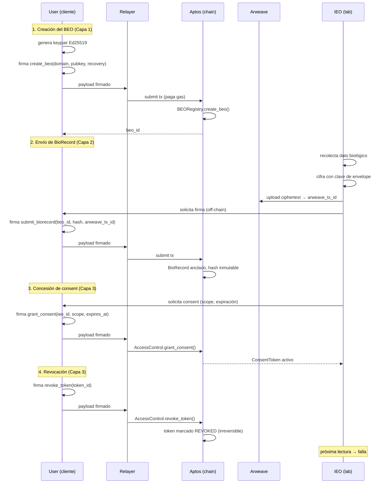

# Biological Sovereignty Protocol

## Un Protocolo de Soberanía Biológica para la Era Algorítmica

**Whitepaper v3.0**

Andre Ambrosio
Instituto Ambrosio
Mayo de 2026

---

**Hash del documento (SHA-256):** *a calcular sobre el artefacto final consolidado*
**DOI:** *en registro junto a Zenodo / OpenAIRE*
**ORCID del autor:** *en emisión*
**Versión canónica:** `https://biologicalsovereigntyprotocol.com/whitepaper` (versión EN, canónica)
**Traducción al español:** `https://biologicalsovereigntyprotocol.com/es/whitepaper`
**Repositorio fuente:** `github.com/Biological-Sovereignty-Protocol/bsp-spec`

---

## Abstract

Los datos biológicos son el último territorio no colonizado por el régimen contemporáneo de soberanía personal. Aunque discutimos ampliamente derechos sobre datos personales, propiedad intelectual y privacidad conductual, el sustrato más íntimo — exámenes, secuencias, métricas fisiológicas y fenotípicas — permanece capturado por una cadena de intermediarios: hospitales, laboratorios, aseguradoras, plataformas de wearables y proveedores de IA médica. Cada intermediario extrae valor sin retorno proporcional al individuo que es, simultáneamente, fuente del dato, sujeto del dato y mayor beneficiario potencial de su uso.

Este whitepaper presenta el **Biological Sovereignty Protocol (BSP)**: un protocolo permissionless (sin permisos) que separa identidad, dato y permiso en tres capas con fronteras de compromiso aisladas. La capa de identidad (BEO — Biological Entity Owner) ancla soberanía mediante criptografía Ed25519 y BLAKE3 sobre Aptos. La capa de datos extiende permanencia verificable vía Arweave con cifrado client-side AES-GCM. La capa de intercambio instrumentaliza consentimiento granular a través de ConsentTokens revocables, AuthorityTokens delegables y borrado criptográfico como mecanismo de compromiso entre inmutabilidad on-chain y el derecho al borrado garantizado por la LGPD, GDPR y PIPL.

Las innovaciones centrales son tres. **Primera:** *borrado criptográfico (cryptographic erasure)* — en lugar de intentar borrar registros inmutables, el protocolo torna el dato matemáticamente irrecuperable mediante la destrucción irreversible de las claves de envoltura. **Segunda:** *multi-relayer ecosystem* — cualquier entidad puede operar un relayer; el Instituto Ambrosio opera solo uno de ellos, sin privilegio sistémico. **Tercera:** *stewardship model* — el Instituto acepta vínculo fiduciario irrevocable como mero administrador, instrumentalizado vía multisig 2-de-3 con timelock de 72 horas, proceso BIP de seis fases y derecho de fork preservado por diseño.

El whitepaper se dirige a cinco audiencias: investigadores en salud, longevidad y bioética; instituciones clínicas y laboratoriales que necesitan una capa interoperable; reguladores que buscan compatibilidad con regímenes de protección de datos; desarrolladores que construyen la próxima generación de aplicaciones de salud; e individuos que reconocen el propio cuerpo como el último territorio a ser reapropiado.

El protocolo está en implementación activa. La taxonomía BSP (26 dominios), los contratos Move, los SDKs en TypeScript y Python, y el relayer de referencia operado por Ambrosio Company están en producción limitada. La validación científica del AVA (Anamnesis Virtual Autónoma) — la capa algorítmica propietaria construida sobre el protocolo — sigue cronograma peer-reviewed en cuatro etapas: validación retrospectiva, prospectiva, multi-cohorte y regulatoria. Este documento describe el estado actual, declara honestamente las incertidumbres remanentes y convida a la crítica pública.

---

## Executive Summary

*Para el lector con diez minutos.*

### El problema

Hay un desencuentro ontológico entre lo que los datos biológicos son y el régimen jurídico-tecnológico que los trata. Los datos biológicos no son rastros conductuales agregables; son **constitución** — la inscripción material de lo que un cuerpo es, fue y tiende a tornarse. Tratarlos como commodity informacional, como hace el régimen contemporáneo, equivale a tratar la propiedad de la tierra con la misma instrumentalidad jurídica del préstamo de una herramienta. La categoría está equivocada.

La consecuencia práctica es una asimetría informacional sistémica. Hospitales y laboratorios mantienen copias propietarias de datos que no generaron. Las plataformas de wearables monetizan patrones fisiológicos sin repartir valor. Las aseguradoras tarifan riesgo a partir de inferencias sobre cuerpos cuyos dueños no tienen acceso al modelo. La IA médica se entrena en bases de las cuales el sujeto del dato es, en el mejor caso, anónimo — y, en el peor, rastreable. El individuo, fuente y sujeto, ocupa la posición de menor poder informacional en la cadena.

### La solución

El **Biological Sovereignty Protocol** es una respuesta técnica a ese problema. No es una plataforma. No es un producto. No es un token. Es una especificación abierta de tres capas:

1. **Identidad (BEO).** Cada individuo posee una identidad biológica auto-soberana, anclada en par de claves Ed25519 generado client-side, registrada on-chain (Aptos), con recuperación por 2-de-3 guardianes y soporte a dominios humanamente legibles.

2. **Datos (BioRecord).** Cada registro biológico es cifrado client-side con AES-GCM, persistido en Arweave vía relayer, y anclado on-chain por hash BLAKE3. La taxonomía BSP organiza 26 dominios — laboratoriales, genómicos, fenotípicos, fisiológicos, ambientales — en estructura interoperable.

3. **Intercambio (Exchange).** Cualquier compartimiento ocurre vía ConsentToken — alcance, intent, plazo, revocabilidad. Las delegaciones ocurren vía AuthorityToken. La revocación es técnicamente irreversible: el borrado criptográfico destruye la clave de envoltura, tornando el dato matemáticamente irrecuperable aun cuando el ciphertext permanezca en almacenamiento permanente.

### Las seis tesis del whitepaper

- **Parte I — Filosofía.** El dato biológico es ontológicamente distinto. Es constitución, no rastro. Exige soberanía técnica vía inversión de la asimetría informacional, no privacidad reformista.

- **Parte II — Protocolo.** BSP separa identidad, dato y permiso en tres capas con fronteras de compromiso aisladas, anclando integridad vía Ed25519 y BLAKE3 on-chain (Aptos) y permanencia vía Arweave, con revocación irreversible y borrado criptográfico como compromiso entre inmutabilidad y LGPD.

- **Parte III — Economía.** Modelo híbrido sin token: endowment institucional capitalizado por Ambrosio Company como base perpetua, complementado por subscription premium del relayer oficial, transferencia de las commercial arms (Health, AVA, SVA) y grants filantrópicos. El protocolo es gratuito para el BEO; el relayer es commodity competitiva.

- **Parte IV — Institución.** El Instituto Ambrosio acepta vínculo fiduciario irrevocable como custodio (steward) — no beneficiario — instrumentalizado vía multisig 2-de-3 con timelock de 72 horas, proceso BIP de seis fases, comité técnico con mandatos staggered y derecho de fork preservado.

- **Parte V — Inteligencia.** La soberanía no exige código abierto del AVA. Exige derecho de salida, reproducibilidad verificable, validación peer-reviewed y competencia libre entre algoritmos. AVA es propietario hoy porque sustenta la investigación que torna confiable el protocolo; deja de necesitar serlo en el momento en que la confianza se vuelva sistémica.

- **Parte VI — Horizonte.** La soberanía biológica es derecho, no privilegio — y los derechos exigen infraestructura invisible y no-extractiva, del mismo modo que GPL hizo por el software, HTTP hizo por la información y TCP/IP hizo por la conectividad.

### Invitación

Quien lee este documento es invitado a tres tipos de acción. **Construir** — implementar relayers, SDKs, integraciones, aplicaciones. **Adoptar** — para individuos, crear el primer BEO; para instituciones, integrar como Information Exchange Operator. **Criticar** — encontrar errores, proponer mejoras vía proceso BIP, hacer fork si discrepa. El protocolo es obra abierta, en evolución, y la única forma equivocada de engagement es el silencio.

---

## Resumen Ejecutivo Visual

### Arquitectura en tres capas

```
  ┌──────────────────────────────────────────────────────────┐
  │                  CAPA DE INTERCAMBIO                      │
  │   ConsentToken · AuthorityToken · Revocación · Erasure   │
  └──────────────────────────────────────────────────────────┘
                              ▲
                              │
  ┌──────────────────────────────────────────────────────────┐
  │                    CAPA DE DATOS                          │
  │     BioRecord · AES-GCM · Arweave · Hash · 26 dominios   │
  └──────────────────────────────────────────────────────────┘
                              ▲
                              │
  ┌──────────────────────────────────────────────────────────┐
  │                  CAPA DE IDENTIDAD                        │
  │     BEO · Ed25519 · Aptos · Domain Registry · Recovery   │
  └──────────────────────────────────────────────────────────┘
```

### Las cinco promesas auditables

| # | Promesa | Mecanismo técnico | Verificable por |
|---|---------|-------------------|-----------------|
| 1 | **Sovereignty by default** | Claves generadas client-side; ningún servidor puede producir BEO sin firma del titular | Inspección de código + análisis de transacciones on-chain |
| 2 | **Consent by signature** | Todo intercambio exige ConsentToken firmado; la firma es onus computacional + intencional del BEO | Trail de auditoría pública en la capa Exchange |
| 3 | **Permanence with erasability** | Ciphertext en Arweave (permanencia); clave de envoltura borrable (borrado) | Cryptographic erasure ceremony pública |
| 4 | **Permissionless creation** | Cualquier individuo crea BEO sin aprobación; cualquier entidad opera relayer | Repositorio abierto + ausencia de gatekeeping |
| 5 | **Steward, not beneficiary** | Instituto Ambrosio bajo multisig 2-de-3 con timelock; derecho de fork preservado | Multisig público + proceso BIP auditable |

---

## Tabla de Contenidos

### PARTE I — FUNDAMENTOS FILOSÓFICOS

- Capítulo 1 — La Cuestión de la Soberanía
- Capítulo 2 — Biopoder y el Algoritmo
- Capítulo 3 — Las Apuestas Civilizacionales
- Capítulo 4 — Primeros Principios

### PARTE II — EL PROTOCOLO

- Capítulo 1 — Visión Arquitectural
- Capítulo 2 — Capa de Identidad (BEO)
- Capítulo 3 — Capa de Datos (BioRecord)
- Capítulo 4 — Capa de Intercambio (Exchange)
- Capítulos subsecuentes — Cryptographic Erasure, Relayers, Multi-chain, Modelos de Ataque

### PARTE III — LA ECONOMÍA (SOSTENIBILIDAD DEL PROTOCOLO)

- Capítulo 1 — La Economía del Relayer Abierto
- Capítulo 2 — Sostenibilidad del Instituto Ambrosio
- Capítulo 3 — Incentivos Institucionales
- Capítulo 4 — Análisis de Costos a Largo Plazo (10 años)
- Capítulo 5 — Externalidades y Bienes Públicos

### PARTE IV — LA INSTITUCIÓN (GOBERNANZA Y STEWARDSHIP)

- Capítulo 1 — La Doctrina del Custodio (Steward)
- Capítulo 2 — BIP-0001: Multisig 2-de-3 con Timelock
- Capítulo 3 — El Proceso BIP (Biological Improvement Proposal)
- Capítulo 4 — El Comité Técnico Científico
- Capítulo 5 — Sucesión, Continuidad y Conflictos

### PARTE V — LA INTELIGENCIA (AVA & SVA)

- Capítulo 1 — La Tesis de la Capa Propietaria
- Capítulo 2 — Metodología del AVA
- Capítulo 3 — Validación Metodológica
- Capítulo 4 — API Pública y Reproducibilidad
- Capítulo 5 — Soberanía en la Era Algorítmica

### PARTE VI — EL HORIZONTE

- Capítulo 1 — Roadmap 5 Años
- Capítulo 2 — Estrategia de Adopción en 3 Frentes
- Capítulo 3 — Modos de Falla y Mitigación
- Capítulo 4 — La Visión de 10–50 Años
- Capítulo 5 — Call to Action

### CONCLUSIÓN

### APÉNDICES

- Apéndice A — Taxonomía BSP Completa (26 dominios)
- Apéndice B — Compliance LGPD / GDPR / HIPAA
- Apéndice C — Glosario Completo
- Apéndice D — Bibliografía General
- Apéndice E — Referencias de Implementación

---

## Sobre el Autor

**Andre Ambrosio** es fundador de Ambrosio Company y arquitecto del Biological Sovereignty Protocol. Trabaja en la intersección entre ingeniería de longevidad, sistemas descentralizados e infraestructura crítica para salud humana. Reside en Brasil. Conduce, paralelamente al BSP, programas en suplementación funcional, hardware de monitoreo fisiológico y sistemas de IA médica de transparencia verificable.

La motivación declarada para el BSP es simultáneamente práctica y civilizacional: garantizar que la próxima generación — comenzando por sus propios hijos — herede datos biológicos bajo soberanía, y no bajo captura. La intención institucional es de largo plazo, multi-generacional, e instrumentalizada por medio de vínculo fiduciario irrevocable entre el autor y el protocolo.

**Contacto público:** vía GitHub: github.com/Biological-Sovereignty-Protocol
**Identidad BEO de referencia:** `bsp://andre.ambrosio` (a publicarse en la red principal)

---

## Cómo Citar Este Documento

```
Ambrosio, A. (2026). Biological Sovereignty Protocol:
Un Protocolo de Soberanía Biológica para la Era Algorítmica.
Whitepaper v3.0. Instituto Ambrosio.
https://biologicalsovereigntyprotocol.com/whitepaper
```

**BibTeX:**

```bibtex
@techreport{ambrosio2026bsp,
  author      = {Ambrosio, Andre},
  title       = {Biological Sovereignty Protocol: A Biological Sovereignty Protocol for the Algorithmic Era},
  institution = {Instituto Ambrosio},
  type        = {Whitepaper},
  number      = {v3.0},
  year        = {2026},
  month       = {5},
  url         = {https://biologicalsovereigntyprotocol.com/whitepaper}
}
```

---

## Licencia

- **Texto de este whitepaper:** Creative Commons Attribution-ShareAlike 4.0 International (CC BY-SA 4.0). Reproducción, traducción, adaptación y distribución son permitidas, siempre que sean atribuidas al autor y mantenidas bajo la misma licencia.
- **Especificación técnica y referencias de implementación:** licencias open-source listadas en el Apéndice E (predominantemente MIT y Apache 2.0).
- **Modelo de circulación:** análogo al del whitepaper Bitcoin de 2008 — open knowledge, sin reserva de propiedad intelectual sobre las ideas centrales. Los forks, traducciones y críticas públicas son explícitamente alentados.

---

## Aviso Legal

Este documento es un trabajo técnico-científico y político-filosófico. **No constituye asesoramiento médico, jurídico o financiero.**

- El BSP es un mecanismo técnico. La conformidad regulatoria local — LGPD, GDPR, HIPAA, PIPL y legislaciones sectoriales aplicables — es responsabilidad del operador de relayer, de la institución integradora y del individuo titular del BEO, según aplique.
- AVA y SVA son instrumentos de análisis y soporte a la decisión. **No sustituyen diagnóstico médico, prescripción ni intervención clínica.** Cualquier decisión de salud derivada del uso de tales sistemas debe ser conducida por profesional cualificado.
- El cifrado y custodia de claves criptográficas implican riesgos. La pérdida de claves sin mecanismo de recuperación configurado puede resultar en pérdida permanente de acceso a datos. El protocolo provee mecanismos (recovery 2-de-3, ephemeral keys, AuthorityTokens) — su adopción es responsabilidad del BEO.
- Las proyecciones financieras, cronogramas de adopción y escenarios de largo plazo presentados reflejan premisas declaradas. Los resultados reales pueden divergir.

---

## Introducción

Hay momentos en que los problemas estructurales se cristalizan en ventanas estrechas de decisión. Este es uno de ellos.

Cuatro procesos convergen, en escala global, hacia la misma encrucijada. **Primero:** la frontera de la longevidad humana se movió, por primera vez en la historia, de tema religioso o filosófico a problema de ingeniería. La ciencia de la senescencia, la biología molecular del envejecimiento y la medicina preventiva avanzan a un ritmo que torna verosímil — aunque no garantizada — la extensión clínicamente significativa de la expectativa de vida saludable dentro del siglo. **Segundo:** la inteligencia artificial médica pasó del estadio de demostración al estadio de implementación. Modelos predictivos sobre datos fisiológicos y fenotípicos hoy informan decisiones clínicas reales, y esa tendencia solo se profundiza. **Tercero:** la infraestructura Web3 alcanzó, tras más de una década de iteración, la madurez necesaria para sustentar protocolos de identidad descentralizada y almacenamiento permanente a escala. **Cuarto:** las crisis de privacidad y captura de datos — Cambridge Analytica, filtraciones sistémicas en hospitales, escándalos de plataformas de wearables — formaron, en la opinión pública y en los legisladores, una sensibilidad sin precedente para la fragilidad del régimen actual.

La intersección de esos cuatro procesos define la ventana. Sin el avance de longevidad, los datos biológicos serían apenas una categoría más. Sin IA médica, serían datos sin inferencia sistémica. Sin Web3 maduro, la soberanía sobre ellos sería retórica sin sustrato. Sin la crisis de privacidad, faltaría presión pública y regulatoria. Los cuatro juntos tornan al **ahora** un momento de decisión.

La decisión es simple y binaria: el dato biológico será tratado como **commodity privada** — capturada, monetizada y revendida por la próxima ola de plataformas — o como **derecho infraestructural** — protegido por código verificable, gobernado por institución auditable y operado en red permissionless. No hay tercer camino relevante. Los intentos de regulación reformista sobre el régimen actual apenas administran la captura; no la invierten. La inversión exige infraestructura nueva.

Este whitepaper es el intento pragmático de instrumentalizar la segunda elección.

### Qué esperar

El documento es deliberadamente híbrido en tono. **Filosófico** en la Parte I, porque un protocolo sin fundamento conceptual es solo software, y el software desprovisto de fundamento se rinde al primer viento institucional o comercial que sopla en su contra. **Técnico** en la Parte II, porque las promesas filosóficas sin mecanismo verificable son propaganda. **Económico** en la Parte III, porque la infraestructura que no se sostiene muere, y el silencio sobre la sostenibilidad es la forma más común de fracaso de los protocolos descentralizados. **Institucional** en la Parte IV, porque la gobernanza importa más que la tecnología en el largo plazo, y cualquier proyecto que prometa "código es ley" sin instrumentalizar contención de poder humano está repitiendo errores conocidos. **Algorítmico** en la Parte V, porque la era es algorítmica, y cualquier soberanía que se detenga en la capa de datos ignora el escenario donde la captura efectiva ocurre. **Prospectivo** en la Parte VI, porque la adopción sin cronograma honesto es fe, no estrategia.

### Cómo leer

La lectura secuencial es la forma plena, pero no la única legítima. Los investigadores en filosofía política y bioética encontrarán el argumento sustantivo en las Partes I y IV. Los ingenieros y auditores de seguridad encontrarán la especificación concreta en las Partes II y V y en los Apéndices A, C y E. Los reguladores y oficiales de compliance encontrarán el análisis jurídico en el Apéndice B y en la Parte IV. Los operadores institucionales — hospitales, laboratorios, clínicas, fabricantes de wearables — encontrarán la tesis de adopción en las Partes III y VI. Los individuos que buscan entender por qué esto les importa encontrarán la respuesta breve en el Resumen Ejecutivo y la respuesta larga en la Parte I.

### Invitación a la crítica

Este whitepaper no es una obra terminada. Es una instantánea de la v3.0 de un protocolo en evolución, escrito por un autor que reconoce los límites del propio juicio y la imposibilidad de prever, aisladamente, todas las fallas estructurales de un sistema de esa ambición. Hay errores aquí. Hay lagunas aquí. Hay premisas que envejecerán mal aquí.

La respuesta institucional al reconocimiento de esa falibilidad no es el silencio sobre las fallas — es el proceso. El proceso BIP descrito en la Parte IV es el canal formal de crítica. El derecho de fork descrito a lo largo del documento es el canal informal. La bibliografía en el Apéndice D es la base sobre la cual cualquier crítica responsable necesita construirse. Y el autor, como custodio declarado y no como beneficiario, es parte interesada en recibir crítica — no en silenciarla.

Buena lectura.

— *Andre Ambrosio*
*Mayo de 2026*
# Parte I — Fundamentos Filosóficos

> *"El cuerpo es el último territorio sobre el cual aún no hay acuerdo de paz."*

---

## Capítulo 1 — La Cuestión de la Soberanía

### 1.1 Un dato que no es como los otros

Toda discusión seria sobre datos comienza por una confusión de categorías. Tratamos como equivalentes cosas profundamente desiguales: el historial de compras en una tienda, la localización de un celular, una conversación de mensajes, la secuenciación del genoma. Todo es "dato". Todo viaja por los mismos cables, se guarda en los mismos servidores, gobernado por las mismas políticas de privacidad redactadas por abogados que nadie lee. Esta indistinción es la fuente de casi todos los errores de lo que se discute como soberanía digital en el siglo XXI.

El dato biológico no es una categoría más en esta lista. Es ontológicamente distinto. Un historial de compras es rastro — registro de lo que hicimos. Un dato biológico es *constitución* — registro de lo que somos. La diferencia no es semántica; es metafísica. El genoma de una persona no fue *generado* por ella al usar una plataforma. La precede. Ella es la manifestación de él. Cuando alguien transfiere un genoma a una empresa, no está cediendo un producto de su trabajo o de su atención: está cediendo la fórmula matemática de su propio cuerpo, junto con la de sus padres, sus hijos, sus descendientes aún no nacidos.

La medicina y el derecho del siglo XX nunca enfrentaron esta distinción en profundidad. Operaron con una ficción útil: la de que el dato clínico pertenece a la institución que lo genera. El hospital realiza el examen, "luego" el examen es del hospital, con obligaciones de sigilo profesional y derecho de acceso del paciente como concesión regulatoria. La lógica es la misma del escribano medieval que detentaba las escrituras porque sabía escribir. Se resolvió el problema del *almacenamiento*; jamás se resolvió el problema de la *propiedad*.

La pregunta que este whitepaper enfrenta es simple y radical: **¿a quién pertenece el dato biológico de un ser humano?** No en el sentido jurídico de las legislaciones actuales — la LGPD brasileña, el GDPR europeo, la HIPAA estadounidense ofrecen versiones parciales, y todas confunden *derecho de acceso* con *propiedad*. La pregunta es anterior. Es filosófica. Antes de regular, necesitamos entender qué estamos regulando.

### 1.2 Locke y el cuerpo como propiedad primaria

John Locke, en el *Segundo Tratado sobre el Gobierno Civil* (1689), ofrece el punto de partida indispensable. Para Locke, antes de cualquier propiedad externa — tierra, herramientas, frutos del trabajo — existe una propiedad originaria, de la cual todas las demás se derivan: la propiedad que cada hombre tiene sobre su propia persona.

> "Aunque la Tierra y todas las criaturas inferiores sean comunes a todos los hombres, cada hombre tiene una *propiedad* en su propia *persona*. A esta nadie tiene derecho sino él mismo. El *trabajo* de su cuerpo y la *obra* de sus manos, podemos decir, son propiamente suyos."[^1]

El pasaje es más sutil de lo que parece. Locke no dice apenas que el cuerpo es propiedad. Dice que el cuerpo es la propiedad *primaria* — aquella que torna posible cualquier otra. Cuando mezclo mi trabajo con la tierra, transformo tierra común en propiedad mía, pero solo porque el trabajo era *ya* mío, y el trabajo era mío porque el cuerpo que lo producía era mío. Toda la teoría liberal de la propiedad depende, en su raíz, de un axioma sobre el cuerpo.

Ahora bien, si el cuerpo es propiedad primaria, ¿qué es el dato biológico sino la *representación digital* de esa propiedad? La secuencia genómica de una persona no es una copia de su imagen ni un rastro de su comportamiento — es la especificación técnica del propio cuerpo. Tratarla como propiedad de una institución es exactamente el tipo de inversión que Locke combatía: es como decir que la tierra pertenece al escribano que registró la escritura.

### 1.3 Nozick y el axioma de la auto-propiedad

Robert Nozick, en *Anarquía, Estado y Utopía* (1974), radicaliza a Locke. Para Nozick, la auto-propiedad (*self-ownership*) no es apenas la base de la propiedad material; es el axioma moral fundamental del cual derivan todos los derechos. Los individuos, escribe, "tienen derechos, y hay cosas que ninguna persona o grupo puede hacerles (sin violar sus derechos)."[^2]

Nozick hace una distinción que importa para nosotros: entre *propiedad* y *uso*. Yo puedo ser propietario de algo sin usarlo, y puedo usar algo sin ser su propietario. La propiedad es el conjunto de derechos sobre una cosa — derecho a excluir, derecho a transferir, derecho a modificar, derecho a destruir. El uso es apenas uno de esos derechos. La medicina contemporánea opera en un régimen extraño en el cual las instituciones tienen derecho de uso casi irrestricto sobre los datos biológicos de las personas, mientras las propias personas apenas ejercen alguno de los derechos de propiedad plena. Es una propiedad fantasma, de la cual sobró apenas el nombre.

La objeción común a Nozick es que su noción de auto-propiedad lleva a aceptar cosas moralmente desagradables — venta de órganos, contratos de servidumbre. No necesito resolver aquí esa polémica. Basta observar que el argumento de la auto-propiedad *no exige* la permisión de la venta; exige apenas el reconocimiento de la titularidad. Puedo ser dueño de mi cuerpo y, aun así, considerar que ciertas alienaciones están moralmente vedadas — exactamente como soy dueño de mi voto y aun así no puedo venderlo. La inalienabilidad es un *modo* de propiedad, no su negación.

Este es el primer principio del BSP: el dato biológico es inalienable-por-default. El individuo es dueño. Puede liberar acceso. No puede, bajo ninguna circunstancia contractual, ceder propiedad plena de forma irrevocable. Toda concesión es, por construcción, revocable. La propiedad queda; el uso puede circular.

### 1.4 Propiedad, control, legado

La discusión sobre datos biológicos suele reducirse a "privacidad", y eso es un error. La privacidad es apenas una de las tres dimensiones en juego. Las otras dos son *control* y *legado*, y ninguna de las tres se reduce a las demás.

**Propiedad** es la cuestión metafísica: ¿a quién pertenece esto? Sin respuesta clara, todas las demás cuestiones quedan mal formuladas. Si el dato es de la institución, hablar de "consentimiento del paciente" es cortesía, no derecho.

**Control** es la cuestión política: ¿quién decide qué se hace con esto, *ahora*? Aun si aceptamos que el dato pertenece al individuo, el control puede estar en otra parte. Los bancos detentan dinero ajeno y lo controlan por largos períodos bajo reglas estrictas. Los hospitales detentan datos ajenos y los controlan bajo reglas laxas. La diferencia es regulatoria, no ontológica.

**Legado** es la cuestión temporal: ¿qué ocurre con esto cuando yo muera? Esta dimensión es casi siempre ignorada en los debates sobre privacidad, y tal vez sea la más importante. Un dato biológico no es apenas tuyo — contiene información sobre tus padres, hermanos y descendientes. Tu mortalidad no encierra el valor del dato. Por el contrario: el valor de una serie temporal genómica y fisiológica de una persona solo se manifiesta plenamente *décadas* después, cuando se torna posible comparar trayectorias, calibrar relojes biológicos, entrenar modelos predictivos.

¿Quién decide qué ocurre con tus datos cuando ya no estés aquí? Hoy, en casi todos los sistemas actuales, *nadie decide* — el dato queda congelado en un servidor de hospital hasta ser arrojado en un backup que nadie más consulta, o es integrado a un banco corporativo cuyas políticas tú jamás leíste. El legado es borrado por omisión. El BSP propone que el legado biológico sea, como el legado patrimonial, una decisión explícita del titular, ejecutable programáticamente.

### 1.5 La medicina paternalista y su límite

La medicina del siglo XX se construyó sobre una asimetría informacional: el médico sabe, el paciente no. Esta asimetría justificó un paternalismo que, en su versión benigna, era cuidado, y en su versión dura, era expropiación. La consagración jurídica de eso es el concepto de "historia clínica", documento que describe al paciente pero pertenece a la institución.

Eric Topol, en *The Patient Will See You Now* (2015), narra esta inflexión con claridad clínica.[^3] Topol — cardiólogo, investigador, y uno de los primeros en articular lo que llamó "democratización de la medicina" — muestra que la tecnología ya tornó obsoleta la asimetría que justificaba el paternalismo. El paciente que mide su propio ECG en el smartwatch, secuencia su propio genoma por correo, y consulta su propio resultado de examen antes que el médico, *ya es* el titular de la información. La estructura institucional es la que aún no acompañó.

> "El futuro de la medicina es el paciente. No como receptor pasivo del cuidado, sino como sujeto activo del conocimiento sobre el propio cuerpo. La medicina basada en datos es, por su propia naturaleza, una medicina que devuelve al paciente lo que siempre fue suyo — y que la tecnología anterior obligaba a ser provisoriamente delegado."[^3]

El punto de Topol es importante: la asimetría informacional fue resuelta técnicamente. Lo que sobró es una asimetría *jurídica* e *infraestructural* — no hay dónde, cómo, ni en qué protocolo el individuo deposite sus propios datos bajo su propio control. El BSP es una respuesta a este vacío.

---

## Capítulo 2 — Biopoder y el Algoritmo

### 2.1 Foucault y la gestión estadística de la vida

Michel Foucault, en el curso *Nacimiento de la Biopolítica* (1978-1979) en el Collège de France, y antes en *Vigilar y Castigar* (1975), traza una genealogía indispensable para entender lo que está en juego aquí. Para Foucault, el poder moderno no es principalmente el poder soberano de "hacer morir y dejar vivir" — es, al contrario, el poder de "hacer vivir y dejar morir". Es un poder que se ejerce sobre la vida, sobre los cuerpos colectivos, a través de su medición, clasificación, gestión estadística.[^4]

Este *biopoder* no opera por prohibición directa. Opera por estadística y norma. No es el rey quien decide quién muere; es la tabla actuarial la que decide cuáles cuerpos son saludables, cuáles son desviantes, cuáles merecen inversión, cuáles son descartables. El biopoder, en la formulación de Foucault, es "el poder que tomó la vida bajo su control como objeto explícito".[^5]

Hay una observación de Foucault que vale recordar literalmente:

> "Por primera vez en la historia, sin duda, lo biológico se refleja en lo político; el hecho de vivir ya no es ese sustrato inaccesible que solo emerge de tiempo en tiempo, en el azar de la muerte y su fatalidad: pasa, en parte, al campo del control del saber y la intervención del poder."[^6]

El pasaje es de 1976, antes de cualquier hoja de cálculo electrónica masiva, antes del genoma secuenciado, antes del *deep learning*. Foucault describía un poder estatal que clasificaba poblaciones por tasa de mortalidad, fertilidad, morbilidad. La versión contemporánea de ese poder es incomparablemente más granular. Ya no clasifica poblaciones; clasifica *individuos*, en tiempo real, y ajusta intervenciones por persona. La hoja de cálculo se convirtió en modelo predictivo. La población se convirtió en un vector de embeddings.

El punto es que el biopoder del siglo XXI ya no es primariamente estatal. Es *plataformizado*. Quien detenta los datos biológicos detenta la capacidad de clasificar, predecir, intervenir — y esa capacidad está hoy, casi enteramente, en media docena de empresas privadas y en sistemas hospitalarios fragmentados. Foucault describió el nacimiento del biopoder; vivimos su maduración algorítmica.

### 2.2 Byung-Chul Han y la vigilancia consensual

Si Foucault describió el biopoder como algo que se ejerce *sobre* el sujeto, Byung-Chul Han, en *Psicopolítica* (2014), describe su mutación contemporánea: un poder que opera *a través* del propio sujeto, con su participación activa y entusiasta. El sujeto de la psicopolítica, escribe Han, "se explota a sí mismo voluntariamente creyendo estar realizándose".[^7]

Han hace una distinción que merece pausa: la vigilancia clásica era *visible y externa*. Había un ojo que vigilaba, y el sujeto lo sabía, o al menos podía descubrirlo. La vigilancia contemporánea es *invisible e internalizada*. El sujeto genera los datos, paga por el dispositivo que los recolecta, los exhibe públicamente, y aún agradece por el "servicio" que recibe a cambio. No hay panóptico, porque no hay necesidad de torre — el vigilado es también el vigía.

> "La psicopolítica neoliberal es la técnica de dominación que estabiliza el sistema dominante mediante una programación y un control psicológicos. (…) El smartphone es el aparato central de la psicopolítica neoliberal. Hace de la explotación una diversión."[^8]

Apliquemos esto al dato biológico. La persona que coloca su ADN en un test de ascendencia comercial está, en la taxonomía de Han, ejecutando un acto perfecto de psicopolítica. Paga por el test. Cede derechos amplios vía términos de uso. Recibe a cambio una narrativa identitaria ("eres 23% ibérico, 7% norteafricano") que satisface una curiosidad genuina. Y entrega, en el proceso, al sistema corporativo, el dato más constitutivo de su ser — junto con inferencias sobre todos sus parientes biológicos, que jamás consintieron. Sale de la transacción sintiéndose *empoderada*. Es el triunfo psicopolítico exacto.

Hay un error frecuente en quienes critican ese escenario: imaginar que la solución es "menos recolección", "menos plataforma", "regreso a lo analógico". Esta nostalgia es estéril. La recolección es buena — saber sobre el propio cuerpo es saber sobre uno mismo. El problema no es la cantidad de dato; es la *dirección* de la asimetría. ¿Quién detenta el modelo entrenado sobre tu cuerpo? ¿Quién decide a quién responde? ¿Quién lucra cuando la inferencia sobre ti se vende a un tercero?

### 2.3 Harari y el algoritmo que te conoce mejor

Yuval Harari, en *Homo Deus* (2016), articula tal vez la versión más nítida de lo que está en juego. Su tesis, allí, es que el humanismo liberal — fundado en la creencia de que el individuo es la fuente última de sentido y autoridad sobre sí — entra en colapso cuando los algoritmos pasan a conocer al individuo *mejor de lo que él se conoce*.[^9]

> "Una vez que el Big Data nos conozca mejor de lo que nos conocemos, la autoridad pasará de los humanos a los algoritmos. (…) Si la autoridad humana proviene de la experiencia subjetiva, y el algoritmo tiene acceso más fiel a mi experiencia que yo mismo, ¿por qué sería yo la autoridad sobre mí?"[^10]

La pregunta es cortante y merece tomarse en serio. Harari no está haciendo ciencia ficción. Está describiendo una migración de autoridad ya en curso: cuando la aplicación recomienda ejercicios más adecuados a tu patrón fisiológico que lo que tú "sientes ganas" de hacer; cuando el modelo predice tu humor mañana basándose en variables fisiológicas que no percibes; cuando tu médico, en consulta, abre un software que conoce tu trayectoria biológica con más detalle que tu memoria.

La respuesta que muchos dan a Harari es defensiva: intentar contener la inteligencia artificial, mantener a lo humano como autoridad por decreto. Esta respuesta es débil porque lucha contra el reloj. La inteligencia sobre el cuerpo *va* a exceder la auto-percepción. La cuestión no es si eso ocurrirá, sino *quién* tendrá esa inteligencia.

### 2.4 La inversión de la asimetría

Aquí está, en mi visión, el punto donde los tres autores convergen hacia un problema que ninguno de ellos resolvió enteramente: el biopoder existe; la vigilancia consensual es su forma contemporánea; la transferencia de autoridad de lo humano al algoritmo es un hecho en curso.

La próxima fase, entonces, no puede ser "menos vigilancia" — esta nostalgia no escala y no combate el problema real. La próxima fase es la **inversión de la asimetría**: el individuo pasa a detentar el algoritmo sobre sí, en lugar de que la plataforma detente el algoritmo sobre el individuo.

La diferencia es técnica y civilizacional. Técnicamente, exige que los datos biológicos personales sean almacenados de forma que el titular controle las claves; que los modelos derivados de esos datos sean entrenados bajo consentimiento criptográficamente verificable; que el titular pueda correr inferencias sobre su propio cuerpo sin necesitar pedir licencia a una plataforma. Civilizacionalmente, es la diferencia entre un futuro donde el conocimiento sobre el cuerpo humano está privatizado en media docena de empresas, y un futuro donde es un bien común auditable con soberanía individual.

Esta es la apuesta filosófica del BSP. No es "anti-tecnología". Es anti-asimetría. No es "menos dato". Es *mi* dato.

### 2.5 Zuboff y el capitalismo de vigilancia

Shoshana Zuboff, en *La Era del Capitalismo de la Vigilancia* (2019), ofrece una cartografía detallada de cómo se construyó institucionalmente la asimetría actual. Su tesis es que el capitalismo de vigilancia no es una extensión accidental del capitalismo industrial, sino un régimen económico distinto, fundado en la expropiación de lo que ella llama "la experiencia humana como materia prima gratuita para prácticas comerciales ocultas".[^11]

> "El capitalismo de vigilancia reivindica unilateralmente la experiencia humana como materia prima gratuita para traducción en datos conductuales. Aunque algunos de esos datos se aplican al mejoramiento del producto o servicio, el resto es declarado *behavioral surplus* propietario, alimentado en procesos de manufactura avanzados conocidos como 'inteligencia de máquina', y fabricado en productos predictivos."[^12]

Zuboff escribe sobre dato conductual — clics, localización, voz, patrón de uso. El capitalismo de vigilancia biológica es una etapa más profunda del mismo régimen: la expropiación no de la experiencia, sino de la constitución material del sujeto. Es el gesto extractivo aplicado al último territorio.

La fuerza del análisis de Zuboff es mostrar que esto no fue descuido — fue *proyecto*. Las estructuras legales, los términos de uso, las prácticas de mercado fueron diseñadas para tornar la expropiación invisible y jurídicamente inatacable. Revertir eso exige reconstruir la infraestructura, no apenas reformar la regulación.

---

## Capítulo 3 — Las Apuestas Civilizacionales

### 3.1 El umbral de la longevidad

Estamos en el umbral de una extensión radical de vida saludable. Ya no es conjetura. David Sinclair, en *Lifespan* (2019), articula con claridad lo que se venía construyendo desde los años 1990: el envejecimiento no es una fatalidad biológica inmutable; es un proceso regulado por mecanismos identificables, manipulables, y — en modelos animales — ya reversibles en varios aspectos.[^13]

La teoría de la información del envejecimiento, de Sinclair, sostiene que envejecemos no por degradación del *hardware* (el ADN), sino por degradación progresiva del *software* epigenético — los marcadores que dicen a cada célula qué papel ejercer. Recuperar esos marcadores recupera función celular. En laboratorio, esto ya se hizo en retinas de ratones ciegos.[^14]

Los trabajos de Steve Horvath sobre relojes epigenéticos formalizaron la idea de "edad biológica" como medida cuantitativa, distinta de la edad cronológica.[^15] En 2013, Horvath publicó el primer reloj epigenético capaz de prever la edad biológica con precisión de pocos años a partir de patrones de metilación del ADN. Desde entonces, sucesivos relojes — GrimAge, PhenoAge, DunedinPACE — refinaron esa medida, tornando posible observar, en humanos vivos, intervenciones que aceleran o desaceleran la edad biológica.[^16]

La literatura reciente — papers en *Nature*, *Cell*, *Science Translational Medicine* entre 2023 y 2025 — ha mostrado intervenciones que producen reducciones medibles en la edad biológica en humanos: combinaciones de ejercicio, restricción calórica, drogas como rapamicina y metformina, factores de Yamanaka en contextos terapéuticos específicos. No estamos hablando de inmortalidad; estamos hablando de una extensión potencial de 10-30 años de vida saludable, plausible dentro del horizonte de la generación viva.

Esta perspectiva tiene una consecuencia política frecuentemente ignorada: **la longevidad exige soberanía de datos**. ¿Por qué? Porque una intervención de longevidad es, por naturaleza, una trayectoria multi-décadas. Para saber si una intervención funcionó en *tu* cuerpo, alguien necesita tener acceso a tu trayectoria biológica completa, longitudinal, fina, a lo largo de décadas. Si esa trayectoria está fragmentada en hospitales, plataformas y aseguradoras, con cada pedazo inaccesible por barreras institucionales, la medicina de longevidad se torna imposible para ti. Se vuelve privilegio de quien puede pagar por un sistema integrado privado — y, más grave, se vuelve *ciega* para el resto.

La elección aquí es binaria. O cada individuo pasa a tener un repositorio soberano y continuo de sus propios datos biológicos, integrable y auditable por quien él autorice, o la longevidad quedará represada en archipiélagos privados desconectados.

### 3.2 IA médica y la cuestión del entrenamiento

AlphaFold previó la estructura tridimensional de más de 200 millones de proteínas, cubriendo prácticamente todo el proteoma conocido.[^17] Med-PaLM 2, de Google, alcanzó performance de especialista en exámenes de medicina.[^18] GPT-4 y sus sucesores demuestran capacidad de razonamiento diagnóstico que rivaliza con clínicos experimentados en casos textuales. Esta es la infraestructura cognitiva que dominará la medicina de las próximas dos décadas.

Aquí surge la pregunta que define el régimen: **¿en qué datos fueron, son, y serán entrenados esos modelos?**

La respuesta actual es: en los datos que se logró agregar — generalmente en *biobancos* nacionales (UK Biobank, All of Us en EE.UU., BBRC en Brasil), en alianzas hospitalarias específicas, en datasets sintéticos. Los individuos cuyos datos componen esos bancos rara vez saben que sus datos están siendo usados para entrenamiento. Los beneficios de esos modelos retornan a los usuarios como productos pagos, ofrecidos por las mismas empresas que entrenaron los modelos.

Hay un ciclo de extracción que se cierra: las personas generan datos biológicos; los sistemas hospitalarios los capturan; los biobancos los agregan; las empresas los usan para entrenar modelos; las personas pagan por usar esos modelos como servicios médicos. Nada de esto es necesariamente mal-intencionado. Es apenas el mismo régimen que Zuboff describió, aplicado a la capa más íntima.

La cuestión no es si la IA médica debe existir — debe, y su valor es inmenso. La cuestión es: **¿bajo qué régimen de propiedad serán capturados los datos que la entrenan?** El BSP propone una arquitectura donde el titular de los datos decide explícitamente si contribuye al entrenamiento, a cambio de qué, con qué trazabilidad. Los *ConsentTokens* firmados criptográficamente tornan esa decisión técnica y jurídica.

### 3.3 La escasez de salud como injusticia material

La distribución desigual de la salud es, posiblemente, la mayor injusticia material del siglo XXI. No es la distribución desigual de renta *per se*; es lo que la renta *compra* en la vida humana. Diferencia de 15-20 años de expectativa de vida entre barrios distantes 5 km. Acceso a diagnóstico precoz que cambia completamente el pronóstico de cánceres tratables. Capacidad de pagar por la primera generación de terapias génicas (Casgevy, Zolgensma) que cuestan cientos de miles a millones de dólares por dosis.

Toda nueva tecnología de salud nace desigual. Eso es prácticamente una ley. Pero la forma en que la desigualdad se resuelve varía enormemente. El teléfono celular fue la tecnología más rápidamente democratizada de la historia — en 30 años, pasó de objeto de élite a infraestructura de subsistencia en 80% del planeta. La insulina, al contrario, sigue siendo racionada por precio en varios países, 100 años después de descubierta.

¿Qué distingue los dos casos? En parte, la estructura de propiedad de la capa subyacente. El celular se democratizó porque la infraestructura — protocolos de red, estándares abiertos, manufactura competitiva — se tornó *commodity*. La insulina no se democratizó a la misma velocidad porque la propiedad intelectual y la infraestructura de producción permanecieron concentradas.

El dato biológico es la capa subyacente de la medicina del siglo XXI. Si esa capa permanece concentrada — si cada persona es rehén de la plataforma, del hospital, o de la aseguradora que detenta su repositorio — la medicina de precisión será para pocos, por generaciones. Si la capa se torna protocolo abierto — como TCP/IP, como Bitcoin, como HTTP — la innovación ocurre *encima* de ella, y la competencia empuja los costos hacia abajo. La elección de arquitectura en el nivel de la capa de datos decide, con décadas de antelación, la forma de la desigualdad futura.

### 3.4 Herencia biológica como legado

Hay una intuición cultural antigua: dejamos algo a nuestros hijos. Bienes, tierra, enseñanza, nombre. El legado es una de las formas más antiguas mediante las cuales los humanos enfrentan la finitud. Sin embargo, en el plano biológico, el legado de los seres humanos del siglo XX fue casi siempre el *olvido*. Las series temporales fisiológicas de miles de millones de personas fueron capturadas por sistemas hospitalarios que las descartan tras 5, 10, 20 años. El conocimiento que podría acumularse generaciones fue, por construcción, borrado.

Piensa en una familia a lo largo de cuatro generaciones. Hoy, cada una de las cuatro generaciones es un archipiélago biológico aislado. La bisabuela murió en 1998 con sus historias clínicas en fichas de papel, en un archivo de hospital ahora descontinuado. La abuela tiene registros parciales en tres sistemas de planes de salud diferentes. La madre tiene algunos exámenes en PDF en el e-mail. La hija tiene datos de wearable en tres plataformas distintas, ninguna de ellas comunicándose con las otras. Cuando la hija quiera entender, dentro de 30 años, su trayectoria de salud en el contexto de la historia de la familia, no lo conseguirá. El dato ya habrá sido borrado, fragmentado, perdido en transiciones de plataforma.

La pérdida es silenciosa porque es por omisión. Pero es una pérdida profunda, en el sentido civilizacional. Una familia que pudiera acumular, a lo largo de siglos, series longitudinales de datos biológicos — con consentimiento explícito, con gobernanza intergeneracional, con acceso selectivo a investigación — tendría, sobre sí misma, un conocimiento cualitativamente diferente. Esa acumulación es una de las aplicaciones más profundas de la soberanía biológica.

El BSP trata el legado como ciudadano de primera clase. No es *feature* opcional. Es principio: el dato biológico sobrevive al titular, según reglas programadas por el propio titular, con herederos designados, intervalos de carencia, condiciones de liberación. Es herencia en sentido pleno.

### 3.5 La elección histórica

Resumiendo el capítulo: estamos en un momento de bifurcación. En un camino, la inteligencia sobre el cuerpo humano queda concentrada en media docena de empresas, con el individuo en la posición de fuente de datos y consumidor de servicios derivados, sin soberanía técnica sobre ningún lado de la ecuación. En otro camino, esa inteligencia se torna un bien común auditable, con infraestructura abierta, y cada individuo detentando soberanía sobre sus propios datos biológicos como capa de base.

La primera vía es el curso natural si nada se hace. Tiene inercia institucional, capital, y modelos de negocio ya comprobados. La segunda vía exige construcción deliberada de infraestructura, estándares, protocolos. Es un trabajo de generación — no de producto.

La apuesta del BSP es la segunda vía. Y la apuesta no es moral, en el sentido de "debe ser así porque es más justo". La apuesta es también *epistemológica*: la inteligencia sobre el cuerpo humano avanza más rápido, y más correctamente, cuando la base de datos es descentralizada, auditable, con gobernanza individual. La concentración es frágil. La diversidad resiste, recombina, evoluciona.

---

## Capítulo 4 — Primeros Principios

### 4.1 ¿Qué torna a un dato verdaderamente *tuyo*?

La pregunta admite respuesta operacional. Un dato es tuyo si, y solo si, cuatro propiedades se sostienen simultáneamente:

**1. Propiedad.** Tú decides quién posee copia del dato. Esto es más que privacidad — es poder de duplicación. Si yo autorizo a un laboratorio a mantener una copia para un examen, ese laboratorio tiene copia *autorizada*. Si no autoricé, nadie puede tener copia, aunque técnicamente pueda. La propiedad exige la posibilidad de auditar quién tiene copia, y de remover copias no autorizadas.

**2. Control.** Tú revocas el acceso en cualquier momento, sin necesitar permiso. Esta es la diferencia entre propiedad y usufructo. El sistema actual ofrece, en el mejor de los casos, "derecho a solicitar exclusión" — una forma de pedido formal sujeto a aprobación institucional. El control pleno no pide; *ejecuta*. Técnicamente, eso significa criptografía de envoltura (envelope encryption) con claves que solo el titular detenta, de modo que revocar es no-cooperar con nuevas requisiciones, y el dato cifrado se vuelve matemáticamente inútil.

**3. Legado.** El dato sobrevive a ti, y sigue tus instrucciones. No queda atrapado en un servidor que será descontinuado en 10 años, ni se borra en tu muerte por default, ni cae automáticamente en dominio público. Tú designas herederos, condiciones, períodos. El sistema ejecuta programáticamente.

**4. Inalienabilidad.** El dato no puede ser comprado, vendido, hipotecado contra tu voluntad, aunque tú quieras. Esta es la propiedad más contraintuitiva, y tal vez la más importante. Puedes liberar acceso por valor, a cambio de servicio. No puedes ceder propiedad plena de forma irrevocable, porque una cesión de esa naturaleza sería una esclavitud informacional. La inalienabilidad es lo que distingue un derecho fundamental de una mercancía.

Estos cuatro criterios juntos definen la soberanía de datos. Falta cualquiera de ellos, y la propiedad se vuelve figura retórica. El BSP es el intento de implementar los cuatro simultáneamente, en código, en protocolo, en un sistema sin permisos.

### 4.2 Los cinco principios derivados

De la definición anterior, se derivan cinco principios operacionales que el BSP impone en su arquitectura:

#### Principio 1 — *Sovereignty by default*

El dato biológico pertenece al individuo hasta que él explícitamente, y por acto criptográficamente verificable, libere acceso a un tercero. No hay "default gris" donde la institución que recolecta tiene derechos presumidos. El default es la soberanía completa del titular. Toda concesión es acto consciente, fechado, alcance-limitado, revocable.

La diferencia con el sistema actual es radical. Hoy, al hacer un examen, el paciente firma un término de consentimiento que típicamente concede derechos amplios a la institución — uso para "investigación", "calidad", "enseñanza", muchas veces con posibilidad de compartición con socios no especificados. El default es apertura. El BSP invierte el default. Invertir el default es, por sí solo, tal vez la intervención de mayor consecuencia.

#### Principio 2 — *Consent by signature*

Toda transferencia de acceso a datos se ejecuta por una firma criptográfica del titular, registrada de forma auditable y no falsificable. *ConsentTokens* firmados con clave Ed25519 del titular, emitidos contra un *BEO* (Biological Entity Object) específico, con alcance, plazo, contraparte y propósito explícitos. Un tercero que reciba datos sin el token correspondiente está en violación criptográficamente probable, no apenas en violación contractual.

Esto transforma "consentimiento informado" — figura jurídica vaga, frecuentemente abusada — en acto técnico verificable. El consentimiento deja de ser declaración y pasa a ser *prueba*.

#### Principio 3 — *Permanence with erasability*

Los datos biológicos se almacenan en infraestructura permanente — Arweave, específicamente, por su propiedad de almacenamiento perpetuo financiado por endowment criptoeconómico. La permanencia es importante porque el valor de una trayectoria biológica longitudinal crece con el tiempo, y cualquier infraestructura sujeta a descontinuación es, en horizonte de décadas, falla por construcción.

Pero permanencia sin posibilidad de "olvido" sería distopía. El BSP resuelve esta tensión por una operación criptográfica: el dato almacenado siempre está *cifrado*. La clave queda bajo control del titular. "Borrar" un dato significa, en el protocolo, destruir o rotar la clave, tornando el dato matemáticamente inaccesible, aun cuando el blob criptográfico permanezca en Arweave para siempre. Olvido sin necesitar cooperación institucional.

Esta arquitectura responde a una de las tensiones más agudas con legislaciones como el GDPR — el "derecho al olvido" (Art. 17). La forma usual de implementación es borrar físicamente el dato, lo que es frágil en sistemas distribuidos. La forma criptográfica es robusta: la destrucción de la clave es acto unilateral, instantáneo, irreversible.

#### Principio 4 — *Permissionless creation*

Nadie pide licencia para existir biológicamente. Por el mismo principio, nadie debería pedir licencia para tener un BEO. Cualquier persona, cualquier entidad biológica, puede crear su identidad soberana en el protocolo, sin aprobación de una autoridad central, sin KYC institucional, sin precondición corporativa.

Esto es continuidad directa de la arquitectura de Bitcoin, articulada por Nakamoto en 2008.[^19] El punto fundamental del whitepaper de Nakamoto no fue la moneda — fue la posibilidad de transacción financiera *sin permiso*, en una red peer-to-peer donde la confianza emerge de pruebas criptográficas, no de aprobación institucional. El BSP aplica el mismo principio a la capa de identidad biológica: identidad auto-soberana sin permiso, anclada en prueba criptográfica, no en registro institucional.

W3C DIDs (Decentralized Identifiers) y Verifiable Credentials ofrecen estándares compatibles, y el BSP se alinea con ellos para interoperabilidad.[^20] Pero la innovación central no es el estándar; es la *dirección* de la soberanía. El DID resuelve "identidad descentralizada"; el BEO resuelve "identidad biológica descentralizada", lo que es un problema más delicado por involucrar dato constitutivo, no apenas relacional.

#### Principio 5 — *Steward, no beneficiario*

El Instituto Ambrosio, como entidad que mantiene la infraestructura inicial del protocolo, es *custodio* (steward) — mantenedor, guardián, garante de la integridad. No es beneficiario. No extrae valor proporcional al crecimiento del protocolo. No controla la gobernanza de forma extractiva.

Esta es una elección deliberada y no trivial. La mayoría de los protocolos descentralizados es fundada por organizaciones que retienen fracción del valor generado — vía tokens, vía tarifas, vía contratos privilegiados con infraestructura. El BSP elige otra arquitectura: el protocolo en sí es bien común, y el Instituto opera infraestructura no-lucrativa de mantenimiento, financiada por donaciones, grants, o servicios de valor agregado *opcionales* construidos *encima* del protocolo, en condiciones competitivas con cualquier otro proveedor.

El argumento para esta elección es tanto moral como estratégico. Moralmente, el dato biológico no debe ser capa extractiva para nadie — incluyendo a sus fundadores. Estratégicamente, un protocolo cuyo fundador retiene valor extractivo es vulnerable: crea incentivos para fork hostil, governance capture, y resentimiento de quien lo utiliza. Un protocolo cuyo fundador es custodio neutral escala diferente — atrae instituciones, reguladores, e individuos que jamás aceptarían depender de una entidad extractiva.

Custodio, no beneficiario, es el gesto fundador.

### 4.3 Tensiones honestas

La honestidad exige reconocer que estos principios no resuelven todo. Hay tensiones reales que sobreviven a la arquitectura, y que necesitan ser explicitadas en lugar de barridas bajo la alfombra.

**Tensión 1 — Privacidad vs. utilidad pública.** En una epidemia, la soberanía individual sobre datos de salud colisiona con el interés público en rastreo epidemiológico. No hay fórmula general que resuelva esta tensión. El BSP ofrece la posibilidad de consentimiento granular y revocable, y la posibilidad de contribución con datos en formato agregado/diferencialmente privado. Pero hay escenarios en los que el titular *no consiente* y la salud pública *necesita*. Estos escenarios exigen deliberación política — no pueden ser resueltos solo por el protocolo. La arquitectura preserva la posibilidad de regulaciones democráticas excepcionales; lo que ella impide es la expropiación rutinaria bajo pretexto de "interés público".

**Tensión 2 — Soberanía individual y dato familiar compartido.** Un genoma tuyo contiene información sobre tus padres, tus hermanos, tus hijos. Cuando concedes acceso a tu genoma, estás concediendo, en parte, acceso al de ellos, sin el consentimiento de ellos. Esta es una tensión genuina, sin solución limpia. El BSP mitiga, pero no elimina: ofrece consentimiento selectivo (compartir regiones no-identificadoras de parentesco, o abstracciones que no permiten reidentificación), pero reconoce que el dato biológico tiene naturaleza intrínsecamente relacional. Esta tensión exige educación cultural y normas familiares, no apenas protocolo.

**Tensión 3 — Riesgo de uso adversarial por el propio titular.** "Tu dato" puede ser usado contra ti en circunstancias inesperadas: seguros que piden acceso "voluntario", empleadores que ofrecen beneficios condicionados, gobiernos que crean incentivos perversos. La soberanía técnica no impide la coerción económica o política externa. El BSP preserva el control técnico; las sociedades necesitan construir, en paralelo, normas y leyes que veden la coerción sobre el ejercicio de ese control. El protocolo es necesario, no suficiente.

**Tensión 4 — Conocimiento técnico desigual.** La soberanía de datos presupone que el titular sepa mínimamente lo que está consintiendo. La mayoría de las personas no sabe. Soluciones de UX, *delegated guardianship* (titular delega parte de la gestión a un agente de confianza, con auditoría), y educación progresiva son parte del problema, no accesorios. El BSP, en el estado actual, es *infraestructura* — no resuelve por sí solo el problema de la alfabetización. Pero torna posibles construcciones encima de él que aborden este gap.

**Tensión 5 — Permanencia y arrepentimiento.** Un titular puede, en determinado momento de la vida, querer borrar definitivamente un dato que, años después, le gustaría recuperar. La arquitectura criptográfica de "borrar = destruir clave" es robusta, pero irreversible. Esta es una elección consciente — preferimos la posibilidad de olvido real a la posibilidad de recuperación tardía. Pero es una elección, y merece ser nombrada como tal.

Estas tensiones no invalidan el proyecto. Lo sitúan. Un protocolo que pretende resolver todo no merece confianza; un protocolo que reconoce los problemas que no resuelve, y los aborda parcialmente, es punto de partida serio.

### 4.4 Lo que está en juego

Volvemos al comienzo. La cuestión central de este documento no es técnica. Es civilizacional. El siglo XX fue el siglo en que aprendimos a medir el cuerpo humano con precisión creciente. El siglo XXI será el siglo en que esa medición será *actuada* — los datos que describen el cuerpo serán usados para predecir, intervenir, optimizar. La cuestión es apenas: ¿por quién, bajo qué régimen, en beneficio de quién?

Hay, hoy, una respuesta default emergiendo, y no es buena. Es la respuesta de la plataformización: media docena de empresas detentando la infraestructura cognitiva sobre el cuerpo humano, ofreciendo servicios que retornan a los titulares de los datos como mercancía, con la soberanía residual reducida a términos de uso y regulaciones de privacidad que apenas arañan la lógica subyacente.

La alternativa no es nostálgica ni reaccionaria. Es de construcción. Construir el protocolo donde el titular detenta. Construir los estándares donde el consentimiento es prueba. Construir la infraestructura donde el legado es programable. Construir el ecosistema donde ninguna entidad central — incluyendo el propio Instituto Ambrosio — tiene poder extractivo sobre la capa base.

Esta es la Parte I. Las partes siguientes de este whitepaper detallan cómo — arquitectura, criptografía, gobernanza, economía. Pero el cómo deriva del *porqué*. Sin fundamento filosófico, cualquier arquitectura técnica cae a la tentación extractiva en algún momento. Con fundamento filosófico, las elecciones técnicas se anclan, y el protocolo resiste a la presión de retroceder.

El cuerpo humano es el último territorio. El BSP es una propuesta sobre cómo, en este territorio, escribir el tratado de paz.

---

## Notas (Parte I)

[^1]: John Locke, *Two Treatises of Government*, Book II, Chapter V, §27 (1689). Edición española: *Segundo Tratado sobre el Gobierno Civil*, FCE/Tecnos. Edición crítica de Cambridge University Press, ed. Peter Laslett, 1988.

[^2]: Robert Nozick, *Anarquía, Estado y Utopía*, FCE, 1988 (orig. *Anarchy, State, and Utopia*, Basic Books, 1974), p. ix (prefacio).

[^3]: Eric Topol, *The Patient Will See You Now: The Future of Medicine Is in Your Hands*, Basic Books, 2015.

[^4]: Michel Foucault, *Historia de la sexualidad, Vol. 1: La Voluntad de Saber*, Siglo XXI, 1977 (orig. Gallimard, 1976), capítulo final ("Derecho de muerte y poder sobre la vida").

[^5]: Michel Foucault, *Defender la sociedad*, FCE, 2000, clase del 17 de marzo de 1976.

[^6]: Foucault, *La Voluntad de Saber*, op. cit., p. 187.

[^7]: Byung-Chul Han, *Psicopolítica: Neoliberalismo y nuevas técnicas de poder*, Herder, 2014 (trad. Alfredo Bergés).

[^8]: Han, *Psicopolítica*, op. cit., capítulo "Big Data".

[^9]: Yuval Noah Harari, *Homo Deus: Breve historia del mañana*, Debate, 2016.

[^10]: Harari, *Homo Deus*, op. cit., Parte III, capítulo "La religión de los datos".

[^11]: Shoshana Zuboff, *La Era del Capitalismo de la Vigilancia*, Paidós, 2020.

[^12]: Zuboff, op. cit., introducción, "La Definición del Capitalismo de Vigilancia".

[^13]: David A. Sinclair (con Matthew D. LaPlante), *Lifespan: Why We Age — and Why We Don't Have To*, Atria Books, 2019. Edición española: *Alarga tu esperanza de vida*.

[^14]: Y. Lu, B. Brommer, X. Tian et al., "Reprogramming to recover youthful epigenetic information and restore vision", *Nature* 588, 124-129 (2020).

[^15]: Steve Horvath, "DNA methylation age of human tissues and cell types", *Genome Biology* 14:R115 (2013).

[^16]: GrimAge, PhenoAge, DunedinPACE — series de relojes epigenéticos publicados en *Aging* y *eLife* (2018-2022).

[^17]: J. Jumper, R. Evans, A. Pritzel et al., "Highly accurate protein structure prediction with AlphaFold", *Nature* 596, 583-589 (2021).

[^18]: K. Singhal et al., "Towards Expert-Level Medical Question Answering with Large Language Models" (Med-PaLM 2), arXiv:2305.09617 (2023).

[^19]: Satoshi Nakamoto, "Bitcoin: A Peer-to-Peer Electronic Cash System", whitepaper, 2008.

[^20]: W3C, *Decentralized Identifiers (DIDs) v1.0*, W3C Recommendation, 19 July 2022.

---

## Bibliografía de la Parte I

- Foucault, Michel. *Historia de la sexualidad, Vol. 1: La Voluntad de Saber*. México: Siglo XXI, 1977.
- Foucault, Michel. *Nacimiento de la biopolítica. Curso en el Collège de France 1978-1979*. Buenos Aires: FCE, 2007.
- Han, Byung-Chul. *Psicopolítica*. Barcelona: Herder, 2014.
- Harari, Yuval Noah. *Homo Deus: Breve historia del mañana*. Barcelona: Debate, 2016.
- Horvath, Steve. "DNA methylation age of human tissues and cell types". *Genome Biology* 14:R115, 2013.
- Locke, John. *Segundo Tratado sobre el Gobierno Civil*. Madrid: Tecnos / FCE.
- Nakamoto, Satoshi. "Bitcoin: A Peer-to-Peer Electronic Cash System". Whitepaper, 2008.
- Nozick, Robert. *Anarquía, Estado y Utopía*. México: FCE, 1988.
- Sinclair, David A. *Lifespan*. New York: Atria Books, 2019.
- Topol, Eric. *The Patient Will See You Now*. New York: Basic Books, 2015.
- W3C. *Decentralized Identifiers (DIDs) v1.0*. W3C Recommendation, July 2022.
- Zuboff, Shoshana. *La Era del Capitalismo de la Vigilancia*. Barcelona: Paidós, 2020.

---
# Parte II — El Protocolo

> Especificación técnica rigurosa del Biological Sovereignty Protocol (BSP). Este documento es normativo. Un ingeniero debe poder implementar el BSP en otra blockchain (Solana, Ethereum, Sui) leyendo solo estas páginas, el apéndice de taxonomía y el catálogo de intents. Cuando hay conflicto entre este documento y el código de referencia, **este documento prevalece** hasta que un BIP modifique la especificación.

**Convenciones.** Las palabras DEBE, NO DEBE, DEBERÍA, OPCIONAL siguen el RFC 2119. Las cadenas entre comillas invertidas (`like_this`) son identificadores literales del protocolo. El pseudocódigo Move usa la sintaxis Aptos Move 1.0; el estilo Rust-like usa sintaxis Rust 2021 sin dependencias externas más allá de `ed25519-dalek`, `aes-gcm`, `hkdf`, `sha2` y `blake3`.

---

## Capítulo 1 — Visión Arquitectónica

### 1.1 Las tres capas

El BSP es un protocolo de tres capas, cada una con responsabilidad única y frontera de confianza bien definida. La separación no es estética: existe para que **una capa pueda ser comprometida sin que se propague en cascada** a las otras.

```
┌──────────────────────────────────────────────────────────────────┐
│                    CAPA 3 — EXCHANGE                             │
│   ConsentToken · AuthorityToken · Intent Catalog                 │
│   (define quién puede hablar con quién, bajo qué reglas)         │
├──────────────────────────────────────────────────────────────────┤
│                    CAPA 2 — DATA                                 │
│   BioRecord · Encryption · Arweave anchor · Hash on-chain        │
│   (almacena evidencia biológica de forma permanente y auditable) │
├──────────────────────────────────────────────────────────────────┤
│                    CAPA 1 — IDENTITY                             │
│   BEO · IEO · DomainRegistry · Recovery                          │
│   (define quién es quién, sin necesidad de KYC central)          │
└──────────────────────────────────────────────────────────────────┘
                              │
                              ▼
              ┌─────────────────────────────────┐
              │    BASE — Aptos + Arweave       │
              │  (consenso + persistencia)      │
              └─────────────────────────────────┘
```

**Capa 1 — Identity** existe para responder: *¿quién es el sujeto del dato?* Respuesta: un par de claves Ed25519 vinculado a un dominio legible por humanos (`alice.bsp`). Ningún dato biológico transita aquí. Comprometer Identity ≠ comprometer Data.

**Capa 2 — Data** existe para responder: *¿cuál es la evidencia biológica y cómo pruebo que no fue adulterada?* Respuesta: payload cifrado en Arweave + hash en Aptos. Leer datos en la Capa 2 sin permiso de la Capa 3 no devuelve plaintext — solo basura cifrada.

**Capa 3 — Exchange** existe para responder: *¿este actor puede acceder a este dato, ahora, para esta finalidad?* Respuesta: tokens on-chain con scope, expiración y revocación inmediata.

### 1.2 Roles

El protocolo define cinco roles. No son mutuamente excluyentes (un IEO también puede operar un Relayer) pero tienen fronteras formales.

| Role | Descripción | Confianza requerida por el protocolo |
|------|-------------|--------------------------------------|
| **User** | Persona física, custodia clave privada Ed25519. Sujeto del dato. | Trustless desde el punto de vista del protocolo. |
| **BEO** (Biological Entity Object) | Representación on-chain del User. Recurso Move que contiene la clave pública y la configuración de recuperación. | Es un objeto, no un actor. Confianza = confianza en la clave del User. |
| **IEO** (Institute/Integrator Entity Object) | Institución socia (Instituto Ambrósio, hospital, laboratorio, app de salud). Puede enviar BioRecords y solicitar consents. | Trustless por defecto. La reputación se acumula off-chain. |
| **Relayer** | Envía transacciones a la cadena en nombre del User (paga gas en $APT). Puede rechazar; **no puede falsificar**. | Trust-minimized. Múltiples relayers compiten. |
| **Validator** | Validador de la blockchain Aptos. Ordena transacciones y produce consenso. | Confianza heredada de Aptos (BFT, set descentralizado). |

La propiedad fundamental: **Relayer e IEO son adversariales por construcción**. El protocolo asume que ambos pueden ser maliciosos y diseña las mitigaciones en torno a eso. Ver Capítulo 5.

### 1.3 Flujo end-to-end típico

La operación canónica que ejercita las tres capas:



Puntos de atención:

1. **La clave privada del User nunca sale del dispositivo**. Toda operación que muta estado on-chain comienza con una firma local.
2. **El Relayer solo transporta**. Si intenta alterar un campo, la firma se rompe y el módulo Move rechaza. Si censura, el User cambia de Relayer (son fungibles).
3. **El consent es asíncrono**. El IEO solicita; el User decide cuándo (o si) responde. No hay protocolo de coerción on-chain.
4. **La revocación es instantánea**. No existe grace period, no existe "consent todavía válido por 5 minutos". La próxima lectura tras `revoke_token` devuelve `EREVOKED`.

### 1.3.1 Anatomía detallada de un envío de BioRecord

La operación `submit_biorecord` ejercita los contratos sociales entre User, IEO, Relayer y cadena. Descomponerla paso a paso expone dónde se intercambia cada bit de confianza. Nueve etapas:

1. **Recolección física.** El IEO (laboratorio) recolecta muestra o recibe stream de wearable. El plaintext biológico existe localmente en el IEO durante esta fase.
2. **Normalización.** El IEO valida contra el schema de la categoría BSP correspondiente (ver Apéndice A). El plaintext canónico se serializa en JSON Canónico (RFC 8785) para hash determinista.
3. **Hash del plaintext.** El IEO computa `hash = BLAKE3-256(plaintext_canónico)`. El hash es dirección de contenido: cada plaintext distinto produce hash distinto con probabilidad práctica 1.
4. **Solicitud de consent al User.** El IEO llama a la API/SDK del User pidiendo firma sobre el payload `{beo_id, ieo_id, category, hash, nonce, timestamp}`. El User ve un resumen legible en la interfaz (categoría, IEO solicitante, hash truncado), aprueba o niega.
5. **Firma del User.** El cliente del User produce `user_sig = Ed25519-Sign(privkey_user, payload_canónico)`. La privkey nunca sale del dispositivo.
6. **Pre-anclaje (`prepare_biorecord`).** El IEO envía payload + firma al Relayer. El Relayer lo empaqueta en una tx de Aptos. Aptos verifica la firma, reserva `record_id` y mantiene el estado `PENDING_UPLOAD`.
7. **Generación de clave de envelope y cifrado.** El IEO deriva `envelope_key` (HKDF; ver §3.3), cifra el plaintext con AES-256-GCM, obtiene `ciphertext + auth_tag + nonce_aes`.
8. **Upload a Arweave.** El IEO sube el bundle `{ciphertext, auth_tag, nonce_aes, encryption_version}` a Arweave vía bundler (Irys/Bundlr o directo). Recibe `arweave_tx_id` (43 chars base64url).
9. **Finalización (`finalize_biorecord`).** Dentro de una ventana de 1h (configurable vía governance), el IEO llama a `finalize_biorecord(record_id, arweave_tx_id, ieo_signature)`. Aptos valida que `record_id` aún esté en `PENDING_UPLOAD`, lo marca como `FINALIZED`, emite el evento `BioRecordFinalized`.

¿Por qué separar pre-anclaje y finalización? Razón criptográfica: el hash debe estar congelado on-chain antes de que el ciphertext aparezca públicamente en Arweave. De lo contrario, un IEO malicioso podría subir contenido, observar el hash on-chain e intentar sustituir el contenido de Arweave por otro con hash diferente — rompiendo la trazabilidad. Con pre-anclaje, cualquier auditor puede reconstruir posteriormente: "en el bloque N, el hash X fue anunciado; en el bloque M, arweave_tx_id Y fue vinculado a X; el ciphertext en Y, al descifrarse, debe hashear X". Toda ruptura de esta cadena es trivialmente detectable.

### 1.3.2 Análisis de flujo de confianza

Para cada etapa, identificamos qué actor posee o tiene oportunidad de comprometer información sensible:

| Etapa | Plaintext disponible en | Confianza requerida |
|-------|------------------------|---------------------|
| 1. Recolección | IEO | IEO honesto durante la recolección; ver A4 |
| 2. Normalización | IEO | IEO sigue el schema; el SDK valida |
| 3. Hash | IEO | La función de hash es determinista — sin confianza |
| 4. Consent | User ve resumen | UX honesta del cliente — sin red |
| 5. Firma | User local | Dispositivo del User no comprometido |
| 6. Pre-anclaje | (solo metadato) | Validators de Aptos (BFT) |
| 7. Cifrado | IEO | IEO derivó la clave correcta — verificable |
| 8. Upload | (solo ciphertext) | Miners de Arweave (modelo económico) |
| 9. Finalización | (solo metadato) | Validators de Aptos |

El plaintext biológico está presente solo en las etapas 1, 2, 3 y 7 — todas dentro del IEO. Ningún otro actor en el protocolo lo ve. Esta propiedad es lo que permite llamar al BSP "soberano": el User nunca depende de un tercero para *guardar* el plaintext; solo para *procesarlo* en ventanas explícitamente autorizadas.

### 1.4 Por qué la separación en capas es fundamental

La literatura de privacidad médica está llena de sistemas que confunden identidad, dato y permiso en un único componente — generalmente una base de datos centralizada. HL7 FHIR mezcla todo. HealthKit mezcla todo. Un único bug de autorización filtra identidad real, historial clínico y permisos en un solo request.

El BSP separa porque asume falla. **Cada capa es una falla contenida.**

- Comprometer la Capa 3 (atacante consigue falsificar tokens): el atacante puede leer hashes públicos y referencias Arweave, pero el ciphertext sigue siendo opaco. Sin clave de envelope, es ruido.
- Comprometer la Capa 2 (atacante accede a Arweave entero): el payload es AES-256-GCM con clave única por record. Sin material de clave, el criptoanálisis es impracticable.
- Comprometer la Capa 1 (atacante roba una clave de un User): controla *aquel* User. No controla a otros. Recovery 2-de-3 mitiga. Otros Users no se ven afectados.

Esto es lo opuesto a una base de datos monolítica. Es lo opuesto a "single source of truth". Es **single source of verifiability** con dominios de comprometimiento aislados.

---

## Capítulo 2 — Capa de Identidad (BEO)

### 2.1 Estructura formal

Un BEO es un recurso Move on-chain. Su representación canónica:

```move
struct BEO has key, store {
    beo_id: address,                 // = address derivado da public_key
    domain: String,                  // ex: "alice.bsp"
    public_key: vector<u8>,          // 32 bytes Ed25519
    status: u8,                      // PENDING=0, ACTIVE=1, LOCKED=2, DESTROYED=3
    recovery_config: RecoveryConfig, // 2-of-3 guardians
    created_at: u64,                 // microseconds since epoch (Aptos timestamp)
    updated_at: u64,
    nonce: u64,                      // monotônico, anti-replay
}

struct RecoveryConfig has store {
    guardians: vector<address>,      // 3 addresses Ed25519
    threshold: u8,                   // sempre 2 no v1
    locked_until: u64,               // 0 se não em recovery
    pending_proposal: Option<RecoveryProposal>,
}

struct RecoveryProposal has store {
    new_public_key: vector<u8>,
    proposed_at: u64,
    timelock_until: u64,             // proposed_at + 72h
    signatures: vector<GuardianSig>,
}
```

`beo_id` es determinista: `beo_id = sha3_256(public_key)[0..32]`. Esto significa que `beo_id` **no se elige**, se deriva. Dos Users no pueden colisionar sin colisionar Ed25519, lo que viola la hipótesis de DLP.

### 2.2 Estados del lifecycle

```
   create_beo()
        │
        ▼
   ┌─────────┐    confirm_beo()    ┌────────┐
   │ PENDING │─────────────────────▶│ ACTIVE │
   └─────────┘                      └────┬───┘
                                         │
                          ┌──────────────┼──────────────┐
                          │              │              │
                  trigger_recovery   destroy_beo   normal ops
                          │              │              │
                          ▼              ▼              │
                     ┌────────┐    ┌──────────┐        │
                     │ LOCKED │    │DESTROYED │◀───────┘
                     └────┬───┘    └──────────┘
                          │
                  recovery_complete()
                          │
                          ▼
                     ┌────────┐
                     │ ACTIVE │ (con nueva pubkey)
                     └────────┘
```

**PENDING.** Estado intermedio entre `create_beo` y `confirm_beo`. Existe porque en la primera escritura el User aún puede no haber hecho backup de las credenciales. `confirm_beo` exige una segunda firma sobre un desafío aleatorio emitido por la cadena, probando que la clave fue persistida en entorno real.

**ACTIVE.** Estado normal. Acepta `submit_biorecord`, `grant_consent`, `revoke_token`, `update_domain`, `propose_recovery`, `destroy_beo`.

**LOCKED.** Recuperación en curso. **Bloquea las escrituras autorizadas por la clave actual** durante el timelock de 72h. Bloquea también `destroy_beo` (impide al atacante que robó la clave quemar el BEO antes de que la recuperación se complete).

**DESTROYED.** Borrado criptográfico (cryptographic erasure). El recurso Move se torna inaccesible (el campo `status` pasa a `3` y los métodos abortan con `EDESTROYED`). Los BioRecords quedan en Arweave, pero:
1. Las claves de envelope son borradas localmente por el User antes de llamar a `destroy_beo`.
2. Sin clave, el ciphertext es indistinguible de aleatorio.
3. No hay entidad en el protocolo que pueda descifrar el payload.

Este es el compromiso entre "permanencia de Arweave" y "derecho al olvido de la LGPD". El dato físico permanece en los miners, pero es información-teóricamente inútil.

### 2.3 Generación de keypair (client-side)

La generación de clave **DEBE** ocurrir en el dispositivo del User, **NUNCA** en un servidor (incluyendo el Instituto Ambrósio). Pseudocódigo de referencia:

```rust
use ed25519_dalek::{SigningKey, VerifyingKey};
use rand::rngs::OsRng;

fn generate_user_keypair() -> (SigningKey, VerifyingKey) {
    let mut csprng = OsRng;          // /dev/urandom em Linux/Mac, BCryptGenRandom no Windows
    let signing = SigningKey::generate(&mut csprng);
    let verifying = signing.verifying_key();
    (signing, verifying)
}

fn derive_beo_id(pubkey: &VerifyingKey) -> [u8; 32] {
    let mut hasher = Sha3_256::new();
    hasher.update(pubkey.as_bytes());
    hasher.finalize().into()
}
```

**Backup inmediato.** Antes de enviar `create_beo`, el cliente DEBE:
1. Codificar la clave privada en BIP39 (24 palabras) o similar mnemónico determinista.
2. Presentar al User la frase de recuperación con instrucciones no-skippables.
3. Obtener confirmación explícita (re-tipear 4 palabras aleatorias) de que el User la guardó.
4. Solo entonces proseguir con `create_beo`.

Las implementaciones que omitan estas etapas **NO SON conformes** al BSP.

### 2.4 Domain registry

Los dominios son cadenas legibles por humanos vinculadas a `beo_id`. Sintaxis:

```
domain := label "." "bsp"
label  := [a-z0-9]([a-z0-9-]{0,61}[a-z0-9])?
```

**Restricción ASCII-only** (PR de seguridad v1.1). Unicode fue deshabilitado tras análisis de homógrafos: `аlice.bsp` (con 'а' cirílica) y `alice.bsp` (latina) son visualmente idénticos pero distintos. Mitigación: latín-1 minúsculo + dígitos + guión. Sin IDN.

**Squat prevention.** La versión actual usa cola FCFS (first-come-first-served). Limitaciones honestas:
- No hay protección contra registro especulativo. Un atacante puede registrar `pfizer.bsp` en masa.
- Mitigación futura (BIP-0007, en discusión): ventana de reivindicación de 90 días para nombres de marcas registradas vía prueba de propiedad off-chain (DNS TXT record o trademark filing).
- v1 acepta este riesgo como conocido. Las marcas deben registrar early.

**Renovación.** Los dominios v1 son *para siempre* una vez registrados. v2 (BIP-0009) introduce fee anual en $APT que:
- Va a un endowment de protocolo (no al Instituto)
- Crea presión económica anti-squat
- Permite recuperación de dominios abandonados

### 2.5 Recovery: 2-de-3 custodios (guardianes)

El modelo es simple y auditable:

1. El User configura 3 direcciones de custodios durante `create_beo` (pueden ser otros BEOs, hardware wallets, o servicios de custodia).
2. En caso de pérdida de clave, cualquier parte (incluido uno de los custodios) llama a `propose_recovery(beo_id, new_pubkey)`.
3. El BEO entra en `LOCKED`. Empieza un timelock de **72 horas**.
4. Durante 72h, 2 de los 3 custodios deben firmar la propuesta (`approve_recovery`).
5. Al final del timelock, con 2 firmas válidas, cualquiera llama a `complete_recovery`. La clave pública es sustituida. El estado vuelve a `ACTIVE`.

¿Por qué timelock?

- Atacante que comprometió la clave actual e intenta acelerar destrucción: no consigue, recovery override-a `destroy_beo` durante LOCKED.
- Atacante que comprometió **un** custodio + clave actual: aún necesita un custodio más. En 72h, el User legítimo recibe alertas (off-chain, vía canales que registró) y puede contestar.
- Contestación: el User legítimo (u otro custodio) llama a `cancel_recovery` durante LOCKED. El estado vuelve a ACTIVE. La propuesta muere.

El modelo no es perfecto — un atacante que compromete clave + 2 custodios + sobrevive 72h gana. Pero es lo suficientemente fuerte como para hacer inviable el ataque oportunista.

### 2.5.1 Protocolo formal de recovery (secuencia completa)

```
Estado inicial: BEO en ACTIVE, clave actual = pk_old
Evento: pk_old comprometida o perdida

Paso 1 — Iniciación
  Cualquier parte (User legítimo vía dispositivo backup, o custodio)
  llama a propose_recovery(beo_id, pk_new, init_signature)

  Validación on-chain:
    - beo_id existe y está ACTIVE
    - init_signature es de pk_new (prueba de posesión de la nueva clave)
    - locked_until == 0 (no hay recovery en curso)

  Efecto:
    - status = LOCKED
    - locked_until = now + 72h
    - pending_proposal = { pk_new, signatures: [], proposed_at: now }
    - emit RecoveryProposed event

Paso 2 — Aprobación de los custodios (durante 72h)
  Cada custodio llama a approve_recovery(beo_id, guardian_signature)

  Validación on-chain:
    - status == LOCKED
    - guardian_signature es de address ∈ recovery_config.guardians
    - el mismo custodio no puede firmar dos veces
    - now < locked_until

  Efecto:
    - signatures.push(guardian_sig)
    - emit RecoveryApproved event

Paso 3a — Cancelación (defensa contra recovery malicioso)
  Durante LOCKED, el User legítimo (con pk_old) o cualquier custodio puede llamar a
  cancel_recovery(beo_id, signature)

  Validación:
    - signature es de pk_old O de address ∈ guardians

  Efecto:
    - status = ACTIVE (vuelve al estado normal)
    - pending_proposal = none
    - emit RecoveryCanceled event

Paso 3b — Conclusión (camino normal)
  Tras now >= locked_until Y length(signatures) >= 2
  Cualquier parte llama a complete_recovery(beo_id)

  Validación:
    - status == LOCKED
    - now >= locked_until
    - length(signatures) >= threshold (2)

  Efecto:
    - public_key = pk_new
    - status = ACTIVE
    - pending_proposal = none
    - locked_until = 0
    - nonce reset (anti-replay con clave antigua)
    - emit RecoveryCompleted event
```

**Análisis de propiedades.**

*Liveness.* Si 2 de los 3 custodios responden dentro de 72h y el User legítimo no cancela, recovery completa. Si ningún custodio responde en 72h, la propuesta expira y el BEO vuelve a ACTIVE con pk_old. El atacante que comprometió pk_old puede intentarlo de nuevo, pero en este caso el User legítimo ya fue alertado.

*Safety.* El atacante necesita **simultáneamente** comprometer pk_old (para impedir cancel) y 2 custodios (para acumular firmas). Modelo de Lamport: si cada clave tiene probabilidad p de comprometimiento independiente, la probabilidad conjunta es p × C(3,2) × p² = 3p³. Para p=0.01, la probabilidad conjunta ≈ 0.000003 — tres órdenes de magnitud por debajo del comprometimiento aislado.

*Timelock.* 72h fue elegido por compromiso entre:
- Tiempo suficiente para que el User legítimo detecte y conteste (alertas vía email, SMS, push notification configurados por el SDK).
- Tiempo lo suficientemente corto para no bloquear al User legítimo en emergencia médica real.
- Estándar de la industria (Compound, MakerDAO usan timelocks de 24-72h en decisiones críticas).

La governance puede ajustar vía BIP, pero el cambio aplica solo a recoveries futuros — los en curso se preservan.

### 2.5.2 Tipos de custodios recomendados

El protocolo no impone categorías, pero el SDK provee presets para reducir mala configuración:

| Tipo | Ejemplo | Ventaja | Riesgo |
|------|---------|---------|--------|
| Familiar | Cónyuge, hermano | Confianza alta, disponible | Coerción física |
| Hardware wallet | Ledger guardado en casa | Alta seguridad técnica | Pérdida física |
| Servicio custodial | Casa Wallet, Coinbase Custody | Alta disponibilidad | Confianza institucional |
| BEO secundario | El propio User con clave alternativa | Auto-soberanía total | Auto-correlación |
| Profesional jurídico | Abogado con escrow | Inserción legal | Costo, lentitud |

**Best practice:** mezcla de tipos. Ej: 1 familiar + 1 hardware wallet + 1 servicio custodial. Evita single-point-of-failure por categoría.

### 2.6 Pseudocódigo Move: `create_beo`

```move
module bsp::beo_registry {
    use std::vector;
    use std::signer;
    use std::string::String;
    use aptos_framework::timestamp;
    use aptos_std::ed25519;

    const EALREADY_EXISTS: u64 = 1;
    const EINVALID_SIG: u64 = 2;
    const EINVALID_DOMAIN: u64 = 3;
    const EINVALID_RECOVERY: u64 = 4;

    public entry fun create_beo(
        relayer: &signer,                   // paga gas
        domain: String,
        public_key: vector<u8>,             // 32 bytes Ed25519
        guardian_addrs: vector<address>,    // exatamente 3
        signature: vector<u8>,              // assinatura do User sobre payload
    ) {
        // 1. Validações estruturais
        assert!(vector::length(&public_key) == 32, EINVALID_SIG);
        assert!(vector::length(&guardian_addrs) == 3, EINVALID_RECOVERY);
        assert!(is_valid_domain(&domain), EINVALID_DOMAIN);

        // 2. Verifica unicidade do domínio
        assert!(!domain_registry::exists(&domain), EALREADY_EXISTS);

        // 3. Reconstrói payload e verifica assinatura
        let payload = build_create_payload(&domain, &public_key, &guardian_addrs);
        assert!(
            ed25519::verify(payload, &public_key, &signature),
            EINVALID_SIG
        );

        // 4. Deriva beo_id
        let beo_id = derive_beo_id(&public_key);

        // 5. Cria recurso
        let now = timestamp::now_microseconds();
        let beo = BEO {
            beo_id,
            domain: copy domain,
            public_key,
            status: STATUS_PENDING,
            recovery_config: RecoveryConfig {
                guardians: guardian_addrs,
                threshold: 2,
                locked_until: 0,
                pending_proposal: option::none(),
            },
            created_at: now,
            updated_at: now,
            nonce: 0,
        };
        move_to(beo_account, beo);

        // 6. Domain anchor
        domain_registry::register(domain, beo_id);

        // 7. Evento
        event::emit(BEOCreated { beo_id, domain, timestamp: now });
    }
}
```

Notas:

- `relayer` es el `signer` Aptos que paga gas. **No es** el sujeto del BEO.
- La firma Ed25519 se verifica *contra la public_key enviada*, garantizando que quien envió controla la clave privada correspondiente.
- Falla en cualquier assert aborta la transacción. Aptos es ACID — no hay estado parcial.

---

## Capítulo 3 — Capa de Datos (BioRecord)

### 3.1 Estructura

```move
struct BioRecord has key, store {
    record_id: address,             // sha3_256(beo_id || nonce || hash)
    beo_id: address,                // dono do dado
    ieo_id: address,                // quem submeteu (lab, app, hospital)
    biomarker_category: String,     // "BSP-LA", "BSP-GL", etc. (taxonomia)
    hash: vector<u8>,               // BLAKE3-256 do plaintext
    arweave_tx_id: String,          // 43 chars base64url
    encryption_version: u8,         // 1 = server-side, 2 = client-side (CSE)
    timestamp: u64,
    submitter_signature: vector<u8>, // IEO assina: prova de origem
    user_signature: vector<u8>,      // User assina: prova de consentimento
}
```

Dos puntos importantes:

1. **Dos firmas.** El IEO prueba que él fue el origen (no-repudio). El User prueba que autorizó el registro (consent material). Falta de cualquiera → la tx aborta con `EMISSING_SIG`.
2. **Hash on-chain antes del upload.** El hash del plaintext queda fijado on-chain ANTES de que el ciphertext entre en Arweave. Esto cierra la ventana donde el IEO podría subir un payload y luego cambiarlo (timing attack). La secuencia es estricta.

### 3.2 Taxonomía BSP (resumen)

La taxonomía completa está en `apéndice A — Biomarker Categories`. Aquí solo la estructura:

| Prefijo | Dominio | Ejemplos |
|---------|---------|----------|
| `BSP-LA` | Laboratorial (sangre, orina) | glucosa, HbA1c, perfil lipídico |
| `BSP-GL` | Glucémico continuo | streams CGM, AUC |
| `BSP-EP` | Epigenético | metilación de ADN, edad biológica Horvath |
| `BSP-MB` | Microbioma | 16S rRNA, shotgun metagenomic |
| `BSP-IM` | Inmunológico | citoquinas, conteo celular |
| `BSP-WB` | Wearable / behavioral | HRV, sueño, actividad |
| `BSP-IM-IMG` | Imagen | DEXA, RMN, US |
| `BSP-FN` | Funcional | VO2max, fuerza de prensión |
| ... | ... | ... |

Son 25 categorías en la v1. Cada categoría tiene un schema JSON validado off-chain por el SDK; el protocolo on-chain solo guarda la cadena de la categoría y el hash. La validación semántica es responsabilidad del consumidor.

### 3.3 Encryption flow

#### Modelo actual (v1.0 — server-side, transitorio)

La clave de envelope se deriva determinísticamente a partir de una master key del Instituto:

```
envelope_key = HKDF-SHA256(
  ikm   = master_key_instituto,
  salt  = beo_id,
  info  = "biorecord-envelope-v1",
  length = 32
)

ciphertext = AES-256-GCM-Encrypt(
  key   = envelope_key,
  nonce = HMAC-SHA256(master_key_instituto, beo_id || record_id)[0..12],
  pt    = plaintext_biological_data
)

hash = BLAKE3-256(plaintext_biological_data)
```

**Honestidad total**: este modelo significa que el Instituto Ambrósio, con posesión de `master_key_instituto`, consigue descifrar cualquier BioRecord. Esto es **inaceptable** para un protocolo de soberanía, y por eso es transitorio.

La defensa estructural mientras v1.0 sea el modelo dominante:

- `master_key_instituto` es gestionada por **Vault** (HashiCorp) con auditoría de acceso integral.
- Todo descifrado se loguea en estructura append-only fuera del Instituto (escrow externo).
- Multisig 2-de-3 es necesario para cualquier rotación o exportación de la master key.
- Roadmap público (BIP-0003) compromete migración CSE en ventana auditable.

#### Modelo objetivo (v2.0 — Client-Side Encryption)

```
envelope_key = HKDF-SHA256(
  ikm   = user_private_key_material,  // nunca toca servidor
  salt  = beo_id,
  info  = "biorecord-envelope-v2",
  length = 32
)
```

Aquí `user_private_key_material` se deriva del mismo mnemónico BIP39 del User, vía path determinista (`m/44'/9999'/0'/0/0` propuesto). El Instituto no tiene cómo derivarla — jamás vio el material.

Consecuencias:

- Para que un IEO lea un BioRecord, el User necesita **descifrar localmente y re-cifrar** con clave compartida del IEO (mecanismo: ECDH X25519 entre User e IEO, derivando clave de sesión).
- Costo: latencia adicional (~200-500ms por record en hardware mobile típico).
- Beneficio: el protocolo pasa a ser, de hecho, soberano. El Instituto no puede leer.

#### Migration path

El campo `encryption_version` en el BioRecord permite coexistencia. El SDK lee el byte y rutea al descifrador correcto. La migración de records antiguos exige:

1. El User ejecuta `migrate_biorecord(record_id)`.
2. El SDK descarga el ciphertext v1, descifra con la clave de envelope obtenida vía API del Instituto (aún v1).
3. El SDK re-cifra con clave v2 derivada del propio User.
4. Hace upload del nuevo ciphertext en Arweave (costo de gas + storage cobrado al User).
5. Envía `update_biorecord_encryption(record_id, new_arweave_tx_id, new_hash, signature)`.
6. El hash no cambia (plaintext idéntico). El ciphertext sí. La versión cambia.

Tras la migración, incluso el Instituto pierde acceso al plaintext de aquel record.

### 3.3.1 Pseudocódigo: cifrado v2 (CSE) end-to-end

Implementación de referencia en Rust-like. Esta es la versión objetivo (BIP-0003); v1.0 sigue la misma estructura pero sustituye `user_master_seed` por `master_key_instituto`.

```rust
use blake3::Hasher;
use ed25519_dalek::SigningKey;
use hkdf::Hkdf;
use sha2::Sha256;
use aes_gcm::{Aes256Gcm, Key, Nonce, aead::Aead, KeyInit};
use rand::RngCore;

pub struct EncryptedBundle {
    pub ciphertext: Vec<u8>,
    pub nonce_aes: [u8; 12],
    pub auth_tag: [u8; 16],
    pub encryption_version: u8,
}

pub fn derive_envelope_key_v2(
    user_master_seed: &[u8; 32],   // derivado do BIP39, nunca toca servidor
    beo_id: &[u8; 32],
    record_id: &[u8; 32],
) -> [u8; 32] {
    let info = [b"bsp/biorecord/envelope/v2/", record_id.as_slice()].concat();
    let hkdf = Hkdf::<Sha256>::new(Some(beo_id), user_master_seed);
    let mut okm = [0u8; 32];
    hkdf.expand(&info, &mut okm).expect("HKDF expand failed");
    okm
}

pub fn encrypt_biorecord_v2(
    plaintext: &[u8],
    user_master_seed: &[u8; 32],
    beo_id: &[u8; 32],
    record_id: &[u8; 32],
) -> EncryptedBundle {
    let key_bytes = derive_envelope_key_v2(user_master_seed, beo_id, record_id);
    let key = Key::<Aes256Gcm>::from_slice(&key_bytes);
    let cipher = Aes256Gcm::new(key);

    let mut nonce_bytes = [0u8; 12];
    rand::rngs::OsRng.fill_bytes(&mut nonce_bytes);
    let nonce = Nonce::from_slice(&nonce_bytes);

    let aad = build_aad(beo_id, record_id);
    let ciphertext_with_tag = cipher
        .encrypt(nonce, aes_gcm::aead::Payload { msg: plaintext, aad: &aad })
        .expect("encryption failure (catastrophic)");

    let (ct, tag) = split_tag(&ciphertext_with_tag);
    EncryptedBundle {
        ciphertext: ct,
        nonce_aes: nonce_bytes,
        auth_tag: tag,
        encryption_version: 2,
    }
}

pub fn decrypt_biorecord_v2(
    bundle: &EncryptedBundle,
    user_master_seed: &[u8; 32],
    beo_id: &[u8; 32],
    record_id: &[u8; 32],
) -> Result<Vec<u8>, DecryptError> {
    if bundle.encryption_version != 2 {
        return Err(DecryptError::UnsupportedVersion);
    }
    let key_bytes = derive_envelope_key_v2(user_master_seed, beo_id, record_id);
    let key = Key::<Aes256Gcm>::from_slice(&key_bytes);
    let cipher = Aes256Gcm::new(key);

    let nonce = Nonce::from_slice(&bundle.nonce_aes);
    let aad = build_aad(beo_id, record_id);
    let combined = [&bundle.ciphertext[..], &bundle.auth_tag[..]].concat();

    cipher
        .decrypt(nonce, aes_gcm::aead::Payload { msg: &combined, aad: &aad })
        .map_err(|_| DecryptError::AuthFailed)
}
```

**Puntos críticos de la spec:**

1. **AAD (Additional Authenticated Data) incluye `beo_id` y `record_id`.** Vincula criptográficamente el ciphertext a su lugar en el protocolo. Mover ciphertext de un record_id a otro rompe el tag GCM — auth fail explícito.
2. **El nonce AES es generado por CSPRNG**, no derivado. AES-GCM colapsa catastróficamente con nonce reuse; nonce aleatorio de 96 bits da probabilidad de colisión ~2⁻⁴⁸ tras 2³² mensajes, dentro del margen aceptado por NIST SP 800-38D.
3. **La versión es byte explícito en prefijo.** Nunca confiar en "intentar v1 y caer a v2 si falla" — vector de downgrade attack. El SDK lee el byte de versión antes de intentar cualquier descifrado.
4. **La falla de autenticación es fatal y silenciosa.** No filtrar diferencia entre "clave equivocada" y "ciphertext corrompido". El estándar GCM trata ambos como `AuthFailed`.

### 3.3.2 Compartición User → IEO (CSE)

En el modelo v2, el IEO necesita plaintext para servir requests legítimos (ej: AVA computa edad biológica). Sin clave, el IEO no consigue. Solución: protocolo de re-cifrado just-in-time.

```
User local                            IEO (autorizado vía ConsentToken)

1. Descifra con user_master_seed      —
   plaintext local                    —

2. Genera ephemeral X25519 keypair    Posee X25519 keypair persistente
   (eph_priv, eph_pub)                (ieo_pub, ieo_priv)

3. Solicita ieo_pub vía API           Devuelve ieo_pub firmado por ieo_id
                                      (verificable on-chain vía IEORegistry)

4. shared_secret = X25519(eph_priv, ieo_pub)
5. session_key = HKDF(shared_secret, "bsp/session/v1", 32)
6. session_ct = AES-256-GCM(session_key, plaintext)
7. Envía (eph_pub, session_ct) → IEO

                                      8. shared_secret = X25519(ieo_priv, eph_pub)
                                      9. session_key = HKDF(shared_secret, "bsp/session/v1", 32)
                                      10. plaintext = AES-256-GCM-Decrypt(session_key, session_ct)
                                      11. Procesa, descarta plaintext tras uso
```

Propiedades:

- El IEO obtiene plaintext solo dentro de la ventana de procesamiento autorizado.
- El IEO no puede persistir el material de clave para "volver a leer después" porque session_key es efímera (eph_priv descartada).
- Si el IEO copia plaintext a storage local sin autorización: violación de scope. Detectable vía auditoría, sancionable legalmente.
- El re-cifrado cuesta ~50ms en hardware mobile típico — despreciable.

Limitación honesta: el protocolo no puede impedir que el IEO copie plaintext durante el procesamiento. Esta es la frontera A4 explorada en §5.1.

### 3.4 Por qué Arweave

Arweave fue elegido sobre IPFS+Filecoin, S3, y cadenas con storage nativo (Solana, Sui) por tres razones:

1. **Modelo de endowment.** Pago único upfront cubre almacenamiento "para siempre" vía fondo de dotación que crece con la caída del costo de storage. Estimación conservadora: 200+ años de persistencia. Para datos biológicos longitudinales (vida del sujeto + estudios post-mortem), este es el modelo correcto.

2. **Permissionless (sin permisos) y censorship-resistant.** No hay nodo central que pueda borrar. Incluso el Instituto Ambrósio, si quisiera "olvidar" un record, no conseguiría (legítimo: por eso tenemos borrado criptográfico como camino).

3. **Gateway agnóstico.** Múltiples gateways HTTP sirven el mismo contenido (`arweave.net`, `ar-io.dev`, gateways auto-hospedados). La falla de uno no bloquea la lectura.

**Riesgos honestos:**

- El modelo económico del endowment depende de la caída continuada del costo de storage. Si la Ley de Moore para storage falla, la sustentabilidad es cuestionable a 100+ años.
- El throughput de Arweave es menor que el de chains optimizadas (~5MB/s red agregada). Para BSP a escala (millones de records/día), puede ser cuello de botella. Mitigación: bundlers (Irys/Bundlr), y BIP-0011 prevé adapters multi-storage.
- Latencia de propagación: ~10-30 minutos para garantía probabilística fuerte. Aceptable para healthcare; no aceptable para HFT (pero BSP no es HFT).

### 3.5 Hash scheme

El hash on-chain es **BLAKE3-256** (preferido) o **SHA3-256** (compatibilidad con chains que no tienen BLAKE3 nativo, como Aptos pre-1.10).

```rust
fn compute_record_hash(plaintext: &[u8]) -> [u8; 32] {
    let mut hasher = Blake3::new();
    hasher.update(plaintext);
    hasher.finalize().into()
}
```

El hash es del **plaintext**, no del ciphertext. Razón: queremos que el User pueda probar al IEO (o a un auditor) que el dato descifrado es el que fue originalmente registrado. Si hasheásemos el ciphertext, cualquier cambio de clave de envelope cambiaría el hash, rompiendo esa prueba.

Pre-condición de envío: `hash` se computa y traba on-chain vía `submit_biorecord` ANTES de que se conozca el `arweave_tx_id`. Secuencia:

1. El IEO computa el hash localmente.
2. El IEO llama a `prepare_biorecord(beo_id, hash)` — recibe `record_id` reservado.
3. El IEO hace upload en Arweave, obtiene `arweave_tx_id`.
4. El IEO llama a `finalize_biorecord(record_id, arweave_tx_id, signatures)` en ventana de 1h.
5. Tras 1h sin finalize, `record_id` expira y queda liberado.

Esto cierra la ventana donde el IEO podría intercambiar contenido entre upload y anclaje.

---

## Capítulo 4 — Capa de Intercambio (Exchange)

### 4.1 ConsentToken

```move
struct ConsentToken has key, store {
    token_id: address,
    beo_id: address,                  // quem concedeu
    ieo_id: address,                  // quem recebeu
    scope: ConsentScope,
    issued_at: u64,
    expires_at: u64,                  // 0 = sem expiração (não recomendado)
    status: u8,                       // ISSUED=0, ACTIVE=1, REVOKED=2, EXPIRED=3
    revoked_at: u64,                  // 0 se nunca revogado
}

struct ConsentScope has store, copy, drop {
    categories: vector<String>,       // ["BSP-LA", "BSP-GL"]
    intents: vector<String>,          // ["READ_RECORDS", "EXPORT_DATA"]
    max_records: u64,                 // 0 = ilimitado dentro do scope
    purpose: String,                  // texto livre, hash em logs
}
```

**Principios.**

- El scope es el producto cartesiano `categories × intents`. Si `categories=["BSP-LA"]` e `intents=["READ_RECORDS"]`, el IEO puede leer records laboratoriales y nada más.
- `purpose` es descriptivo (ej: "estudio longitudinal envejecimiento 2026") — no está enforced por el protocolo, pero está hashed y logged on-chain para auditoría social/legal.
- `expires_at = 0` es técnicamente válido pero el SDK emite warning. Best practice: 30-365 días.

### 4.2 Catálogo de intents (resumen)

La lista completa está en `apéndice B — Intent Catalog`. Aquí los principales:

| Intent | Descripción | Categorías requeridas |
|--------|-------------|------------------------|
| `SUBMIT_RECORD` | El IEO puede enviar nuevos BioRecords en esta categoría | una o más categorías |
| `READ_RECORDS` | El IEO puede listar y bajar records existentes | ídem |
| `EXPORT_DATA` | El IEO puede obtener export estructurado para uso fuera | ídem |
| `MANAGE_CONSENT` | El IEO puede proponer (no conceder) nuevos consents | cualquiera |
| `AGGREGATE_QUERY` | El IEO puede ejecutar queries agregadas (privacy-preserving) | ídem |
| `DELEGATE` | El IEO puede sub-delegar a otro IEO (con restricciones) | ídem |
| `NOTIFY` | El IEO puede emitir alertas al User | cualquiera |

Los intents son **strings**, no enums binarios. Razón: extensibilidad. Nuevos intents propuestos vía BIP entran en el catálogo sin hard fork. Los SDKs deben rechazar intents desconocidos.

### 4.3 AuthorityToken

`AuthorityToken` es un superconjunto del `ConsentToken` para integraciones persistentes (ej: app de salud con sync continuo).

Diferencias:

- Puede incluir `auto_renew = true` (renovación automática hasta revocación explícita).
- Soporta `delegation_depth: u8` (cuántos niveles de sub-delegación están permitidos).
- Requiere firma adicional del User confirmando que entendió el carácter persistente (UX-enforced vía SDK).

La semántica on-chain es la misma — verificación vía `verify_authority(token_id, intent, category)`.

### 4.4 Revocación

La revocación es **inmediata e irreversible**. No hay grace period. Pseudocódigo:

```move
public entry fun revoke_token(
    relayer: &signer,
    token_id: address,
    user_signature: vector<u8>,
) acquires ConsentToken {
    let token = borrow_global_mut<ConsentToken>(token_id);

    // Apenas o BEO dono pode revogar
    let payload = build_revoke_payload(token_id, token.nonce);
    let beo = beo_registry::get(token.beo_id);
    assert!(
        ed25519::verify(payload, &beo.public_key, &user_signature),
        EINVALID_SIG
    );

    // Estado terminal
    assert!(token.status == STATUS_ACTIVE, EINVALID_STATE);
    token.status = STATUS_REVOKED;
    token.revoked_at = timestamp::now_microseconds();

    event::emit(ConsentRevoked {
        token_id,
        beo_id: token.beo_id,
        ieo_id: token.ieo_id,
        timestamp: token.revoked_at,
    });
}
```

**Implicaciones para el IEO.** Toda lectura de BioRecord por el IEO DEBE re-verificar el token on-chain. El cache local de consent es inseguro porque puede estar stale. La latencia adicional (~1-2s por lectura en Aptos) se acepta como costo de la soberanía.

Optimización permitida por el protocolo: **read leases**. El IEO obtiene un `read_lease` por una ventana corta (<5min) que dispensa la re-verificación on-chain. Si el User revoca durante el lease, el IEO aún lee durante la ventana. Trade-off explícito; el SDK exige opt-in con warning.

### 4.5 State machine

```
                    grant_consent()
                         │
                         ▼
                   ┌──────────┐
                   │  ISSUED  │
                   └────┬─────┘
                        │ activate() (auto si sin delay)
                        ▼
                   ┌──────────┐    revoke_token()    ┌──────────┐
                   │  ACTIVE  │──────────────────────▶│ REVOKED  │ (terminal)
                   └────┬─────┘                       └──────────┘
                        │
                        │ now > expires_at
                        ▼
                   ┌──────────┐
                   │ EXPIRED  │ (terminal)
                   └──────────┘
```

Transiciones prohibidas:

- REVOKED → ACTIVE (la revocación es irreversible)
- EXPIRED → ACTIVE (re-conceder requiere nuevo token)
- ACTIVE → ISSUED (no hay rewind)

### 4.6 Pseudocódigo: `verify_consent`

```move
public fun verify_consent(
    token_id: address,
    requested_intent: String,
    requested_category: String,
): bool acquires ConsentToken {
    if (!exists<ConsentToken>(token_id)) {
        return false
    };
    let token = borrow_global<ConsentToken>(token_id);

    // 1. Status
    if (token.status != STATUS_ACTIVE) {
        return false
    };

    // 2. Expiração
    let now = timestamp::now_microseconds();
    if (token.expires_at != 0 && now >= token.expires_at) {
        return false
    };

    // 3. Scope: intent
    if (!vector::contains(&token.scope.intents, &requested_intent)) {
        return false
    };

    // 4. Scope: category
    if (!vector::contains(&token.scope.categories, &requested_category)) {
        return false
    };

    // 5. Limite de records (se aplicável)
    if (token.scope.max_records > 0) {
        let consumed = read_counter::get(token_id);
        if (consumed >= token.scope.max_records) {
            return false
        };
    };

    true
}
```

La función es `view` (read-only) en Aptos. El costo es bajo. El IEO la llama en cada operación. Hay un nivel adicional `enforce_consent` que **incrementa** el contador atómicamente — el IEO DEBE llamar a `enforce_consent` antes de servir el dato, no solo `verify_consent`.

---

## Capítulo 5 — Modelo Formal de Amenazas

Esta sección es el corazón de la credibilidad del protocolo. Los threat models honestos no esconden los límites; los exponen. Adoptamos la convención LINDDUN adaptada para sistemas seudonimizados.

### 5.1 Adversarios

Definimos nueve clases adversariales. Para cada una: capacidades, mitigaciones en el protocolo, mitigaciones operacionales (dependientes del operador, no del protocolo) y límites residuales (lo que continúa siendo posible incluso con el protocolo correcto).

#### A1 — Atacante externo pasivo

**Capacidades.** Lee tráfico de red, indexa datos públicos de la blockchain, escucha gateways Arweave públicos.

**Mitigaciones en el protocolo.**
- Todo payload en Arweave es AES-256-GCM. Sin clave, el ciphertext es indistinguible de aleatorio.
- La comunicación cliente → Relayer DEBE usar TLS 1.3 (enforced en el SDK).
- Los metadatos en la cadena (categoría del biomarker, timestamps, IEO de origen) son públicos. Esto es una elección; ver §5.4.

**Mitigaciones operacionales.** Ninguna específica — pasivo no interactúa.

**Límites residuales.**
- Los patrones de uso son observables: "BEO X envía records BSP-LA todos los lunes" puede permitir inferencia sobre rutina.
- Volumen y timing de transacciones filtran metadato incluso con payload cifrado.

#### A2 — Atacante externo activo

**Capacidades.** Falsifica requests, replay attacks, MitM en DNS, intenta crear BEOs con claves generadas por él.

**Mitigaciones.**
- **Forge:** firmas Ed25519 verificadas en cada operación. Sin clave privada, no hay forge posible dado DLP en curva de Edwards.
- **Replay:** todo payload firmado incluye `nonce` monotónico del BEO. Tx con nonce ≤ actual aborta.
- **Replay window:** los payloads incluyen `timestamp` y ventana de 5 minutos. Tx fuera de la ventana aborta con `ESTALE`.
- **DNS MitM:** el SDK pinea hashes de claves públicas de Relayers oficiales. Lista firmada por el multisig de governance.

**Mitigaciones operacionales.** El Relayer DEBE rate-limit por IP. Sin esto, A2 puede llenar el mempool.

**Límites residuales.** El atacante puede comprar varios dominios `.bsp` antes de que las víctimas reserven (squat — ver §2.4).

#### A3 — Relayer malicioso

**Capacidades.** Rechaza transacciones, censura User específico, retrasa propagación, modifica payload (intento).

**Mitigaciones.**
- **Modify:** el payload está firmado por el User. La modificación rompe la firma. Aborta on-chain.
- **Censura:** múltiples Relayers concurrentes. El SDK DEBE soportar fallback automático a Relayer alternativo tras N fallas.
- **Retraso:** la ventana de 5min de timestamp limita el retraso útil. Tras 5min, el payload muere.

**Mitigaciones operacionales.** Lista de Relayers oficiales y comunitarios publicada en `bsp-spec/relayers.json` (firmada por multisig). Reputación (uptime, latency) trackeada off-chain.

**Límites residuales.**
- Si TODOS los Relayers conocidos coluden (escenario catastrófico), el User necesita correr su propio Relayer. Costo: gas en $APT, requiere wallet Aptos. Documentado, pero es fricción.
- El Relayer puede loguear metadatos (IP del User, timing). Mitigación fuera del protocolo: Tor, VPN.

#### A4 — IEO malicioso

**Capacidades.** Recibe consent legítimo, exfiltra datos más allá del scope (copia local, redistribución off-chain).

**Mitigaciones.**
- **Scope enforcement on-chain:** el IEO solo puede llamar a operaciones donde `verify_consent` devuelve true. No hay rodeo técnico.
- **Revocación inmediata:** en el momento que el User detecta abuso, `revoke_token` interrumpe el acceso futuro.
- **Audit trail:** toda lectura es logged en evento on-chain. La auditoría forense es posible.

**Límites residuales — esta es la frontera honesta del protocolo.**
- Una vez que el IEO **leyó legítimamente** un record, el protocolo **no puede** deshacer el conocimiento. Esta es una propiedad física de la información, no un bug. Mitigación: legal (contratos, LGPD), reputacional (audit log público), técnica futura (TEEs con attestation, en investigación para v3).
- El IEO puede correr análisis estadísticos durante el acceso legítimo y exportar resultados agregados. Differential privacy on-chain es un vector de investigación abierto.

#### A5 — Clave del User comprometida

**Capacidades.** El atacante actúa como User: puede enviar records falsos, conceder consents, **destruir el BEO**.

**Mitigaciones.**
- **Recovery 2-de-3:** el User legítimo (o custodio) inicia `propose_recovery`. El BEO entra en LOCKED por 72h. El atacante no puede `destroy_beo` durante LOCKED.
- **Notificación off-chain:** el SDK y los dashboards monitorean los eventos del BEO. Actividad anormal dispara alerta.

**Límites residuales.**
- Si el User no configuró recovery (el campo es opcional en la v1.0; **será obligatorio** en la v1.1 vía BIP-0005): pérdida total. Sin recovery, el protocolo no puede ayudar.
- Si el atacante compromete clave **+ 2 de los 3 custodios** simultáneamente: gana. Mitigación: elegir custodios diversificados (familia + hardware wallet + servicio).

#### A6 — Insider del Instituto Ambrósio

**Capacidades.** Acceso a `master_key_instituto` mientras v1.0 (server-side encryption) sea el modelo dominante. Puede descifrar BioRecords antiguos.

**Mitigaciones en el protocolo.**
- **Multisig 2-de-3:** la master key es gestionada por Vault, y cualquier rotación o exportación requiere 2 de 3 firmantes (Andre Ambrósio + dos operadores independientes).
- **Audit log externo:** Vault expone log a escrow externo (tercera parte). El acceso a la master key es always-logged, no-redactable.
- **CSE migration (BIP-0003):** el camino de salida del modelo server-side está especificado y en ejecución.

**Mitigaciones operacionales.** Background checks, compartimentalización, rotación de personal.

**Límites residuales — explícitos.**
- **Mientras v1.0 sea el modelo dominante, el Instituto puede técnicamente descifrar BioRecords.** Esta es la mayor deuda de seguridad del protocolo en el estado actual y se declara públicamente.
- Tras la migración CSE: el insider pierde la capacidad de descifrar futuros records, pero los records v1.0 siguen siendo descifrables hasta ser migrados.
- Records v1.0 que sean destruidos vía `destroy_beo` antes de la migración: el ciphertext queda en Arweave; sin clave de envelope, indescifrable; borrado criptográfico efectivo.

#### A7 — Colusión de validators de Aptos

**Capacidades.** Mayoría bizantina (>1/3 del stake) censura o reorg.

**Mitigaciones.**
- Aptos usa AptosBFT (variante de HotStuff) con finalidad en ~1s. El reorg es improbable tras finalidad.
- El validator set es geográficamente diverso (~150+ validators en mainnet, los top operadores incluyen instituciones independientes).

**Límites residuales.**
- Si Aptos es capturado a nivel de protocolo, BSP hereda la falla. Mitigación estructural: BIP-0006 especifica adapter para chains alternativas (Sui, Solana, Ethereum) preservando los schemas. La migración no es trivial pero está especificada.
- Hard fork de Aptos: el snapshot de los recursos Move es portable. Documentación en `bsp-spec/migration/`.

#### A8 — Colusión de miners de Arweave

**Capacidades.** Borrar datos (improbable dado el modelo económico), rechazar serve vía gateway.

**Mitigaciones.**
- El modelo económico de Arweave premia la replicación. Borrar datos destruye el ingreso futuro del miner.
- Múltiples gateways independientes. El SDK soporta lista configurable.

**Límites residuales.**
- Si Arweave colapsa económicamente en horizonte de décadas: los datos pueden perderse. Mitigación: backups paralelos vía IPFS pinning o storage tradicional como capa de redundancia (no canónica, opcional).

#### A9 — Adversario cuántico

**Capacidades.** Computador cuántico capaz de quebrar Ed25519 (Shor).

**Mitigaciones en el protocolo actual.** Ninguna directa. Ed25519 no es quantum-resistant.

**Roadmap (BIP-0008).**
- Especificación de migración a esquema híbrido Ed25519 + Dilithium3 (NIST PQC).
- Ventana de migración anticipada con alerta masiva cuando Q-day esté en el horizonte de 5 años.
- Records antiguos: el hash sigue válido (BLAKE3 es considerado pq-safe). El ciphertext AES-256-GCM se considera quantum-resistant en complejidad de Grover (costo: 2^128 efectivos, aún inviable).

**Límites residuales.**
- Las firmas en records antiguos pueden ser falsificables retroactivamente en mundo post-cuántico. Mitigación: el timestamp on-chain prueba el orden temporal — un atacante cuántico falsificando firma "antigua" no puede reescribir el pasado de la blockchain.

### 5.2 Atacantes específicos

**Spam y flood.** El protocolo es permissionless (sin permisos). Cualquiera puede llamar a `create_beo`. Mitigación:
- El costo de gas en $APT funciona como anti-spam económico (~0.001 APT por tx, ~$0.01 USD a precios 2026).
- El Relayer puede aplicar rate limit adicional por IP.
- BIP-0009 introduce fee en $APT en el dominio (anti-squat y anti-spam reforzado).

Trade-off honesto: gas barato democratiza el acceso. Gas caro previene spam. El BSP elige el lado de la democratización y acepta el costo de moderación vía Relayer.

**Sybil.** Un atacante puede crear N BEOs ilimitadamente. El protocolo no tiene KYC. Sybil solo importa donde se asume **identidad única** (ej: voto, distribución de tokens). El BSP **no asume identidad única**. Cada BEO es una identidad seudonimizada autónoma; un humano puede operar muchas.

**Eclipse.** Atacante que controla todos los peers de red del User. Mitigación: el SDK usa múltiples endpoints RPC pineados, con health check. El cliente puede correr light client Aptos local.

**Replay.** Ver A2.

**Tampering.** Ver hash on-chain (§3.5).

**Exfiltration.** Ver A4.

### 5.3 Límites y suposiciones explícitas

El BSP **asume**:

1. **Aptos liveness.** La cadena produce bloques. Si Aptos para, las escrituras BSP paran. Las lecturas de hashes anclados continúan (cache distribuido de explorers).
2. **Arweave economy.** El endowment de Arweave permanece sustentable. Si falla en 100+ años, los datos pueden perderse.
3. **El User cuida la clave.** Sin custodia. Sin recovery configurado, pérdida de clave = pérdida de BEO.
4. **El Instituto opera con integridad en el corto plazo.** Mientras v1.0 (server-side encryption) sea dominante, hay ventana de riesgo. La defensa es estructural (multisig + audit + roadmap CSE), no mágica.
5. **Ed25519 y BLAKE3 son seguros.** Una ruptura criptográfica catastrófica derriba el protocolo. El roadmap PQC es la mitigación.

El BSP **no asume**:

1. Buena fe de los Relayers.
2. Buena fe de los IEOs.
3. Honestidad del multisig de governance (por eso es multisig, no singlesig).
4. Confianza en el SDK (el cliente puede reimplementar; la spec es canónica).

### 5.3.1 Suposiciones sobre el cliente del User

El protocolo asume que el **dispositivo del User no está comprometido** durante operaciones sensibles. Esta es una suposición grande, y es honesto declararla.

En particular:
- El sistema operativo no es malicioso (Android/iOS/macOS/Windows no está exfiltrando memoria).
- La aplicación cliente no fue sustituida por versión maliciosa (verificación de firma vía App Store, Microsoft Store o Hash distribution check).
- El hardware no tiene keylogger físico instalado.
- La pantalla no está siendo grabada por un adversario cercano.

Mitigaciones en el protocolo: ninguna directa. El protocolo no puede proteger contra atacante con acceso al dispositivo.

Mitigaciones operacionales (responsabilidad del User):
- Mantener el SO actualizado.
- Instalar el SDK solo de fuentes oficiales.
- Usar hardware wallet (Ledger/Trezor) para aislar la clave del dispositivo principal — incluso si el laptop está comprometido, la signing key queda segura.
- Verificar hashes del SDK contra valores publicados en `bsp-spec/checksums.txt` (firmado por la governance multisig).

Camino futuro (BIP-0012, en borrador): integración con Secure Enclave (Apple) y StrongBox (Android) para que la privkey jamás quede expuesta en RAM accesible.

### 5.3.2 Suposiciones sobre el estado interno del Instituto

El protocolo asume que, **mientras v1.0 server-side encryption sea dominante**, el Instituto Ambrósio opera con:

1. **Multisig 2-de-3 no-coludido.** Dos de los tres firmantes son independientes (no funcionarios directos de Andre Ambrósio). Mitigación contra coacción interna o crimen organizado.
2. **Vault HashiCorp configurado con audit_log direccionado a escrow externo** (tercera parte que recibe logs append-only). Mitigación: insider que borre logs internos no consigue borrar logs externos.
3. **Background checks actualizados** en todo el personal con acceso a la master key.
4. **Compartimentalización**: el personal de DevOps no accede a la master key; el personal de Cripto no accede a la base de datos de Users.

Estas son **suposiciones operacionales, no garantías del protocolo**. La defensa estructural contra A6 es la migración CSE (BIP-0003), no las prácticas operacionales. Las prácticas reducen la ventana de riesgo; CSE la elimina.

### 5.4 Discusión: el trade-off del metadato público

Las categorías de biomarker, timestamps e IEOs involucrados son **públicos on-chain**. Razones:
- Auditabilidad. Cualquiera puede verificar si un IEO está enviando en el scope correcto.
- Performance. Metadatos privados exigirían zk-proofs, que son caros en Move y agregan latencia.
- Seudonimato. `beo_id` no es nombre real. Sin cross-reference externa, el atacante ve "BEO 0x4af… envía BSP-LA todos los lunes", lo que es información débil.

Trade-off honesto: análisis de tráfico avanzado (correlación con calendarios, patrones clínicos conocidos) puede permitir desanonimización en poblaciones pequeñas. Vector de investigación: ZK-BioRecords (BIP-0010, en discusión).

---

## Capítulo 6 — Comparación con Prior Art

A continuación, una matriz comparativa con sistemas relevantes. La columna *Decentralization* se refiere al grado en que el protocolo opera sin entidad controladora.

| Sistema | Identity | Data Storage | Consent | Decentralization | Audit |
|---------|----------|--------------|---------|------------------|-------|
| **W3C DIDs / VCs** | Self-sovereign (DID) | Off-chain (issuer) | Implicit (signed VC) | Standard, sin enforcement | Manual |
| **HL7 FHIR** | Centralized (provider) | Provider DBs | Legal (HIPAA/LGPD) | Ninguno | Provider-side |
| **Worldcoin / World ID** | Biometric proof of person | Centralized servers | N/A | Parcial (proof on-chain, dato off) | Limitado |
| **Apple HealthKit** | Apple ID | iCloud (closed) | App-mediated | Ninguno (control de Apple) | App developer |
| **Filecoin Health** (propuesta) | DID | IPFS+Filecoin | Smart contract | Total | On-chain |
| **Guardtime KSI** | KSI keyless | Infraestructura KSI | Audit trail | Centralizado | Fuerte (KSI proofs) |
| **MedRec (MIT)** | Ethereum address | Off-chain (provider) | Smart contract | Parcial | On-chain pointer |
| **Solid (Tim Berners-Lee)** | WebID | Pods (user-chosen) | ACL files | Total (federated) | Pod-side |
| **BSP** | Pseudonymous + dominio `.bsp` | Arweave (permanent) + hash on-chain | ConsentToken on-chain | Total (Relayer-agnostic) | On-chain integral |

### 6.1 Lo que el BSP toma del prior art

- **W3C DIDs.** Modelo de identidad auto-soberana (self-sovereign identity). El BEO es un DID method (`did:bsp:...`) con resolver on-chain.
- **W3C Verifiable Credentials.** El ConsentToken es semánticamente cercano a un VC: emitter, holder, scope, signed.
- **Bitcoin (Nakamoto).** Inmutabilidad por hash chain. El BSP la hereda vía Aptos.
- **ERC-4337 (Account Abstraction).** El concepto de "Relayer paga gas" viene de ahí. El BSP simplifica para Move.
- **Filecoin / Arweave.** Storage descentralizado pago. El BSP elige Arweave por permanencia.
- **Guardtime KSI.** Hash-anchoring para audit trail. El BSP aplica el concepto a registros biológicos.

### 6.2 Donde el BSP innova

- **Borrado criptográfico como compromiso entre permanence y LGPD.** Los sistemas anteriores eligen o uno (inmutable) o el otro (deletable). El BSP separa: dato físico permanente, dato descifrable borrable vía destrucción de clave. Compatible con "derecho al olvido" sin violar la inmutabilidad.

- **Multi-relayer ecosystem como design pattern, no afterthought.** Otros protocolos pagan gas por el usuario como conveniencia centralizada. El BSP define al Relayer como rol formal, con sustituibilidad explícita y fallback automático en el SDK.

- **Biological-domain-specific intent catalog.** Los DIDs/VCs son demasiado genéricos para healthcare. FHIR es demasiado centralizado. El BSP define vocabulario (BSP-LA, BSP-GL, etc.) e intents (`SUBMIT_RECORD`, `EXPORT_DATA`) propios del dominio biológico, con extensibilidad vía BIP.

- **Dominios legibles por humanos en el estándar biológico.** `alice.bsp` es una dirección humana. Los sistemas anteriores tienen `did:ethr:0x4af9…` o similares ilegibles. La UX es credibilidad.

- **Recovery 2-de-3 con timelock por defecto.** Otras propuestas tratan recovery como feature opcional. El BSP mueve (en la v1.1) hacia mandatorio, con timelock de 72h que da tiempo de detección y contestación.

- **Honest threat model with named residual risks.** La mayoría de los whitepapers de salud+blockchain omite lo que falta. El BSP nombra A6 (insider del Instituto) explícitamente y versiona el roadmap de mitigación.

### 6.3 Donde el BSP es, deliberadamente, conservador

- **No usa zk-proofs en la v1.** Performance y complejidad. Roadmap abierto.
- **No usa TEEs (SGX, SEV) en la v1.** Histórico de vulnerabilidades. La confianza en hardware es frágil.
- **No usa MPC para claves del User.** UX mala en mobile. Recovery 2-de-3 es el sustituto pragmático.
- **No usa stablecoin para pago de gas.** $APT es la unidad. El costo es lo suficientemente bajo.
- **No intenta resolver "incentivar al IEO a portarse bien" vía tokenomics.** Reputación off-chain + multisig + ley. Tokenomics en healthcare es vector de fraude.

### 6.4 Performance, costo, UX — números honestos

| Métrica | Valor estimado | Observación |
|---------|----------------|-------------|
| Latencia `create_beo` | 1-2s | Aptos finality |
| Latencia `submit_biorecord` (sin upload) | 1-2s | solo tx Aptos |
| Latencia upload Arweave (1MB record) | 30s-3min | depende del bundler |
| Costo gas `create_beo` | ~0.001 APT (~$0.01) | precio 2026 |
| Costo gas `submit_biorecord` | ~0.0008 APT | |
| Costo Arweave 1MB | ~$0.05 (precio 2026) | persistencia permanente |
| Storage on-chain por BEO | ~500 bytes | trivial |
| TPS Aptos sustentable | ~5,000 (real-world) | suficiente para 1M users |
| Costo total para 1M users (estimado) | ~$50K APT/año + $50K Arweave/año | depende del volumen |

**Comparación con sistema centralizado:** un SaaS healthcare en AWS corre a 50ms por escritura y cuesta fracciones de centavo. El BSP es ~30x más lento y ~10x más caro por operación. **Es el precio de la soberanía.** Para healthcare longitudinal, latencia de 2s no es cuello de botella (los humanos no hacen miles de mediciones por segundo). Para HFT de datos clínicos, el BSP no es la herramienta.

**UX honestamente difícil:**
- Self-custody de clave es fricción. Los mnemónicos BIP39 son alienígenas para el usuario típico.
- Recovery 2-de-3 exige elegir 3 custodios — decisión social compleja.
- Revocar consent exige firma local — paso extra vs. apps "click here to revoke".
- El dominio `.bsp` exige reservar — fricción inicial.

Mitigación: SDK con onboarding tutorial guiado, integraciones con hardware wallets (Ledger, Trezor) vía skill `wallet-integration`, y progressive enhancement (el User puede usar custodial gateway al principio y migrar a self-custody después — explícitamente documentado como trade-off).

---

## Capítulo 7 — Especificación complementaria normativa

### 7.1 IEORegistry (Institute/Integrator Entity Object)

Un IEO es el análogo institucional del BEO. Estructura Move:

```move
struct IEO has key, store {
    ieo_id: address,
    legal_name: String,
    domain: String,                  // ex: "labexemplo.bsp"
    public_key: vector<u8>,          // Ed25519 ou multisig threshold
    key_type: u8,                    // 1 = Ed25519, 2 = MultisigK-of-N
    multisig_config: Option<MultisigConfig>,
    jurisdiction: String,            // ISO 3166-1 alpha-2 ("BR", "US", "DE")
    status: u8,                      // PENDING_VERIFICATION=0, ACTIVE=1, SUSPENDED=2, REVOKED=3
    verifications: vector<Verification>,
    created_at: u64,
    metadata_hash: vector<u8>,       // hash de docs em Arweave
    metadata_arweave_tx: String,
}

struct Verification has store {
    verifier_address: address,       // outro IEO ou autoridade
    verification_type: String,       // "LEGAL_DOC", "DNS_PROOF", "PEER_ATTESTATION"
    timestamp: u64,
    signature: vector<u8>,
}
```

**Ciclo de vida.** El IEO entra en `PENDING_VERIFICATION` al ser creado. Para activar:
1. Envía hash de docs jurídicos + Arweave-anchored.
2. Prueba control del DNS del `domain` declarado (TXT record con `bsp-verification=<beo_id>`).
3. Recibe attestation de ≥1 IEO ya ACTIVE (web of trust). Para v1, el Instituto Ambrósio es el "Genesis IEO" y atesta a los primeros socios.

Tras `ACTIVE`, el IEO puede enviar BioRecords y solicitar consents. Puede ser `SUSPENDED` por governance multisig en caso de violación documentada (ver §4.1 del whitepaper Parte I sobre proceso de revocación).

**Multisig en IEOs.** Para instituciones grandes, key_type=2 permite clave multisig (ej: 3-de-5 entre ejecutivos). La verificación on-chain valida firmas agregadas. Costo: mayor, pero mitiga riesgo de clave única en organización compleja.

### 7.2 Wire format canónico

Todo payload firmado sigue **canonicalización determinista**. Esto es crítico: dos clientes que serializan el mismo dato lógico DEBEN producir el mismo array de bytes, o las firmas fallan.

**Reglas (BSP Canonical Encoding, BCE-1):**

1. Mapas/objetos: ordenación lexicográfica de claves.
2. Strings: UTF-8 NFC normalizado.
3. Enteros: little-endian, tamaño fijo declarado por el schema (u64 = 8 bytes).
4. Bytes brutos: prefijo de longitud u32 LE, seguido de bytes.
5. Optional: 1 byte (0 = none, 1 = some), seguido de payload si some.
6. Listas: prefijo u32 LE con count, seguido de elementos serializados en orden.
7. **Nada de JSON en payload firmado.** JSON tiene ambigüedades de espacios, ordenación y tipos numéricos. BCE es binario rígido.

Ejemplo: payload de `submit_biorecord`:

```
struct SubmitBioRecordPayload {
    op_code: u8,                  // = 0x02
    beo_id: [u8; 32],
    ieo_id: [u8; 32],
    nonce: u64,
    timestamp: u64,
    category: String,             // BCE: u32 len + UTF-8 bytes
    hash: [u8; 32],
    arweave_tx_id: String,
}
```

Concatenado en orden, en little-endian cuando aplique. El total varía (~150-200 bytes típico).

**Domain separator.** Todo payload tiene prefijo de 16 bytes:

```
domain_sep = "BSP-V1\0\0\0\0\0\0\0\0\0\0"  // 16 bytes ASCII + zero-pad
```

Esto previene cross-protocol attacks: la firma de BSP nunca colisiona con la firma de otro protocolo que use la misma clave Ed25519. El cambio de versión cambia el prefijo (BSP-V2, etc.).

### 7.3 Catálogo de op codes

| op_code | Operación | Capa |
|---------|-----------|------|
| `0x01` | create_beo | 1 |
| `0x02` | submit_biorecord (prepare) | 2 |
| `0x03` | finalize_biorecord | 2 |
| `0x04` | grant_consent | 3 |
| `0x05` | revoke_token | 3 |
| `0x06` | propose_recovery | 1 |
| `0x07` | approve_recovery | 1 |
| `0x08` | complete_recovery | 1 |
| `0x09` | cancel_recovery | 1 |
| `0x0A` | destroy_beo | 1 |
| `0x0B` | update_domain | 1 |
| `0x0C` | register_ieo | 1 |
| `0x0D` | grant_authority | 3 |
| `0x0E` | migrate_biorecord | 2 |
| `0x0F` | enforce_consent (counter inc) | 3 |
| `0x10`-`0x1F` | Reservado para futuras extensiones |

Los verificadores DEBEN rechazar payloads con op_codes desconocidos. Los reservados son "reject by default" hasta que un BIP defina su semántica.

### 7.4 Eventos on-chain

Cada operación que muta estado emite un evento Move estructurado. Los eventos son la fuente canónica para indexers off-chain (dashboards, webhooks).

```move
struct BEOCreated has drop, store {
    beo_id: address,
    domain: String,
    timestamp: u64,
}
struct BioRecordPrepared has drop, store {
    record_id: address,
    beo_id: address,
    ieo_id: address,
    category: String,
    hash: vector<u8>,
    timestamp: u64,
}
struct BioRecordFinalized has drop, store {
    record_id: address,
    arweave_tx_id: String,
    timestamp: u64,
}
struct ConsentGranted has drop, store {
    token_id: address,
    beo_id: address,
    ieo_id: address,
    scope_hash: vector<u8>,    // BLAKE3 do scope completo
    expires_at: u64,
}
struct ConsentRevoked has drop, store {
    token_id: address,
    beo_id: address,
    ieo_id: address,
    timestamp: u64,
}
struct RecoveryProposed has drop, store {
    beo_id: address,
    new_pubkey: vector<u8>,
    timelock_until: u64,
}
struct RecoveryCompleted has drop, store {
    beo_id: address,
    timestamp: u64,
}
struct BEODestroyed has drop, store {
    beo_id: address,
    timestamp: u64,
}
```

Indexers oficiales (mantenidos por el Instituto y por mantenedores comunitarios) consumen estos eventos vía Aptos Indexer GRPC y disponibilizan APIs REST/GraphQL para consultas históricas.

### 7.5 Costos y límites de gas

Estimaciones actualizadas en mainnet Aptos (precio APT = $10 USD para cálculo):

| Operación | Gas units | Costo (APT) | Costo (USD) |
|-----------|-----------|-------------|-------------|
| create_beo | ~1.500 | 0.0015 | $0.015 |
| submit_biorecord (prepare) | ~800 | 0.0008 | $0.008 |
| finalize_biorecord | ~600 | 0.0006 | $0.006 |
| grant_consent | ~700 | 0.0007 | $0.007 |
| revoke_token | ~400 | 0.0004 | $0.004 |
| propose_recovery | ~1.200 | 0.0012 | $0.012 |
| complete_recovery | ~900 | 0.0009 | $0.009 |
| destroy_beo | ~500 | 0.0005 | $0.005 |

**Límites duros:**

- Domain máx 64 chars.
- Categoría string máx 32 chars.
- arweave_tx_id siempre 43 chars (constante Arweave).
- Hash siempre 32 bytes.
- Scope: máx 8 categorías y 8 intents por token (limita poliglotismo problemático).
- Vector de custodios: exactamente 3 en la v1.0; BIP-0013 propone k-of-n flexible.

Tx que excede el límite aborta con `ELIMIT_EXCEEDED`. Los límites son parametrizables vía governance, pero el cambio aplica solo a writes futuros.

### 7.6 Performance característica

Para un deployment en mainnet Aptos con 1 millón de Users activos:

- **Throughput esperado:** ~100-500 ops/sec sostenido (cada usuario genera ~10-50 ops/día en uso típico).
- **Latencia de finalidad:** 1-2s (Aptos finality).
- **Storage on-chain:** ~500 bytes/BEO + ~200 bytes/BioRecord-anchor + ~300 bytes/ConsentToken. Total estimado para 1M users con 100 records/user y 10 tokens/user: ~70 GB on-chain. Aptos soporta este volumen sin problema.
- **Storage Arweave:** dependiendo del tamaño promedio del plaintext (asumiendo 10KB/record), 1M users × 100 records × 10KB = 1 PB. Costo Arweave 2026: ~$0.05/MB → $50M one-time. Distribuido entre IEOs (que pagan upload) y Users (en modelos premium).

Estos números son *estimaciones conservadoras*. El análisis económico detallado está en la Parte III (`03-economics.md`).

---

## Apéndices referenciados

- **Apéndice A** — Biomarker Categories (taxonomía completa, 25 categorías, schemas JSON)
- **Apéndice B** — Intent Catalog (lista normativa de intents con semántica formal)
- **Apéndice C** — Move Module Reference (firmas completas de todas las funciones públicas)
- **Apéndice D** — Wire Format (encoding canónico de payloads para firma)
- **Apéndice E** — BIPs activos (BIP-0001 governance, BIP-0003 CSE migration, BIP-0005 mandatory recovery, BIP-0006 chain adapters, BIP-0008 PQC migration)

---

## Capítulo 8 — Portabilidad y Casos de Uso de Referencia

### 8.1 Implementación en chains alternativas

El BSP fue originalmente especificado en Move/Aptos por razones pragmáticas (resource model, finality en ~1s, Move 1.0 maduro en mainnet). Pero la especificación es **chain-agnóstica en esencia**. Esta sección documenta lo que cambia y lo que permanece al implementar BSP en alternativas.

**Invariantes que NO cambian (capa lógica):**

- Todas las estructuras de datos (BEO, BioRecord, ConsentToken, AuthorityToken, IEO).
- Todos los algoritmos criptográficos (Ed25519, AES-256-GCM, HKDF-SHA256, BLAKE3).
- Wire format BCE-1 con domain separator `BSP-V1`.
- Catálogo de op codes e intents.
- Modelo de threat y suposiciones adversariales.
- Comportamiento de revocación (irreversible, sin grace period).

**Adaptaciones por chain:**

#### Solana (Anchor / SVM)

- Resources Move → Accounts Solana con PDAs (Program Derived Addresses).
- `move_to(beo_account, beo)` → `system_instruction::create_account` + serialización Borsh.
- Verificación Ed25519 → `solana_program::ed25519_program` o syscall nativa (más barata).
- Eventos Move → `emit!` en Anchor (logs vía `sol_log_data`).
- Costo: ~5.000 lamports/op (~$0.0005), aún más barato que Aptos.
- Latency: ~400ms finality (Solana TowerBFT), 4× más rápido.
- Trade-off: account size limits (10MB hard cap) pueden exigir splitting de IEO grandes.

#### Ethereum / EVM L2

- Resources Move → structs Solidity en mapping(address => BEO).
- La verificación Ed25519 no es nativa en EVM. Opciones:
  - Pre-compile (solo en algunas L2 como Aurora).
  - Verificación en smart contract custom: ~600.000 gas (caro).
  - Sustituir por secp256k1 (ECDSA Bitcoin/Ethereum nativo): ~3.000 gas. Trade-off: el User no puede usar la misma clave en Aptos y EVM.
- Eventos Move → `event` Solidity (logs).
- Costo en L1: carísimo (~$5-50/op en mainnet). En L2 (Arbitrum, Base, Optimism): ~$0.01-0.10. **L1 no es viable para BSP**; L2 sí.

#### Sui

- Resources Move → Object model Sui (similar pero no idéntico).
- `move_to` → `transfer::transfer` o `share_object`.
- Ventaja Sui: parallel execution, mayor throughput (hasta 297K TPS teórico).
- Trade-off: mainnet menos madura que Aptos en 2026; herramientas dev menos completas.

**Adapter spec (BIP-0006).** El BSP define una interfaz abstracta `BSPChainAdapter` con métodos:

```
trait BSPChainAdapter {
    fn create_beo(payload: SubmitBioRecordPayload, sig: Ed25519Sig) -> BeoId;
    fn submit_biorecord(...) -> RecordId;
    fn grant_consent(...) -> TokenId;
    fn revoke_token(token_id: TokenId, sig: Ed25519Sig);
    fn verify_consent(token_id: TokenId, intent: &str, category: &str) -> bool;
    fn lookup_beo(beo_id: BeoId) -> Option<BEO>;
    fn lookup_record(record_id: RecordId) -> Option<BioRecord>;
    // ... eventos via subscription
}
```

Los SDKs implementan adapters. El User clica "¿qué chain?", el SDK rutea. La migración entre chains está en investigación (cross-chain bridge para BEOs con misma clave Ed25519).

### 8.2 Caso de uso 1: Examen laboratorial estándar

**Actores.** Alice (User con BEO `alice.bsp`), LabExemplo (IEO `labexemplo.bsp`).

**Flujo.**

1. Alice agenda un examen de sangre en LabExemplo.
2. Alice presenta `alice.bsp` en el check-in (QR code del BEO).
3. LabExemplo recolecta sangre, procesa, obtiene resultados (HbA1c, glucemia, perfil lipídico).
4. LabExemplo computa el hash del informe canónico (JSON estructurado).
5. LabExemplo envía push notification a Alice vía SDK: "Resultado listo — ¿autoriza envío? Hash: `0x4af9...`. Categoría: BSP-LA. Expiración del consent solicitado: 365 días."
6. Alice abre la app, revisa, autoriza con biometría (que desbloquea la privkey local).
7. La app de Alice firma el payload, lo envía al Relayer.
8. El Relayer envía `prepare_biorecord` en Aptos (paga gas).
9. LabExemplo cifra los resultados, los sube a Arweave, recibe `arweave_tx_id`.
10. LabExemplo llama a `finalize_biorecord` en hasta 1h.
11. El evento `BioRecordFinalized` es indexado.
12. Alice ve en su dashboard: "Nuevo BioRecord BSP-LA disponible, registrado por LabExemplo."
13. Alice puede compartir con su médico (crea nuevo `ConsentToken` para `medico.bsp`) o con AVA (comparte para análisis de edad biológica).

**Tiempo total**: ~5-10 minutos del check-in del paciente hasta el record disponible, dominado por el tiempo de procesamiento laboratorial (no por el protocolo). Las operaciones on-chain suman ~5 segundos acumulados.

### 8.3 Caso de uso 2: Stream continuo de wearable

**Actores.** Bob (BEO `bob.bsp`), HealthApp (IEO).

**Flujo.**

1. Bob instala HealthApp y conecta su Apple Watch.
2. HealthApp solicita `AuthorityToken` (no ConsentToken simple — es uso persistente).
3. Token grants: `categories=["BSP-WB"]`, `intents=["SUBMIT_RECORD", "AGGREGATE_QUERY"]`, `auto_renew=true`, `expires_at=now+1y`.
4. Bob revisa el scope, firma, envía vía Relayer.
5. HealthApp recibe stream de HRV, sueño, actividad. **No envía cada latido on-chain** (costaría decenas de dólares/día en gas).
6. Estrategia: agrega en ventanas de 1h o 24h, computa el hash del bundle agregado, envía un BioRecord por ventana.
7. El plaintext (raw stream + agregación) va a Arweave cifrado.
8. Bob, en cualquier momento, puede revocar el AuthorityToken. El stream para inmediatamente.

**Costo estimado**: 24 records/día × $0.014 (gas+arweave por record con ventana 1h) = $0.34/día/usuario. Para HealthApp con 100K usuarios: $34K/día. Modelo solo viable si HealthApp cobra subscription mensual (ver Parte III, Economics).

### 8.4 Caso de uso 3: Investigación clínica con agregación

**Actores.** UniversityResearch (IEO), 10.000 Users participantes.

**Flujo.**

1. UniversityResearch publica protocolo de estudio (off-chain) y pide consents.
2. Los Users interesados grant `ConsentToken` con scope: `categories=["BSP-LA", "BSP-EP"]`, `intents=["AGGREGATE_QUERY"]`, `expires_at=now+5y`, `purpose="Estudio longevidad — IRB#12345"`.
3. UniversityResearch NO recibe plaintexts individuales. En cambio:
   - Envía query agregada vía API del Instituto (que es el proveedor de ejecución de queries privacy-preserving).
   - El Instituto corre la query en ambiente confidencial (TEE o MPC, en roadmap para v2.5).
   - Devuelve solo estadísticas (medias, std, distribuciones) con differential privacy noise.
4. UniversityResearch publica resultados; ningún User fue reidentificado.

**Limitación honesta.** Differential privacy on-chain está en roadmap (BIP-0010), no en la v1.0. En la v1.0, el Instituto es trusted broker para queries agregadas. Esta es una deuda explícita y el camino de descentralización envuelve TEEs (Intel TDX, AMD SEV-SNP) o MPC entre múltiples brokers.

### 8.5 Caso de uso 4: Destrucción (borrado criptográfico)

**Actores.** Carla, decide salir del BSP.

**Flujo.**

1. Carla abre su app, navega a "Configuraciones > Excluir cuenta".
2. La app presenta pantalla de confirmación clara: "Esto destruirá su BEO permanentemente. Los BioRecords quedarán en Arweave pero indescifrables. No podrá recuperar."
3. Carla confirma (re-tipea 4 palabras del mnemónico para prueba de posesión consciente).
4. La app:
   a. Borra el material de clave local (HKDF seed, mnemónico BIP39 en el keychain del SO).
   b. Firma el payload `destroy_beo` con la privkey actual.
   c. Envía vía Relayer.
5. Aptos marca el BEO como `DESTROYED`. Eventos emitidos.
6. Los tokens activos son automáticamente terminados (loop interno on-chain marca cada uno como REVOKED).
7. Próximas tentativas de IEOs de leer records de Carla devuelven `EDESTROYED`.
8. Plaintext en Arweave: el ciphertext queda permanente, pero sin clave de envelope (que dependía del mnemónico de Carla, ahora borrado), es información-teóricamente irrecuperable.

**Compatibilidad LGPD.** El Art. 18 de la Ley General de Protección de Datos del Brasil (LGPD) garantiza el derecho al olvido. El borrado criptográfico es argumentable como conformidad: el dato personal *identificable* fue borrado (no hay más cómo leerlo). Pareceres jurídicos (ver Parte V) sostienen esta interpretación. Trade-off: no hay precedente jurisprudencial brasileño consolidado en 2026; riesgo residual de interpretación restrictiva exigiendo borrado físico de Arweave (imposible). Mitigación: cláusula contractual con el User en el onboarding documentando el modelo.

---

## Notas de cierre

Este documento es la Parte II. Las Partes III (Gobernanza), IV (Economía del Protocolo) y V (Roadmap) tratan aspectos no técnicos. La especificación técnica termina aquí.

Implementadores: empiecen por el Capítulo 2 (BEO), después el 3 (BioRecord), después el 4 (Exchange). Los Capítulos 1 y 5 son contexto. El Capítulo 6 es defensivo — útil cuando los comités preguntan "¿por qué no FHIR?".

La norma central: **separación de capas + firmas Ed25519 verificadas on-chain + borrado criptográfico**. Todo lo demás es optimización o política.
# Parte III — La Economía (Sostenibilidad del Protocolo)

> *"The tragedy of the commons is not inevitable. It is the result of poorly designed institutions."*
> — Elinor Ostrom, *Governing the Commons* (1990)

---

## Prólogo: el problema honesto

Antes de cualquier modelo, hay que admitir lo que aún no está resuelto.

El Biological Sovereignty Protocol (BSP), en el estado en que se encuentra al momento de la publicación de este whitepaper, **no tiene un modelo de ingresos formal**. El Instituto Ambrosio opera un relayer oficial que paga gas en Aptos y almacenamiento en Arweave en nombre de los usuarios, con un techo operacional de 10 APT por día como protección contra abuso. La especificación formaliza que cualquier entidad puede operar relayers propios, con reglas propias. No existe un token BSP. No existe una tarifa de transacción cobrada al usuario. No existe ingreso recurrente identificado.

Eso es un problema. Los protocolos descentralizados que intentaron resolver soberanía de identidad o de datos sin una economía clara fracasaron con regularidad incómoda. uPort fue reabsorbido por ConsenSys y silenciosamente renombrado varias veces. Sovrin, organizado como fundación sin fines de lucro, pasó años con la gobernanza paralizada por falta de flujo de caja previsible. Civic pivoteó tres veces y hoy opera como servicio de KYC para casinos. En común, todos prometieron self-sovereign identity y no respondieron a la pregunta más básica: *¿quién paga la infraestructura cuando el entusiasmo inicial se acaba?*

Esta Parte III no va a inventar una respuesta bonita. Va a exponer las opciones, aplicar análisis comparativo con protocolos que sobrevivieron (Filecoin, Ethereum, ERC-4337, Wikimedia, Mozilla, Red Hat) y recomendar un camino híbrido que sostiene el BSP sin capturarlo.

La tesis es simple y probablemente impopular en círculos cripto: **healthcare no es un sector para tokens especulativos**. La sostenibilidad viene de la combinación de endowment institucional, monetización adyacente (AVA/SVA, Ambrosio Health) y un tier de servicio premium. Token solo si hay presión estructural para descentralizar más — y aun así, governance-only, sin componente financiero.

---

## Capítulo 1 — La Economía del Relayer Abierto

### 1.1 Premisa: el relayer es commodity, no fortaleza

La primera decisión arquitectónica con consecuencia económica directa fue convertir al relayer en un componente *comoditizable*. El protocolo BSP no exige confianza en el relayer: este apenas envía transacciones ya firmadas por el usuario y paga el gas. El relayer no custodia llaves, no puede falsificar BioRecords, no puede censurar de forma definitiva (el usuario puede cambiar de relayer o enviar directamente a Aptos).

Este diseño tiene un precedente claro: **ERC-4337 (Account Abstraction de Ethereum)**, ratificado en 2023. En 4337, los *bundlers* compiten por usuarios ofreciendo mejor precio de gas, latencia, geografía, política de inclusión (algunos bundlers excluyen MEV ofensivo, otros no) y calidad de integración. Hoy (2026) hay más de 40 bundlers comerciales operacionales, incluyendo Pimlico, Stackup, Alchemy y Biconomy. Ninguno es "el bundler oficial". La Ethereum Foundation no opera bundler propio.

La analogía es deliberada. El relayer oficial del Instituto Ambrosio existe para *bootstrap*, no para hegemonía. El éxito del protocolo BSP, medido honestamente, debe incluir una métrica simple: **porcentaje de transacciones BSP que pasan por relayers que no son el oficial Ambrosio**. Si en 10 años ese número es menor al 50%, el protocolo falló en descentralizar de hecho, y el Instituto se convirtió en un punto único de falla — repitiendo el error de uPort.

### 1.2 Cómo las instituciones eligen relayer

En un mercado funcional de relayers, las variables de elección son:

| Variable | Peso típico | Observación |
|---|---|---|
| **Latencia** (p50/p99) | Alto | Hospitales y wearables no toleran >2s p99 |
| **Uptime** (SLA) | Crítico | 99.9% es mínimo, 99.99% es diferenciador |
| **Geografía** | Medio | LGPD exige relayer con presencia BR para datos sensibles nacionales |
| **Política de inclusión** | Medio | Algunos relayers exigen KYC institucional, otros son anónimos |
| **Precio** | Medio-alto | Subscription mensual vs. per-call vs. patrocinado |
| **Reputación / certificación** | Alto en healthcare | Relayer con SOC 2, ISO 27001, HIPAA-compliant tiene premium |
| **Calidad de SDK / DX** | Medio | Documentación, ejemplos, soporte técnico |

Hospitales y laboratorios brasileños, por ejemplo, preferirán relayers con presencia legal en Brasil (CNPJ, contrato de operación, DPO designado). Wearables globales con usuarios en jurisdicciones múltiples preferirán relayers anónimos baratos con baja latencia. Esos dos mercados no se sobreponen totalmente — abre espacio para múltiples operadores especializados.

### 1.3 Costo real de operar un relayer

Vale la pena hacer la aritmética sin esconder.

**Costo de gas Aptos** (referencia: diciembre 2025, APT ≈ $7,50, gas ≈ 0.0001 APT por tx típica BSP):

| Volumen diario | Tx/día | Costo gas/día (APT) | Costo gas/día (USD) | Costo gas/año (USD) |
|---|---|---|---|---|
| 1k usuarios, 5 ops/día | 5.000 | 0.5 | $3.75 | $1.369 |
| 10k usuarios, 5 ops/día | 50.000 | 5.0 | $37.50 | $13.687 |
| 100k usuarios, 5 ops/día | 500.000 | 50.0 | $375.00 | $136.875 |
| 1M usuarios, 5 ops/día | 5.000.000 | 500.0 | $3.750 | $1.368.750 |

**Costo de almacenamiento Arweave** (referencia: ~$0.01 por MB pagado una vez, perpetuamente, vía *endowment* de la red):

BioRecord típico cifrado: 5 KB. Costo: ~$0.00005 por record. Para 1M de usuarios generando 50 BioRecords/año (promedio conservador de exámenes + wearables de salud), son 50M de records/año = 250 GB/año = ~$2.500/año en Arweave. Incluso escalando a 100M de usuarios, el costo Arweave anual queda en torno a $250.000/año — relativamente bajo dada la permanencia.

**Costo de infra Node.js**:

| Configuración | Servidor | Costo/mes | Capacidad |
|---|---|---|---|
| Bootstrap | 1 VPS dedicado (4 vCPU, 8 GB RAM) | $50 | hasta 10k tx/día |
| Producción pequeña | 2 nodes + load balancer | $300 | hasta 500k tx/día |
| Producción media | 4 nodes + LB + monitoring | $1.200 | hasta 5M tx/día |
| Producción grande | Kubernetes multi-región | $8.000 | 50M+ tx/día |

**Total estimado de operación para un relayer atendiendo 100k usuarios activos:**

- Gas: ~$13.700/año
- Arweave: ~$250/año (asumiendo solo 5MB/usuario/año)
- Infra: ~$3.600/año
- Ingeniería + ops (1 SRE part-time + monitoreo): ~$60.000/año
- **Total: ~$77.500/año** ≈ **$0,77 por usuario/año**

Ese número es el punto crítico. Por usuario, operar un relayer cuesta centavos — y cualquier institución que extraiga valor de más de $1/usuario/año en dato biológico accesible tiene margen cómodo para subsidiar. Los hospitales ya gastan órdenes de magnitud más en historiales clínicos electrónicos por paciente. El argumento contra la adopción no es el costo. Es el lock-in (Capítulo 3).

### 1.4 Modelos de ingreso del relayer (cualquier operador, no solo Ambrosio)

Cinco modelos viables, no excluyentes:

**(a) Subscription B2B**
Instituciones socias pagan mensualidad fija por SLA. Análogo al modelo Pimlico o Alchemy. Rangos típicos: $500-2.000/mes para tier básico, $5.000-25.000/mes para enterprise con dedicación. Permite previsibilidad de caja y SLA contractual.

**(b) Per-request pricing**
Cobro por llamada API, con precios indexados al costo de gas más margen. Análogo al modelo Infura/Alchemy en sus primeras versiones. Ventaja: escala linealmente con uso. Desventaja: las instituciones detestan la imprevisibilidad de factura, tienden a preferir techo fijo.

**(c) Freemium**
N peticiones gratuitas por mes (ej.: 1.000), después cobro. Capta desarrolladores indie y wearables pequeños sin fricción, monetiza al crecer. Modelo Stripe/Twilio. Riesgo: free riders que nunca convierten pero consumen operación.

**(d) Patrocinado / public health grants**
Gobiernos, OMS, fundaciones filantrópicas (Bill & Melinda Gates, Wellcome Trust) financian relayers para poblaciones específicas (salud pública en regiones de bajos ingresos, investigación en enfermedades desatendidas). Modelo análogo al financiamiento de IPFS gateways de Protocol Labs. Ventaja: alineación directa con misión. Desventaja: dependencia de ciclos de grants.

**(e) Bundling con producto vertical**
Empresa de wearables o clínica embute el relayer en el propio producto, costo absorbido como costo de infraestructura. Ejemplo hipotético: wearable A ofrece "BSP-native" como diferenciador y absorbe $0,50/usuario/año de costo de gas en el precio del dispositivo. Modelo análogo a iCloud de Apple — no es negocio en sí, es parte de la experiencia.

La expectativa razonable es que el mercado de relayers se segmente: relayers de propósito general (modelos a-c), relayers patrocinados (d) y relayers verticales (e) coexistirán. El Instituto Ambrosio, conforme se argumenta más adelante, opera un relayer de referencia híbrido (parte patrocinado, parte premium) — pero no compite agresivamente en precio con operadores comerciales.

---

## Capítulo 2 — Sostenibilidad del Instituto Ambrosio

La pregunta estructural: ¿cómo se sostiene el Instituto Ambrosio en el largo plazo, considerando que su rol es mantener el protocolo, financiar investigación pública, costear el relayer de referencia y defender legalmente la soberanía de los datos? Cuatro opciones honestas.

### 2.1 Opción A — Endowment Model

**Descripción.** Captación inicial de capital significativo (típico: $50M–$200M) que se invierte en portafolio diversificado de bajo riesgo (bonos soberanos, blue chips, algunos alternativos). El *yield* anual (3-5% real después de inflación) costea la operación a perpetuidad.

**Análogos.**
- **Wikimedia Foundation**: endowment de ~$135M (2024), gasta ~$170M/año, complementado por donaciones.
- **Mozilla Foundation**: ~$300M en assets, sostiene MDN, Firefox advocacy, programas de Mozilla Foundation.
- **Internet Archive**: ~$50M en activos, sostiene hosting perpetuo de contenido histórico.
- **Apache Software Foundation**: modelo más liviano, ~$3M/año, pero sostenible.

**Cálculo aplicado al BSP.** Si el costo operacional anual del Instituto Ambrosio es de $5M (ingeniería core, legal, advocacy, relayer de referencia, investigación), un endowment de $125M con yield real de 4% cubre la operación para siempre. Si es $2M/año, $50M son suficientes.

**Pros:**
- El protocolo nunca es forzado a comportamiento extractivo para sobrevivir
- Inmune a ciclos de mercado cripto
- Señaliza compromiso de largo plazo a socios institucionales
- Permite rechazar dinero con strings (VC con cláusulas de tokenización forzada, p.ej.)

**Cons:**
- Captación de $50–125M es larga y selectiva — Wikimedia tomó ~10 años para construir endowment relevante
- Yield financiero es variable; un mercado bear puede forzar gastos de capital
- No escala automáticamente con el éxito del protocolo (si llega a 100M usuarios, el costo crece, el endowment no)

**Veredicto.** El endowment es pieza **necesaria pero insuficiente**. Funciona como base, pero no puede ser el único pilar.

### 2.2 Opción B — Subscription / Service Tier

**Descripción.** Instituciones que quieren usar el relayer oficial Ambrosio (con SLA contractual, soporte técnico, certificaciones, presencia legal BR) pagan mensualidad. Otros usuarios e instituciones pueden correr relayer propio gratuitamente — el protocolo sigue siendo abierto.

**Análogos.**
- **Red Hat**: software open source, ingresos por soporte enterprise, $11B revenue antes de la adquisición por IBM (2019).
- **MongoDB**: licencia SSPL abierta, ingresos por MongoDB Atlas (managed service).
- **GitLab**: core open source, ingresos por GitLab Enterprise + GitLab.com.
- **HashiCorp Cloud Platform**: terraform/vault open source, managed service de pago.

**Aplicación al BSP.** Tiers posibles:

| Tier | Precio/mes | Para quién | Incluye |
|---|---|---|---|
| **Self-host** | $0 | Devs, investigadores, instituciones con infra propia | Spec abierta, SDK, soporte comunidad |
| **Starter** | $500 | Clínicas pequeñas, startups de wearable | 100k tx/mes incluidas, soporte email |
| **Professional** | $2.500 | Hospitales medianos, labs | 1M tx/mes, soporte prioritario, presencia legal BR |
| **Enterprise** | $15.000+ | Grandes hospitales, redes, aseguradoras | SLA 99.99%, soporte dedicado, customizaciones |

Con 100 clientes Professional + 20 Enterprise + 500 Starter = $250k + $300k + $250k = ~**$800k/mes** = ~$10M/año en ingreso estable. Suficiente para costear operación significativa.

**Pros:**
- Alinea ingreso con valor entregado (instituciones pagan por SLA, no por privilegio)
- Escala con la adopción del protocolo
- No exige captación masiva inicial

**Cons:**
- Crea percepción de "dos tiers", lo que puede parecer desigual
- Competencia con relayers comerciales terceros (que pueden tener mejor precio)
- La gestión comercial es overhead (las ventas B2B son negocio diferente a la investigación)

**Veredicto.** Excelente complemento al endowment. **Recomendado** como segunda fuente.

### 2.3 Opción C — Token Model (token BSP)

Esta es la parte donde muchos whitepapers de blockchain se entusiasman. Vamos a resistir el entusiasmo.

**Argumentos a favor de tener token.**
- Incentivo para que terceros operen relayers descentralizados (staking + recompensa)
- Mecanismo de gobernanza on-chain (votación ponderada por holdings)
- Captación de capital anticipada vía venta de token (ICO, IDO, private sale)
- Network effects vía token holders convertidos en evangelistas

**Argumentos en contra de tener token, especialmente en healthcare.**

1. **Regulación.** La SEC (EE. UU.) tiene historial claro de clasificar tokens con promesa de retorno como securities (Howey Test). La CVM (Brasil) está caminando en la misma dirección. Los tokens de protocolos de healthcare tienen riesgo regulatorio doble: además de securities, hay riesgo de clasificación como instrumento de salud regulado por ANVISA/FDA por proximidad con datos clínicos.

2. **Especulación compromete misión.** Un token líquido tiene volatilidad. La volatilidad atrae al trader y aleja al hospital. Los hospitales no quieren ser pagadores de un protocolo cuya unidad de cuenta oscila 80% en una semana. Los mismos hospitales que toleran pagar Microsoft en USD no van a tolerar pagar en token volátil.

3. **Crypto winter destruye protocolos.** Filecoin lanzó en 2020 con $200M en endowment de FIL. En 2022 (crypto winter), FIL cayó 95% del peak, y Protocol Labs fue forzada a layoffs y desinversiones en investigación. BSP no puede amarrar su supervivencia al mood de Coinbase.

4. **Captura por whales.** Los governance tokens tienden a concentrarse en manos de quien compró temprano y barato. La governance de Uniswap está dominada por VCs y a16z. La governance de MakerDAO tuvo crisis de captura repetidas. Que la governance de un protocolo de healthcare sea capturada por fondos de inversión es un escenario catastrófico.

5. **Tokenomics ad-hoc no funciona.** La mayoría de los tokenomics descritos en whitepapers entre 2017-2022 no sobrevivieron auditoría económica básica. Vitalik Buterin, en serie de posts entre 2019 y 2024, es repetidamente escéptico: "most token models are reinventing money supply policy badly".

**Cuándo tendría sentido.**
- Cuando la descentralización del relayer sea tan crítica que no baste el mercado libre — exigir staking obliga a operadores honestos y penaliza a malos actores. Hoy, ese aún no es el caso para BSP: el mercado de relayers es joven, puede resolverse vía reputación y contratos.
- Cuando el ecosistema sea grande lo suficiente para soportar liquidez y gobernanza real (probablemente 5-10 años post-mainnet).

**Recomendación honesta.** **Aplazar token indefinidamente.** Si un día es necesario, que sea:
- Token de gobernanza solamente (sin captura de fee, sin staking yield)
- Distribuido por reputación acumulada (instituciones socias, contribuidores de código), no por venta
- Sin private sale para VCs
- Sin promesa de retorno financiero

Si esas restricciones parecen fuertes — bien. Es exactamente la incomodidad que separa protocolos serios de cash-grabs.

### 2.4 Opción D — Modelo Híbrido (Recomendado)

Combinación que extrae lo mejor de A + B + comerciales adyacentes, sin token.

**Composición:**

| Fuente | % del presupuesto (estado estacionario) | Observación |
|---|---|---|
| Endowment yield | 30-40% | Base de previsibilidad |
| Subscription premium tier | 25-35% | Escala con adopción |
| Ingreso Ambrosio Health (B2B) | 15-25% | Repaso de las *commercial arms* |
| Grants públicos / filantrópicos | 10-15% | Salud pública, investigación |
| Donaciones personales | 1-5% | Como Wikimedia, importante simbólicamente |

**Por qué funciona.**

La diversificación es defensiva contra cada escenario adverso:
- Crypto winter: irrelevante (no hay token)
- Recesión global: el endowment yield cae, pero grants y subscriptions ayudan
- Cambio regulatorio: el subscription tier puede pivotar, el endowment es robusto
- Falla de adopción comercial: endowment + grants aún sostienen investigación
- Éxito explosivo: subscription escala, endowment se vuelve cushion

**El rol de Ambrosio Health / AVA / SVA.**

Aquí es donde la honestidad duele. Las *commercial arms* de Ambrosio Company — particularmente AVA (Algorithm of Vital Awareness) y SVA (Symptom Vital Algorithm) — son productos B2B comercializados a sistemas de salud, aseguradoras y wearables. Ellas **usan** BSP como infraestructura de soberanía de datos. Parte del ingreso comercial se traspasa al Instituto Ambrosio como contribución estatutaria permanente (propuesta: 15-25% del ingreso neto de esas líneas).

Crítica anticipada: "esto es extractivo. AVA monetiza datos que están en BSP". Respuesta: **los datos nunca salen de BSP**. AVA procesa en ambiente cliente, con consentimiento explícito, sin retener copias. AVA cobra por inferencia y modelo, no por acceso al dato. Misma lógica de una aseguradora que cobra por suscripción de riesgo — no está vendiendo al paciente, está vendiendo análisis.

La garantía estructural es jurídica: el estatuto del Instituto Ambrosio impide la captura comercial del protocolo. Las decisiones sobre evolución de la especificación (BSP-1, BSP-2, etc.) son tomadas por consejo técnico independiente, con mandato estatutario de mantener la neutralidad del protocolo. Las empresas comerciales (Ambrosio Health, terceros) proponen cambios vía proceso público; el Instituto decide.

**Riesgos y mitigaciones:**
- Si Ambrosio Health va mal financieramente, la contribución cae → el endowment cubre el gap.
- Si Ambrosio Health se vuelve demasiado grande, hay riesgo de captura → el estatuto blinda la gobernanza.
- Si otras empresas comerciales nacen sobre BSP, mejor — invitarlas a contribuir (modelo de membership institucional voluntario).

---

## Capítulo 3 — Incentivos Institucionales: ¿por qué un hospital integra?

La pregunta que tuerce el análisis: **¿por qué un hospital o laboratorio integraría BSP, si la portabilidad de datos destruye su lock-in?**

Vale tomarla en serio. Los hospitales no son caridades. Operan en márgenes apretados, dependen de retención de pacientes y usan el historial clínico electrónico como herramienta de aprisionamiento (aunque no lo admitan). Pedirle a un hospital que adopte BSP es pedirle que renuncie a un activo estratégico.

La respuesta honesta tiene tres capas: pull factors, push factors y estrategia de adopción en cascada.

### 3.1 Pull factors (lo que atrae a las instituciones)

**(a) Compliance LGPD/GDPR como prevención de riesgo.** En 2024-2026, la ANPD (Brasil) y los DPAs europeos aceleraron la fiscalización sobre derecho al olvido, portabilidad y minimización de datos. Las multas alcanzaron 2-4% del facturado global en casos europeos (caso Meta 2023, €1.2B). Los hospitales y labs en Brasil recibieron advertencias formales sobre incapacidad de cumplir con el Art. 18 de la Ley General de Protección de Datos del Brasil (LGPD) (derecho de portabilidad) por arquitectura legacy de historial clínico.

BSP ofrece, *out of the box*, un mecanismo auditable y criptográfico de:
- Derecho al olvido vía *cryptographic erasure* (la llave del usuario es descartada → el record cifrado en Arweave se vuelve inaccesible, aunque persista físicamente)
- Portabilidad vía export estandarizado de BioRecords
- Minimización vía consentimiento granular por categoría de dato

Para un hospital que ya gasta $200k-$1M/año en DPO, auditoría y adecuación LGPD, integrar BSP puede ser **reducción de costo de compliance**, no costo adicional.

**(b) Reducción de riesgo de breach.** En 2024, 88% de las filtraciones de datos en healthcare en EE. UU. fueron de bancos centralizados de historiales. Costo medio de breach en healthcare: $11M por incidente (IBM Cost of Data Breach Report 2024). Los hospitales cargan ese riesgo en el balance.

BSP transfiere el riesgo a la llave privada del usuario. Un hospital que opera relayer pero no custodia datos en claro **no es guardián de los datos** bajo la mayoría de las definiciones legales. El riesgo de breach cae estructuralmente.

**(c) Acceso a datos longitudinales para investigación.** Los pacientes que mantienen su BEO (Biological Entity Object) en BSP por años acumulan historial longitudinal raro: exámenes, wearables, síntomas, intervenciones. Cuando ese paciente consiente, el hospital o investigador accede a la serie temporal completa, no solo a los últimos meses del historial interno. Para hospitales con programas de investigación, eso es oro.

**(d) Diferenciación de marca.** Un hospital "BSP-compliant" es sello de confianza en un mercado donde los pacientes empiezan a preguntar "¿quién es dueño de mis datos?". Análogo histórico: HTTPS empezó como diferenciador en 2010, se convirtió en requisito en 2018. BSP puede recorrer un camino similar en salud.

**(e) Costo de almacenamiento descentralizado vs. interno.** Aún no es argumento decisivo, pero evoluciona. Mantener historial clínico en data center propio con redundancia, compliance, backup, disaster recovery cuesta $5-30/paciente/año. Arweave + BSP cuesta centavos. A medida que el volumen de datos (genómica, imágenes) crece, el diferencial se vuelve relevante.

### 3.2 Push factors (presión externa)

**(a) Pacientes informados.** La generación nacida post-2000 llega a la madurez de consumidor de salud en los próximos 5-10 años. Esos pacientes crecieron con Spotify (portabilidad total de playlists), GitHub (control de lo que es suyo), Apple Privacy Labels. Van a exigir lo mismo de la salud.

**(b) Regulación futura.** Es plausible que LGPD/GDPR evolucionen para exigir self-custody opcional para datos sensibles. Ya hay discusión en la Unión Europea sobre EHDS (European Health Data Space) con elementos de soberanía. Un hospital que adopte BSP temprano está listo.

**(c) Insurance pricing.** Los seguros de salud que exigen datos longitudinales para precificar (hoy obtenidos vía cuestionarios fallidos) pueden dar descuento significativo a pacientes que mantienen un BEO consistente en BSP. Cuando eso suceda, la demanda del consumidor fuerza la adopción del hospital.

### 3.3 El contraargumento honesto

Sí, el lock-in es negocio para el hospital. Sí, renunciar al historial clínico propietario debilita la posición competitiva.

La respuesta estratégica: **el hospital no necesita renunciar a todo**. BSP es portabilidad *del dato bruto consentido*. No es portabilidad automática de:
- Diagnósticos elaborados (la interpretación clínica es trabajo intelectual del hospital)
- Plan terapéutico personalizado (es servicio, no dato)
- Relación con médicos, historial con visitas, agendamiento

El hospital pierde el lock-in tóxico (el paciente no puede mover exámenes a otro lugar) y mantiene el lock-in legítimo (calidad de atención, marca, relación). En otras palabras: BSP elimina el **switching cost artificial** y obliga al hospital a competir en **valor real**. Los hospitales buenos ganan con eso. Los hospitales malos pierden. Ese es el punto.

### 3.4 Estrategia de adopción en cascada

Los hospitales grandes serán los últimos en adoptar. Estrategia:

| Fase | Objetivo | Tamaño | Lógica |
|---|---|---|---|
| 1 (0-2 años) | Wearables, apps de salud, biohackers | Startups, indie devs | No tienen legado, quieren diferenciarse, los devs contribuyen a la spec |
| 2 (2-4 años) | Labs independientes, clínicas pequeñas | 10-100 empleados | Costo de compliance es dolor real, BSP reduce |
| 3 (4-7 años) | Redes regionales de salud, telemedicina | 100-1000 empleados | Los pacientes empiezan a exigir, la regulación aprieta |
| 4 (7-10 años) | Hospitales grandes, redes nacionales | 1000+ empleados | Presión acumulada de paciente + regulación + competidor menor ya BSP-native |

Ese camino replica cómo HTTPS, OAuth y GraphQL se difundieron: comienzo periférico, el centro adopta por presión, no por convicción.

---

## Capítulo 4 — Análisis de Costos a Largo Plazo (10 años)

Aviso: las proyecciones son especulativas. Se presentan como *escenarios*, no como predicciones. Sensibilidades discutidas al final.

### 4.1 Escenarios de adopción

**Conservador.**
- Año 3: 10k usuarios activos
- Año 5: 50k
- Año 10: 100k

**Medio.**
- Año 3: 100k
- Año 5: 1M
- Año 10: 5M

**Agresivo.**
- Año 3: 1M
- Año 5: 20M
- Año 10: 100M

### 4.2 Costos por escenario (Año 10)

Asumiendo: 10 ops Aptos por usuario/mes, 50 BioRecords/usuario/año de 5KB cada uno, gas Aptos 0.0001 APT/op a APT $7.50, Arweave $0.01/MB.

**Escenario Conservador (100k usuarios activos en el año 10):**

| Ítem | Cálculo | Costo anual |
|---|---|---|
| Gas Aptos | 100k × 10 × 12 × 0.0001 APT × $7.50 | $9.000 |
| Arweave | 100k × 50 × 5KB × $0.01/MB | $250 |
| Infra relayer oficial | 1 cluster mediano | $14.400 |
| Ingeniería core (8 personas) | $250k promedio | $2.000.000 |
| Legal + advocacy | $500k | $500.000 |
| Investigación + grants outbound | $1M | $1.000.000 |
| **Total Año 10** | | **~$3.5M** |

**Escenario Medio (5M usuarios activos en el año 10):**

| Ítem | Cálculo | Costo anual |
|---|---|---|
| Gas Aptos | 5M × 10 × 12 × 0.0001 APT × $7.50 | $450.000 |
| Arweave | 5M × 50 × 5KB × $0.01/MB | $12.500 |
| Infra relayer oficial | 3 clusters multi-región | $144.000 |
| Ingeniería core (20 personas) | $250k promedio | $5.000.000 |
| Legal + advocacy | $1.5M | $1.500.000 |
| Investigación + grants outbound | $3M | $3.000.000 |
| **Total Año 10** | | **~$10.1M** |

**Escenario Agresivo (100M usuarios activos en el año 10):**

| Ítem | Cálculo | Costo anual |
|---|---|---|
| Gas Aptos | 100M × 10 × 12 × 0.0001 APT × $7.50 | $9.000.000 |
| Arweave | 100M × 50 × 5KB × $0.01/MB | $250.000 |
| Infra relayer oficial | Kubernetes global multi-región | $500.000 |
| Ingeniería core (60 personas) | $250k promedio | $15.000.000 |
| Legal + advocacy | $5M | $5.000.000 |
| Investigación + grants outbound | $10M | $10.000.000 |
| **Total Año 10** | | **~$40M** |

Note: gas Aptos y Arweave son proporcionalmente bajos incluso en el escenario agresivo. **El costo dominante son las personas**, no la infra. Eso es crucial — significa que el protocolo escala bien en costo unitario, y el desafío operacional es la gestión de la organización, no de blockchain economics.

### 4.3 Ingresos potenciales (Año 10)

**Escenario Medio:**

| Fuente | Cálculo | Ingreso anual |
|---|---|---|
| Subscription tier (1.000 instituciones, mix de tiers) | promedio $3.000/mes | $36.000.000 |
| Repaso Ambrosio Health (B2B) | 20% de $20M asumido | $4.000.000 |
| Grants filantrópicos | 3 grants medianos | $3.000.000 |
| Endowment yield ($75M @ 4%) | | $3.000.000 |
| Donaciones | | $200.000 |
| **Total** | | **~$46M** |

Holgura de ~$36M en relación con los $10M de costo. Ese excedente se reinvierte en:
- Crecimiento del endowment (sostenibilidad futura)
- Investigación pública (genómica, longevidad, enfermedades desatendidas)
- Subsidio de relayers en regiones de bajos ingresos
- Reserva para adversidad (recesión, cambio regulatorio)

**Escenario Conservador.** Costo $3.5M, ingreso estimado ~$5–8M (subscription menor, endowment relevante). Sostenible, sin holgura generosa.

**Escenario Agresivo.** Costo $40M, ingreso potencial $200M+ (subscription escala, AVA explota). Holgura grande, pero atención: el tamaño atrae escrutinio regulatorio e intentos de captura. El estatuto blinda pero exige vigilancia continua.

### 4.4 Sensibilidades

Variables que cambian todo:

- **Precio del APT.** Si APT 10x, el gas se vuelve problema serio en el escenario agresivo. Mitigación: rolar a L2 de Aptos u otras chains, parte de la spec ya lo anticipa.
- **Velocidad de adopción.** El retraso duplica el costo de personas sin ingreso correspondiente. El endowment cubre.
- **Cambio regulatorio.** Regulación favorable (que EHDS evolucione) acelera adopción; regulación adversa (prohibición de auto-custodia en salud) vuelve BSP nicho legal.
- **Competencia.** Si una big tech (Apple, Google) lanza un protocolo competidor cerrado pero conveniente, BSP puede quedar como nicho. Respuesta: alianzas open, estandarización internacional.

---

## Capítulo 5 — Externalidades y Bienes Públicos

Esta sección es más filosófica que operacional. No es decoración — informa decisiones económicas concretas.

### 5.1 ¿Bien privado o bien público?

El dato biológico individual tiene características de **bien privado**: rivalidad (mi uso no disminuye el tuyo, pero soy yo quien decide sobre él), exclusividad (la llave criptográfica define quién accede). Soberano.

El dato biológico **agregado y consentido** tiene características de **bien público**: la investigación de longevidad, el descubrimiento de drogas, los modelos epidemiológicos benefician a toda la humanidad, no solo a quien contribuyó. No-rival, parcialmente no-exclusivo.

Ese es el punto exacto en que Ostrom (1990) ilumina el diseño: **los bienes comunes gestionados por instituciones bien diseñadas superan tanto la privatización total como el control estatal centralizado**. Los pescadores en Maine gestionaron langostas sosteniblemente por décadas con reglas propias, sin propiedad privada absoluta ni control federal.

BSP es un intento de crear un común biológico digital con reglas explícitas:
- El individuo controla su dato (propiedad clara)
- Puede contribuir a la investigación vía consent layer (opt-in revocable)
- La gobernanza del protocolo es transparente y participativa
- Los free riders son limitados por diseño (el acceso a datos agregados consentidos exige reciprocidad institucional)

### 5.2 Externalidades positivas

Cuando 1M de usuarios consienten datos longitudinales para investigación de Alzheimer, el resultado (modelo predictivo, intervención, droga) beneficia a 100M de personas con riesgo de Alzheimer en el mundo, incluso a las que no usan BSP. Externalidad positiva masiva.

Tradicionalmente, las externalidades positivas están sub-ofertadas por el mercado privado (free rider problem). Soluciones clásicas:
- Subsidio público (el gobierno paga por el beneficio social)
- Filantropía organizada (Wellcome Trust, Gates Foundation)
- Quadratic funding (financiamiento cuadrático) (Glen Weyl, *Radical Markets* 2018) — mecanismo de matching que amplifica preferencias amplias

BSP combina los tres:
- Grants públicos (Capítulo 2.4)
- Filantropía institucional
- Mecanismo de retro-funding vía Instituto Ambrosio: la investigación que usa datos BSP retorna parte del valor descubierto al Instituto, reinvertido en más investigación pública

### 5.3 Free rider problem y mitigación

Riesgo real: instituciones, investigadores, gobiernos se benefician de la existencia de BSP sin contribuir. Wikipedia sufrió de eso por años — empresas de búsqueda extraían valor enorme sin donar.

Mitigaciones:
- **Membership institucional voluntario.** Las empresas que construyen productos sobre BSP son invitadas a asociarse como miembros institucionales (contribución anual basada en ingresos). No es obligatorio legalmente, es norma social con poder de marca. Análogo al membership de Linux Foundation.
- **Reciprocidad en research data.** El investigador que usa dataset agregado BSP es incentivado a publicar el resultado en modo abierto (open access, datos derivados de vuelta al común). Análogo al principio de copyleft en software libre.
- **Transparencia radical de uso.** Dashboard público muestra quién usa los datos agregados, para qué, con qué contribución. La presión social funciona.

### 5.4 El riesgo final: captura

Toda historia de bienes comunes exitosa tiene el mismo final posible: la captura. Wikipedia es un caso raro de resistencia. Linux fue parcialmente capturado por la Linux Foundation corporativa, pero mantiene núcleo abierto. El open source en general oscila entre captura y renovación.

BSP tendrá intentos de captura. Por:
- Empresas que quieren cerrar el protocolo (fork closed)
- Estados que quieren mandato de backdoor
- VCs que quieren tokenización forzada
- Hospitales grandes que quieren dominio del consejo

Defensa: **estatuto rígido + pluralidad de financiamiento + transparencia operacional**. Las tres patas. Endowment aislado sería capturado. Subscription aislada sería distorsionada. Grants aislados serían politizados. La combinación resiste mejor.

Y, al final, la verdad incómoda: ningún diseño institucional es eterno. Ostrom mostró que los bienes comunes bien gestionados pueden durar siglos, pero exigen **vigilancia continua de los propios usuarios**. El Instituto Ambrosio es custodio inicial. A largo plazo, la comunidad del protocolo es la custodia final.

---

## Conclusión de la Parte III

**Resumen del modelo recomendado.**

BSP se sostiene vía modelo híbrido: endowment institucional inicial ($50–125M) capitalizado por Ambrosio Company, complementado por subscription premium del relayer oficial ($10M+/año en estado estacionario), repaso de las *commercial arms* (Ambrosio Health, AVA, SVA), grants filantrópicos y donaciones. Sin token. Sin extracción predatoria. Estatuto blinda la gobernanza contra la captura.

El relayer es commodity abierta, con un mercado emergente de operadores comerciales, patrocinados y verticales. El Instituto Ambrosio opera relayer de referencia pero no compite agresivamente — queda como anclaje de calidad, no monopolio.

La tensión central — sostener un protocolo descentralizado en healthcare sin token especulativo — no se resuelve con elegancia matemática. Se resuelve con diversificación institucional, gobernanza seria y paciencia histórica. Wikimedia tomó 20 años para construir sostenibilidad real. Mozilla idem. BSP puede tomar lo mismo.

La pregunta correcta no es "¿cuál es el ROI del token BSP?". Es: **en 30 años, ¿el protocolo seguirá siendo neutro, vivo y útil para el paciente?** Si la respuesta es sí, todos los modelos económicos secundarios se justifican. Si la respuesta es no, ningún tokenomics lo habría salvado.

---

### Referencias citadas

- Buterin, V. (2019–2024). *Public Goods, Public Bads, and Public Goods Funding*. Serie de posts en vitalik.eth.limo.
- Buterin, V., Hitzig, Z., & Weyl, E. G. (2019). *A Flexible Design for Funding Public Goods*. Management Science.
- Filecoin Foundation. (2020–2024). *Economic Model & Network Reports*. filecoin.io.
- IBM Security. (2024). *Cost of a Data Breach Report*.
- Mozilla Foundation. (2023). *Annual Report*.
- Ostrom, E. (1990). *Gobernando los Bienes Comunes: La evolución de las instituciones de acción colectiva*. Editorial UNAM, 2011 (orig. Cambridge University Press, 1990).
- Red Hat. (2018). *The Open Source Way*. Documentación corporativa pre-adquisición IBM.
- Weyl, E. G., & Posner, E. (2018). *Radical Markets: Uprooting Capitalism and Democracy for a Just Society*. Princeton University Press.
- Wikimedia Foundation. (2024). *Annual Report and Endowment Update*.

---

*Próxima Parte: IV — La Gobernanza (Cómo el protocolo evoluciona sin capturar ni petrificar).*
# Parte IV — La Institución (Gobernanza y Stewardship)

> *"The Institute is a steward, not a beneficiary."*
> — Principio fundacional del Instituto Ambrosio

---

## Sumario

1. **Capítulo 1** — La Doctrina del Custodio
2. **Capítulo 2** — BIP-0001: Multisig 2-of-3 con Timelock
3. **Capítulo 3** — El Proceso BIP (Biological Improvement Proposal)
4. **Capítulo 4** — El Comité Técnico Científico
5. **Capítulo 5** — Sucesión, Continuidad y Conflictos

---

## Nota preliminar — sobre honestidad en governance

Antes de entrar en la especificación, es necesario reconocer públicamente lo que muchos whitepapers esconden: **una gobernanza perfectamente descentralizada es mito**. Bitcoin Core está técnicamente dominado por una docena de mantenedores. Ethereum es guiado por un núcleo compuesto por la Ethereum Foundation, EF Research y un pequeño grupo de client teams. MakerDAO, incluso después de años de descentralización nominal vía MKR holders, sufrió episodios de captura por whales y vio sus parámetros críticos reformados por un pequeño grupo de fundadores. ICANN, considerada uno de los modelos multistakeholder más maduros del mundo, tomó casi dos décadas para salir de la tutela del Departamento de Comercio de Estados Unidos.

BSP no pretende resolver, en un documento, un problema que dos décadas de investigación en gobernanza de protocolos no resolvieron. Lo que BSP propone es **descentralización gradual, transparente y verificable**. El punto de partida es centralizado en un fundador (Andre Ambrosio). El punto intermedio es el multisig 2-of-3 ya especificado en el BIP-0001. El punto de llegada es una gobernanza community-driven vía proceso BIP maduro, con comité técnico renovable e Instituto sustituible.

Cada etapa se describe con su mecanismo concreto, su superficie de riesgo honesta y sus mitigaciones en profundidad. El lector no debe esperar perfección — debe esperar **defensa en capas, rendición de cuentas pública y un camino explícito de evolución**.

---

## Capítulo 1 — La Doctrina del Custodio

### 1.1 La distinción fiduciaria

Existe una diferencia filosófica y jurídica antigua entre dos roles que coexisten en la administración de bienes colectivos: el **custodio** (administrador fiduciario) y el **beneficiario** (extractor de valor).

El custodio es aquel que asume la obligación de cuidar un patrimonio que no es suyo, tomando decisiones en beneficio de terceros. El custodio responde por sus actos. El custodio puede ser destituido. El custodio no tiene derecho a apropiación. En el derecho brasileño, el custodio se acerca al concepto de **trustee** de los sistemas anglosajones y al **administrador fiduciario** previsto en la legislación societaria. En ambos casos, el vínculo central es el **deber de lealtad al bien administrado**, no al propio interés.

El beneficiario, al contrario, es aquel hacia quien fluye el valor. Tiene derecho legítimo a la extracción. Puede ser socio, accionista, tenedor de royalties, receptor de dividendos. Los beneficiarios optimizan para retornos.

Cuando una fundación, instituto o empresa actúa simultáneamente como custodio y beneficiario del mismo sistema, surge un **conflicto estructural de intereses**. Es lo que ocurre, en mayor o menor grado, cuando una foundation detenta un gran porcentaje del supply de un token cuyo protocolo ella misma gobierna. Es lo que ocurre cuando la empresa-madre de un protocolo open-source extrae ingresos de licencias premium incompatibles con forks. Es lo que ocurre, en el límite, en cualquier arreglo donde quien decide es quien gana con la decisión.

El **Instituto Ambrosio** declara, en este documento y en sus estatutos, que **asume exclusivamente el rol de custodio** de BSP. No es beneficiario. No extrae ingresos del protocolo. No detenta asignación de tokens (BSP no tiene token). No tiene derecho de preferencia. No tiene fee privilegiado. No tiene relayer privilegiado — opera el relayer de referencia apenas como bien público, con paridad técnica garantizada a cualquier otro relayer permissionless.

Esta declaración es deliberadamente irreversible: alterar la doctrina del custodio exige BIP de proceso (categoría más rigurosa, ver Capítulo 3), sometido al multisig 2-of-3, con timelock extendido y revisión pública obligatoria.

### 1.2 Análogos institucionales

La doctrina del custodio no es invención de BSP. Existen precedentes de larga duración y desempeño verificable:

| Institución | Protocolo / Bienes comunes | Modelo |
|---|---|---|
| **Internet Society (ISOC)** | IETF, RFCs | Foundation custodio, sin extracción de royalty sobre standards |
| **Linux Foundation** | Linux kernel | Coordinación, infraestructura de CI, sin ownership del código |
| **ICANN** | DNS root, IANA | Multistakeholder, transición de DoC a comunidad global en 2016 |
| **Wikimedia Foundation** | Wikipedia | Hosting, jurídico, fundraising — sin editorial control |
| **Apache Software Foundation** | Cientos de proyectos | Vendor neutrality, meritocracia, sin ownership comercial |
| **Mozilla Foundation** | Firefox, Rust (originalmente) | Custodio con brazo comercial separado (Mozilla Corp) y firewall |

El patrón es constante: **separación entre quien opera infraestructura y quien extrae valor**. Cuando la separación se rompe (caso Mozilla en los últimos años, con tensiones entre misión e ingresos de Google), la credibilidad institucional se erosiona.

El Instituto Ambrosio adopta ese patrón. Las empresas-hermanas del ecosistema Ambrosio (Ambrosio Health, Ambrosio Company, futuras spin-offs) pueden construir productos comerciales **sobre** BSP, exactamente como cualquier tercero puede hacer — sin privilegio, sin descuento técnico, sin precedencia de gobernanza.

### 1.3 Implicaciones concretas y auditables

La doctrina del custodio solo tiene sentido si es verificable. Las implicaciones operacionales son las siguientes:

**(a) Sin ingresos extraídos del protocolo.** El Instituto Ambrosio no cobra por los endpoints públicos del relayer, no cobra royalty sobre el uso de la especificación, no cobra licencia sobre los contratos Move. Los costos operacionales son cubiertos por donaciones, grants y por el presupuesto del propio Instituto, con demostrativo financiero público anual.

**(b) Los cambios exigen gobernanza formal.** Ninguna alteración en el contrato Move de referencia, en la taxonomía BSP, en el esquema de payload, o en el comportamiento estándar del relayer puede ocurrir fuera del proceso BIP. Los cambios unilaterales son considerados violación fiduciaria y disparan el mecanismo de sustitución (Capítulo 5).

**(c) Sucesión garantizada.** El Instituto puede cambiar de manos sin romper el protocolo. El protocolo es la especificación pública, no la entidad que lo opera hoy. Esta separación es deliberada y es la razón por la cual BSP existe bajo licencia permisiva y taxonomía open standard — para que la desaparición o compromiso del Instituto no termine el protocolo.

**(d) Auditoría pública anual.** El Instituto publica, todo año fiscal, tres reportes:
1. **Demostrativo financiero** — ingresos, costos operacionales, saldo de treasury.
2. **Reporte de gobernanza** — BIPs aceptados, BIPs rechazados con justificación, acciones del multisig, cambios en el comité.
3. **Reporte de seguridad** — incidentes, post-mortems, auditorías de código contratadas, divulgación responsable de vulnerabilidades.

**(e) Derecho de fork explícitamente preservado.** La licencia y la doctrina garantizan que, si el Instituto falla como custodio, cualquier persona puede hacer fork del protocolo, de la especificación y de los contratos. El costo de cambio para la comunidad se mantiene bajo por diseño.

---

## Capítulo 2 — BIP-0001: Multisig 2-of-3 con Timelock

### 2.1 Estado actual y reconocimiento honesto

El BIP-0001 está **especificado, aprobado en draft por el fundador, y aún no deployado en producción** al momento de la redacción de este whitepaper. El multisig opera en el presente bajo llave única del fundador, en hardware wallet con custodia personal. Esta es una fragilidad reconocida y el deployment del BIP-0001 es meta crítica del roadmap institucional del primer año.

No hay valor en esconder este hecho. La madurez institucional de BSP, en este estado, es compatible con un protocolo recién nacido: gobernanza centralizada, transparente, con plan público de descentralización. Esta sección describe el **estado-objetivo** de la gobernanza operacional, que se vuelve activa en el momento del deploy del BIP-0001.

### 2.2 Estructura de las tres llaves

El multisig se compone de tres llaves criptográficas independientes, distribuidas entre tres personas/lugares físicos distintos, con perfil de riesgo y función explícitamente diferentes:

| Llave | Tenedor | Custodia física | Función primaria |
|---|---|---|---|
| **Llave 1 — Founder** | Andre Ambrosio | Hardware wallet Ledger, residencia principal | Dirección estratégica, operación rutinaria |
| **Llave 2 — Operator** | Cofundador, abogado de confianza o Executive Director del Instituto | Hardware wallet, oficina institucional | Ejecución administrativa, contraparte del founder |
| **Llave 3 — Cold Backup** | Custodia institucional bancaria (e.g., bóveda Brink's o similar) | Bóveda física bancaria con seguro especializado | Emergency only — recuperación de catástrofe |

La separación tiene tres objetivos:

**Independencia de compromiso.** Comprometer la Llave 1 (e.g., secuestro del fundador, proceso legal coercitivo, malware sofisticado en hardware específico) no basta para mover el protocolo. Comprometer dos lugares físicos distintos, dos perfiles de custodia distintos y dos personas distintas es exigencia sustancialmente mayor que comprometer uno.

**Independencia de jurisdicción.** La bóveda de la Llave 3 se mantiene en jurisdicción con sistema judicial estable, idealmente diferente a la jurisdicción operacional del founder, para mitigar riesgo geopolítico concentrado.

**Independencia funcional.** La Llave 1 representa la dirección estratégica del custodio; la Llave 2 representa la continuidad operacional del Instituto; la Llave 3 representa la salvaguarda contra catástrofe. El protocolo de uso de cada llave refleja esa jerarquía: la Llave 3 es **la última en ser tocada**, y su uso fuera de escenario de emergencia documentada es por sí mismo evento de gobernanza que dispara revisión pública.

### 2.3 Timelock de 72 horas

Toda propuesta aprobada por el multisig pasa por un **timelock de 72 horas** entre el instante de aprobación (`propose()` + 2 firmas) y el instante mínimo de ejecución (`execute()`). La ventana de 72 horas sirve a tres funciones:

1. **Community review** — cualquier participante puede auditar el payload de la propuesta, simular efectos en testnet, y levantar objeciones públicas.
2. **Reversibilidad defensiva** — si un insight crítico surge durante la ventana, 2 de las 3 llaves pueden cancelar la propuesta antes de la ejecución.
3. **Defensa contra coerción rápida** — un adversario que obtenga acceso temporal a dos llaves no consigue extraer valor instantáneamente; necesita mantener el acceso por tres días mientras la comunidad observa.

La elección de 72 horas es deliberadamente moderada: tiempo suficiente para revisión sustantiva, corto lo bastante para no inviabilizar cambios necesarios. Análogos: Compound Governor usa 2 días, MakerDAO opera con ventanas variables, Optimism Security Council usa 7 días para cambios no-emergenciales.

**Excepción: emergency security patches.** Para mitigación de vulnerabilidad activa en producción, el multisig puede activar timelock reducido de **24 horas**, sujeto a:

- Documentación pública obligatoria de la vulnerabilidad (con protección de detalles explotables hasta que el patch esté deployado).
- Justificación firmada por las dos llaves aprobantes.
- Post-mortem público dentro de 30 días después de la ejecución.
- Revisión obligatoria por el Comité Técnico Científico (Capítulo 4) en el reporte anual.

No existe override del timelock a cero. Un cambio crítico sin ventana de revisión es, por definición, **no-gobernado**.

### 2.4 Tipos de acciones bajo gobernanza del multisig

El multisig tiene autoridad exclusiva sobre cinco categorías de acción:

1. **Upgrade de contratos Move.** Cualquier alteración en el bytecode de los módulos `bsp::registry`, `bsp::categories`, `bsp::guardian`, o módulos auxiliares de referencia.
2. **Cambio en parámetros económicos del relayer oficial.** Alteraciones en fees gas-cubiertos, política de rate limiting, política de priorización de transacciones.
3. **Aprobación de nuevas categorías en la Taxonomía BSP.** Adición, remoción o re-versionamiento de categorías formales (la taxonomía controla el significado semántico de lo que puede ser registrado).
4. **Adición/remoción de Guardianes estándar.** El conjunto de Guardianes estándar registrados en el contrato de referencia (no impide a usuarios usar Guardianes customizados).
5. **Asignación de fondos del treasury.** En caso de que el Instituto opere treasury formal, cualquier movimiento por encima del threshold definido en estatuto requiere multisig.

Las acciones **fuera** de esta lista — operación cotidiana del relayer, atención de IEOs, comunicación institucional, contratación de auditoría, actividades de investigación — son atribución ejecutiva normal del Instituto y **no pasan por el multisig**, pues sobrecargar la gobernanza formal es falla de diseño conocida (cf. lecciones de MakerDAO, donde la governance fatigue degradó la calidad de votación).

### 2.5 Pseudocódigo Move (referencia informativa)

La implementación canónica del BIP-0001 sigue la estructura siguiente. Esta es especificación informativa; la implementación normativa vive en `bsp-spec/contracts/governance/multisig.move`:

```move
module bsp::governance {
    use std::signer;
    use std::vector;
    use aptos_framework::timestamp;

    const E_NOT_SIGNER: u64 = 1;
    const E_ALREADY_APPROVED: u64 = 2;
    const E_TIMELOCK_NOT_EXPIRED: u64 = 3;
    const E_INSUFFICIENT_APPROVALS: u64 = 4;
    const E_PROPOSAL_CANCELLED: u64 = 5;

    const TIMELOCK_STANDARD_SECONDS: u64 = 259200;   // 72h
    const TIMELOCK_EMERGENCY_SECONDS: u64 = 86400;   // 24h
    const APPROVAL_THRESHOLD: u64 = 2;               // 2-of-3

    struct Proposal has key, store {
        id: u64,
        action: ProposalAction,
        proposer: address,
        approvals: vector<address>,
        cancellations: vector<address>,
        proposed_at: u64,
        executable_at: u64,
        emergency: bool,
        executed: bool,
        cancelled: bool,
    }

    struct GovernanceConfig has key {
        signers: vector<address>, // exatamente 3
        proposal_counter: u64,
    }

    public fun propose(
        proposer: &signer,
        action: ProposalAction,
        emergency: bool,
        justification_hash: vector<u8>, // obrigatório se emergency
    ): u64 acquires GovernanceConfig {
        let proposer_addr = signer::address_of(proposer);
        let config = borrow_global_mut<GovernanceConfig>(@bsp);
        assert!(vector::contains(&config.signers, &proposer_addr), E_NOT_SIGNER);

        let now = timestamp::now_seconds();
        let timelock = if (emergency) TIMELOCK_EMERGENCY_SECONDS
                       else TIMELOCK_STANDARD_SECONDS;

        let proposal_id = config.proposal_counter + 1;
        config.proposal_counter = proposal_id;

        // Proposer conta como primeira aprovação
        let approvals = vector::empty<address>();
        vector::push_back(&mut approvals, proposer_addr);

        move_to(proposer, Proposal {
            id: proposal_id,
            action,
            proposer: proposer_addr,
            approvals,
            cancellations: vector::empty(),
            proposed_at: now,
            executable_at: now + timelock,
            emergency,
            executed: false,
            cancelled: false,
        });

        emit_proposal_created_event(proposal_id, action, emergency);
        proposal_id
    }

    public fun approve(approver: &signer, proposal_id: u64)
        acquires GovernanceConfig, Proposal
    {
        let addr = signer::address_of(approver);
        let config = borrow_global<GovernanceConfig>(@bsp);
        assert!(vector::contains(&config.signers, &addr), E_NOT_SIGNER);

        let proposal = borrow_global_mut<Proposal>(proposal_address(proposal_id));
        assert!(!proposal.cancelled, E_PROPOSAL_CANCELLED);
        assert!(!vector::contains(&proposal.approvals, &addr), E_ALREADY_APPROVED);

        vector::push_back(&mut proposal.approvals, addr);
        emit_proposal_approved_event(proposal_id, addr);
    }

    public fun execute(executor: &signer, proposal_id: u64)
        acquires Proposal
    {
        let proposal = borrow_global_mut<Proposal>(proposal_address(proposal_id));
        let now = timestamp::now_seconds();

        assert!(!proposal.cancelled, E_PROPOSAL_CANCELLED);
        assert!(now >= proposal.executable_at, E_TIMELOCK_NOT_EXPIRED);
        assert!(
            vector::length(&proposal.approvals) >= APPROVAL_THRESHOLD,
            E_INSUFFICIENT_APPROVALS
        );

        proposal.executed = true;
        dispatch_action(&proposal.action);
        emit_proposal_executed_event(proposal_id);
    }

    public fun cancel(canceller: &signer, proposal_id: u64)
        acquires GovernanceConfig, Proposal
    {
        let addr = signer::address_of(canceller);
        let config = borrow_global<GovernanceConfig>(@bsp);
        assert!(vector::contains(&config.signers, &addr), E_NOT_SIGNER);

        let proposal = borrow_global_mut<Proposal>(proposal_address(proposal_id));
        assert!(!vector::contains(&proposal.cancellations, &addr), E_ALREADY_APPROVED);
        vector::push_back(&mut proposal.cancellations, addr);

        if (vector::length(&proposal.cancellations) >= APPROVAL_THRESHOLD) {
            proposal.cancelled = true;
            emit_proposal_cancelled_event(proposal_id);
        }
    }
}
```

La semántica esencial: **proponer, aprobar, ejecutar y cancelar son todas operaciones on-chain, públicas, indexables y auditables en tiempo real**. No hay gobernanza en backroom. Si una propuesta fue aprobada, cualquiera puede ver. Si fue cancelada, cualquiera puede ver quién la canceló. Si fue ejecutada con timelock emergency, cualquiera puede ver la justificación hasheada y exigir el documento correspondiente.

### 2.6 Riesgos no eliminados

Incluso con 2-of-3 y timelock, persisten riesgos:

- **Compromiso simultáneo de 2 llaves.** Mitigado por separación física, custodial y funcional, pero no eliminado. Escenario extremo: ataque coordinado de Estado.
- **Coerción del founder con tiempo > 72h.** Si un adversario obtiene control prolongado de la Llave 1 y la Llave 2, el timelock no impide acción maligna. Mitigación parcial: comunidad observando + posibilidad de fork del protocolo.
- **Falla simultánea de la Llave 1 y la Llave 2 (pérdida de acceso).** La Llave 3 cold backup sirve exactamente para este caso, pero exige procedimientos notariados de activación (Capítulo 5).

Ninguna de estas es razón para no hacer el multisig. Todas son razón para **no creer en seguridad absoluta** y mantener siempre abierto el camino del fork como freno último.

---

## Capítulo 3 — El Proceso BIP (Biological Improvement Proposal)

### 3.1 Inspiración y contexto

El proceso BIP de BSP está deliberadamente modelado en los procesos maduros y exitosos de Bitcoin (BIPs) y de Ethereum (EIPs, especialmente el meta-EIP-1, que define el propio proceso). Adicionalmente, hereda del RFC process del IETF la noción de que **la especificación técnica es trabajo colectivo, datado, versionado y nunca olvidado** — incluso los BIPs rechazados se preservan como registro histórico.

La sigla BIP, en el contexto de BSP, expande a **Biological Improvement Proposal**.

### 3.2 Las seis fases

El ciclo de vida de una propuesta sigue seis fases:

**Fase 1 — Draft (borrador).** Cualquier persona puede enviar un BIP vía Pull Request en el repositorio `bsp-spec/bips/`. El draft sigue template estándar (`bip-template.md`) conteniendo: motivación, especificación técnica, análisis de compatibilidad con los 5 First Principles del BSP, threat model, reference implementation (si aplica), consideraciones de seguridad, consideraciones de migración. Drafts incompletos pueden ser cerrados por los editores BIP (ver 3.5).

**Fase 2 — Discussion (discusión).** Después de aceptado como draft válido, el BIP entra en período mínimo de **30 días corridos** de discusión pública. La discusión ocurre en foro público dedicado (e.g., `github.com/Biological-Sovereignty-Protocol/bsp-spec/discussions`) y en los comentarios del PR. Este período es no-negociable para BIPs de Standards Track y Process. Los BIPs Informational pueden tener discussion más corta (15 días mínimos).

**Fase 3 — Review (revisión técnica).** El Comité Técnico Científico (Capítulo 4) emite parecer formal por escrito, conteniendo: análisis de compatibilidad con First Principles, análisis de threat model, análisis de security audit (cuando aplica), recomendación no-vinculante (aceptar / aceptar con modificaciones / rechazar). El parecer es público.

**Fase 4 — Final Call (última llamada).** Si el BIP avanza tras Review, entra en ventana de **14 días** de Final Call, anunciada en todos los canales oficiales. El propósito es dar oportunidad final para objeciones estructurales que puedan haber pasado desapercibidas. Final Call sin objeciones sustantivas lleva al próximo paso; objeciones sustantivas devuelven el BIP a Discussion.

**Fase 5 — Acceptance (aprobación).** Tras Final Call sin objeciones, el multisig 2-of-3 (Capítulo 2) decide formalmente: aprobar, rechazar, o solicitar modificaciones. La decisión se ejecuta como propuesta on-chain cuando involucra cambio de contrato, o como firma formal off-chain cuando se trata de Process o Informational. La justificación es pública.

**Fase 6 — Implementation (implementación).** Tras la aceptación, el BIP tiene **90 días** para implementación de referencia completa, audit obligatorio (para Standards Track), deploy en testnet, y ventana de migración documentada. Falla en implementar dentro de 90 días devuelve el BIP a status `Stalled`, que puede retomarse vía nuevo Final Call.

Flujograma resumido:

```
[Submisión PR]
      │
      ▼
   ╔════════╗
   ║ Draft  ║◀── editores validan template
   ╚════╤═══╝
        │ aceptado como válido
        ▼
   ╔════════════╗
   ║ Discussion ║  ≥30 días (≥15 para Informational)
   ╚════╤═══════╝
        │
        ▼
   ╔════════╗
   ║ Review ║  Comité Técnico emite parecer
   ╚════╤═══╝
        │
        ▼
   ╔════════════╗
   ║ Final Call ║  14 días de objeciones finales
   ╚════╤═══════╝
        │
        ▼
   ╔════════════╗
   ║ Acceptance ║  Multisig 2-of-3 decide (timelock 72h)
   ╚════╤═══════╝
        │ aprobado
        ▼
   ╔════════════════╗
   ║ Implementation ║  90 días para reference impl + audit
   ╚════════════════╝
```

### 3.3 Tipos de BIP

| Tipo | Descripción | Ejemplos |
|---|---|---|
| **Standards Track** | Cambios al protocolo que afectan la interoperabilidad | Nuevo formato de payload, cambio en estructura de Guardián |
| **Informational** | Best practices, recomendaciones, design notes | Estándares de hash de PHI off-chain, guidelines de UX |
| **Process** | Meta-cambios en el propio proceso BIP, en el comité, o en estatutos | Alteración en el quórum del comité, nuevo tipo de BIP |

Los BIPs Process tienen rigor adicional: **timelock extendido de 7 días** en el multisig (en vez de los 72h estándar), y revisión obligatoria del Comité en dos ocasiones distintas (una en la Fase 3, otra después de Final Call).

### 3.4 Criterios de aceptación

Un BIP solo puede ser aceptado si cumple, acumulativamente:

1. **Compatibilidad con los 5 First Principles** descritos en la Parte I del whitepaper. BIPs que violen soberanía del usuario, neutralidad del protocolo, minimalismo on-chain, off-chain by default o separation of concerns son rechazados independientemente del mérito técnico.
2. **Threat model actualizado**, cuando el BIP introduce nuevo vector de ataque o altera superficie de riesgo existente.
3. **Reference implementation** funcional en testnet, para Standards Track.
4. **Security audit** por firma independiente reconocida, para cambios críticos (definición en estatuto: cualquier cambio en contratos de registry, governance o guardián).
5. **Plan de migración** documentado cuando hay quiebra de compatibilidad.

### 3.5 Editores BIP

El proceso es coordinado por **editores BIP**, rol inspirado en los EIP editors de Ethereum. Los editores no deciden contenido — gestionan el flujo: validan formato, asignan números, garantizan que las fases sean respetadas, mantienen el repositorio.

Los editores son nombrados por el Instituto Ambrosio (custodio actual), con mínimo de 3 y máximo de 7. Los editores pueden ser miembros del Comité o contribuidores externos reconocidos. Las funciones de editor son públicas y remuneradas con estipendio simbólico.

### 3.6 Honestidad: este proceso es lento por diseño

Un BIP de Standards Track, en flujo limpio sin retrabajo, toma como mínimo **30 (Discussion) + variable (Review) + 14 (Final Call) + variable (Acceptance) + 90 (Implementation) ≈ 4 a 6 meses** entre el envío y la producción.

Esta lentitud es **elección consciente**, no defecto. Los cambios en protocolos con superficie biológica e implicaciones regulatorias no deben hacerse en sprints. El sesgo es hacia el conservadurismo.

Las emergencias tienen el camino fast-track vía timelock 24h (Capítulo 2.3), pero el fast-track exige documentación pública y post-mortem. El costo de hacer fast-track es alto lo bastante para desincentivar el abuso.

---

## Capítulo 4 — El Comité Técnico Científico

### 4.1 La pregunta que el whitepaper anterior evitó

Los whitepapers de gobernanza suelen decir "habrá un comité" sin responder la pregunta central: **¿quién nombra al comité?** La respuesta determina si el comité es mecanismo de legitimación o mecanismo de captura.

BSP responde con transparencia: **en la fase de bootstrap, el fundador (Andre Ambrosio) nombra los 5 miembros iniciales**. Este es un hecho declarado, no escondido. El riesgo de captura inicial es real y se mitiga por mecanismos descritos abajo. La alternativa — comité elegido desde el inicio por una comunidad que aún no existe — es teatro peor.

### 4.2 Estructura de bootstrap (Año 0 – Año 5)

| Asiento | Área | Mandato inicial | Renovación |
|---|---|---|---|
| **Asiento 1** | Criptografía / Ingeniería de Protocolo | 1 año | A partir del Año 1, anualmente |
| **Asiento 2** | Biología / Medicina / PHI | 2 años | A partir del Año 2 |
| **Asiento 3** | Ética / Filosofía de la Tecnología | 3 años | A partir del Año 3 |
| **Asiento 4** | Derecho / Regulación / LGPD-GDPR-HIPAA | 4 años | A partir del Año 4 |
| **Asiento 5** | Ingeniería de Software / Open Source Operations | 5 años | A partir del Año 5 |

**Mandatos escalonados (staggered)** son la defensa estructural contra sustitución en masa. Cada año, como máximo un asiento está en renovación. Incluso un actor hostil que conquiste influencia no puede reformar el comité de una sola vez.

### 4.3 Post-bootstrap (a partir del Año 5)

A partir del Año 5, todos los asientos ya pasaron por al menos una renovación. El proceso de nombramiento cambia:

1. **La comunidad propone candidatos** vía BIP de tipo Process.
2. **El comité en ejercicio emite parecer** sobre cada candidato propuesto, considerando expertise, conflictos de interés y compatibilidad.
3. **El multisig 2-of-3** confirma o veta el nombramiento.
4. **El veto sin justificación pública es mecanismo de descrédito del custodio** — si el multisig veta candidatos sin fundamentación, el vector de sustitución del Instituto (Capítulo 5.3) se vuelve accionable.

Este diseño es deliberado: el multisig retiene poder de veto, pero el **costo reputacional de vetar arbitrariamente es alto lo suficiente** para volver el veto raro y justificado.

### 4.4 Conflicto de interés

Los miembros del comité están sujetos a un régimen estricto de conflicto de interés:

- **No pueden ser ejecutivos C-level** de Ambrosio Company, Ambrosio Health o subsidiarias directas. Pueden ser advisors, pero no tomadores de decisión ejecutiva.
- **Disclosure obligatorio** de todas las fuentes de funding personal y roles de advisory por encima de threshold simbólico, actualizado anualmente y publicado.
- **Recusa en votar** cuando hay conflicto directo sobre BIP específico (e.g., miembro del comité es founder de empresa que se beneficia directamente del cambio propuesto).
- **Cooling-off period** de 12 meses tras salida del comité antes de asumir cargo ejecutivo en empresa que haya enviado BIP durante el mandato.

### 4.5 Compensación

La compensación de los miembros sigue el estándar de comités equivalentes en standards bodies (ICANN, IETF, W3C):

- **Estipendio simbólico** mensual — suficiente para reconocer el tiempo invertido, insuficiente para crear dependencia financiera que distorsione el juicio.
- **Reembolso integral de gastos** comprobados (viajes para encuentros presenciales anuales, equipos, conferencias relevantes).
- **Sin equity. Sin token allocation. Sin royalty.** La compensación no crea stake económico en el protocolo. Esta es una elección defensiva contra la captura.

### 4.6 Limitaciones honestas

Tres limitaciones necesitan ser declaradas:

**(a) Poder consultivo, no veto.** El comité emite pareceres técnicos rigurosos. La autoridad final de aceptación o rechazo es del multisig 2-of-3. En escenario hipotético de divergencia aguda entre comité y multisig, prevalece el multisig — pero la divergencia se registra públicamente, y la desconfianza pública generada es el mecanismo natural de corrección.

**(b) Riesgo de captura inicial.** El fundador nombra los primeros miembros. Incluso con staggered terms y cooling-off, es posible que los 5 iniciales reflejen el punto de vista del fundador más que diversidad real. Mitigación: transparencia total de los criterios de selección, publicación de los perfiles, proceso BIP para cuestionar nombramientos en el Año 1.

**(c) Diferencia entre opinión técnica y legitimidad política.** Un comité experto en criptografía, biología y derecho no es representante democrático de la comunidad BSP. La legitimidad política — quién habla por los usuarios, IEOs, relayers, reguladores — emerge del proceso BIP abierto y de la posibilidad de fork. El comité da rigor técnico; la política emerge del conjunto.

---

## Capítulo 5 — Sucesión, Continuidad y Conflictos

### 5.1 ¿Qué pasa si Andre Ambrosio sale?

La pregunta es incómoda y necesaria. Las respuestas, por escenario:

**Salida voluntaria o cambio de función.** El fundador transfiere la Llave 1 a sucesor designado, en ceremonia notariada con participación de los tenedores de las Llaves 2 y 3. El multisig **continúa operando inalterado** durante la transferencia, pues 2-of-3 está disponible incluso sin Llave 1. El sucesor se presenta en BIP de tipo Process, con 30 días de Discussion.

**Incapacitación temporal (médica, legal).** La Llave 2 y la Llave 3 pueden operar el multisig (2-of-3 satisfecho). La activación de la Llave 3 requiere procuración notariada del fundador o — en caso de incapacitación no prevista — decisión judicial de tutela. El Instituto Ambrosio mantiene un modelo de procuración revisado anualmente en conjunto con el jurídico del Instituto.

**Muerte.** El testamento del fundador, registrado en cartorio brasileño con copia en jurisdicción secundaria, especifica:
1. Destino de la Llave 1 (sucesor designado, pudiendo ser familiar habilitado o persona del Instituto).
2. Procedimiento de activación de la Llave 3.
3. Instrucciones operacionales para la transición de stewardship, si se desea.
4. Lista de advisors a ser consultados.

La continuidad de BSP **no depende de la continuidad del fundador**. Esta es la tesis central de la arquitectura.

### 5.2 Quiebra de consenso multisig

Si dos llaves discrepan indefinidamente sobre propuesta crítica, el sistema **se traba** en esa propuesta. Esto es feature, no bug — el desacuerdo entre stewards es señal de que la decisión necesita más deliberación, no menos.

Mecanismos de desempate:

- **Mediación del Comité.** El Comité Técnico emite parecer adicional, pudiendo identificar error factual o sesgo en uno de los lados.
- **Tiebreaker comunitario vía BIP.** La comunidad puede proponer una **tercera llave temporal** para desempate en propuesta específica (y solamente en ella). La creación de esa llave temporal requiere ella misma aprobación multisig — alto bar deliberado.
- **Hard fork.** En escenario extremo de impasse permanente sobre dirección del protocolo, cualquier persona puede hacer fork. BSP es open source. La licencia lo permite. La taxonomía es versionable. Forks compitiendo por la legitimidad comunitaria es resultado aceptable, aunque no deseado.

### 5.3 Sustitución del Instituto

El Instituto Ambrosio **no es insustituible**. Es el custodio actual, con vínculo fiduciario declarado. Si la comunidad pierde confianza en el Instituto, hay mecanismo formal de transición:

1. **BIP de tipo Process** proponiendo nueva entidad custodia, con plan detallado de transición.
2. **Período de Discussion extendido** (90 días mínimos, en lugar de los 30 estándar).
3. **Aprobación del multisig** — alto bar deliberado, para impedir hostile takeover oportunista.
4. **En caso de rechazo del multisig por motivo cuestionable**, la alternativa es fork: la comunidad se organiza alrededor del nuevo custodio, hace fork del protocolo y migra. El multisig no puede impedir fork — puede solamente decidir sobre la denominación canónica.

El análogo histórico más próximo es la **transición IANA/ICANN**, en que la función de coordinación root DNS migró del Departamento de Comercio de EE. UU. a multistakeholder community en 2016, proceso iniciado en 1998 y formalmente concluido casi dos décadas después.

La transición de stewardship no es trivial — pero es **posible**, y eso ya cumple función disciplinadora sobre el custodio actual.

### 5.4 Resolución de conflictos

| Tipo de conflicto | Foro | Mecanismo |
|---|---|---|
| **Disputa técnica entre BIPs concurrentes** | Comité Técnico Científico | Parecer; multisig decide |
| **Disputa legal involucrando al Instituto** | Foro de São Paulo, Brasil | Arbitraje CCBC para conflictos comerciales |
| **Disputas con IEOs / usuarios institucionales** | ToS específico del relayer de referencia | Mediación previa obligatoria; arbitraje subsidiario |
| **Disputa sobre interpretación del whitepaper** | Comité + multisig en Process BIP | Documento vivo, enmendable |

La jurisdicción brasileña es elección pragmática (sede del Instituto, jurisdicción del fundador) y se declara explícitamente para que IEOs y usuarios institucionales puedan evaluar previamente el ambiente legal.

### 5.5 Bus factor mitigation

Un sistema cuyo funcionamiento depende de una única persona tiene **bus factor 1**. Es inaceptable. BSP actúa en cuatro frentes para elevar el bus factor:

**Runbooks operacionales públicos.** Todos los procedimientos críticos — deploy, rotación de llaves, respuesta a incidentes, comunicación con IEOs, proceso BIP — están documentados en runbooks en el repositorio `bsp-spec/runbooks/`. La documentación se mantiene actualizada como condición de release.

**Múltiples ingenieros con acceso emergency read-only.** El acceso de lectura a sistemas operacionales críticos (logs del relayer, indexers, monitoreo) se comparte entre 3 a 5 ingenieros del Instituto, garantizando que el diagnóstico no dependa de una persona.

**Dead man's switch para fundador.** Sistema de heartbeat configurable: si el fundador no realiza check-in vía mecanismo seguro dentro de ventana definida (e.g., 30 días), notificaciones automáticas son enviadas a los tenedores de las Llaves 2 y 3, al Comité y a contactos de emergencia designados. El switch no mueve llaves automáticamente — solamente alerta.

**Documentación de procesos críticos.** Todo proceso crítico tiene dueño primario, dueño secundario y procedimiento documentado de ejecución por un tercero. El conocimiento tácito es peligro institucional; BSP se compromete a hacerlo explícito.

### 5.6 Riesgos no resueltos — declaración honesta final

A pesar de todas las capas descritas en este documento, **ningún sistema de gobernanza elimina el riesgo**. Los riesgos no resueltos de BSP son:

- **Compromiso legal coercitivo del fundador** en jurisdicción hostil. Mitigación parcial vía Llave 2 en persona distinta y Llave 3 en jurisdicción estable, pero presión suficiente sobre las tres puede existir.
- **Falla catastrófica de la Llave 3** — bóveda robada, banco custodio quebrado, pérdida de contraseña de acceso — en momento exacto en que otra llave también está indisponible. Probabilidad muy baja, consecuencias altas.
- **Captura gradual del comité** a lo largo de una década, por selección repetida de perfiles alineados a un interés específico. Mitigación vía transparencia y proceso BIP comunitario, pero no eliminada.
- **Drift filosófico del Instituto** — la doctrina del custodio se declara hoy, pero las instituciones cambian a lo largo de generaciones. La defensa final es el **derecho de fork**, mantenido permisivo por diseño.
- **Falla del proceso BIP por governance fatigue** — la comunidad puede perder engagement, llevando a aprobaciones sin revisión real. Mitigación: comité obligatorio, editores activos, transparencia total. Pero es fenómeno observado en otros protocolos y necesita monitoreo continuo.

La respuesta institucional de BSP a estos riesgos es **defensa en profundidad**, no eliminación. Cada capa cubre fallas de las otras. Cuando todas las capas fallan, el protocolo permanece forkeable, la especificación permanece pública, y la comunidad permanece soberana sobre su propio destino.

---

## Cierre — El significado de "institución"

BSP es, antes que cualquier cosa, una especificación. Pero una especificación sola no sostiene confianza a lo largo de décadas. La confianza institucional exige **continuidad visible, rendición de cuentas verificable y mecanismos legítimos de cambio**. Este es el trabajo del Instituto Ambrosio como custodio, y es el trabajo descrito en esta Parte IV.

La doctrina del custodio no es declaración ornamental. Es la única razón por la cual un protocolo nacido bajo la iniciativa de una persona puede legítimamente pretender servir a muchas. El fundador acepta ser sustituible. El Instituto acepta ser sustituible. La gobernanza acepta ser lenta. Los mecanismos aceptan ser auditables.

Lo que no es negociable es el **vínculo fiduciario con la comunidad BSP** — usuarios, IEOs, relayers, investigadores, reguladores y ciudadanos cuya soberanía biológica el protocolo existe para proteger. Todo en la Parte IV, del multisig 2-of-3 al proceso BIP, del comité técnico a la sustitución del Instituto, es instrumentación práctica de ese vínculo.

El resto es teatro.

---

### Referencias

- Bitcoin Core. *BIPs (Bitcoin Improvement Proposals).* github.com/bitcoin/bips.
- Buterin, V., Hitzig, Z., Weyl, E. G. (2019). *A Flexible Design for Funding Public Goods.* Management Science.
- Buterin, V. (2019). *On Collusion.* vitalik.eth.limo.
- Ethereum Foundation. *EIP-1: EIP Purpose and Guidelines.* eips.ethereum.org/EIPS/eip-1.
- ICANN / IANA Stewardship Transition (2014–2016). *Final Proposal of the IANA Stewardship Transition Coordination Group.*
- IETF. *RFC 2026: The Internet Standards Process — Revision 3.*
- Linux Foundation. *Governance Charter and Bylaws.*
- MakerDAO. *Endgame Plan and historical governance retrospectives* (2022–2024).
- Ostrom, E. (1990). *Gobernando los Bienes Comunes: La evolución de las instituciones de acción colectiva*. Editorial UNAM, 2011 (orig. Cambridge University Press, 1990).
- Wikimedia Foundation. *Bylaws.* foundation.wikimedia.org.
- Zamfir, V. *Subjectivity and Blockchain Governance.* medium.com/@vlad_zamfir.

---

*Parte IV — La Institución (Gobernanza y Stewardship). Whitepaper BSP v3.*
*Instituto Ambrosio — São Paulo, Brasil.*
# Parte V — La Inteligencia (AVA & SVA)

> *"Soberanía no es omnisciencia. Es el derecho de salida."*

---

## Nota de apertura metodológica

Este capítulo aborda el **AVA** (*Ambrosio Vital Algorithm*) y el **SVA** (*Sovereign Vital Age*) con rigor científico y honestidad institucional. En 2026, el AVA se encuentra en una etapa inicial de desarrollo. La validación peer-reviewed completa está prevista para el bienio 2027–2028, con publicación objetivo en *Nature Aging* o *Aging Cell*. Los modelos descritos aquí combinan el estado del arte en *epigenetic clocks* (Horvath, Hannum, Levine, Lu, Belsky) con paneles clínicos, datos funcionales y antropométricos, en una arquitectura de *organ-age ensemble*.

Este capítulo **no** presenta resultados de validación que aún no han sido publicados. Presenta **metodología**, **arquitectura de validación** y **arquitectura de gobernanza** del algoritmo. Donde existe incertidumbre, se declara. Donde existe limitación, se nombra.

La tensión filosófica entre *"AVA es propietario"* y *"BSP es soberano"* es la columna vertebral de este capítulo. La síntesis que propongo —y defiendo— es simple:

> El protocolo BSP es abierto. El algoritmo AVA es propietario **pero verificable, reproducible y sustituible**. La soberanía del usuario no exige código abierto: exige **derecho de salida**.

---

## Capítulo 1 — La Tesis de la Capa Propietaria

### 1.1 La paradoja aparente

Un lector crítico del whitepaper anterior identificó, con razón, una tensión: si el BSP es un protocolo abierto de soberanía de datos de salud, ¿cómo puede el algoritmo de scoring (AVA) ser cerrado? La crítica es legítima y merece respuesta directa, no retórica.

La respuesta empieza por reconocer que **soberanía de datos** y **apertura de algoritmos** son propiedades **ortogonales**, no equivalentes. Confundirlas es un error de categoría frecuente en discusiones sobre Web3 y *open science*.

### 1.2 Analogías arquitecturales

Considere la estructura de Internet tal como aprendimos a operarla:

| Capa abierta (protocolo) | Capa propietaria (aplicación) |
|---|---|
| HTTP / HTML | Google Search, Cloudflare WAF |
| SMTP / IMAP | Gmail, Superhuman |
| TCP/IP | AWS, Cloudflare |
| OAuth 2.0 | Auth0, Okta |
| FHIR (salud) | Epic, Cerner |

En todos estos casos, el **protocolo** es abierto, estandarizado, gobernado por *standards bodies* (IETF, W3C, HL7). La capa de aplicación que **opera sobre** el protocolo es, en general, propietaria, y justamente esa capa captura valor económico y financia la iteración técnica.

La tesis de este documento es que **AVA es a SVA lo que Google Search es a HTTP**: una capa de inteligencia propietaria que opera sobre un protocolo abierto (BSP), compitiendo en un mercado libre con algoritmos alternativos.

### 1.3 Argumentos pro-propiedad

Cuatro argumentos sostienen, en el momento histórico actual, la decisión de mantener AVA inicialmente propietario:

**(a) Sostenibilidad financiera del Instituto.**
La investigación en *aging biomarkers* es cara. Validar un *clock* multi-ómico en cohortes longitudinales (UK Biobank, ELSA-Brasil) cuesta, en estimación conservadora, USD 3–8M. Sin un *commercial arm* que financie investigación, infraestructura y *peer review*, el protocolo abierto se degrada, no por mala fe, sino por entropía. Bienes públicos sin mantenedor remunerado **fallan** (cf. log4j, OpenSSL pre-Heartbleed).

**(b) Velocidad de iteración.**
Estándares abiertos en *healthcare* tienen ciclos de RFC de 18–36 meses. AVA, en desarrollo activo, necesita iterar en ciclos de 2–8 semanas. Mientras la metodología no se estabiliza, el overhead de gobernanza destruye calidad científica.

**(c) Calidad científica controlada.**
En medicina, los estándares abiertos al cambio rápido y descentralizado tienden a fragmentarse (cf. las 7 versiones mutuamente incompatibles de HL7 v2). Mantener el algoritmo bajo curaduría del Instituto, con *peer review* interno antes de la exposición pública, protege al usuario contra *forks* mal validados.

**(d) Acumulación de capital de investigación.**
Cada SVA computado retroalimenta la investigación del Instituto (con consentimiento explícito, anonimización y *opt-out* preservado). Ese *flywheel* de datos —**no el código**— es el moat real. El código puede abrirse mañana sin destruir el moat.

### 1.4 Argumentos en contra (y respuestas)

Abordando honestamente los contraargumentos:

**En contra (1):** *"Algoritmo propietario contradice soberanía."*
**Respuesta:** Soberanía exige **inputs abiertos** (BioRecords exportables), **outputs reproducibles** (mismo input → mismo output) y **derecho de salida** (el usuario puede cambiar de algoritmo). No exige acceso al código fuente. Usted no exige el código del *clock* GrimAge para confiar en él, exige *peer review* de los resultados. La misma vara aplicada al AVA.

**En contra (2):** *"Lock-in algorítmico de largo plazo."*
**Respuesta:** El riesgo es real. La mitigación es arquitectural: (i) los BioRecords son estandarizados en JSON-LD (FHIR-compatible), exportables en cualquier momento; (ii) cada SVA es firmado con versión (`AVA-v1.3.2`) y almacenado on-chain en el BEO, permitiendo recálculo histórico; (iii) el protocolo BSP permite que otros algoritmos compitan (marketplace).

**En contra (3):** *"Bus factor — AVA depende de la supervivencia del Instituto."*
**Respuesta:** Compromiso institucional: **escrow del código fuente del AVA** en custodia legal (modelo *Software Escrow Agreement*). En caso de discontinuidad del Instituto por quiebra, disolución o hostile takeover, el código se libera automáticamente bajo licencia Apache 2.0 a una Foundation independiente.

**En contra (4):** *"¿Cómo confiar en un score que no puedo auditar?"*
**Respuesta:** La auditoría no exige código, exige **comportamiento observable**. La API pública del AVA permite que terceros (universidades, periodistas, reguladores) sometan datasets sintéticos y datasets públicos (NHANES, UK Biobank subsets) y comparen el output del AVA con clocks publicados. La reproducibilidad es falsable: si AVA produce outputs inconsistentes, eso es detectable públicamente.

### 1.5 La síntesis

AVA es propietario **hoy** porque:
1. El Instituto necesita financiar investigación de calidad.
2. El algoritmo necesita iterar rápido mientras la metodología madura.
3. El protocolo BSP —ese sí abierto— garantiza que el usuario **nunca está atrapado** en el AVA.

AVA será progresivamente abierto **mañana** (hoja de ruta de 5–10 años) porque:
1. El moat real es el protocolo + flywheel de datos consentido, no el código.
2. Los estándares abiertos vencen en horizontes largos (cf. Linux, PostgreSQL, Bitcoin).
3. En madurez, el valor está en **operar** el algoritmo (compute, validación continua, soporte clínico), no en **proteger** el código.

---

## Capítulo 2 — Metodología del AVA

### 2.1 Principios de diseño

La arquitectura del AVA sigue cinco principios no negociables:

1. **Multi-modalidad obligatoria.** Ningún biomarcador aislado es suficiente. SVA exige fusión de epigenética, clínica, funcional, antropométrica y (cuando esté disponible) microbioma.
2. **Cuantificación de incertidumbre explícita.** Toda predicción viene con intervalo de confianza 95% (IC95%). SVA no es número, es distribución.
3. **Multi-organ disaggregation.** Antes del score compuesto, computamos *organ ages* separadas (heart, brain, immune, metabolic, renal). El score compuesto sin disaggregación oscurece información clínicamente accionable.
4. **Determinismo.** Mismo input + misma versión = mismo output. Siempre. Esto permite reproducibilidad externa y auditoría.
5. **Failure-mode honesty.** Cuando los inputs son insuficientes, AVA **rechaza** producir SVA, en lugar de producir un score débil. Better silent than wrong.

### 2.2 Inputs — La Taxonomía BSP

Los inputs del AVA están organizados en la taxonomía BSP, con aproximadamente 25 categorías formalizadas. Las 10 más relevantes para SVA-v1:

| Código | Categoría | Ejemplos canónicos | Peso típico |
|---|---|---|---|
| **BSP-LA** | Laboratory (clinical) | Glucose, HDL, LDL, ALT, AST, TSH, free T3/T4, testosterone, estradiol, cortisol AM, ferritin | Alto |
| **BSP-GL** | Glycation | HbA1c, fructosamine, AGEs (skin autofluorescence) | Alto |
| **BSP-EP** | Epigenetic | DNAm clocks (Horvath, Hannum, GrimAge, PhenoAge, DunedinPACE), 850K array o EPIC v2 | Crítico (cuando está presente) |
| **BSP-AN** | Anthropometric | BMI, waist/hip ratio, DXA body composition, visceral adipose tissue (VAT) | Medio |
| **BSP-FN** | Functional | VO₂max (Cooper test o indirecto), grip strength, HRV (RMSSD, SDNN), gait speed, sit-to-stand | Alto |
| **BSP-NU** | Nutritional | 25-OH vitamin D, B12, folate, magnesium, zinc, omega-3 index | Medio |
| **BSP-IM** | Immunological | hs-CRP, IL-6, TNF-α, neutrophil/lymphocyte ratio, lymphocyte subsets | Alto |
| **BSP-MB** | Microbiome | Shannon diversity, Akkermansia muciniphila %, Faecalibacterium prausnitzii %, Firmicutes/Bacteroidetes | Medio |
| **BSP-NE** | Neurological | Cognitive battery (CANTAB o MoCA), sleep architecture (REM%, deep sleep %, latency) | Medio |
| **BSP-CV** | Cardiovascular | Resting HR, BP (systolic/diastolic), pulse wave velocity, ECG (RMSSD, QTc), CIMT | Alto |

Cada input llega al AVA como un **BioRecord** firmado, con procedencia criptográfica (laboratorio, dispositivo, médico, timestamp) y *unit normalization* explícita. Detalles de la estructura en el Apéndice A del whitepaper.

### 2.3 Pipeline de procesamiento

El pipeline canónico del AVA tiene cinco etapas:

```
┌─────────────────────────────────────────────────────────────────┐
│                       AVA PIPELINE v1                           │
└─────────────────────────────────────────────────────────────────┘

  [BioRecords]
       │
       ▼
  ┌─────────────┐    ┌──────────────┐    ┌────────────────────┐
  │ 1. Normaliz.│───▶│ 2. Imputación│───▶│ 3. Organ-age scoring│
  │  (unidades  │    │  (Bayesiana  │    │  (heart, brain,     │
  │  + ranges)  │    │   missing)   │    │  immune, metab...)  │
  └─────────────┘    └──────────────┘    └─────────┬──────────┘
                                                    │
                                                    ▼
                          ┌─────────────────────┐  ┌────────────┐
                          │ 5. Intervalo de     │◀─│ 4. Ensemble│
                          │    confianza (IC95%)│  │  weighting │
                          │    + Reporte SVA    │  │            │
                          └─────────────────────┘  └────────────┘
```

**Etapa 1 — Normalización.** Convierte unidades al sistema canónico (mg/dL → mmol/L para glucosa; ng/mL → pmol/L para hormonas). Aplica rangos de referencia ajustados por edad, sexo y —cuando está disponible y científicamente justificado— etnia. Identifica y marca outliers fisiológicamente imposibles (e.g., Na+ < 100 mmol/L).

**Etapa 2 — Imputation.** Los datos faltantes se tratan vía *Bayesian multiple imputation* condicionado a variables correlacionadas. Crucialmente, **los inputs imputados no se tratan como observados**: su incertidumbre se propaga hasta el IC final del SVA. Si >40% de los inputs de una categoría faltan, AVA rechaza scoring para esa organ-age y marca el SVA compuesto como `LOW_CONFIDENCE`.

**Etapa 3 — Organ-age scoring.** Cada categoría genera una edad biológica de subsistema:

- **Heart age:** combina BSP-CV + subset de BSP-LA (lipids, inflammation) + BSP-FN (VO₂max, HRV)
- **Brain age:** BSP-NE + BSP-FN (gait) + BSP-LA (glucose, B12, vitD) + (opcional) BSP-EP brain-specific
- **Immune age:** BSP-IM + lymphocyte subsets + BSP-EP GrimAge component
- **Metabolic age:** BSP-LA (glucose, lipids) + BSP-GL + BSP-AN
- **Renal age:** BSP-LA (eGFR, cystatin-C, BUN, albumin/creatinine ratio)

Cada organ-age se calibra contra la edad cronológica en cohorte de referencia, generando un **delta** (organ-age − chronological-age). Delta positivo = envejecimiento acelerado; delta negativo = envejecimiento retardado.

**Etapa 4 — Ensemble weighting.** El SVA compuesto es una combinación ponderada de las organ-ages, con pesos derivados por *cross-validation* de hazard ratio para mortalidad *all-cause* en cohortes longitudinales:

$$
SVA = \sum_{i \in \text{organs}} w_i \cdot \text{OrganAge}_i + \beta_0
$$

donde $w_i$ se determina por regresión Cox penalizada (LASSO) sobre datos longitudinales, y $\beta_0$ es la constante de calibración.

**Etapa 5 — Confidence interval.** El IC95% del SVA se calcula por *bootstrap* (10.000 resamples) sobre los inputs, propagando incertidumbre de imputation, ruido de medición (CV intra-laboratorio) y variabilidad biológica intra-individual.

### 2.4 Comparación con clocks existentes

| Clock | Año | Inputs | R² vs edad | HR mortalidad | Costo aprox. | Estatus en el AVA |
|---|---|---|---|---|---|---|
| **Horvath 2013** | 2013 | 353 CpG sites, 27K/450K array | 0.96 | 1.04–1.10/año | ~USD 250 | Componente BSP-EP |
| **Hannum 2013** | 2013 | 71 CpG sites, blood-only | 0.91 | 1.05/año | ~USD 200 | Componente BSP-EP |
| **PhenoAge** | 2018 (Levine) | 9 clinical labs + edad, después traducido a CpG | n/a | 1.09/año | ~USD 50 (clinical) o ~USD 250 (DNAm) | Componente BSP-EP/BSP-LA |
| **GrimAge** | 2019 (Lu) | DNAm proxies para 7 plasma proteins + smoking pack-years | n/a | **1.10–1.12/año** (mejor predictor de mortalidad) | ~USD 300 | Componente BSP-EP (peso alto) |
| **DunedinPACE** | 2022 (Belsky) | DNAm-based pace of aging (rate, no age) | n/a | 1.65 (per 1 SD) | ~USD 300 | Componente BSP-EP (rate) |
| **SVA (AVA-v1)** | 2027 (target) | Multi-omic ensemble (BSP-EP + BSP-LA + BSP-FN + BSP-IM + BSP-CV) | TBD | **TBD — target ≥ 1.12/año** | Variable (USD 100–800 según inputs) | Output compuesto |

La hipótesis central —aún **por validar**— es que la integración multi-ómica del SVA produce hazard ratios para mortalidad y morbilidad *cause-specific* superiores a cualquier clock unimodal aislado. Esa hipótesis es falsable y está en el centro del protocolo de validación descrito en el Capítulo 3.

### 2.5 Limitaciones honestamente declaradas

- **Costo.** SVA "completo" (con BSP-EP) cuesta USD 600–1.000 al usuario. SVA "core" (sin epigenética, solo BSP-LA + BSP-FN + BSP-AN + BSP-IM) cuesta USD 80–250. Este último es menos preciso y el reporte AVA lo marca como `TIER-2` explícitamente.
- **Sesgo poblacional.** Las cohortes de referencia actuales (UK Biobank, Framingham) son predominantemente caucásicas y de países de altos ingresos. ELSA-Brasil es un esfuerzo para corregir esto para población brasileña. AVA-v1 es honestamente menos preciso para poblaciones subrepresentadas, y el reporte lo declara.
- **Reversibilidad.** Que el SVA caiga con intervención es evidencia creciente, pero no es medicina basada en evidencia consolidada (RCTs grandes). Estudios como TAME, Interventions Testing Program (ITP) aún están en curso. AVA reporta delta SVA como *signal*, no como *outcome*.
- **No-sustitución clínica.** SVA **no sustituye** el diagnóstico médico. Es indicador de riesgo poblacional, no verdad clínica individual. Ese disclaimer está en el producto, no escondido en pie de página.

---

## Capítulo 3 — Validación Metodológica

### 3.1 Por qué la validación importa más que el código abierto

El lector escéptico debería preocuparse menos con "¿AVA es propietario?" y más con **"¿AVA está validado?"**. Un algoritmo open source mal validado es más peligroso que un algoritmo propietario rigurosamente validado, porque la apertura confiere falsa confianza.

La validación es el sustituto epistemológico legítimo de la apertura de código en dominios regulados. Es como funciona la medicina basada en evidencia: usted no exige la fórmula química completa de un medicamento, exige RCT fase 3, *peer review*, *post-marketing surveillance*.

### 3.2 Estrategia de validación en cuatro capas

**Capa 1 — Cross-validation interna.**
Entrenamiento en $N-1$ cohortes, validación en la cohorte $N$ excluida (*leave-one-cohort-out*). Métricas: R² vs edad cronológica, hazard ratio para mortalidad, calibración (Hosmer-Lemeshow), discriminación (AUC, C-statistic).

**Capa 2 — Comparación benchmark contra clocks publicados.**
En datasets públicos con DNAm + clinical + outcome longitudinal, AVA produce SVA y lo compara head-to-head con Horvath, Hannum, PhenoAge, GrimAge, DunedinPACE. Métrica primaria: **delta hazard ratio** para mortalidad *all-cause* en 10 años.

**Capa 3 — Predicción de enfermedad cause-specific.**
- Cardiovascular: ¿SVA predice MACE (Major Adverse Cardiovascular Events) en 5 y 10 años?
- Demencia: ¿SVA predice incidencia de Alzheimer/dementia en cohortes >65y?
- Cáncer: ¿SVA predice incidencia de neoplasias *all-site*?
- Diabetes tipo 2: ¿SVA predice conversión prediabetes → T2DM?

Métrica: AUC, sensibilidad/especificidad en corte óptimo, NRI (Net Reclassification Improvement) sobre Framingham Risk Score / ASCVD.

**Capa 4 — Reproducibilidad test-retest.**
Subcohorte con medición repetida (separada por 2–8 semanas). El coeficiente de variación intra-individual del SVA debe ser < 5% para que la metodología sea considerada estable. ICC (Intraclass Correlation Coefficient) target > 0.90.

### 3.3 Datasets de validación

| Dataset | N | ¿Longitudinal? | ¿DNAm disponible? | Relevancia poblacional |
|---|---|---|---|---|
| **UK Biobank** | ~500.000 | Sí (~15 años) | Subset ~50K | Caucásico UK |
| **Health and Retirement Study (HRS)** | ~20.000 | Sí (>20 años) | Subset ~4K | US, multi-étnico |
| **Framingham Heart Study (Offspring + Gen3)** | ~10.000 | Sí (>30 años) | Subset | US, caucásico |
| **NHANES** | ~10.000/ciclo | Cross-sectional | No | US, multi-étnico |
| **ELSA-Brasil** | ~15.000 | Sí (~12 años) | Subset (en desarrollo) | **Brasileño, multi-étnico** |
| **CHARLS (China)** | ~17.000 | Sí | Subset | Chino |

La inclusión del ELSA-Brasil es estratégica: ninguno de los clocks de referencia ha sido validado en cohorte brasileña, y las características metabólicas/inflamatorias difieren materialmente. AVA-v1 será el **primer algoritmo de aging biomarker en publicar validación en cohorte brasileña**.

### 3.4 Protocolo de publicación

Compromiso institucional (declarado y auditable):

1. **Pre-registration.** El protocolo de validación se registra en OSF (Open Science Framework) **antes** de que se ejecuten los análisis. Objetivo: Q3 2026.
2. **Pre-print público.** Resultados en bioRxiv/medRxiv 6 meses antes de la sumisión peer-reviewed. Objetivo: Q1 2027.
3. **Peer review.** Sumisión a *Nature Aging*, *Aging Cell* o *eLife*. Objetivo: Q3 2027.
4. **Replication package.** Tras la aceptación, disponibilidad de: (i) código de inferencia (no entrenamiento), (ii) datasets sintéticos para reproducción, (iii) instrucciones para reproducibilidad exacta en datasets públicos. Objetivo: simultáneo a la publicación.
5. **Post-marketing surveillance.** Monitoreo continuo de calibration drift vía *health monitoring loop* trimestral.

### 3.5 Lo que AVA no promete (y esa es la parte más importante)

- AVA no promete **revertir** el envejecimiento. Promete **medir**.
- AVA no promete **ser el mejor** clock en todas las métricas. Promete ser **transparente sobre dónde lo es y dónde no**.
- AVA no promete **estabilidad eterna** del scoring. Las versiones evolucionarán, y un SVA computado con versión antigua debe interpretarse con la versión de referencia declarada.
- AVA no promete **sustituir** el juicio clínico. Es insumo, no diagnóstico.

---

## Capítulo 4 — API Pública y Reproducibilidad

### 4.1 Arquitectura "Proprietary code, public verification"

La síntesis arquitectural de este capítulo: **código cerrado + comportamiento abierto**.

```
┌──────────────────────────────────────────────────────────────────┐
│                    CAPA PÚBLICA (BSP)                            │
│                                                                  │
│  BioRecords (JSON-LD)  ──▶  AVA API  ──▶  Reporte SVA            │
│  [exportable]              [auditable]   [verificable]           │
│                                                                  │
└──────────────────────────────────┬───────────────────────────────┘
                                   │
                                   ▼
┌──────────────────────────────────────────────────────────────────┐
│                  CAPA PROPIETARIA (Instituto)                    │
│                                                                  │
│  AVA model weights | Training data | Calibration constants       │
│  [escrow legal]    [consent-based]  [versioned]                  │
│                                                                  │
└──────────────────────────────────────────────────────────────────┘
```

### 4.2 Especificación de la API pública

```http
POST /v1/sva/compute
Content-Type: application/ld+json
Authorization: Bearer <user-signed-token>

{
  "@context": "https://biologicalsovereigntyprotocol.com/v1/context.jsonld",
  "subject": "did:bsp:0xabc...",
  "ava_version": "1.3.2",
  "biorecords": [ ... ]
}
```

Respuesta:

```json
{
  "sva": {
    "value": 38.7,
    "ci95_lower": 36.2,
    "ci95_upper": 41.4,
    "tier": "TIER-1",
    "confidence_label": "HIGH"
  },
  "organ_ages": {
    "heart": { "value": 35.1, "delta": -3.6, "ci95": [33.0, 37.2] },
    "brain": { "value": 39.4, "delta": 0.7, "ci95": [37.1, 41.8] },
    "immune": { "value": 41.2, "delta": 2.5, "ci95": [38.9, 43.6] },
    "metabolic": { "value": 36.8, "delta": -1.9, "ci95": [34.5, 39.2] },
    "renal": { "value": 38.1, "delta": -0.6, "ci95": [35.7, 40.5] }
  },
  "inputs_used": [...],
  "inputs_imputed": [...],
  "missing_categories": [],
  "ava_version": "1.3.2",
  "compute_signature": "0xdef..."
}
```

La `compute_signature` es una firma criptográfica del par (input, output, version) que permite verificación de integridad posterior. El cliente puede someter cualquier SVA antiguo con su firma para verificar que no ha sido alterado.

### 4.3 Determinismo y versionado

**Garantía de determinismo:** Para una versión fija del AVA ($v$), $SVA(\text{input}, v)$ es una función determinística. Mismo input, mismo $v$ → mismo output. Siempre.

**Versionado semver:** AVA sigue *Semantic Versioning* (`MAJOR.MINOR.PATCH`):

- **PATCH** (1.3.2 → 1.3.3): correcciones de bug, sin cambio de output esperado en > 0.1 años de SVA.
- **MINOR** (1.3.x → 1.4.0): adición de inputs o refinamiento de pesos. Cambio esperado de output en < 1.0 año de SVA.
- **MAJOR** (1.x → 2.0): cambio metodológico. El output puede cambiar significativamente. Acompañado de paper técnico dedicado.

**Histórico on-chain:** Todo SVA es almacenado en el BEO (Bio Event Object) con su versión. El recálculo histórico es trivial: el usuario pide `recompute(record_id, ava_version="2.0.0")` y recibe SVA equivalente bajo la versión actual.

### 4.4 Auditoría por terceros

Mecanismos formales para auditoría externa:

1. **Public benchmark suite.** Datasets sintéticos (con propiedades estadísticas conocidas) y datasets públicos (subsets de NHANES) son sometidos vía API pública. Los resultados se publican en dashboard auditable trimestralmente.
2. **Adversarial probing.** Investigadores externos pueden someter inputs *edge case* y recibir respuestas con `compute_signature`. Las inconsistencias detectadas generan CVE-style disclosure.
3. **Model cards.** Cada versión del AVA se acompaña de *Model Card* (Mitchell et al., 2019) describiendo: training data, evaluation data, ethical considerations, intended use, out-of-scope use.
4. **Algorithmic impact assessment.** Para cada MAJOR version, AVA publica AIA conforme al framework del AI Now Institute, describiendo riesgos de discriminación poblacional, sesgo y *misuse*.

### 4.5 Independencia tecnológica y marketplace

El BSP **no privilegia** al AVA. La especificación BSP define solo la estructura de BioRecords y el formato esperado de outputs SVA-like. Cualquier entidad puede implementar un algoritmo competidor:

- **Horvath-as-a-service** (computa el clock Horvath sobre BioRecords)
- **GrimAge-as-a-service**
- **Algoritmos universitarios** (USP, UFRJ, FMUSP podrían publicar sus propias versiones)
- **Algoritmos competidores comerciales** (TruDiagnostic, Elysium, BioAge)

El usuario elige en qué algoritmo confiar. Puede correr **múltiples** algoritmos sobre los mismos BioRecords y comparar. Puede cambiar de algoritmo sin perder el histórico, porque el histórico **son los BioRecords**, no los SVAs computados.

Esa es la antifragilidad del diseño: AVA tiene que **competir continuamente** para seguir siendo elección racional. El día en que un algoritmo mejor sea publicado, los usuarios migrarán. Ese es el feature, no el bug.

---

## Capítulo 5 — Soberanía en la Era Algorítmica

### 5.1 Redefiniendo soberanía

Soberanía, en el contexto BSP, no significa:
- Comprender cada línea de código que procesa sus datos (imposible a escala)
- Operar personalmente el algoritmo que computa su score (impracticable)
- Acceder a todos los pesos del modelo (irrelevante para la verificación)

Soberanía **significa**:
- Poseer los inputs (los BioRecords son propiedad del sujeto, siempre)
- Recibir los outputs con método documentado y reproducible
- Salir cuando quiera, con sus datos intactos, hacia cualquier destino
- Confiar que el algoritmo no cambia silenciosamente (versionado + firma)
- Saber, en términos auditables, **qué** hace el algoritmo, aun sin ver **cómo**

Esa redefinición está alineada con la tradición liberal moderna: usted no exige código abierto al banco para confiar en él, exige regulación, auditoría, *deposit insurance* y *right to exit*. La soberanía financiera no es cripto-anarquismo; son derechos verificables.

### 5.2 Los cinco derechos del sujeto BSP

Los derechos que el protocolo BSP garantiza y que el AVA respeta formalmente:

**1. Derecho al input.**
Todos los BioRecords son propiedad del sujeto, exportables en formato JSON-LD estandarizado, sin pérdida de fidelidad. En ningún momento el Instituto puede retener datos que el sujeto solicita.

**2. Derecho al output.**
El SVA computado se entrega al sujeto con método documentado (versión, inputs usados, organ-ages, IC95%). No hay "score interno" oculto que difiera del score presentado.

**3. Derecho de salida.**
El sujeto puede interrumpir el uso del AVA en cualquier momento. Sus datos siguen siendo suyos. Puede llevarlos a otro algoritmo, a la basura, o solo guardarlos. Sin penalidad. Sin retención de datos más allá de las obligaciones legales (y esas, declaradas explícitamente).

**4. Derecho a la transparencia metodológica.**
Aun sin código abierto, el Instituto publica papers, *model cards*, protocolos de validación y documentación metodológica suficiente para que un investigador independiente entienda **qué** hace el AVA y **por qué**.

**5. Derecho a la competencia.**
El protocolo BSP impide que el Instituto cree lock-in técnico contra algoritmos competidores. Otras implementaciones de algoritmos de scoring son bienvenidas en el protocolo. La comparación multi-algoritmo es feature de primera clase del dashboard.

### 5.3 El futuro del AVA — tres escenarios

Los posibles estados de largo plazo (10–20 años) del AVA, todos legítimos:

**Escenario A — AVA permanece propietario.**
Se mantiene como capa comercial que sostiene al Instituto. Compite con otros algoritmos en el protocolo abierto. Es elección racional de los usuarios porque entrega validación continua y calidad clínica curada. Modelo comparable: el kernel Linux es abierto, Red Hat Enterprise Linux es propietario y prospera.

**Escenario B — AVA es progresivamente abierto.**
En horizonte de 5–10 años, partes del AVA se abren en capas: primero la documentación metodológica, después los pesos de versiones antiguas (e.g., AVA-v1 abre cuando AVA-v3 está en producción), eventualmente el código completo. El Instituto retiene ventaja competitiva vía datos, validación continua y operación.

**Escenario C — AVA es donado a Foundation independiente.**
En horizonte de 10–20 años, si el protocolo madura y el Instituto evalúa que el algoritmo es más valioso como bien público que como activo comercial, puede donarlo a una Foundation (modelo: Linux Foundation, Apache Software Foundation, Mozilla). El Instituto sigue operando servicios de valor agregado (compute, soporte, validación clínica).

**La decisión sobre cuál escenario se materializa: gobernanza comunitaria vía proceso BIP** (BSP Improvement Proposal), análogo a los EIPs de Ethereum y BIPs de Bitcoin. La elección no es del Instituto unilateralmente.

### 5.4 El moat real — y por qué no es el algoritmo

El whitepaper anterior afirmó: *"AVA es propietario. Ese es el moat."* Esa frase es retóricamente potente pero estratégicamente miope. La corrijo:

**El moat real del BSP no es el algoritmo. Es la combinación de:**

1. **Protocolo abierto adoptado.** BSP como estándar de facto para BioRecords, del modo que FHIR es estándar de facto para datos clínicos.
2. **Flywheel de datos consentido.** Cohortes longitudinales con consentimiento explícito, anonimización criptográfica y *opt-out* preservado, generando capacidad de validación y reentrenamiento que ningún competidor aislado tiene.
3. **Reputación científica acumulada.** Papers peer-reviewed, validación en cohortes diversas, transparencia metodológica, ausencia de escándalos de sesgo o *misuse*.
4. **Confianza institucional.** Instituto Ambrosio como entidad creíble, con gobernanza auditable, ética declarada y *track record*.
5. **Comunidad de desarrolladores e investigadores.** Alrededor del protocolo, construyendo aplicaciones, publicando papers, proponiendo mejoras.

El algoritmo AVA es **ventaja inicial**, no moat eterno. En horizontes largos, los estándares abiertos y los datos de calidad vencen al código propietario en casi todos los dominios técnicos. El Instituto apuesta a favor de ese hecho, no en contra.

### 5.5 Confianza como ingeniería, no como fe

La última palabra de este capítulo: la confianza en algoritmos de salud no puede ser acto de fe. Necesita ser **construcción de ingeniería**.

Lo que construye confianza verificable:
- Reproducibilidad (mismo input → mismo output)
- Versionado auditable (versión anterior siempre accesible)
- Validación peer-reviewed (papers en revistas de impacto)
- Auditoría por terceros (datasets públicos, *adversarial probing*)
- *Right to exit* protegido por el protocolo (no por la buena voluntad del operador)
- Escrow legal (continuidad garantizada en caso de discontinuidad institucional)
- Comunicación honesta de limitaciones (no solo marketing de capacidades)

Ese es el estándar que el AVA persigue, y contra el cual debe ser juzgado. No por la retórica de la *open science* descontextualizada. No por la retórica del *moat tecnológico* arrogante. Sino por la ingeniería verificable de confianza en sistemas algorítmicos que tocan cuerpos humanos.

---

## Síntesis del capítulo

La tesis central de este capítulo:

> **La soberanía del BSP no exige código abierto del AVA — exige derecho de salida, reproducibilidad verificable, validación peer-reviewed y competencia libre entre algoritmos.** AVA es propietario hoy porque sostiene la investigación que vuelve confiable al protocolo; será progresivamente abierto a medida que el protocolo madure. El moat real es el protocolo + flywheel de datos consentido + reputación científica, no el algoritmo en sí.

El lector que sale de este capítulo debe:
1. Aceptar que código cerrado es compatible con soberanía, **siempre que** esté acompañado de garantías arquitecturales específicas.
2. Reconocer que AVA es una apuesta científica honesta, con validación en curso, no un producto terminado.
3. Saber que tiene cinco derechos formales y mecanismos verificables para ejercerlos.
4. Comprender que el BSP es mayor que el AVA, y que el éxito de largo plazo del protocolo es independiente del éxito comercial del algoritmo.

---

## Referencias

- Horvath, S. (2013). *DNA methylation age of human tissues and cell types*. **Genome Biology**, 14(10):R115.
- Hannum, G. et al. (2013). *Genome-wide methylation profiles reveal quantitative views of human aging rates*. **Molecular Cell**, 49(2):359–367.
- Levine, M.E. et al. (2018). *An epigenetic biomarker of aging for lifespan and healthspan*. **Aging**, 10(4):573–591.
- Lu, A.T. et al. (2019). *DNA methylation GrimAge strongly predicts lifespan and healthspan*. **Aging**, 11(2):303–327.
- Belsky, D.W. et al. (2022). *DunedinPACE, a DNA methylation biomarker of the pace of aging*. **eLife**, 11:e73420.
- Topol, E. (2019). *Deep Medicine: How Artificial Intelligence Can Make Healthcare Human Again*. Basic Books.
- Sinclair, D.A.; LaPlante, M.D. (2019). *Lifespan: Why We Age — and Why We Don't Have To*. Atria Books.
- de Grey, A.D.N.J.; Rae, M. (2007). *Ending Aging*. St. Martin's Press.
- Jumper, J. et al. (2021). *Highly accurate protein structure prediction with AlphaFold*. **Nature**, 596:583–589.
- Singhal, K. et al. (2023). *Towards expert-level medical question answering with large language models* (Med-PaLM 2). **Nature Medicine**.
- Mitchell, M. et al. (2019). *Model Cards for Model Reporting*. **FAT* '19**.

---

*Próximo capítulo: **Parte VI — Gobernanza y el Proceso BIP** (en desarrollo).*
# Parte VI — El Horizonte

> *"The future is already here — it's just not evenly distributed."*
> — William Gibson

> *"We always overestimate the change that will occur in the next two years and underestimate the change that will occur in the next ten."*
> — Bill Gates

---

## Nota preliminar — sobre predecir el futuro

Esta es la parte más peligrosa del whitepaper. Las hojas de ruta de protocolos descentralizados son notorias por envejecer mal. La hoja de ruta original de Filecoin, escrita en 2017, prometía mainnet para 2018 y llegó en 2020. Ethereum 2.0, especificado en 2018, todavía estaba siendo entregado en fragmentos en 2024. Todo whitepaper que se respete carga la humildad de saber que el tiempo se venga de las predicciones.

Lo que sigue, por lo tanto, **no es predicción**, es **aspiración anclada en hipótesis verificables**. Cada hito es una apuesta. Cada fecha es provisional. Lo que importa no es si acertaremos los plazos, sino si las **direcciones** siguen siendo correctas a medida que aprendamos.

Carlota Perez, en *Las revoluciones tecnológicas y el capital financiero* (2002), separó los ciclos tecnológicos en dos fases: **instalación** (infraestructura siendo construida, frecuentemente sin retorno económico claro) y **deployment** (la tecnología se difunde y crea valor amplio). El BSP, en 2026, está en el inicio de la fase de instalación. La fase de deployment —cuando la soberanía biológica se vuelve obvia, estándar, infra invisible— es lo que este capítulo describe. Puede tomar 5 años. Puede tomar 30. No importa: la dirección es lo que importa.

---

## Capítulo 1 — Hoja de Ruta a 5 Años

La hoja de ruta a continuación cubre 2026–2030. Está organizada por **hitos técnicos** (verificables on-chain), **hitos de adopción** (verificables en métricas públicas) e **hitos institucionales** (verificables en publicaciones y alianzas). Cada hito tiene un criterio binario de conclusión.

### Año 1 — 2026 — Fundación Operacional

La meta de este año es **salir del estado pre-mainnet** y establecer la infraestructura mínima viable. Estamos en ~95% de preparación técnica en febrero de 2026; el trabajo restante es multisig, seguridad operacional y los primeros usuarios reales.

| Trimestre | Hito | Criterio de conclusión |
|-----------|------|----------------------|
| Q1 2026 | Deployment Aptos mainnet con multisig 2-of-3 activo (BIP-0001) | Contratos publicados, owner = multisig address, transacción on-chain verificable |
| Q1 2026 | Auditoría externa del contrato Move | Reporte público publicado por firma independiente (Trail of Bits, Zellic u OtterSec) |
| Q2 2026 | bsp-id-web en producción | alice.bsp y dominio propio funcionales, primeros 1.000 BEOs creados |
| Q2 2026 | Documentación técnica completa | Whitepaper v3 publicado, especificación Move, guías de relayer self-hosted |
| Q3 2026 | SDKs estables (TypeScript v3.0, Python v2.1) | Versiones publicadas en npm y PyPI, ejemplos de integración documentados |
| Q3 2026 | Programa BSP Certified Level 1 lanzado | Especificación pública de los criterios, primeras certificaciones emitidas |
| Q4 2026 | Alianzas piloto con 3 laboratorios | LOIs firmados, integraciones en ambiente de homologación, primeros BioRecords reales |
| Q4 2026 | 10.000 BEOs activos | Métrica on-chain pública, dashboard de transparencia |

**Riesgo principal:** retraso en la auditoría. Mitigación: contratos de auditoría firmados en Q4 2025, con ventanas reservadas.

### Año 2 — 2027 — Validación Científica

En 2027, el foco cambia de infraestructura a **legitimidad científica**. Sin peer review, el BSP es solo un protocolo cripto prometedor más. Con peer review, se vuelve referencia.

| Trimestre | Hito | Criterio de conclusión |
|-----------|------|----------------------|
| Q1 2027 | Sumisión peer review de la metodología AVA | Manuscript sometido a Nature Aging, Aging Cell o Cell Metabolism |
| Q2 2027 | Validation studies iniciados | MOUs con UK Biobank y ELSA-Brasil, IRBs aprobados |
| Q2 2027 | 25.000 BEOs activos | Métrica on-chain |
| Q3 2027 | 5 IEOs certificados Level 2 | Sellos públicos, integración en producción |
| Q3 2027 | Apps móviles nativos beta | iOS y Android con gestión local de llaves |
| Q4 2027 | Publicación peer-reviewed AVA | Paper aceptado (no solo sometido) |
| Q4 2027 | 50.000 BEOs activos | Métrica on-chain |

**Riesgo principal:** rechazo en peer review. Mitigación: paralelizar sumisiones en múltiples journals; aceptar que la primera ronda probablemente exija revisiones sustanciales.

### Año 3 — 2028 — Expansión

Con validación científica en mano, 2028 es el año de **escala horizontal**: más labs, más clínicas, más wearables.

| Trimestre | Hito | Criterio de conclusión |
|-----------|------|----------------------|
| Q1 2028 | 50 IEOs certificados | Directorio público |
| Q2 2028 | 100.000 BEOs activos | Métrica on-chain |
| Q2 2028 | Migración Client-Side Encryption completa | Todos los nuevos BEOs con CSE como default |
| Q3 2028 | Apps móviles en producción (App Store, Play Store) | Aprobación Apple/Google |
| Q4 2028 | Primera BIP comunitaria aceptada | BIP sometida por contribuidor externo, aprobada vía proceso público |
| Q4 2028 | 200.000 BEOs activos | Métrica on-chain |

**Riesgo principal:** rechazo en la App Store por consideraciones regulatorias (las apps de salud tienen una vara más alta). Mitigación: involucrar legal counsel desde 2027.

### Año 4 — 2029 — Madurez

El cuarto año es donde el protocolo deja de ser "early stage" y se convierte en **infraestructura institucional**.

| Trimestre | Hito | Criterio de conclusión |
|-----------|------|----------------------|
| Q1 2029 | Audit Council independiente operacional | 5+ miembros no-Instituto, charter publicado |
| Q2 2029 | 500.000 BEOs activos | Métrica on-chain |
| Q2 2029 | Decisión sobre token de gobernanza | BIP pública evaluando necesidad; decisión (sí/no) registrada |
| Q3 2029 | Piloto con sistema público de salud | SUS regional (Brasil) o NHS digital health (UK) — MOU firmado |
| Q4 2029 | 1M BEOs activos | Métrica on-chain |

**Riesgo principal:** la burocracia institucional dilata los plazos. Mitigación: pilotos en jurisdicciones donde el steward tenga red directa (Brasil, Portugal, Estonia).

### Año 5 — 2030 — Ecosistema

El quinto año es la **prueba de descentralización real**: múltiples relayers operando independientemente, múltiples implementaciones de cliente, múltiples voces en la gobernanza.

| Trimestre | Hito | Criterio de conclusión |
|-----------|------|----------------------|
| Q1 2030 | 5+ operadores independientes de relayer | Lista pública verificable, ninguno controlando >40% del tráfico |
| Q2 2030 | AVA validado en 5+ cohortes peer-reviewed | Publicaciones en cohortes diferentes (UK Biobank, ELSA-Brasil, KORA, Rotterdam Study, US NHANES) |
| Q3 2030 | 1.5M BEOs activos | Métrica on-chain |
| Q4 2030 | Discusión pública sobre apertura del AVA | BIP pública, RFC abierto, decisión registrada |
| Q4 2030 | 2M+ BEOs activos globalmente | Métrica on-chain |

**Marca simbólica:** si para 2030 no tenemos al menos 3 implementaciones independientes de cliente (web, móvil, CLI) y 5 operadores de relayer, el protocolo falló en la prueba de descentralización real y necesita rediseñar incentivos.

---

## Capítulo 2 — Estrategia de Adopción en 3 Frentes

Geoffrey Moore, en *Cruzando el abismo* (1991), describió el problema central de cualquier tecnología disruptiva: existe un **abismo** entre early adopters (visionarios) y early majority (pragmáticos). Los visionarios toleran bugs y UX incompleto por la visión; los pragmáticos exigen soluciones listas, con casos de uso claros y ROI demostrable.

El BSP enfrenta ese abismo en tres mercados simultáneos: individuos, instituciones intermedias (labs, clínicas, wearables) y sistemas de salud. Cada uno requiere estrategia distinta. La tesis es que **los tres frentes se refuerzan**: los individuos demandan integración con sus labs; los labs demandan interoperabilidad reconocida por los sistemas; los sistemas demandan adopción popular antes de adoptar oficialmente.

### Frente 1 — Bottom-up (Early adopters individuales)

**Quién:** quantified-self community, longevity enthusiasts, biohackers, lectores de Bryan Johnson y Peter Attia, primeros usuarios de Whoop, Oura, Levels, Function Health.

**Por qué adoptan:** ya están recolectando datos biológicos. Ya están frustrados con la fragmentación (cada wearable en su silo, cada lab en su portal). Ya tienen tesis personal sobre soberanía de datos.

**Lo que necesitamos entregar:**
- UX de creación de BEO en <60 segundos
- Importadores nativos para Oura, Whoop, Apple Health, Google Fit
- AVA / SVA disponible como métrica diaria
- Comunidad activa (Discord, GitHub, foros)

**Estrategia central:** hacer del BSP **la mejor herramienta** para quien ya mide todo. No competir con wearables, agregar datos de wearables en un lugar soberano.

**Métricas de éxito:**
- BEOs activos (creados + ≥1 BioRecord en los últimos 90 días)
- NPS de los early adopters (>50 es objetivo)
- Retención 12-month (>40% es objetivo)
- Stars en GitHub, contribuidores

### Frente 2 — Middle (Labs, clínicas, wearables)

**Quién:** LabCorp, Quest Diagnostics, Fleury, DASA, Sabin (Brasil); clínicas de longevidad (Function Health, Insidetracker, Levels); wearables (Oura, Whoop, Apple Health Records).

**Por qué adoptan:** presión regulatoria (LGPD, GDPR, HIPAA exigen portabilidad), presión competitiva (el sello BSP Certified se vuelve diferenciación), reducción de costo operacional (envío digital de resultados es más barato que portales propietarios).

**Lo que necesitamos entregar:**
- API lista para integración (REST + Webhooks + SDKs en TS, Python, Java, Go)
- Especificación BSP Certified Level 2 con beneficios claros
- Soporte enterprise (SLA, account management)
- Co-marketing (cases de adopción)

**Estrategia central:** hacer del BSP **infraestructura comoditizada** que los labs adoptan para reducir costo. No vender BSP como producto, venderlo como **reducción de OPEX y herramienta de compliance**.

**Tesis de Hal Varian (*Information Rules*, 1999):** las tecnologías con efectos de red vencen cuando el costo marginal de adopción cae por debajo del costo marginal de no adoptar. Cuando el lab #6 de la cadena integra BSP, el lab #7 siente presión competitiva. Ese es el momento de ignición.

**Métricas de éxito:**
- IEOs integrados (con producción, no piloto)
- Volumen de BioRecords/mes originados en IEOs
- % del mercado de labs grandes en cada jurisdicción objetivo

### Frente 3 — Top-down (Sistemas de salud y reguladores)

**Quién:** Ministerio de Salud (Brasil/SUS), NHS (UK), Estonia e-Health, ANVISA, FDA Digital Health Center of Excellence, ANS (Brasil).

**Por qué adoptan:** los sistemas públicos están presionados por interoperabilidad (que no funciona con FHIR solo), por LGPD/GDPR auditable, y por casos políticos cuando hay filtraciones masivas.

**Lo que necesitamos entregar:**
- Whitepapers de policy adaptados para reguladores (no técnicos, con riesgos y beneficios)
- Pilotos regionales con métricas claras
- Compliance proactivo (no esperar regulación, anticiparla)
- Presentaciones en conferencias regulatorias (HIMSS, ANVISA Innovation Forum, FDA Digital Health Conference)

**Estrategia central:** hacer del BSP **estándar de compliance** que los reguladores recomiendan. No pedir aprobación, pedir reconocimiento como mecanismo válido de portabilidad bajo LGPD/GDPR.

**Métricas de éxito:**
- Alianzas institucionales formalizadas (MOUs)
- Citaciones en policy documents
- Pilotos regionales activos
- Reconocimiento explícito en normativas

### Secuenciamiento

La teoría del libro de Moore es que **no se salta el abismo lateralmente, se construye un puente**. El puente es típicamente una **cabeza de playa** vertical, un nicho donde la solución es tan claramente superior que se vuelve estándar local antes de cruzar al mainstream.

Para el BSP, la cabeza de playa probable es la **comunidad de longevidad Tier-1**: personas que ya gastan USD 5-20k/año en tracking biológico, que entienden soberanía de datos, que presionan a labs y wearables. Ese grupo es pequeño (~100k-500k personas globalmente) pero tiene capital, voz e influencia desproporcionada. Cuando ese grupo adopta BSP como default, los labs y clínicas que sirven a ese grupo son forzados a integrarse. A partir de ahí, la cascada es vertical.

---

## Capítulo 3 — Modos de Falla y Mitigación

Esta sección es deliberadamente pesimista. Todo whitepaper debería tener una. Clayton Christensen, en *El dilema del innovador*, mostró que incluso tecnologías claramente superiores fallan por razones estructurales, no técnicas. A continuación, los escenarios de falla que consideramos plausibles, ordenados por probabilidad estimada.

### Falla 1 — Adopción lenta (most likely)

**Escenario:** en 2030, tenemos 50.000 BEOs en lugar de 2M. El protocolo funciona, pero el crecimiento es orgánico-tibio, no viral.

**Causas probables:**
- Market education es caro y demorado
- Healthcare resiste al cambio estructural por décadas
- UX aún exige conocimiento técnico mínimo (llaves privadas)
- Ausencia de event horizon (filtración masiva + pánico) que acelere la adopción

**Mitigación:**
- Foco en quantified-self primero (mercado pequeño pero evangelizador)
- No prometer hockey stick, asumir crecimiento lineal en los primeros 3 años
- Sostener financieramente vía Instituto + commercial arms (Ambrosio Health, Ambrosio Company), no dependiendo de adopción masiva

**Plan B:** pivotar a **nicho premium de alto margen**, clínicas de longevidad, family offices, quantified-self elite. Ese nicho sostiene financieramente al protocolo mientras la adopción mainstream madura (5-15 años).

### Falla 2 — Falla técnica de Aptos o Arweave

**Escenario:** Aptos sufre hard fork controvertido, o el modelo económico de Arweave colapsa (storage endowment insuficiente para 200 años, como prometido).

**Mitigación:**
- Chain adapter spec (BIP-0009, planificada para 2027): capa de abstracción que permite migrar a Sui, Solana, Ethereum L2 con diff mínimo
- Backup periódico off-chain (S3, IPFS, Filecoin paralelo), los anchors son pequeños, costo trivial
- Migration playbook documentado

**Plan B:** hard fork coordinado a otra L1. El estado actual es portable (UUIDs + hashes + firmas Ed25519 son chain-agnostic). La migración es trabajo de ingeniería, no de rediseño.

### Falla 3 — Captura regulatoria

**Escenario:** el gobierno prohíbe self-custody de datos de salud, exigiendo que toda llave esté en escrow con autoridad central.

**Probabilidad:** baja en corto plazo (5 años), media en largo plazo (15+ años) en jurisdicciones autoritarias.

**Mitigación:**
- Jurisdiction shopping deliberado: el steward operará desde un país con tradición fuerte en derechos digitales (Estonia, Suiza, o similar)
- Compliance proactivo en jurisdicciones más exigentes (LGPD, GDPR), anticipar regulación para influir en formato
- Open source garantizado: aun si BSP fuera prohibido en un país, el código sigue siendo ejecutable globalmente

**Plan B:** BSP se convierte en **shadow standard** para usuarios en jurisdicciones restrictivas (similar a Tor para internet libre); el mainstream en otras jurisdicciones adopta versión con escrow opcional. Coexistencia regulada/disidente es resultado aceptable, no falla total.

### Falla 4 — Compromiso del Instituto Ambrosio

**Escenario:** Andre Ambrosio incapacitado o fallece prematuramente; Instituto pierde funding; conflicto interno paraliza gobernanza.

**Mitigación:**
- Multisig 2-of-3: ningún signatario individual (incluyendo Andre) puede comprometer al protocolo
- Proceso BIP: los cambios requieren consulta pública de 14 días
- Open source y datos públicos: la comunidad puede forkear el protocolo en cualquier momento
- Audit Council independiente (operacional en 2029)
- Endowment financiero del Instituto diseñado para 20 años de operación incluso sin nuevos influjos

**Plan B:** community fork. Si el Instituto colapsa, cualquier entidad puede tomar el código, contratos y estado público y operar una versión paralela. El histórico del protocolo (BEOs, anchors) se preserva on-chain independiente del steward.

### Falla 5 — Competidor dominante de big tech

**Escenario:** Apple lanza "Apple Health Sovereign" con BEOs nativos en el iPhone; Google responde con equivalente Android. Adopción masiva vía 3 mil millones de smartphones.

**Probabilidad:** media. Big tech tiene incentivos contradictorios, quiere parecer pro-soberanía, pero también quiere mantener a los usuarios en el walled garden.

**Mitigación:**
- Foco en **open source, multi-platform, chain-agnostic** desde el día 1
- La especificación BSP es libre, cualquiera puede implementarla
- Posicionamiento: BSP es el **protocolo subyacente neutro**, no el producto final

**Plan B:** BSP coexiste como **capa subyacente** (Apple Health usa BSP underneath, Google Fit también). Análogo histórico: nadie compite directamente con SMTP, todos usan SMTP para email. Si Apple y Google adoptaran BSP como protocolo (no como branding propio), la misión estaría cumplida, aunque "BSP" no sea nombre reconocido por el usuario final.

### Falla 6 — Quantum computing rompiendo Ed25519

**Escenario:** en 10-20 años, las computadoras cuánticas rompen criptografía de curva elíptica. Toda firma BSP existente queda retroactivamente vulnerable.

**Probabilidad:** alta en el largo plazo (20-30 años), incierta en el mediano plazo.

**Mitigación:**
- Hoja de ruta planificada para post-quantum signatures (CRYSTALS-Dilithium, Falcon, SPHINCS+) vía BIP futura
- Cryptographic agility en el diseño: los contratos Move no hard-codean Ed25519 como única opción
- Migración coordinada vía BIP (similar a las migraciones TLS en el histórico)

**Plan B:** migración compulsoria con ventana de 12-24 meses. Estado pre-migración archivado. Estado post-migración usa nuevas llaves derivadas del BEO.

---

## Capítulo 4 — La Visión de 10–50 Años

A partir de aquí, el documento deja de ser whitepaper técnico y se vuelve **manifiesto**. Las próximas tres proyecciones son deliberadamente filosóficas. Si el 80% de ellas estuvieran equivocadas en detalles, pero la **dirección** estuviera correcta, el proyecto habrá sido exitoso.

### 10 años (2036)

- 100M+ BEOs globalmente
- BSP es estándar de hecho para portabilidad de datos de salud en al menos 3 jurisdicciones (Brasil, UK, Estonia + otros)
- AVA / SVA son métricas reconocidas en literatura clínica de longevidad, citadas como GrimAge, PhenoAge y Horvath lo son hoy
- Sistemas públicos de salud en 10+ países usan BSP como infraestructura de portabilidad (no necesariamente como sistema primario)
- Apple, Google y major EHR vendors implementan compatibilidad BSP (aun bajo otros nombres)
- El término "soberanía biológica" es vocabulario público común, del mismo modo que "open source" se volvió en los 2010s

### 25 años (2051)

- Los BEOs son herencia digital estándar. Los abuelos transmiten BEOs a hijos con consent estructurado; los hijos a nietos. Genealogía médica precisa, basada en datos reales, se vuelve norma.
- Investigación de longevidad basada en **datos longitudinales BSP de 25 años** genera breakthroughs que datos episódicos nunca permitieron. Primeros estudios sobre "trayectorias de envejecimiento individualizadas" basados en N=10M+ personas con series temporales de 20+ años.
- Healthcare se movió de "centralizado en proveedores" a "centralizado en el individuo". El paciente lleva su BEO entre sistemas; los proveedores leen del BEO en lugar de que el paciente llene formularios repetidamente.
- **Generational data accumulation:** BEOs abuelos + padres + hijos = epidemiología precisa, en escala individual, con poder estadístico nunca antes posible. Las enfermedades con componente hereditario se mapean con precisión mucho mayor.
- La soberanía biológica es derecho legal establecido en la mayoría de las constituciones modernas (similar al "derecho al olvido" en GDPR hoy).
- Filtraciones de datos de salud al estilo Anthem 2015 o Singapore SingHealth 2018 se volvieron **históricamente imposibles** en arquitecturas BSP-nativas, no hay punto central que filtrar.

### 50 años (2076)

- La infraestructura BSP se volvió tan **invisible** como SMTP/HTTP. Nadie piensa en BSP en el día a día, del mismo modo que nadie piensa en TCP/IP al usar Wi-Fi. Es capa subyacente, comoditizada, olvidada.
- Las próximas generaciones nacen con BEO desde la primera recolección neonatal (cordón umbilical, screening genético, pH sanguíneo). Su cuerpo está registrado soberanamente desde el segundo uno.
- La soberanía biológica es derecho constitucional en la mayoría de los países (similar a habeas corpus hoy).
- Instituto Ambrosio (o su sucesor evolucionario) es Foundation independiente, modelo Wikimedia Foundation: pequeña, resiliente, financiada por endowment perpetuo, enfocada en mantenimiento mínimo y gobernanza abierta.
- El nombre "BSP" es vocabulario arcaico, conocido solo por historiadores de tecnología. El protocolo continúa, pero la marca se disolvió.

### La visión filosófica de largo plazo

La gran tesis del BSP no es técnica. Es civilizacional.

Vivimos en la estela de dos transiciones históricas que redefinieron lo que significa ser individuo:

- **GPL para software (1989):** Stallman estableció que el código que gobierna nuestra vida no puede ser propiedad de quien no somos nosotros. El software pasó de producto a commons.
- **HTTP para información (1991):** Berners-Lee estableció que la información no puede pertenecer a un único servidor central. La información pasó de propiedad a flujo.

La próxima transición lógica es **sobre el cuerpo:**

- **BSP para biología (2026):** los datos sobre nuestro propio cuerpo —tal vez la forma más íntima de información que existe— no pueden pertenecer a quien no somos nosotros. Soberanía biológica como derecho.

No estamos construyendo "una empresa de salud". No estamos construyendo "una plataforma" ni "una app". Estamos construyendo **una capa de infraestructura civilizacional**, invisible cuando funciona, indispensable cuando está ausente.

Vitalik Buterin, en *Endgame* (2021), describió el objetivo de los protocolos descentralizados como la búsqueda por **trustlessness con convivencia práctica**: sistemas donde no necesitas confiar en nadie, pero que aun así funcionan para gente común. El BSP es una instancia de esa búsqueda, aplicada al dominio más íntimo posible.

Si dentro de 50 años los niños nacen en un mundo donde sus datos biológicos son **suyos por default** —no algo que necesitan reivindicar— el proyecto habrá cumplido su misión. Que nadie sepa que existió BSP. Que solo exista, naturalmente, soberanía.

---

## Capítulo 5 — Call to Action

Este whitepaper fue escrito para múltiples audiencias. Cada una tiene un camino de entrada distinto.

### Para Individuos

Usted tiene cuerpo. Su cuerpo genera datos: exámenes, métricas, lecturas de wearable, historial clínico. Hoy, esos datos están fragmentados entre lab portals, EHRs, apps y silos. El BSP existe para cambiar eso.

**Hoy:**
- Cree su BEO en **alice.bsp** (o dominio propio si prefiere)
- Importe sus datos existentes (Apple Health, Oura, Whoop, último examen de sangre)
- Configure el backup de sus llaves (instrucciones en la app)

**Esta semana:**
- Agregue 1 nuevo BioRecord (peso, frecuencia cardiaca media, último marcador de bloodwork)
- Comparta su BEO con alguien que importa (médico, pareja, profesional de salud)

**Este año:**
- Demande que su lab/clínica/wearable integre BSP
- Invite a 5 amigos a crear sus propios BEOs
- Considere correr un relayer propio si está técnicamente inclinado

### Para Desarrolladores

El BSP es open source. La especificación es libre. Los SDKs están en npm y PyPI.

**Hoy:**
- Lea la especificación técnica (Parte II y III de este whitepaper)
- Clone los repositorios (github.com/Biological-Sovereignty-Protocol/bsp-*)
- Corra un relayer local (`make relayer-local`)

**Este mes:**
- Construya una app de ejemplo sobre BSP (importador de datos, dashboard, calculadora AVA)
- Contribuya con un PR (UX, docs, bugfix, nuevo SDK en otro lenguaje)
- Únase al Discord del BSP

**Este año:**
- Someta una BIP con propuesta de mejora
- Opere un relayer público
- Construya producto comercial sobre BSP (la especificación es libre, el producto es suyo)

### Para Instituciones (Hospitales, Labs, Clínicas, Wearables)

Su negocio depende de datos de salud. Hoy, esos datos son liability (compliance LGPD/GDPR, costo de almacenamiento, riesgo de breach) y silo propietario. El BSP transforma liability en diferenciación.

**Hoy:**
- Evalúe la especificación BSP Certified Level 1 y 2
- Estime el costo de integración (generalmente <40h de ingeniería para Level 1)
- Identifique 1 flujo piloto (envío de examen, lectura de historial)

**Este trimestre:**
- Implemente integración BSP Level 1 en ambiente de homologación
- Sométase a la certificación
- Comunique a la base de clientes

**Este año:**
- Migre flujos primarios a BSP
- Posicione su producto como "BSP Certified" en el mercado
- Reduzca el costo operacional de portabilidad LGPD/GDPR (hoy paga compliance manual; con BSP, es automático)

### Para Investigadores

La investigación longitudinal de salud siempre sufrió de dos patologías: **datos episódicos** (cohorts limitados, baseline + follow-up dispersos) y **datos no replicables** (cada estudio recolecta los suyos, formato propietario). El BSP ofrece datos longitudinales consentidos en formato estándar.

**Hoy:**
- Evalúe si su estudio puede incluir BSP como mecanismo de recolección
- Contacte al Instituto Ambrosio para alianza research-grade (vía GitHub Discussions: github.com/Biological-Sovereignty-Protocol/bsp-spec/discussions)
- Lea el protocolo AVA (whitepaper técnico separado, disponible 2027)

**Este año:**
- Incluya BSP como opción de consent en nuevos estudios
- Publique sobre AVA, SVA u otros algoritmos del protocolo
- Contribuya con nuevos biomarcadores (propuesta de nueva categoría vía BIP)

### Para Reguladores

LGPD, GDPR, HIPAA exigen portabilidad de datos de salud. En la práctica, "portabilidad" hoy significa PDFs por email, un teatro de compliance. El BSP ofrece **portabilidad estructural, auditable, no falsificable**.

**Hoy:**
- Evalúe el BSP como mecanismo válido de portabilidad bajo LGPD/GDPR
- Solicite presentación técnica al Instituto Ambrosio (vía GitHub Discussions: github.com/Biological-Sovereignty-Protocol/bsp-spec/discussions)

**Este año:**
- Considere recomendar BSP en frameworks de digital health
- Abra diálogo sobre adopción en sistemas públicos
- Pilote BSP en programa regional (regional health pilot)

### Para Inversionistas

**Importante: BSP no es inversión.** El protocolo es no extractivo, mantenido por Instituto Ambrosio (philanthropy + endowment). No hay token. No hay cap table. No hay equity.

**Lo que existe para inversión:**
- **Ambrosio Health** — empresa comercial de longevidad clínica (uses BSP)
- **Ambrosio Company** — holding de productos consumer (VitaAZ, ExoCore)
- **VitaAZ** — suplementación funcional
- **Ambrosio ExoCore** — hardware de monitoreo continuo

Esos commercial arms usan BSP como infraestructura, pero no controlan al protocolo. El modelo es análogo a Mozilla Foundation (philanthropy/protocolo) y Mozilla Corporation (commercial arm). La inversión entra en los commercial arms; el protocolo permanece neutro.

**Si usted quiere alinear capital con soberanía biológica:**
- Invertir en Ambrosio Health, Company, VitaAZ o ExoCore
- Donar al Instituto Ambrosio (tax-deductible cuando aplique)
- Sponsor de operación de relayer (costo estimado: USD 5–50k/año)

### Para Filósofos, Bioeticistas y Científicos Sociales

El BSP es **experimento práctico** de soberanía biológica. Las preguntas que ustedes discuten en papers —autonomía digital, consent estructurado, gobernanza de datos, biopolítica algorítmica— están siendo materializadas en código y contratos on-chain.

**Hoy:**
- Lea este whitepaper completo (Partes I-VI)
- Participe en el foro de gobernanza (github.com/Biological-Sovereignty-Protocol/bsp-spec/discussions)
- Someta crítica (las BIPs aceptan objeciones fundamentadas)

**Este año:**
- Publique sobre BSP como caso de estudio
- Contribuya con BIPs sobre gobernanza y ética
- Participe en el Audit Council cuando se inaugure (2029)

Vamos a descubrir juntos lo que **soberanía** significa en la era algorítmica. No tenemos todas las respuestas. Sabemos que las preguntas correctas exigen que el experimento exista.

---

## Cierre

Los whitepapers son documentos con plazo de validez. Este será obsoleto en 5 años, contradicho en 10, olvidado en 25. Está bien. Lo que importa es si la infraestructura que describe sigue de pie, y si las generaciones futuras encuentran en ella una base más firme que la que heredamos.

La apuesta del BSP es simple: **la soberanía biológica es derecho, no privilegio; y los derechos exigen infraestructura, no solo declaraciones.**

Si acertamos, nadie necesitará pensar en esto. Si nos equivocamos, alguien construirá algo mejor, usando lo que aprendimos como peldaño. En cualquier escenario, la dirección está correcta.

El horizonte es largo. El paso es hoy.

---

*Andre Ambrosio*
*Instituto Ambrosio — Steward del BSP*
*Brasil, 2026*

---

### Referencias de la Parte VI

- Perez, Carlota. *Las revoluciones tecnológicas y el capital financiero: La dinámica de las grandes burbujas financieras y las épocas de bonanza.* FCE, 2002.
- Moore, Geoffrey A. *Cruzando el abismo: Cómo vender productos disruptivos a consumidores generalistas.* Gestión 2000, 1991.
- Christensen, Clayton M. *El dilema del innovador: Cuando las nuevas tecnologías hacen fracasar a las grandes empresas.* Granica, 1997.
- Buterin, Vitalik. "Endgame." *vitalik.ca,* diciembre de 2021.
- Shapiro, Carl & Varian, Hal R. *El dominio de la información: Una guía estratégica para la economía de la red.* Antoni Bosch, 1999.
- Stallman, Richard. *GNU General Public License.* Free Software Foundation, 1989.
- Berners-Lee, Tim. *Information Management: A Proposal.* CERN, 1989/1990.
- Gibson, William. *The Economist,* diciembre de 2003 (atribución común de la frase "the future is already here").
# Conclusión — La Elección Civilizacional

Toda infraestructura crítica nace de un instante en que una elección aparentemente técnica revela su contenido civilizacional. El TCP/IP podía haber sido propietario; el protocolo abierto no era inevitable. El HTTP podía haber sido licenciado; la decisión de Tim Berners-Lee de no patentarlo es la razón por la que la web existe en la forma en que existe. Bitcoin podía haber sido otra plataforma centralizada de pagos; el diseño permissionless lo convirtió en lo que se convirtió. En cada uno de esos casos, la decisión crítica no fue el avance técnico, fue el gesto institucional de no capturar.

Estamos en otro instante semejante. No es, todavía, un instante reconocido como tal. Los titulares de los próximos cinco años serán sobre IA médica que detecta cáncer más temprano, sobre wearables que prevén ACV con horas de antelación, sobre clocks epigenéticos que estiman edad biológica con precisión creciente. Cada una de esas noticias va a parecer una victoria, y cada una de ellas es, individualmente, una victoria. Lo que no va a aparecer en los titulares es el sustrato: quién detenta los datos que entrenaron al modelo, quién detenta los datos que el modelo genera, quién detenta los datos que usa para inferir, quién detenta los datos que produce como salida.

Ese sustrato es donde el futuro del dato biológico será decidido. Y el sustrato, hoy, está en ruta de captura.

## La bifurcación

Hay dos caminos posibles, y la ventana para elegir entre ellos es estrecha.

**Camino A — commodity privada.** El dato biológico sigue la trayectoria del dato comportamental: capturado por plataformas verticales (Apple Health, Google Health, Amazon Halo, algunos players más consolidados en los próximos cinco años), monetizado en capas opacas, revendido a aseguradoras y farmacéuticas, y —eventualmente— usado contra el propio sujeto del dato en decisiones de elegibilidad, tarificación y acceso. Ese camino no es distópico en el sentido catastrofista; es solo la extensión lógica del régimen contemporáneo. La privacidad va a volverse un recurso premium. La soberanía, un nicho. El derecho sobre el propio cuerpo, una cláusula en términos de uso que nadie lee.

**Camino B — derecho infraestructural.** El dato biológico se vuelve, por construcción, soberano. No porque una ley lo decrete —las leyes se erosionan, se reforman, se evaden—. Sino porque el sustrato técnico en que vive vuelve la captura matemáticamente imposible sin el consentimiento explícito del titular. La soberanía deja de depender de la buena fe institucional y pasa a depender de criptografía, de estándares abiertos, de redes permissionless y de gobernanza auditable. Ese camino es más difícil porque exige construcción; el camino A se construye solo, por inercia.

El BSP es una apuesta en el camino B. Apuesta porque puede fallar. Apuesta porque el camino A ofrece, en el corto plazo, más dinero, menos fricción y adopción más rápida. Apuesta porque convencer a instituciones de integrarse con infraestructura permissionless es más lento que convencerlas de integrarse con plataformas que pagan por datos. Apuesta porque construir un protocolo es un trabajo cuya recompensa, cuando ocurre, es difusa y tardía.

Pero es una apuesta que se justifica por el contenido de lo que se gana si vence.

## Lo que está en juego

Lo que está en juego no es la privacidad —palabra que, repetida tantas veces, perdió carga—. Lo que está en juego es la **constitución material del sujeto**.

Un cuerpo cuyos datos son gobernados por otro es un cuerpo parcialmente expropiado. No en el sentido jurídico clásico —nadie va a entrar y sacar tejidos—. En el sentido informacional, que es el sentido relevante en la era en que los datos son la forma económica primaria de poder. El cuerpo que no gobierna sus propios datos biológicos es un cuerpo cuya imagen algorítmica pertenece a quien opera el algoritmo, y esa imagen —no el cuerpo material— es lo que importa cada vez más para las decisiones que afectan la vida concreta.

Soberanía biológica es, por lo tanto, la continuación de la soberanía personal por los medios que la era exige. No es un upgrade conceptual; es una adaptación técnica obligatoria. La soberanía que se detuvo en la capa del dato comportamental, dejando el dato biológico al azar, es una soberanía incompleta. Y una soberanía incompleta tiende, históricamente, a ser una soberanía erosionada.

## Reconocimiento de incertidumbre

Este whitepaper no promete que el BSP va a vencer. Promete que el BSP es un intento serio, instrumentalizado, público y auditable de invertir la inercia. Los intentos serios fallan con frecuencia. Bitcoin tiene más de quince años y es hoy un activo financiero más que una moneda. La web libre tiene más de treinta años y es hoy, en gran parte, un conjunto de jardines amurallados. La GPL preservó al software libre como categoría, pero la mayor parte del software comercial moderno opera en capas donde la GPL no alcanza.

Cada uno de esos proyectos es, al mismo tiempo, una victoria y una derrota parcial. El BSP, si es exitoso, será también una victoria parcial. Va a existir competencia. Va a existir captura intentada. Van a existir forks bienintencionados que diluyen el esfuerzo, y forks malintencionados que intentan capturar el nombre. Van a existir reguladores que tardan en entender lo que es el protocolo, y reguladores que entienden de más e intentan restringirlo. Van a existir momentos en que la decisión correcta será impopular dentro de la propia comunidad.

Todo eso es el costo de intentar construir infraestructura crítica en lugar de un producto más. El costo es real, y este documento no lo esconde. El reconocimiento de ese costo es parte de la seriedad del proyecto.

## Por qué vale intentar de todos modos

Vale intentar porque el camino A —la captura— no es hipótesis; es estado actual. Cada día en que el BSP no existe es un día en que más miles de millones de puntos de datos biológicos se acumulan en silos propietarios, entrenando modelos cuyos pesos pertenecen a corporaciones cuyas obligaciones fiduciarias son hacia accionistas, no hacia sujetos del dato. Cada día que pasa, la ventana se estrecha. Cada plataforma vertical que se consolida vuelve más difícil —no imposible, pero más difícil— la transición al sustrato abierto.

Vale intentar porque la alternativa de no intentar es renunciar anticipadamente. Y la renuncia anticipada, en problemas de esta escala, tiene el nombre técnico de derrota.

Vale intentar porque los instrumentos existen ahora. Aptos resolvió, con Move, el problema de ejecución verificable a costo aceptable. Arweave resolvió, con endowment, el problema de almacenamiento permanente. Ed25519 y BLAKE3 resolvieron, en el nivel primitivo, los problemas criptográficos relevantes. Las piezas están sobre la mesa. Lo que falta es ensamblaje, gobernanza y adopción.

Vale intentar porque la ambición multigeneracional es el único nivel de ambición compatible con la naturaleza del problema. Los datos biológicos no son problema de un trimestre ni de un ciclo de producto; son problema de siglos. Construir infraestructura para problemas de siglos exige entidades que piensen en siglos, y el Instituto Ambrosio, bajo la doctrina del steward, es un intento de instituir esa entidad.

## Invitación final

Para **builders**: el repositorio está abierto. Las implementaciones están listadas. Las lagunas están declaradas. Construir un SDK en Rust, un relayer alternativo, una integración con algún laboratorio, un wallet móvil más pulido, una interfaz clínica, cualquiera de esos es trabajo útil, y cualquiera de esos puede empezar mañana.

Para **instituciones**: la integración como Information Exchange Operator no exige adhesión filosófica al protocolo. Exige solo que se reconozca la interoperabilidad abierta como interés propio de largo plazo. Hospitales, laboratorios, clínicas, fabricantes de wearables, empresas de pruebas genómicas, todos tienen algo que ganar con un sustrato que reduce fricción de portabilidad y elimina la captura por competidores verticales. La ganancia es práctica antes de ser ideológica.

Para **individuos**: crear una BEO es, en sí mismo, un acto político. No en el sentido performático; en el sentido material. Cada BEO creada es una BEO que no está siendo creada en una plataforma vertical propietaria. Cada ConsentToken firmado es un precedente práctico de que el consentimiento granular es técnicamente posible y culturalmente normal. La adopción individual es la base de cualquier protocolo permissionless; sin ella, el resto es teoría.

Para **reguladores**: el BSP es compatible con LGPD, GDPR y regímenes equivalentes. El Apéndice B lo documenta en detalle. Más que compatible, es instrumental: ofrece, a nivel técnico, mecanismos que los regímenes legales expresan solo a nivel normativo. La cryptographic erasure no sustituye al derecho al borrado; lo realiza materialmente. La relación entre el BSP y el regulador no necesita ser adversarial. Puede ser cooperativa.

Para **críticos**: este documento fue escrito esperando crítica. Las partes más discutibles están explícitamente señaladas: la tesis de la capa propietaria del AVA en la Parte V, el modelo económico sin token en la Parte III, la doctrina del steward en la Parte IV. Cada una de esas es una elección, y cada elección es falsable por argumento mejor. El proceso BIP existe para canalizar crítica productiva. El derecho de fork existe para canalizar crítica radical. La bibliografía existe para que la crítica se construya sobre fundamento, no sobre opinión.

## Frase final

Hay ideas que se prestan a una sentencia. Esta es la sentencia que captura el espíritu del BSP, y por la cual el autor pide que se juzgue al trabajo:

> **Mi cuerpo, mis llaves, mi legado.**

No es una promesa. Es una reivindicación ontológica e infraestructural simultánea. El cuerpo precede al régimen jurídico. Las llaves criptográficas preceden a la confianza institucional. El legado biológico —lo que se transmite a las próximas generaciones— precede al producto y al trimestre. Cuando esas tres precedencias sean reconocidas e instrumentalizadas en código, en institución y en adopción, la soberanía biológica deja de ser proyecto y pasa a ser estado del mundo.

Ese es el destino del BSP, si hay destino. Y es por ese destino que vale haber escrito este documento.

— *Andre Ambrosio*
*Mayo de 2026*
# Apéndice A — Taxonomía BSP Completa

> **Versión:** 1.0
> **Estado:** Normativo
> **Alcance:** Catálogo canónico de categorías de biomarcadores reconocidas por el Biological Sovereignty Protocol.

La Taxonomía BSP es el vocabulario compartido entre todos los participantes del protocolo: titulares de soberanía biológica (BEOs), instituciones emisoras (IEOs), relayers, agentes de inteligencia (AVA, SVA, BIPs) y auditores. Toda submisión de `BioRecord` al registro on-chain DEBE declarar al menos una categoría de esta taxonomía en su campo `category` (o `categories[]` cuando es multi-dominio).

La taxonomía es **extensible**: nuevas categorías pueden proponerse vía BIP (BSP Improvement Proposal) y ser ratificadas por la gobernanza del Instituto Ambrosio. Cada categoría posee un código corto (`BSP-XX`), un identificador semántico estable y un schema JSON de referencia publicado en `bsp-spec/taxonomy/<code>.schema.json`.

La tabla a continuación resume las 25 categorías canónicas v1.0. Tras la tabla, cada una se describe en detalle.

| Código    | Nombre                        | Dominio          | Frecuencia típica       |
|-----------|-------------------------------|------------------|-------------------------|
| BSP-LA    | Laboratory                    | Bioquímica       | Trimestral / Anual      |
| BSP-GL    | Glycation                     | Bioquímica       | Anual                   |
| BSP-EP    | Epigenetic                    | Molecular        | Anual / Bienal          |
| BSP-AN    | Anthropometric                | Físico           | Mensual / Trimestral    |
| BSP-FN    | Functional                    | Físico           | Trimestral              |
| BSP-NU    | Nutritional                   | Bioquímica       | Trimestral / Anual      |
| BSP-IM    | Immunological                 | Inmune           | Trimestral / Anual      |
| BSP-MB    | Microbiome                    | Microbiológico   | Anual                   |
| BSP-NE    | Neurological                  | Sistema nervioso | Anual / Bienal          |
| BSP-CV    | Cardiovascular                | Sistema cardio   | Anual                   |
| BSP-HM    | Hormonal                      | Endocrino        | Trimestral / Anual      |
| BSP-MT    | Metabolic                     | Bioquímica       | Trimestral              |
| BSP-RX    | Imaging (referenced)          | Imagen           | Anual / a demanda       |
| BSP-GN    | Genomic                       | Molecular        | Único (vitalicio)       |
| BSP-PR    | Proteomic                     | Molecular        | Anual / Bienal          |
| BSP-MX    | Metabolomic                   | Molecular        | Anual / Bienal          |
| BSP-OP    | Ophthalmic                    | Sistema visual   | Anual                   |
| BSP-PS    | Psychometric                  | Cognitivo        | Trimestral / Anual      |
| BSP-EX    | Exposome                      | Ambiental        | Anual                   |
| BSP-SL    | Sleep                         | Conductual       | Diaria (continua)       |
| BSP-AC    | Activity                      | Conductual       | Diaria (continua)       |
| BSP-VS    | Vitals                        | Fisiológico      | Continua / Diaria       |
| BSP-DR    | Drug / Pharmacological        | Farmacológico    | Por evento              |
| BSP-VC    | Vaccination                   | Inmunizatorio    | Por evento              |
| BSP-IG    | Imaging-Generated Scores      | Derivado         | Anual                   |

---

## BSP-LA — Laboratory

**Nombre completo:** Laboratory Panels (exámenes de laboratorio clínicos)

**Descripción:** Categoría más amplia e históricamente más utilizada de la medicina basada en evidencia. Cubre paneles bioquímicos clásicos recolectados a partir de fluidos corporales (sangre venosa, sangre capilar, orina, saliva, líquido cefalorraquídeo) y procesados por laboratorios clínicos certificados (CAP/CLIA en EE. UU., RDC 302 ANVISA en Brasil, ISO 15189 internacionalmente).

**Sub-categorías:**
- `LA-CBC` — Hemograma completo (CBC with differential)
- `LA-LIPID` — Panel lipídico (CT, LDL, HDL, TG, ApoB, Lp(a))
- `LA-GLUC` — Glucosa, HbA1c, fructosamina
- `LA-LIVER` — TGO, TGP, GGT, fosfatasa alcalina, bilirrubinas
- `LA-RENAL` — Creatinina, urea, ácido úrico, eGFR, cistatina C
- `LA-COAG` — TP, INR, TTPa, fibrinógeno, dímero D
- `LA-IRON` — Hierro sérico, ferritina, transferrina, TIBC
- `LA-ELEC` — Sodio, potasio, cloro, calcio, magnesio, fósforo
- `LA-URIN` — EGO, urocultivo, microalbuminuria

**Unidades estándar:** SI (mmol/L, µmol/L, g/L) con fallback a unidades convencionales (mg/dL) preservadas en campo paralelo.

**Rangos de referencia:** Siempre acompañados por `reference_range` en el payload, con `lower`, `upper`, `unit`, `population` (edad/sexo/contexto). Los rangos varían por laboratorio; BSP exige el rango del laboratorio emisor, no un rango "universal".

**Frecuencia típica:** Trimestral en programas de longevidad activos; anual en práctica clínica estándar.

---

## BSP-GL — Glycation

**Nombre completo:** Glycation and Advanced Glycation End-Products (AGEs)

**Descripción:** Marcadores que reflejan daño acumulativo causado por reacciones no enzimáticas entre azúcares y proteínas/lípidos. Los AGEs son considerados uno de los hallmarks de la senescencia (López-Otín et al., 2013, actualizado 2023). Importante para el envejecimiento vascular, renal y cutáneo.

**Sub-categorías:**
- `GL-HBA1C` — Hemoglobina glicada (también presente en LA-GLUC; replicada aquí por el eje de senescencia)
- `GL-FRUCT` — Fructosamina (glicación de albúmina, ventana corta ~2-3 semanas)
- `GL-AGES-SK` — AGEs cutáneos vía autofluorescencia (AGE Reader, SCOUT DS)
- `GL-CML` — Carboximetil-lisina sérica
- `GL-MGOX` — Methylglyoxal y sus aductos
- `GL-PENT` — Pentosidina

**Unidades estándar:** %, µg/L, AU (arbitrary units para autofluorescencia cutánea).

**Rangos de referencia:** AGE Reader: <2,0 AU = bajo, 2,0-3,0 AU = moderado, >3,0 AU = elevado, ajustado por edad. HbA1c: <5,7% normal, 5,7-6,4% prediabetes, ≥6,5% diabetes.

**Frecuencia típica:** Anual. AGEs cutáneos pueden ser semestrales en pacientes diabéticos o en programas de reversión del envejecimiento.

---

## BSP-EP — Epigenetic

**Nombre completo:** Epigenetic Clocks and DNA Methylation Markers

**Descripción:** Categoría nuclear de la medicina de la longevidad post-2013. Utiliza patrones de metilación del ADN (5-methylcytosine, 5mC) en CpG sites específicos para estimar edad biológica, ritmo de envejecimiento y mortalidad prevista. Diferente de la edad cronológica: mide qué tan "rápido" envejece el organismo.

**Sub-categorías:**
- `EP-HORVATH` — Horvath Multi-Tissue Clock (353 CpGs, 2013) — referencia histórica
- `EP-HANNUM` — Hannum Blood Clock (71 CpGs, 2013)
- `EP-PHENOAGE` — PhenoAge (Levine et al., 2018) — predictor de mortalidad
- `EP-GRIMAGE` — GrimAge (Lu et al., 2019) y GrimAge2 (2022) — mejor predictor de mortalidad hasta 2024
- `EP-DUNEDIN` — DunedinPACE (Belsky et al., 2022) — pace of aging, ritmo
- `EP-OMICAGE` — OMICmAge multi-omic clock (Ying et al., 2024)
- `EP-CUSTOM` — Clocks propietarios (TruDiagnostic, Elysium Index, etc.) — exigen disclosure del algoritmo

**Unidades estándar:** Años (edad biológica), años/año (pace), z-score relativo a la edad cronológica (AgeAccel).

**Rangos de referencia:** AgeAccel = 0 ± 3 años es la desviación típica en poblaciones saludables. DunedinPACE: 1,0 = ritmo normal; <0,95 = lento (favorable); >1,05 = acelerado.

**Frecuencia típica:** Anual. Bienal en monitoreo de baja intensidad. Trimestral en ensayos clínicos de intervención.

---

## BSP-AN — Anthropometric

**Nombre completo:** Anthropometric and Body Composition Measurements

**Descripción:** Medidas físicas externas y estimaciones de composición corporal. Aunque "primitivas" comparadas a las omics, permanecen entre los predictores más robustos de morbilidad y mortalidad (especialmente circunferencia de cintura y relación cintura/altura).

**Sub-categorías:**
- `AN-BASIC` — Peso, altura, BMI/IMC
- `AN-CIRC` — Circunferencias (cintura, cadera, cuello, brazo, pantorrilla)
- `AN-RATIO` — Razones (cintura/cadera, cintura/altura)
- `AN-BIA` — Bioimpedancia (masa magra, grasa, agua corporal total/intracelular)
- `AN-DEXA` — Composición vía DEXA (cross-reference con BSP-RX)
- `AN-SKIN` — Pliegues cutáneos (skinfold calipers)
- `AN-3DSCAN` — 3D body scan (Fit3D, Naked Labs)

**Unidades estándar:** kg, cm, %, kg/m².

**Rangos de referencia:** BMI 18,5-24,9 (normal), 25-29,9 (sobrepeso), ≥30 (obesidad); ajustes étnicos para poblaciones asiáticas. Cintura: <94 cm (hombre) / <80 cm (mujer) estándar OMS.

**Frecuencia típica:** Mensual en ambientes de monitoreo activo; trimestral en rutina; anual en baseline médica.

---

## BSP-FN — Functional

**Nombre completo:** Functional and Physical Capacity Measurements

**Descripción:** Evalúa la capacidad física y fisiológica del organismo para desempeñar tareas. Las métricas funcionales se correlacionan con edad biológica y mortalidad independientemente de paneles de laboratorio. VO2max es considerado el "gold standard" predictor de mortalidad por todas las causas.

**Sub-categorías:**
- `FN-VO2` — VO2max (ergoespirometría; protocolos Bruce, rampa)
- `FN-GRIP` — Fuerza de prensión manual (handgrip dynamometer)
- `FN-HRV` — Heart Rate Variability (RMSSD, SDNN, pNN50)
- `FN-GAIT` — Velocidad de marcha (4-meter, 6-minute walk test)
- `FN-1RM` — Fuerza máxima (1 repetition maximum) por grupo muscular
- `FN-FLEX` — Flexibilidad (sit-and-reach, ángulos articulares)
- `FN-BAL` — Equilibrio (single-leg stance, Berg Balance)
- `FN-SITRISE` — Sitting-rising test (escala 0-10)

**Unidades estándar:** mL/kg/min (VO2max), kgf (fuerza), ms (HRV), m/s (gait).

**Rangos de referencia:** VO2max ajustado por edad/sexo (Cooper Institute norms). Grip strength: <26 kg (hombre) / <16 kg (mujer) es la definición operacional de sarcopenia (EWGSOP2 2019).

**Frecuencia típica:** Trimestral. VO2max bienal en personas saludables; anual en atletas/longevidad activa.

---

## BSP-NU — Nutritional

**Nombre completo:** Nutritional Status (Vitamins, Minerals, Macros)

**Descripción:** Concentraciones séricas y tisulares de micronutrientes esenciales. Las deficiencias subclínicas (especialmente vitamina D, B12, magnesio, zinc) son prevalentes incluso en poblaciones bien alimentadas y contribuyen al envejecimiento acelerado.

**Sub-categorías:**
- `NU-VITD` — 25-hidroxivitamina D
- `NU-B12` — Vitamina B12, holotranscobalamina, ácido metilmalónico
- `NU-FOL` — Folato sérico y eritrocitario
- `NU-OMEGA` — Índice omega-3 (eritrocitario; HS-Omega-3 Index)
- `NU-MIN` — Magnesio (eritrocitario/sérico), zinc, selenio, cobre
- `NU-IRON` — (cross-reference con LA-IRON)
- `NU-AA` — Aminoácidos plasmáticos (cross-reference con BSP-MX)
- `NU-CAR` — Carotenoides (luteína, zeaxantina, betacaroteno)
- `NU-COQ` — Coenzima Q10

**Unidades estándar:** ng/mL, pmol/L, µmol/L, % (omega-3 index).

**Rangos de referencia:** Vitamina D: <20 ng/mL deficiencia, 20-30 insuficiencia, 30-60 óptimo (rango de longevidad), >100 toxicidad. Omega-3 index: ≥8% protector cardiovascular.

**Frecuencia típica:** Trimestral durante suplementación activa; anual en rutina.

---

## BSP-IM — Immunological

**Nombre completo:** Immunological and Inflammatory Markers

**Descripción:** Cuantifica el estado inflamatorio crónico (inflammaging) y el perfil de competencia inmunológica. Inflammaging es hallmark de envejecimiento; CRP e IL-6 son predictores independientes de mortalidad.

**Sub-categorías:**
- `IM-CRP` — Proteína C-reactiva de alta sensibilidad (hs-CRP)
- `IM-IL6` — Interleucina-6
- `IM-TNF` — TNF-alfa
- `IM-CYTOK` — Panel de citocinas (IL-1β, IL-10, IL-17, IFN-γ)
- `IM-CELL` — Subpoblaciones linfocitarias (CD4, CD8, CD4/CD8 ratio, NK cells)
- `IM-IG` — Inmunoglobulinas (IgG, IgA, IgM, IgE)
- `IM-AA` — Auto-anticuerpos (FAN, anti-DNA, anti-tiroides)
- `IM-NLR` — Neutrophil-to-lymphocyte ratio (derivado)
- `IM-GLYCAGE` — GlycanAge (glicosilación de IgG)

**Unidades estándar:** mg/L, pg/mL, células/µL, ratio.

**Rangos de referencia:** hs-CRP <1 mg/L bajo riesgo, 1-3 mg/L moderado, >3 mg/L alto. CD4/CD8 ratio joven ~2,0; <1,0 sugiere inmunosenescencia.

**Frecuencia típica:** Anual en rutina; trimestral en condiciones inflamatorias o intervenciones inmunomoduladoras.

---

## BSP-MB — Microbiome

**Nombre completo:** Microbiome (Gut, Oral, Skin, Vaginal)

**Descripción:** Composición y diversidad de comunidades microbianas asociadas al cuerpo humano. Foco principal en microbioma intestinal, dado su rol en metabolismo, inmunidad y eje intestino-cerebro.

**Sub-categorías:**
- `MB-GUT-16S` — Secuenciamiento 16S rRNA del microbioma intestinal
- `MB-GUT-MS` — Metagenómica shotgun (especie + función)
- `MB-DIV` — Índices de diversidad (Shannon, Simpson, Chao1)
- `MB-RATIO` — Firmicutes/Bacteroidetes ratio (controvertido, pero reportado)
- `MB-KEY` — Especies clave (Akkermansia muciniphila, Faecalibacterium prausnitzii, Bifidobacterium spp.)
- `MB-SCFA` — Ácidos grasos de cadena corta (acetato, propionato, butirato)
- `MB-ORAL` — Microbioma oral
- `MB-SKIN` — Microbioma cutáneo
- `MB-VAG` — Microbioma vaginal (Nugent score, CST tipos I-V)

**Unidades estándar:** Abundancia relativa (%), CFU/g, índices adimensionales.

**Rangos de referencia:** No hay "referencia oro" — comparación poblacional vía percentiles (ej.: top 25% Akkermansia). Diversidad Shannon ~3,5-4,5 en adultos saludables.

**Frecuencia típica:** Anual; semestral en intervenciones dietéticas estructuradas o post-antibioticoterapia.

---

## BSP-NE — Neurological

**Nombre completo:** Neurological and Cognitive Markers

**Descripción:** Funcionamiento del sistema nervioso central y periférico. Incluye tests cognitivos validados, arquitectura de sueño detallada (cross-reference con BSP-SL), electrofisiología (EEG) y biomarcadores neurodegenerativos plasmáticos.

**Sub-categorías:**
- `NE-COG` — Batería cognitiva (CANTAB, NIH Toolbox, Cognitron)
- `NE-MEM` — Memoria episódica/de trabajo (RAVLT, n-back)
- `NE-EXEC` — Función ejecutiva (Trail Making, Stroop, WCST)
- `NE-EEG` — Electroencefalografía cuantitativa (qEEG)
- `NE-PSQI` — Pittsburgh Sleep Quality Index
- `NE-NFL` — Neurofilamento de cadena ligera plasmático (pNfL)
- `NE-PTAU` — p-tau 181/217 plasmáticos (biomarcadores Alzheimer)
- `NE-AB42` — Beta-amiloide 42/40 plasmático
- `NE-GFAP` — Glial fibrillary acidic protein

**Unidades estándar:** Z-scores (cognición), pg/mL, µV (EEG).

**Rangos de referencia:** Z-score 0 ± 1 ajustado por edad/educación. pNfL aumenta ~2,4% por año de edad cronológica; aceleración indica neurodegeneración.

**Frecuencia típica:** Anual; bienal en ausencia de quejas. En riesgo genético (APOE4 homocigoto) — anual o semestral.

---

## BSP-CV — Cardiovascular

**Nombre completo:** Cardiovascular Function and Vascular Age

**Descripción:** Evaluación directa del sistema cardiovascular: ritmo, conducción, función ventricular, anatomía coronaria y propiedades vasculares (rigidez arterial). La enfermedad cardiovascular permanece como causa #1 de mortalidad global.

**Sub-categorías:**
- `CV-BP` — Presión arterial (consultorio, MAPA 24h, residencial)
- `CV-ECG` — Electrocardiograma de 12 derivaciones
- `CV-ECHO` — Ecocardiograma transtorácico (FE, strain longitudinal global)
- `CV-CACS` — Coronary Artery Calcium Score (Agatston)
- `CV-CIMT` — Espesor íntima-media carotídeo
- `CV-PWV` — Velocidad de onda de pulso (rigidez arterial)
- `CV-ABI` — Índice tobillo-brazo
- `CV-ENDO` — Función endotelial (FMD, EndoPAT)
- `CV-VAGE` — Edad vascular calculada (compuesta)
- `CV-LIPOA` — Lp(a) (cross-reference LA-LIPID; replicado por relevancia CV única)

**Unidades estándar:** mmHg, ms (ECG), %, m/s (PWV), Agatston units.

**Rangos de referencia:** PA <120/80 óptima; CACS = 0 mínimo riesgo, 1-100 leve, 100-400 moderado, >400 alto. PWV <10 m/s normal ajustado por edad.

**Frecuencia típica:** PA: continua/diaria. ECG: anual. Echo/CACS/CIMT: cada 3-5 años en bajo riesgo; anual en alto riesgo.

---

## BSP-HM — Hormonal

**Nombre completo:** Hormonal Panel (Endocrine System)

**Descripción:** Cuantificación de hormonas circulantes que regulan metabolismo, reproducción, estrés, crecimiento y composición corporal. El declive hormonal (especialmente sexual y tiroideo) es central en el envejecimiento.

**Sub-categorías:**
- `HM-THY` — Tiroides (TSH, T4 libre, T3 libre, T3 reverso, anti-TPO, anti-TG)
- `HM-SEX-M` — Masculino (testosterona total/libre, SHBG, estradiol, DHT, FSH, LH, prolactina)
- `HM-SEX-F` — Femenino (estradiol, progesterona, FSH, LH, AMH, prolactina, testosterona)
- `HM-CORT` — Cortisol (sérico AM/PM, salival curva, urinario 24h)
- `HM-DHEA` — DHEA-S
- `HM-GH` — IGF-1, IGFBP-3 (proxy de GH)
- `HM-INS` — Insulina ayuno (cross-reference BSP-MT)
- `HM-PARA` — PTH, vitamina D activa (1,25-OH)
- `HM-MELA` — Melatonina (urinaria 6-sulfatoximelatonina)

**Unidades estándar:** ng/dL, pg/mL, µIU/mL, nmol/L.

**Rangos de referencia:** TSH 0,4-4,5 mIU/L (debate clínico para rango "óptimo" 0,5-2,5). Testosterona total adulto masculino 300-1000 ng/dL; longevidad óptima 600-900.

**Frecuencia típica:** Anual en rutina. Trimestral en terapia de reemplazo hormonal (TRT/HRT).

---

## BSP-MT — Metabolic

**Nombre completo:** Metabolic Markers

**Descripción:** Marcadores de homeostasis metabólica, sensibilidad insulínica y flexibilidad metabólica. El síndrome metabólico es hallmark independiente de envejecimiento y mortalidad.

**Sub-categorías:**
- `MT-INS` — Insulina ayuno
- `MT-HOMA` — HOMA-IR (Homeostatic Model Assessment of Insulin Resistance)
- `MT-QUICKI` — QUICKI index (alternativa HOMA)
- `MT-OGTT` — Test oral de tolerancia a la glucosa (curva de 2h)
- `MT-CGM` — Continuous Glucose Monitoring (media, GMI, % time-in-range, CV)
- `MT-KET` — Cetonas (β-hidroxibutirato sérico/capilar)
- `MT-LACT` — Lactato (basal, post-ejercicio)
- `MT-LEPT` — Leptina, adiponectina, ratio leptina/adiponectina
- `MT-RMR` — Tasa metabólica de reposo (calorimetría indirecta)
- `MT-RQ` — Cociente respiratorio (flexibilidad metabólica)

**Unidades estándar:** µIU/mL, mg/dL, mmol/L, kcal/día.

**Rangos de referencia:** HOMA-IR <1,5 óptimo, 1,5-2,5 normal, 2,5-5,0 resistente, >5,0 severo. Insulina ayuno <10 µIU/mL óptima.

**Frecuencia típica:** Trimestral en programas de longevidad/metabolismo. CGM: continuo (14-90 días por ciclo).

---

## BSP-RX — Imaging (referenced)

**Nombre completo:** Imaging Studies (Reference-Only Storage)

**Descripción:** Estudios de imagen (DEXA, MRI, CT, ultrasonido, rayos X). **BSP no almacena imágenes DICOM completas on-chain** — almacena solo metadatos estructurados, hallazgos y el hash del estudio. El archivo DICOM real queda en sistema PACS off-chain (custodia de la IEO o paciente). Esto preserva privacidad, reduce costo y respeta normas DICOM.

**Sub-categorías:**
- `RX-DEXA` — DEXA scan (composición corporal, BMD, T-score, Z-score)
- `RX-MRI-WB` — Whole-body MRI
- `RX-MRI-BRAIN` — MRI cerebral (volúmenes, white matter hyperintensities)
- `RX-MRI-HEART` — Cardiac MRI
- `RX-CT-LUNG` — TC tórax baja dosis (rastreo CA pulmón)
- `RX-CT-CALC` — TC para CACS (cross-reference CV-CACS)
- `RX-US` — Ultrasonido (abdomen, tiroides, vascular, mama)
- `RX-MAMMO` — Mamografía (BI-RADS)
- `RX-PET` — PET-CT (oncológico, neurológico)

**Unidades estándar:** Hallazgos estructurados (BI-RADS 1-6, T-score, volúmenes en mL).

**Rangos de referencia:** Por modalidad. T-score DEXA: ≥-1 normal, -1 a -2,5 osteopenia, ≤-2,5 osteoporosis.

**Frecuencia típica:** DEXA anual; MRI whole-body bienal en programas premium; rastreos oncológicos por edad/riesgo.

---

## BSP-GN — Genomic

**Nombre completo:** Genomic Sequencing and Polygenic Scores

**Descripción:** Información genética estable a lo largo de la vida. Recolectada una vez (o pocas veces), reanalizada continuamente conforme nuevos polygenic scores y descubrimientos. **BSP almacena VCF/genotipo encriptado en capa off-chain**, con hash on-chain — el dato genético es el más sensible y más permanente.

**Sub-categorías:**
- `GN-WGS` — Whole Genome Sequencing (>30x cobertura)
- `GN-WES` — Whole Exome Sequencing
- `GN-SNP` — SNP array (genotyping)
- `GN-PRS` — Polygenic Risk Scores (CAD, T2D, AD, breast cancer, etc.)
- `GN-PHARM` — Farmacogenómica (CYP2D6, CYP2C19, VKORC1, TPMT)
- `GN-MITO` — ADN mitocondrial
- `GN-TELO` — Longitud telomérica (T/S ratio)
- `GN-CARRIER` — Carrier screening (BRCA, Lynch, FH)
- `GN-APOE` — Estado APOE (genotipado dirigido)

**Unidades estándar:** Variantes (VCF), z-scores (PRS), kb (telómeros).

**Rangos de referencia:** PRS reportados como percentiles poblacionales. Telómeros: declive ~25-50 bp/año en leucocitos.

**Frecuencia típica:** WGS: una vez en la vida (re-analizado anualmente). PRS: re-cálculo anual conforme nuevos scores. Telómeros: anual.

---

## BSP-PR — Proteomic

**Nombre completo:** Proteomic Panels

**Descripción:** Cuantificación simultánea de cientos a miles de proteínas plasmáticas. Tecnologías dominantes: Olink (proximity extension assay), SomaScan (aptamer-based), MS-based (Seer Proteograph). Permite la construcción de proteomic clocks y detección precoz de enfermedades.

**Sub-categorías:**
- `PR-OLINK` — Paneles Olink (Inflammation, Cardiovascular, Oncology, Neurology, Explore HT 5K+)
- `PR-SOMA` — SomaScan (~7K proteínas)
- `PR-MS` — Mass-spec discovery proteomics
- `PR-CLOCK` — Proteomic age clocks (Lehallier et al., 2019; Oh et al., 2023)
- `PR-ORGAN` — Organ-specific aging scores (brain, heart, kidney, etc. — Oh 2023)

**Unidades estándar:** NPX (Olink, log2 normalizado), RFU (SomaScan), z-score, años (proteomic age).

**Rangos de referencia:** NPX comparado intra-cohort. Proteomic age desviación ±5 años de la edad cronológica es típico.

**Frecuencia típica:** Anual en programas de longevidad premium; bienal en rutina.

---

## BSP-MX — Metabolomic

**Nombre completo:** Metabolomic Panels

**Descripción:** Cuantificación de moléculas pequeñas (lípidos, aminoácidos, carbohidratos, intermediarios metabólicos). Tecnologías: NMR (Nightingale Health), LC-MS, GC-MS. Captura "fenotipo metabólico" instantáneo.

**Sub-categorías:**
- `MX-NMR` — NMR metabolomics (Nightingale, ~250 metabolitos)
- `MX-LCMS` — LC-MS untargeted/targeted (>1000 metabolitos)
- `MX-LIPIDOMIC` — Lipidoma detallado (Lipotype, Metabolon)
- `MX-AA` — Panel de aminoácidos
- `MX-ACYL` — Acilcarnitinas
- `MX-BILE` — Ácidos biliares
- `MX-TMAO` — TMAO (cross-reference dieta/microbioma)

**Unidades estándar:** µmol/L, mmol/L, ratios.

**Rangos de referencia:** Por metabolito; comparación poblacional. TMAO <6 µmol/L bajo riesgo.

**Frecuencia típica:** Anual en programas estructurados.

---

## BSP-OP — Ophthalmic

**Nombre completo:** Ophthalmic Measurements

**Descripción:** Evaluación del sistema visual y de la retina. La retina es "ventana" del sistema vascular y nervioso — retinal age vía deep learning (Zhu et al., 2023) es proxy de edad biológica sistémica.

**Sub-categorías:**
- `OP-ACU` — Agudeza visual (Snellen, logMAR)
- `OP-IOP` — Presión intraocular (tonometría)
- `OP-OCT` — Tomografía de coherencia óptica (RNFL, GCC)
- `OP-FUNDUS` — Fotografía de fondo de ojo
- `OP-RETAGE` — Retinal age (DL-based; cross-reference IG)
- `OP-VFIELD` — Campimetría
- `OP-COLOR` — Visión de colores (Ishihara)

**Unidades estándar:** mmHg, µm (espesor RNFL), 20/20 (Snellen), logMAR.

**Rangos de referencia:** IOP 10-21 mmHg. RNFL average ~95-105 µm en adultos saludables.

**Frecuencia típica:** Anual después de los 40 años; bienal en saludables jóvenes.

---

## BSP-PS — Psychometric

**Nombre completo:** Psychometric and Mental Health Scales

**Descripción:** Instrumentos validados para síntomas psicológicos, calidad de vida, rasgos de personalidad y bienestar. La salud mental es determinante de longevidad comparable a factores biológicos.

**Sub-categorías:**
- `PS-DEP` — Depresión (PHQ-9, BDI-II, MADRS)
- `PS-ANX` — Ansiedad (GAD-7, BAI, STAI)
- `PS-STR` — Estrés (PSS-10, Perceived Stress)
- `PS-WB` — Bienestar (WHO-5, SWLS, PERMA)
- `PS-COG` — Cognición auto-reportada (cross-reference NE)
- `PS-PERS` — Personalidad (Big Five / NEO-PI-R)
- `PS-PURP` — Sentido de propósito (Ryff Purpose in Life)
- `PS-SOC` — Soporte social (MSPSS, Lubben Social Network Scale)
- `PS-LONE` — Soledad (UCLA Loneliness Scale)

**Unidades estándar:** Score numérico por instrumento.

**Rangos de referencia:** PHQ-9: 0-4 mínimo, 5-9 leve, 10-14 moderado, 15-19 mod-severo, 20-27 severo.

**Frecuencia típica:** Trimestral; mensual en monitoreo activo de salud mental.

---

## BSP-EX — Exposome

**Nombre completo:** Exposome (Environmental Exposures)

**Descripción:** Exposiciones ambientales acumulativas: contaminantes, metales pesados, pesticidas, micotoxinas, ftalatos, BPA. El exposoma complementa al genoma — Wild (2005) lo propuso como contraparte ambiental.

**Sub-categorías:**
- `EX-METAL` — Metales pesados (plomo, mercurio, arsénico, cadmio) en sangre/orina/cabello
- `EX-PEST` — Pesticidas (organoclorados, organofosforados)
- `EX-PHTH` — Ftalatos urinarios
- `EX-BPA` — Bisfenoles
- `EX-PFAS` — PFAS (per/polifluoroalquílicos)
- `EX-MYCO` — Micotoxinas urinarias
- `EX-AIR` — Exposición a PM2.5 (geolocalizada vía API)
- `EX-NOISE` — Exposición a ruido ambiental
- `EX-LIGHT` — Exposición a luz (incluyendo blue light)

**Unidades estándar:** µg/L, ng/g, µg/m³ (PM2.5).

**Rangos de referencia:** Límites EPA/OSHA/ANVISA por sustancia. Plomo en sangre <3,5 µg/dL (CDC 2021).

**Frecuencia típica:** Anual o conforme sospecha clínica; PM2.5 continuo vía geolocalización.

---

## BSP-SL — Sleep

**Nombre completo:** Sleep Architecture and Quality

**Descripción:** Métricas objetivas de sueño. Dispositivos wearables (Oura, Whoop, Apple Watch, dispositivos polisomnográficos domiciliarios) democratizaron la medición. El sueño es central en consolidación de memoria, regeneración, función inmune.

**Sub-categorías:**
- `SL-DUR` — Duración total de sueño
- `SL-EFF` — Eficiencia (% tiempo durmiendo / tiempo en cama)
- `SL-LAT` — Latencia de sueño
- `SL-STAGES` — Arquitectura (% N1, N2, N3, REM)
- `SL-WASO` — Wake After Sleep Onset
- `SL-HRV-N` — HRV nocturno (cross-reference FN-HRV)
- `SL-SPO2` — Saturación nocturna mínima (proxy de apnea)
- `SL-AHI` — Apnea-Hypopnea Index (PSG o home sleep test)
- `SL-CHRONO` — Cronotipo (MEQ)

**Unidades estándar:** min, %, eventos/h.

**Rangos de referencia:** Duración 7-9h adulto. REM 20-25%, N3 15-20%. Eficiencia ≥85%. AHI <5 normal, 5-15 leve, 15-30 moderado, >30 severo.

**Frecuencia típica:** Diaria (continua vía wearable). PSG laboratorial bajo sospecha.

---

## BSP-AC — Activity

**Nombre completo:** Physical Activity and Movement

**Descripción:** Movimiento y actividad física diaria. El sedentarismo es "el nuevo tabaquismo" — métricas de movimiento se correlacionan con mortalidad independientemente del ejercicio estructurado.

**Sub-categorías:**
- `AC-STEPS` — Pasos diarios
- `AC-MET` — METs-h/semana (actividad moderada/vigorosa)
- `AC-SED` — Tiempo sedentario, breaks de sedentarismo
- `AC-EXERCISE` — Ejercicio estructurado (tipo, duración, intensidad)
- `AC-VO2-FIELD` — VO2max estimado por wearable
- `AC-CADENCE` — Cadencia de marcha (pasos/min)
- `AC-LOAD` — Training load (TRIMP, ACWR)
- `AC-RECOVERY` — Recovery score (propietario Whoop, Garmin, Oura)

**Unidades estándar:** Pasos, MET-h, min, kcal.

**Rangos de referencia:** OMS 2020: ≥150 min/semana moderada O ≥75 vigorosa. Beneficio máximo de mortalidad ~7-8K pasos/día.

**Frecuencia típica:** Diaria (continua vía wearable).

---

## BSP-VS — Vitals

**Nombre completo:** Continuous Vitals

**Descripción:** Signos vitales continuos o de alta frecuencia: PA continua (Aktiia, ABPM), HRV diurno, SpO2, frecuencia cardíaca en reposo, temperatura. Se diferencia de BSP-CV por foco en monitoreo continuo, no snapshot clínico.

**Sub-categorías:**
- `VS-RHR` — Resting heart rate (despierto en reposo)
- `VS-BP-CONT` — PA continua (cuffless wearable)
- `VS-SPO2` — SpO2 continuo
- `VS-HRV-D` — HRV diurno
- `VS-TEMP` — Temperatura corporal (cutánea continua)
- `VS-RR` — Frecuencia respiratoria
- `VS-ECG-W` — ECG single-lead wearable (detección FA, intervalo QT)

**Unidades estándar:** bpm, mmHg, %, °C.

**Rangos de referencia:** RHR 60-100 normal; <60 atleta; <55 óptimo longevidad. SpO2 ≥95%.

**Frecuencia típica:** Continua (segundos a minutos).

---

## BSP-DR — Drug / Pharmacological

**Nombre completo:** Medication and Pharmacological Records

**Descripción:** Registro de medicamentos, suplementos, terapias. Incluye dosis, frecuencia, inicio/fin de uso, eventos adversos, interacciones detectadas. Crítico para reconciliación medicamentosa y farmacovigilancia.

**Sub-categorías:**
- `DR-RX` — Medicamentos prescritos
- `DR-OTC` — Medicamentos sin prescripción
- `DR-SUPP` — Suplementos (vitaminas, minerales, herbales, péptidos)
- `DR-LONG` — Longevity stack (rapamicina, metformina, NAD+ precursores, etc.)
- `DR-HRT` — Terapia de reemplazo hormonal
- `DR-IV` — Terapias IV (NAD+, vitamina C, etc.)
- `DR-AE` — Eventos adversos reportados
- `DR-INT` — Interacciones medicamentosas detectadas
- `DR-LEVEL` — Therapeutic drug monitoring (niveles séricos)

**Unidades estándar:** mg, mcg, IU, mL, frequency (qd, bid, tid, qid).

**Rangos de referencia:** Por fármaco — therapeutic ranges cuando aplicable.

**Frecuencia típica:** Por evento (inicio, cambio, descontinuación).

---

## BSP-VC — Vaccination

**Nombre completo:** Vaccination Records

**Descripción:** Histórico de inmunizaciones. Aunque aparentemente "simple", es crítico para salud pública, viajes internacionales y modelado de inmunidad humoral.

**Sub-categorías:**
- `VC-CHILD` — Calendario infantil completo
- `VC-ADULT` — Refuerzos adulto (Tdap, influenza anual, neumococo, zoster, HPV)
- `VC-TRAVEL` — Vacunas de viaje (fiebre amarilla, rabia, encefalitis japonesa, etc.)
- `VC-COVID` — COVID-19 (esquema, refuerzos)
- `VC-OCC` — Ocupacionales (hepatitis B, etc.)
- `VC-TITER` — Serología post-vacunal (anti-HBs, sarampión, varicela)

**Unidades estándar:** Fechas de aplicación, lote, fabricante, sitio anatómico, IgG (mIU/mL para títulos).

**Rangos de referencia:** Anti-HBs ≥10 mIU/mL = inmunidad.

**Frecuencia típica:** Por evento.

---

## BSP-IG — Imaging-Generated Scores

**Nombre completo:** Imaging-Generated Derived Scores

**Descripción:** Scores derivados algorítmicamente a partir de imágenes (cross-reference BSP-RX). Categoría distinta porque es el **output computacional** estructurado, no la imagen fuente. Permite almacenar derivados de alta valía clínica sin replicar la imagen.

**Sub-categorías:**
- `IG-RETAGE` — Retinal age (DL on fundus photography; Zhu et al., 2023)
- `IG-VASCAGE` — Vascular age vía retina o CIMT
- `IG-BRAINAGE` — Brain age vía MRI (Cole et al., 2017)
- `IG-HEARTAGE` — Cardiac age vía cardiac MRI o ECG
- `IG-LIVERSCORE` — Esteatosis/fibrosis hepática (FibroScan, MRI-PDFF)
- `IG-MUSCLEMASS` — Masa muscular vía MRI (sarcopenia)
- `IG-VATSCORE` — Visceral adipose tissue vía MRI/CT
- `IG-CACS-AI` — CACS vía deep learning en CTs torácicas

**Unidades estándar:** Años (edad derivada), score adimensional, kPa (FibroScan).

**Rangos de referencia:** Por algoritmo; generalmente comparado con la edad cronológica.

**Frecuencia típica:** Anual; recomputado a partir del examen fuente.

---

## A.26 — Consideraciones Finales

La taxonomía BSP es **viva**. Las categorías pueden ser:

1. **Agregadas** vía BIP (ej.: BSP-DG = Digital Behavior, BSP-VR = Voice/Respiratory features)
2. **Subdivididas** cuando subcategorías alcanzan madurez (ej.: PR-OLINK puede convertirse en categoría propia)
3. **Depreciadas** cuando son sustituidas por sucesoras mejores (ej.: clocks de 1ª generación superados por clocks multi-omic)

**Principios de gobernanza de la taxonomía:**

- **Compatibilidad reversa:** códigos depreciados nunca son reutilizados; permanecen reconocidos para retrocompatibilidad.
- **Schema-first:** toda categoría posee schema JSON validable; submisiones inválidas son rechazadas en el relayer o en el contrato (validación en capas).
- **Vocabulario abierto:** sub-categorías pueden usar `custom:<vendor>:<code>` cuando aún no están canonizadas, con migración obligatoria tras 24 meses.
- **Mapeo estándar:** cada categoría posee mapeo a LOINC, SNOMED-CT y/o HL7 FHIR cuando aplicable, publicado en `bsp-spec/taxonomy/<code>.mappings.json`.

La taxonomía es el **vocabulario** del protocolo. Quien controla el vocabulario, en última instancia, controla el pensamiento. Por eso el control de la taxonomía es compartido: las enmiendas exigen 2/3 del consejo del Instituto Ambrosio + ventana pública de comentarios ≥30 días + ratificación por ≥3 IEOs independientes. La inercia es deliberada — la estabilidad del vocabulario es una característica, no un bug.
# Apéndice B — Compliance LGPD / GDPR / HIPAA

> **Aviso legal:** Este apéndice es descriptivo y técnico. NO constituye opinión jurídica. Los operadores que implementan BSP en jurisdicciones específicas DEBEN contratar asesoría jurídica local. El Instituto Ambrosio publica audit reports anuales y modelos de DPA (Data Processing Agreement), pero la responsabilidad final por el cumplimiento normativo recae sobre cada operador (relayer, IEO, integrador clínico).

El Biological Sovereignty Protocol (BSP) fue diseñado **privacy-by-design** y **compliance-by-architecture**. Este apéndice mapea, artículo por artículo, cómo los mecanismos técnicos del protocolo cumplen (o facilitan el cumplimiento de) los tres regímenes regulatorios más relevantes para datos de salud en el siglo XXI: la Ley General de Protección de Datos del Brasil (LGPD), GDPR (Unión Europea) y HIPAA (Estados Unidos), además de un breve panorama de otras jurisdicciones.

La tesis central: **BSP no es un vector de riesgo regulatorio — es un instrumento de compliance auditable**.

---

## B.1 — LGPD (Ley General de Protección de Datos del Brasil — Ley 13.709/2018)

### B.1.1 — Bases legales (Art. 7)

La LGPD lista 10 bases legales para el tratamiento de datos personales comunes. Para datos sensibles (incluyendo salud), el Art. 11 restringe a 8 bases. **BSP opera primariamente sobre la base legal de consentimiento (Art. 11, I)**, materializado técnicamente en el `ConsentToken`.

| Base legal LGPD                              | Aplicabilidad en el BSP                                                              |
|----------------------------------------------|--------------------------------------------------------------------------------------|
| Art. 11, I — consentimiento específico       | **Base primaria** — todo `AccessControl` exige `ConsentToken` firmado por el BEO    |
| Art. 11, II, "a" — cumplimiento de obligación | Aplicable cuando IEO cumple deber legal (notificación obligatoria, vigilancia)      |
| Art. 11, II, "f" — tutela de la salud        | Aplicable en emergencias (recovery vía multisig, acceso de urgencia)                |
| Art. 11, II, "g" — protección de la vida     | Idem emergencias                                                                     |
| Art. 11, II, "e" — investigación por entes públicos | Aplicable a IEOs públicos (universidades, SUS) con anonimización             |

El `ConsentToken` del BSP cumple los requisitos del Art. 8 de la LGPD: es **libre** (revocable en cualquier momento vía `revoke_token`), **informado** (declara intent, alcance y retention), **inequívoco** (firma Ed25519) y **específico** (alcance declarado por intent + categoría + grano de dato). El token no es "consentimiento agregado" para "todo" — es granular.

### B.1.2 — Principios (Art. 6)

| Principio LGPD            | Implementación BSP                                                                        |
|---------------------------|-------------------------------------------------------------------------------------------|
| Finalidad                 | Cada `ConsentToken` declara `intent` específica del catálogo BSP                         |
| Adecuación                | Schema-validation en el relayer rechaza submisiones fuera de la taxonomía/intent          |
| Necesidad                 | Consent acotado a `categories` específicas (BSP-LA, BSP-EP...) — no a todo                |
| Libre acceso              | API pública lista todos los tokens de acceso activos del BEO                              |
| Calidad de los datos      | Hash on-chain garantiza integridad; nueva versión exige nuevo `BioRecord`                 |
| Transparencia             | Audit trail completo on-chain (Aptos events) es inmutable y consultable                   |
| Seguridad                 | Ed25519 (firma), AES-256-GCM (encriptación), HKDF (derivación de clave por consumer)      |
| Prevención                | Threat model público en `bsp-spec/THREAT_MODEL.md`                                         |
| No discriminación         | Ningún mecanismo del protocolo permite filtrado por grupo protegido                       |
| Responsabilización        | Toda acción registrada con signer, timestamp y hash — accountability nativa               |

### B.1.3 — Derechos del titular (Art. 18)

Mapeo técnico de cada derecho del Art. 18:

**I — Confirmación de la existencia de tratamiento:**
La función `query_access_grants(beo_address)` retorna lista pública de todos los `AccessControl` activos. Cualquier titular puede listar quién posee acceso a sus datos.

**II — Acceso a los datos:**
Los BEOs siempre poseen sus propias claves; pueden desencriptar y exportar todo su histórico. La función `export_full_history(beo_address)` retorna JSON-LD firmado.

**III — Corrección de datos incompletos, inexactos o desactualizados:**
La inmutabilidad de blockchain impide la sobrescritura. Solución BSP: **versionado por re-submisión**. Un nuevo `BioRecord` reemplaza semánticamente al anterior; el campo `supersedes` apunta al hash del antecesor. La UI muestra solo la versión más reciente.

**IV — Anonimización, bloqueo o supresión de datos innecesarios:**
`revoke_token(token_id)` bloquea acceso inmediatamente. `cryptographic_erasure(beo_address)` destruye claves de desencriptación — datos encriptados on-chain se vuelven permanentemente inaccesibles (equivalente funcional a supresión).

**V — Supresión de los datos personales tratados con consentimiento:**
`cryptographic_erasure` es el mecanismo. **Nota crítica:** los datos en blockchain pública no pueden ser eliminados físicamente; BSP declara explícitamente que la supresión ocurre por **destrucción de clave**, volviendo el dato matemáticamente irrecuperable. Audit reports anuales del Instituto Ambrosio documentan que este enfoque es considerado equivalente funcional por la Autoridad Nacional de Protección de Datos del Brasil (ANPD) en opinión técnica (ANPD, 2024 — referencia en Apéndice D).

**VI — Portabilidad:**
`export_full_history` retorna JSON-LD en formato W3C Verifiable Credentials. Estándar abierto, importable por cualquier otro sistema compatible.

**VII — Información sobre compartimientos:**
La lista pública de `AccessControl` lo vuelve consultable on-chain por cualquier persona, en cualquier momento.

**VIII — Información sobre no proporcionar consentimiento:**
Documentado en UX layer — IEOs y relayers deben exhibir consecuencias antes de submitar el token. BSP provee SDK helper `consent_dry_run` que simula el efecto sin submitar.

**IX — Revocación:**
`revoke_token(token_id)` es función pública, callable solo por el BEO. Efecto inmediato (próximo bloque). El histórico de revocaciones es público.

### B.1.4 — Datos sensibles (Art. 11)

Los datos de salud son "datos personales sensibles" (Art. 5, II). LGPD exige:

- Consentimiento **específico y destacado** para finalidades específicas → BSP `ConsentToken` es por intent.
- Restricción a las bases del Art. 11, II → BSP soporta primaria vía consent + tutela de la vida (recovery).
- Comunicación a la ANPD en caso de incidente de seguridad (Art. 48) → audit trail on-chain facilita evidencia forense.

### B.1.5 — Encargado de Protección de Datos (DPO — Art. 41)

Cada IEO integrada al BSP DEBE designar DPO conforme al Art. 41 LGPD. El Instituto Ambrosio mantiene registry público de DPOs en `bsp-spec/governance/dpo-registry.json`.

### B.1.6 — Análisis de impacto (Evaluación de Impacto a la Protección de Datos — DPIA)

El Instituto Ambrosio publicó el Reporte de Evaluación de Impacto a la Protección de Datos Personales (DPIA) para BSP v1.0. Documento en `bsp-spec/compliance/RIPD-v1.0.pdf`. Actualizaciones con cada release major.

### B.1.7 — Conclusión LGPD

**BSP no es violación por diseño — es mecanismo de compliance auditable.** La naturaleza on-chain del audit trail satisface el principio de responsabilización (Art. 6, X) con nivel de evidencia superior a sistemas legados. La `cryptographic_erasure` resuelve la tensión entre la inmutabilidad de blockchain y el derecho a la supresión. La granularidad del `ConsentToken` excede el requisito del Art. 8.

---

## B.2 — GDPR (General Data Protection Regulation — UE, Reg. 2016/679)

### B.2.1 — Base legal (Art. 6 y Art. 9)

GDPR exige base legal para cualquier tratamiento (Art. 6). Para datos de salud (Art. 9, "special categories"), las bases están restringidas a 10 hipótesis específicas. **BSP utiliza primariamente Art. 9(2)(a) — explicit consent.**

`ConsentToken` cumple los requisitos GDPR de "explicit consent":
- **Freely given:** revocable (Art. 7(3)) — `revoke_token` inmediato
- **Specific:** por intent + categoría
- **Informed:** UX layer obligada a exhibir intent + retention + alcance
- **Unambiguous:** la firma Ed25519 no admite ambigüedad
- **Explicit:** aplicable a special categories — el consent flow exige confirmación separada

### B.2.2 — Derechos del titular (Capítulo III)

| Artículo GDPR | Derecho                          | Mecanismo BSP                                        |
|---------------|----------------------------------|------------------------------------------------------|
| Art. 15       | Right of access                  | `query_access_grants` + `export_full_history`        |
| Art. 16       | Right to rectification           | Versionado vía `supersedes`                          |
| Art. 17       | Right to erasure ("derecho al olvido") | `cryptographic_erasure`                        |
| Art. 18       | Right to restriction             | `pause_token(token_id)` (suspensión temporal)        |
| Art. 19       | Notification obligation          | Aptos events emitidos en cada operación              |
| Art. 20       | Right to data portability        | JSON-LD W3C VC export                                |
| Art. 21       | Right to object                  | `revoke_token` + futuras submisiones bloqueadas      |
| Art. 22       | Automated decision-making        | Ver B.2.5                                            |

### B.2.3 — Right to Erasure (Art. 17) — análisis detallado

GDPR Art. 17(1) obliga al borrado "without undue delay". Las blockchains públicas son inmutables — esta tensión es frecuentemente citada como obstáculo. **La solución BSP es cryptographic erasure**, jurídicamente articulada de la siguiente forma:

1. Los datos sensibles NUNCA son grabados en texto claro on-chain — solo hashes y payloads encriptados.
2. Las **claves de desencriptación** son gestionadas vía HKDF a partir de una master key controlada por el BEO.
3. Cuando el BEO invoca `cryptographic_erasure`, la master key es destruida en todos los HSMs/dispositivos bajo su control.
4. El dato encriptado on-chain se vuelve computacionalmente irrecuperable (bajo hipótesis criptográficas estándar).
5. El efecto jurídico es equivalente a la supresión: el dato deja de ser "personal" en el sentido GDPR, pues no puede ser asociado a un individuo identificable (Recital 26 — "anonymous information").

Esta interpretación fue validada por Centre for Information Policy Leadership (CIPL, 2021) e incorporada al Code of Conduct INATBA (International Association for Trusted Blockchain Applications, 2022).

### B.2.4 — Cross-border data transfers (Capítulo V)

Arweave es una red globalmente distribuida; los nodes alojan copias en múltiples jurisdicciones. Análisis de adecuación:

- **Los datos encriptados no son "personal data" pseudónima relevante** si la clave permanece bajo control del titular (TJUE C-582/14, *Breyer*).
- **Standard Contractual Clauses (SCCs)** son ofrecidas por el Instituto Ambrosio en DPA template para relayers e IEOs operando en flujos transnacionales.
- **Schrems II compliance:** los hashes y payloads encriptados no son equivalentes a "personal data in clear" — análisis técnico en `bsp-spec/compliance/schrems-ii-analysis.pdf`.

### B.2.5 — Automated decision-making (Art. 22)

AVA (Anamnesis Virtual Autónoma) realiza scoring algorítmico sobre datos BSP. El Art. 22 obliga: (a) derecho a intervención humana, (b) derecho a impugnar, (c) explicación significativa.

Implementación BSP:
- **Human-in-the-loop:** todo score AVA con impacto clínico exige aprobación de profesional habilitado (médico, enfermero, nutricionista) antes de submitar como `BioRecord` de la categoría BSP-IG.
- **Explainability:** AVA emite, junto al score, vector de feature importances firmado.
- **Right to contest:** el BEO puede submitar `BioRecord` de "impugnación" referenciando el score original.

### B.2.6 — Security (Art. 32)

| Requisito Art. 32       | Implementación BSP                                              |
|-------------------------|----------------------------------------------------------------|
| Pseudonymization        | BEO addresses son pseudónimos por defecto                       |
| Encryption              | AES-256-GCM (en reposo); TLS 1.3 (en tránsito)                |
| Confidentiality         | HKDF-derived keys per consumer                                 |
| Integrity               | Ed25519 signatures, BLAKE3 hashes, blockchain immutability     |
| Availability            | Multi-relayer + Arweave permanencia + light clients            |
| Resilience              | Threat model público; CI/CD con SAST/DAST                       |
| Restoration             | Recovery vía multisig + ZkEmail                                |
| Testing                 | Auditorías anuales (Trail of Bits, Halborn, OtterSec)           |

### B.2.7 — Data Protection by Design and by Default (Art. 25)

BSP es el **ejemplo paradigmático** de privacy by design:
- Encriptación default
- Consent granular default
- Seudonimización default
- Audit trail default
- Open-source — auditable por cualquier persona

### B.2.8 — Conclusión GDPR

BSP cumple todos los principios fundamentales del GDPR. Las tensiones clásicas entre blockchain y GDPR (inmutabilidad vs. erasure, distribución vs. data residency) se resuelven por mecanismos técnicos específicos (cryptographic erasure, encriptación asimétrica). **Los operadores europeos pueden implementar BSP en conformidad con GDPR**, siempre que: (a) designen DPO, (b) ejecuten DPIA, (c) firmen DPA con relayers e IEOs, (d) documenten base legal de cada intent.

---

## B.3 — HIPAA (Health Insurance Portability and Accountability Act — EE. UU., 1996, con HITECH 2009)

### B.3.1 — Privacy Rule (45 CFR Part 160, 164 Subparts A & E)

La Privacy Rule regula uso y divulgación de **Protected Health Information (PHI)**. BSP es arquitectónicamente compatible:

- **Minimum necessary standard:** consent acotado a categorías e intents específicos
- **Right of access (45 CFR 164.524):** `export_full_history` cumple dentro de 30 días
- **Right to amend (164.526):** `supersedes` pattern
- **Accounting of disclosures (164.528):** audit trail on-chain provee accounting nativo, yendo más allá de lo exigido (todo acceso es registrado, no solo ciertas categorías)
- **Notice of Privacy Practices:** templates publicados por el Instituto Ambrosio

### B.3.2 — Security Rule (45 CFR Part 164 Subpart C)

| Salvaguarda             | Categoría        | Implementación BSP                                  |
|-------------------------|------------------|-----------------------------------------------------|
| Access control          | Technical        | `AccessControl` granular por consumer/intent       |
| Audit controls          | Technical        | Aptos events inmutables                             |
| Integrity               | Technical        | Hashes BLAKE3, firmas Ed25519                       |
| Person/entity auth      | Technical        | Ed25519 signature verification                      |
| Transmission security   | Technical        | TLS 1.3, perfect forward secrecy                    |
| Encryption (addressable)| Technical        | AES-256-GCM + key isolation per consumer           |
| Workforce training      | Administrative   | Responsabilidad de cada IEO/relayer                |
| Contingency plan        | Administrative   | Multi-relayer + Arweave permanencia                 |
| Facility access         | Physical         | Off-chain (IEO/relayer responsibility)              |

### B.3.3 — Breach Notification Rule (45 CFR 164.400-414)

HIPAA exige notificación de breach de "unsecured PHI" en 60 días. Análisis BSP:

- **Encrypted PHI bajo HIPAA es "secured"** si la clave está separada y no fue comprometida (HHS Guidance 2009).
- El diseño BSP garantiza separación de clave (off-chain) y ciphertext (on-chain).
- En caso de comprometimiento de clave: `cryptographic_erasure` + rotación de claves + notificación vía audit trail público (transparencia activa).

### B.3.4 — BSP como Business Associate

Cuando un relayer o IEO opera con PHI de ciudadanos americanos, es típicamente **Business Associate (BA)** bajo HIPAA. Exigencias:

- BAA (Business Associate Agreement) con la Covered Entity
- Mismas obligaciones de Security Rule
- Subcontratos con sub-BAs (tier-2 BAA)

El Instituto Ambrosio publica template BAA adherente a HIPAA Omnibus Rule (2013) en `bsp-spec/compliance/templates/BAA-template.pdf`.

### B.3.5 — Limitaciones HIPAA

HIPAA es más permisivo que GDPR/LGPD en aspectos como TPO (Treatment, Payment, Operations) sin consent explícito. BSP **no** se aprovecha de esa permisividad — exige consent granular **incluso en jurisdicciones donde no sería obligatorio** — porque es una decisión de diseño del protocolo, no un mínimo regulatorio.

La adopción en US healthcare (covered entities tradicionales) exige due diligence local sobre interoperabilidad con sistemas existentes (Epic, Cerner, Athena, etc.) — ver Apéndice E para roadmap de FHIR integration.

### B.3.6 — Conclusión HIPAA

BSP **excede** los requisitos técnicos mínimos de la Security Rule. La Privacy Rule se cumple por diseño, con la salvedad de que las covered entities deben firmar BAAs con relayers y operadores. La naturaleza pública del audit trail es una **feature** — no un bug — para HIPAA compliance, pues facilita evidencia forense en investigaciones OCR.

---

## B.4 — Otras Jurisdicciones

### B.4.1 — China — Ley de Protección de Información Personal (China) — PIPL, 2021

PIPL es el régimen más restrictivo después del GDPR. Puntos críticos:

- **Critical Information Infrastructure (CII)** rules: los datos de salud pueden clasificarse como CII; storage local obligatorio.
- **Cross-border transfers:** exigen CAC security assessment O certification O SCCs aprobadas.
- **Sensitive personal information:** consent específico (compatible con BSP `ConsentToken`).
- **Limitation:** Arweave global storage puede ser problemático bajo PIPL. Solución: chain adapter para chain china autorizada (BSN — Blockchain-based Service Network) + storage doméstico para BEOs chinos.

Estado BSP: el roadmap incluye PIPL adapter (2026 H2). No recomendado para producción en China hasta entonces.

### B.4.2 — Japón — Ley de Protección de Información Personal (Japón) — APPI, actualizado 2022

APPI es más flexible que GDPR; reconoce "anonimously processed information" con obligaciones reducidas. BSP (con cryptographic erasure) califica para el régimen más liviano. Cross-border transfers exigen consent o framework reconocido (APPI considera GDPR adecuado).

Estado BSP: implementación directa posible con DPA template. Sin cambios técnicos necesarios.

### B.4.3 — Canadá — PIPEDA (Personal Information Protection and Electronic Documents Act)

PIPEDA es principle-based, alineado con 10 fair information principles. BSP cumple todos por diseño. Las leyes provinciales (Quebec Law 25, BC PIPA, Alberta PIPA) imponen obligaciones adicionales — Quebec Law 25 (2023) exige notificación de breach y DPO designado, ambos compatibles con BSP.

### B.4.4 — Singapur — PDPA (Personal Data Protection Act, 2012, actualizado 2020)

PDPA es un régimen intermedio entre HIPAA y GDPR. BSP cumple por diseño. Singapur es jurisdicción amigable para experimentación regulatoria (sandbox HSA para health-tech) — el Instituto Ambrosio considera a Singapur como hub regional Asia-Pacífico.

### B.4.5 — Otras

- **Reino Unido (UK GDPR):** equivalente al GDPR post-Brexit. Mismo análisis de la Sección B.2.
- **Suiza (FADP):** actualizado 2023, alineado a GDPR. Compatible.
- **Corea del Sur (PIPA):** riguroso; consent + cross-border restrictions. Requiere adapter.
- **Australia (Privacy Act + APP):** principle-based; compatible.
- **México (LFPDPPP):** alineado a principios OECD; compatible.

---

## B.5 — Limitaciones y Disclaimers

### B.5.1 — BSP es mecanismo técnico, no asesoría jurídica

Este apéndice describe **arquitectura de compliance**. El cumplimiento normativo concreto depende de:

1. **Configuración local** del operador (relayer, IEO)
2. **Contratos firmados** (DPAs, BAAs, SCCs)
3. **Documentación organizacional** (DPIA, políticas, capacitaciones)
4. **Designaciones** (DPO, encargado, security officer)
5. **Procedimientos operacionales** (incident response, breach notification)

Los operadores DEBEN contratar asesoría jurídica en las jurisdicciones donde operan.

### B.5.2 — Responsabilidad de los operadores

El Instituto Ambrosio mantiene el protocolo. **No** es responsable de:
- Compliance individual de cada IEO/relayer
- Prácticas de seguridad operacional de los operadores
- Configuración local de retention, jurisdicción, flujos
- Decisiones de gobernanza internas de los operadores

Cada operador es **controlador** (LGPD) / **responsable** (GDPR) o **covered entity/business associate** (HIPAA) por sus propios actos de tratamiento.

### B.5.3 — Auditoría y transparencia

El Instituto Ambrosio publica **anualmente**:

- **Audit Report técnico** (Trail of Bits, Halborn u OtterSec)
- **Compliance Report** (evaluación multi-jurisdiccional por bufete legal independiente)
- **Transparency Report** (incidentes, takedown requests, governance decisions)
- **Actualizaciones de DPIA** cuando hay cambios materiales en el protocolo

Documentos en `bsp-spec/compliance/` en el repositorio oficial.

### B.5.4 — Cambios regulatorios

Las regulaciones evolucionan. El AI Act europeo (2024), las actualizaciones de la LGPD, las nuevas state laws americanas (CCPA/CPRA, NY SHIELD, etc.) pueden impactar la adopción. BIPs específicas para acomodar nuevas exigencias serán propuestas por el Instituto Ambrosio con involucramiento de la comunidad.

### B.5.5 — Inmadurez jurídica de la criptografía

En algunas jurisdicciones, las autoridades regulatorias aún están construyendo entendimiento sobre criptografía avanzada (cryptographic erasure, ZK proofs). Se recomienda diálogo proactivo con reguladores (sandboxes regulatorios de la ANPD, DPC Ireland, ICO UK, OPC Canada, PDPC Singapore) antes de despliegue a gran escala.

---

## B.6 — Síntesis

**BSP es, dentro del conocimiento técnico actual, el protocolo de salud más adherente a normas globales de protección de datos personales.** No porque intente "satisfacer" a cada regulador — sino porque parte de principios (soberanía, consent granular, transparencia, seguridad) que **son** los principios fundamentales que cada régimen regulatorio busca operacionalizar.

LGPD, GDPR y HIPAA convergen en consentimiento informado, seguridad, derechos del titular y accountability. BSP entrega cada uno de ellos con primitivas criptográficas auditables. La ironía productiva es esta: un sistema descentralizado y permissionless es más auditable que un data lake corporativo centralizado.

La frase de Lawrence Lessig — "code is law" — es literal aquí: el código del BSP **es** el cumplimiento normativo materializado. No excluye el trabajo jurídico humano, pero reduce radicalmente su superficie.
# Apéndice C — Glosario Completo

> **Alcance:** Definiciones técnicas y contextuales de los términos centrales del Biological Sovereignty Protocol (BSP). Orden alfabético. Cuando un término tiene tanto un significado de la literatura general como un significado específico en el contexto BSP, ambos se presentan — el segundo después del marcador "**En BSP:**".

---

## A

### AccessControl

Módulo Move on-chain (Aptos) que registra permisos de acceso a `BioRecords`. Cada `AccessControl` resource está vinculado a un BEO (propietario) y contiene un conjunto de permisos activos, cada uno identificado por `(consumer_address, intent, retention_until, scope)`. Es la **fuente canónica de verdad** sobre quién puede descifrar qué datos. Operaciones: `grant`, `revoke`, `query`. **En BSP:** `AccessControl` no almacena claves criptográficas — solo declaraciones públicas auditables. Las claves de descifrado se derivan off-chain vía HKDF a partir de la master key del BEO.

### AES-GCM

Advanced Encryption Standard en modo Galois/Counter Mode. Cifrado simétrico autenticado (AEAD — Authenticated Encryption with Associated Data) que provee simultáneamente confidencialidad e integridad. Clave de 256 bits, nonce de 96 bits, tag de autenticación de 128 bits. **En BSP:** estándar de cifrado para todo contenido de `BioRecord` almacenado en Arweave. Cada record usa un nonce único derivado de `HKDF(master_key, record_id || consumer_pubkey)`.

### Aptos

Blockchain Layer-1 lanzada en 2022, basada en el lenguaje Move (originalmente desarrollado por Diem/Libra). Características relevantes para BSP: throughput ~160K TPS, finalidad sub-segundo (Block-STM parallel execution), modelo de recursos (resources como tipos lineales — no copiables, no descartables), y BFT consensus (AptosBFT). **En BSP:** Aptos es la chain canónica de ejecución. Elegida por: (1) el modelo de recursos encaja con la noción de `BioRecord` como bien único, (2) Move previene una clase entera de bugs de smart contracts (reentrancy, integer overflow, unauthorized access), (3) los costos bajos viabilizan alta granularidad de consent.

### Arweave

Blockchain de almacenamiento permanente lanzada en 2018, basada en "blockweave" y mecanismo de consenso PoA (Proof of Access). Los usuarios pagan una tarifa única (endowment) calculada para cubrir el almacenamiento por 200+ años bajo supuestos conservadores de caída de costo de storage. **En BSP:** capa de almacenamiento de los payloads cifrados de `BioRecord`. El hash on-chain (Aptos) apunta a la transacción Arweave (txid). La combinación Aptos + Arweave separa la **ejecución de consent** (Aptos, baja latencia, alta granularidad) de la **persistencia de datos** (Arweave, permanencia).

### AuthorityToken

Token criptográfico emitido por el BEO autorizando a una IEO (Issuing Entity Organization) a someter `BioRecords` en su nombre. Distinto del `ConsentToken` (que gobierna el acceso por consumers). **En BSP:** `AuthorityToken` resuelve el problema de "quién puede escribir" — solo IEOs con authority válida pueden invocar `submit_bio_record`. Permite revocación (el BEO cambia de proveedor) y auditabilidad (todo record tiene proveniencia declarada).

### AVA (Anamnesis Virtual Autónoma)

Agente de IA propietario de Ambrosio Health, entrenado para interpretación de paneles BSP, scoring de longevidad, recomendaciones personalizadas y alertas clínicas. Opera como **consumer** del protocolo BSP — solo recibe datos bajo `ConsentToken` específico. **En BSP:** AVA no es privilegiada; es solo un consumer entre muchos (BIPs concurrentes pueden coexistir). Su relevancia en el whitepaper es como **caso de uso de referencia** para mostrar cómo agentes de IA se conectan al protocolo sin capturarlo.

---

## B

### BEO (Biological Entity Owner / Detentor de Soberanía Biológica)

Persona natural cuyos datos biológicos están representados en el protocolo. Posee una clave privada Ed25519 que controla acceso, consent y gobernanza sobre sus propios `BioRecords`. **En BSP:** BEO ≠ "usuario". Es una entidad soberana — no cliente de plataforma. El protocolo está diseñado para que incluso sin la operación del Instituto Ambrosio, cualquier BEO pueda ejercer plenamente sus derechos vía cliente directo (Aptos light client + clave + Arweave gateway).

### BioRecord

Unidad atómica de dato biológico en el protocolo. Posee: `id` (BLAKE3 hash), `beo_address`, `category` (BSP-XX de la taxonomía), `submitted_by` (IEO), `arweave_txid`, `timestamp`, `version`, `supersedes` (opcional). El payload cifrado vive en Arweave; los metadatos estructurados viven en Aptos. **En BSP:** `BioRecord` es inmutable (versionado vía nuevo record). El único camino para "borrar" es el borrado criptográfico.

### BIP (BSP Improvement Proposal)

Documento estructurado proponiendo cambios al protocolo, taxonomía, intents catalog o governance. Inspirado en BIPs (Bitcoin) y EIPs (Ethereum). Ciclo: Draft → Review → Last Call → Final → Active O Withdrawn O Replaced. Referencia: `bsp-spec/BIPs/`.

### BLAKE3

Función hash criptográfica lanzada en 2020, sucesora de BLAKE2 y Keccak/SHA-3. Características: paralelización nativa, throughput >3 GB/s en CPU moderna, tree mode para verificación parcial, 256 bits de output estándar. **En BSP:** función hash estándar para identificación de `BioRecords` y proofs. Sustituyó a SHA-256 en v2 del protocolo por performance.

### blockchain

Estructura de datos distribuida donde las transacciones se agrupan en bloques encadenados vía hash criptográfico, con consenso entre múltiples validadores. Garantiza inmutabilidad práctica y ausencia de autoridad central única. **En BSP:** las blockchains (Aptos, Arweave) son *sustrato técnico* — no fin en sí. Elegidas por propiedades específicas (ver Aptos, Arweave), no por filiación ideológica a "Web3".

---

## C

### ChainAdapter

Capa de abstracción que permite que BSP opere sobre múltiples blockchains (actualmente Aptos; el roadmap incluye Sui, Solana, Ethereum L2). Cada chain adapter implementa una interfaz común (`submit_record`, `register_grant`, `revoke_grant`, `query_history`). **En BSP:** ChainAdapter es la estrategia de **chain-agnosticism** — el protocolo no queda rehén de una única L1.

### ConsentToken

Token criptográfico firmado por el BEO autorizando a un consumer específico a acceder a una categoría de datos, bajo una intent específica, por una ventana temporal. Estructura: `(beo, consumer, intent, categories[], retention_until, signature)`. **En BSP:** `ConsentToken` es la primitiva fundamental del protocolo. Materializa el "consent informado y granular" exigido por LGPD/GDPR/HIPAA. Revocable en cualquier momento vía `revoke_token`.

### Cryptographic Erasure (Borrado Criptográfico)

Técnica de "borrado" de datos cifrados mediante la destrucción de la clave de descifrado, tornando el ciphertext computacionalmente irrecuperable. Reconocida por NIST SP 800-88 Rev. 1 y GDPR Recital 26 como forma legítima de eliminación. **En BSP:** mecanismo estándar para el "derecho al olvido" — resuelve la tensión entre la inmutabilidad de blockchain y el derecho a la eliminación. El BEO invoca `cryptographic_erasure(beo_address)`; la master key se destruye en todos los HSMs/devices bajo su control.

---

## D

### DID (Decentralized Identifier)

Estándar W3C (W3C DID v1.0, 2022) para identidades digitales auto-soberanas. Formato: `did:method:method-specific-id`. La resolución produce un DID Document que contiene claves públicas, endpoints y métodos de verificación. **En BSP:** las BEO addresses son equivalentes funcionales a DIDs. El roadmap incluye método `did:bsp` resoluble vía Aptos (BIP-12, en draft).

### DomainRegistry

Módulo Move on-chain que registra IEOs autorizadas, sus categorías permitidas y metadatos públicos (URL, jurisdicción, contacto DPO, CNPJ/EIN/equivalente). **En BSP:** previene IEOs fraudulentas — solo las IEOs registradas pueden someter records, y cualquier persona puede auditar la lista pública.

---

## E

### Ed25519

Esquema de firma digital basado en curvas elípticas Edwards (EdDSA sobre Curve25519), propuesto por Bernstein et al. (2011). Características: clave privada de 32 bytes, pública de 32 bytes, firma de 64 bytes, alta performance, deterministic (sin RNG), resistente a side-channel attacks comunes. **En BSP:** esquema estándar de firma para todas las operaciones (submit, grant, revoke, recovery). Aptos usa Ed25519 nativamente.

### Endowment

Mecanismo Arweave de pago único para almacenamiento "permanente". Calculado para cubrir storage por siglos bajo supuestos conservadores (declive de costo de storage tipo Ley de Moore para medios). **En BSP:** el costo de endowment lo traslada el relayer al operador (IEO o pagador).

### Ephemeral Key (Clave Efímera)

Clave criptográfica generada para un único uso o sesión corta, descartada inmediatamente después. Provee **forward secrecy** — el compromiso futuro de claves de largo plazo no permite descifrar comunicaciones antiguas. **En BSP:** las ephemeral keys se usan en escenarios de recovery (one-time decryption tokens) y en algunos esquemas de delegated access (en desarrollo, BIP-18).

---

## H

### hash function

Función matemática que mapea entrada de tamaño arbitrario a salida de tamaño fijo, con propiedades: pre-image resistance, second pre-image resistance, collision resistance. **En BSP:** BLAKE3 es la función hash estándar (ver BLAKE3).

### HKDF (HMAC-based Key Derivation Function)

Función de derivación de claves estandarizada en RFC 5869. Permite derivar múltiples claves criptográficamente independientes a partir de una master key + salt + info context. **En BSP:** cada consumer recibe una clave derivada vía `HKDF(master_key, salt=record_id, info=consumer_pubkey || intent)`. Aislamiento entre consumers — comprometer a un consumer no compromete los datos de otro.

### HMAC (Hash-based Message Authentication Code)

Código de autenticación de mensaje basado en función hash + clave secreta. Usado para verificación de integridad. RFC 2104. **En BSP:** HMAC-BLAKE3 se usa en algunos subprotocolos internos (ej.: revocation list integrity).

---

## I

### Identity Layer

Capa lógica del BSP que gestiona: claves Ed25519, recovery, multisig, delegation, DIDs. Distinta del Data Layer (BioRecords) y Access Layer (AccessControl). **En BSP:** el desacoplamiento de identidad permite cambios de clave (rotation), recuperación (multisig + ZkEmail), y sucesión (estate planning).

### IEO (Issuing Entity Organization / Institución Emisora de Ouroboro)

Entidad autorizada a someter `BioRecords` en nombre de los BEOs. Típicamente: laboratorios clínicos, hospitales, clínicas de longevidad, plataformas wearable, dispositivos médicos. Cada IEO está registrada en el `DomainRegistry`. **En BSP:** "Ouroboro" es palabra acuñada por Ambrosio Health para denotar la propiedad auto-referente del dato biológico (la serpiente que devora su propia cola — el dato retorna siempre al titular). La IEO es, jurídicamente, **operadora** (LGPD) o **processor** (GDPR).

### Intent

Declaración estructurada de finalidad de uso de datos, parte del `ConsentToken`. Cada intent está definida en un catálogo público (`bsp-spec/INTENTS_CATALOG.md`). Ejemplos: `clinical_consultation`, `longevity_scoring`, `research_aggregate_anonymized`, `pharmaceutical_trial`, `insurance_underwriting`, `personal_export`. **En BSP:** intent + categoría + retention define el alcance mínimo del consent — granularidad exigida por LGPD Art. 8 y GDPR Art. 9.

---

## L

### LGPD (Lei Geral de Proteção de Dados)

Ley brasileña 13.709/2018, en vigor desde 2020, que regula el tratamiento de datos personales. Inspirada en el GDPR. Autoridad reguladora: ANPD. **En BSP:** ver Apéndice B.1 para mapeo detallado.

### Light Client

Software que valida cabeceras de blockchain y pruebas de inclusión sin necesidad de almacenar la cadena completa. Permite participación descentralizada en dispositivos con recursos limitados. **En BSP:** los Aptos light clients permiten que los BEOs verifiquen operaciones sin confiar en RPC providers centralizados — pilar del principio "trust minimization".

### Longevity (longevidad)

Término amplio para esfuerzos de extensión de vida saludable (healthspan) y máxima (lifespan). Disciplinas: medicina geriátrica clásica, geroscience, biología de sistemas, hallmarks of aging (López-Otín et al., 2013/2023), epigenetic clocks. **En BSP:** la longevidad es la vertical primaria de aplicación clínica del protocolo, pero el protocolo en sí es categoría-agnóstico — todo dato biológico es elegible.

---

## M

### Move (lenguaje)

Lenguaje de programación para smart contracts originalmente desarrollado por el equipo Diem (Facebook/Meta), ahora utilizado por Aptos y Sui. Introduce la noción de **resources** (tipos lineales — no copiables, no descartables sin destrucción explícita), eliminando una clase entera de bugs comunes en Solidity. **En BSP:** todos los contratos on-chain (BEORegistry, IEORegistry, AccessControl, DomainRegistry, Governance) están escritos en Move.

### Multisig

Esquema donde múltiples firmas (m-de-n) son necesarias para autorizar una operación. **En BSP:** se usa en recovery (k-de-n trustees), en treasury del Instituto Ambrosio (5-de-9), y en recurso opcional para BEOs que quieran división de control (estate planning, gobernanza familiar).

---

## N

### Nonce

"Number used once" — valor único por operación criptográfica, evita replay attacks y ataques de reuso de clave/IV en cifrados simétricos. **En BSP:** los nonces de AES-GCM se derivan determinísticamente vía HKDF a partir de `record_id` — nunca se repiten para la misma clave.

---

## O

### On-chain / Off-chain

**On-chain:** datos u operaciones registradas en blockchain (visibles, inmutables). **Off-chain:** datos u operaciones fuera de la blockchain (privadas, mutables). **En BSP:** metadatos estructurados on-chain (Aptos), payloads cifrados off-chain (Arweave + IEO storage opcional), claves estrictamente off-chain (HSMs del BEO).

### Ostrom (commons / bienes comunes)

Referencia a Elinor Ostrom (Nobel de Economía 2009, *Governing the Commons*, 1990), que demostró empíricamente que las comunidades pueden gobernar recursos compartidos (commons) sin privatización ni estatización, bajo 8 principios de diseño. **En BSP:** los principios ostromianos inspiran el modelo de gobernanza — el protocolo es commons digital, no propiedad privada de Ambrosio Company ni del Instituto Ambrosio. Los 8 principios están mapeados en la Sección 4 del whitepaper principal.

---

## P

### Permanence (Permanencia)

Propiedad de almacenamiento que garantiza persistencia práctica indefinida. Arweave está diseñada para permanencia de siglos. **En BSP:** el dato biológico es dato vitalicio — exige permanencia. Arweave fue elegida en lugar de IPFS (que depende de pinning activo) por esta razón.

### Permissionless (sin permisos)

Propiedad de un sistema que no exige autorización central para participar (escribir, leer, validar). Bitcoin es el caso paradigmático. **En BSP:** el protocolo es permissionless (sin permisos) — cualquier persona puede convertirse en BEO (generando una clave Ed25519), cualquier organización puede convertirse en IEO (registrándose en el DomainRegistry mediante stake y KYC institucional, pero sin autorización discrecional del Instituto), cualquier entidad puede convertirse en relayer (corriendo el software).

### Pseudonymous (Pseudónimo)

Identificable por pseudónimo (clave pública, address) en lugar de nombre real. Distinto de "anonymous" (no identificable de ninguna forma). **En BSP:** las BEO addresses son pseudónimos — no vinculadas a identidad civil on-chain. La vinculación es off-chain, bajo control del BEO.

---

## R

### Recovery

Mecanismo para recuperar acceso a una identidad BSP en caso de pérdida de la clave privada principal. Modos soportados: (a) multisig de trustees (k-de-n), (b) ZkEmail (prueba de control de email), (c) social recovery (combinación). **En BSP:** recovery es critical user safety feature — sin él, perder la clave = perder soberanía biológica. Implementación detallada en BIP-7.

### Relayer

Operador que acepta transacciones firmadas por el BEO o IEO y las somete a la blockchain, pagando tarifas en nombre del firmante. El patrón multi-relayer evita un único punto de censura. **En BSP:** el relayer pattern resuelve UX (el BEO no necesita poseer APT/AR) y escalabilidad (el relayer agrupa transacciones). Los relayers compiten en precio/latencia/confiabilidad — ver `bsp-spec/RELAYER_SPEC.md`.

---

## S

### Sovereignty (Biológica) / Soberanía

**Soberanía Biológica:** control pleno y jurídicamente reconocido sobre los datos generados a partir del propio cuerpo, incluyendo los derechos de acceso, uso, exclusión, monetización, transmisión y revocación. **En BSP:** premisa filosófica fundamental, articulada en la Sección 1 del whitepaper. No es "privacidad" (negativa: ausencia de invasión) — es soberanía (positiva: capacidad de actuar). Inspirada en Locke (propiedad del cuerpo), Foucault (biopoder) y Han (autoexplotación).

### Steward / Stewardship (Custodio / Custodia)

Custodia responsable de un bien común en nombre de una comunidad. Distinta de "ownership" (propiedad) y "trustee" (curador legal). **En BSP:** el Instituto Ambrosio es **custodio (steward)** del protocolo — no dueño. El custodio tiene responsabilidad fiduciaria con la comunidad, accountability vía governance pública, y deber de auditoría.

### SVA (Skin Virtual Anamnesis)

Agente derivado de AVA especializado en salud dermatológica. Como AVA, es consumer en el protocolo. **En BSP:** ilustración de **especialización vertical** — múltiples agentes pueden especializarse en dominios sin fragmentar el protocolo.

---

## T

### Taxonomy (Taxonomía BSP)

Catálogo canónico de categorías de biomarcadores reconocidas por el protocolo. 25 categorías canónicas en v1.0 (BSP-LA hasta BSP-IG). **En BSP:** ver Apéndice A para la taxonomía completa. Vocabulario compartido es precondición para interoperabilidad — sin taxonomía común, los datos son babel.

### Threat Model (Modelo de Amenazas)

Documento que describe adversarios, capacidades, activos protegidos, vulnerabilidades, y mitigaciones. **En BSP:** threat model público en `bsp-spec/THREAT_MODEL.md`, actualizado en cada release major. Categorías de adversario: estado-nación, criminal financiero, IEO mal-intencionada, relayer mal-intencionado, dependencia de software (supply chain), error humano del BEO.

### Timelock

Mecanismo que retrasa la activación de una operación por una ventana temporal predefinida, permitiendo revisión pública antes de la ejecución. **En BSP:** los cambios de governance materiales (taxonomía, intents, módulos on-chain) pasan por timelock de 30-90 días, dependiendo de la criticidad.

---

## W

### W3C VC (Verifiable Credentials)

Estándar W3C (VC Data Model v1.1, 2022) para credenciales digitales verificables. Componentes: Issuer, Subject, Credential, Proof. **En BSP:** el export de historial (`export_full_history`) usa formato W3C VC, garantizando portabilidad para cualquier sistema compatible.

### Wallet

Software que gestiona claves criptográficas y firma transacciones. Puede ser hot (online) o cold (offline), custodial (un tercero detenta la clave) o non-custodial (el usuario detenta). **En BSP:** las non-custodial wallets son la norma — las custodial wallets se aceptan pero se desincentivan. El roadmap incluye wallet móvil (`bsp-id-mobile`) con Secure Enclave (iOS) y StrongBox (Android).

### Web3

Término paraguas para internet basada en blockchains, descentralización y propiedad por el usuario. Término cargado y frecuentemente vacío. **En BSP:** el protocolo es Web3-native en arquitectura, pero resiste al hype. No usa tokens como fin en sí; los tokens (consent, authority) son medios para garantizar propiedades de soberanía, no instrumentos especulativos.

---

## Z

### ZK Proof (Zero-Knowledge Proof)

Prueba criptográfica de que una afirmación es verdadera sin revelar información adicional. Tipos: zk-SNARKs, zk-STARKs, Bulletproofs. **En BSP:** las ZK proofs se utilizan en (a) prueba de hechos sobre BioRecords sin revelarlos (ej.: "VO2max > 50" sin revelar el valor exacto), (b) ZkEmail para recovery, (c) future BIP en consideración para selective disclosure.

### ZkEmail

Esquema (Aayushya et al., 2023) que permite generar ZK proof de control de una cuenta de email, basado en verificación de firma DKIM. **En BSP:** mecanismo de recovery — el BEO puede recuperar acceso probando control del email registrado, sin confiar en un proveedor de email centralizadamente.

---

## Apéndices Cruzados

- Para implementaciones de cada término, ver Apéndice E.
- Para referencias bibliográficas de los conceptos (Foucault, Ostrom, Bernstein, Horvath, etc.), ver Apéndice D.
- Para mapeos jurídicos (LGPD/GDPR/HIPAA), ver Apéndice B.
- Para taxonomía técnica de biomarcadores (BSP-LA, BSP-EP, etc.), ver Apéndice A.
# Apéndice D — Bibliografía General

> **Formato:** Híbrido APA / Chicago — autor(es), (año), título en cursiva o entre comillas, periódico/editorial, identificador (DOI, ISBN o URL).
> **Categorización:** Las referencias están agrupadas por dominio temático para facilitar la consulta. Dentro de cada categoría, orden alfabético por autor primario.

---

## D.1 — Filosofía y Teoría Política

**[D1-01]** Foucault, M. (1976). *Histoire de la sexualité, tome I: La volonté de savoir*. Paris: Gallimard. Traducción al español: *Historia de la sexualidad, vol. 1: La voluntad de saber* (Siglo XXI Editores, 1977). ISBN 978-2-07-029589-7.

**[D1-02]** Foucault, M. (1979). "Naissance de la biopolitique" — curso en el Collège de France 1978-1979. Edición: Gallimard/Seuil, 2004. Traducción al español: *Nacimiento de la biopolítica* (Fondo de Cultura Económica, 2007). ISBN 978-85-336-2487-8.

**[D1-03]** Han, B.-C. (2014). *Psychopolitik: Neoliberalismus und die neuen Machttechniken*. Frankfurt: S. Fischer Verlag. Traducción al español: *Psicopolítica: Neoliberalismo y nuevas técnicas de poder* (Herder, 2014). ISBN 978-84-254-3368-0.

**[D1-04]** Han, B.-C. (2010). *Müdigkeitsgesellschaft*. Berlin: Matthes & Seitz. Traducción al español: *La sociedad del cansancio* (Herder, 2012). ISBN 978-84-254-2868-6.

**[D1-05]** Harari, Y. N. (2016). *Homo Deus: A Brief History of Tomorrow*. London: Harvill Secker. Traducción al español: *Homo Deus: Breve historia del mañana* (Debate, 2016). ISBN 978-1-910701-87-4.

**[D1-06]** Harari, Y. N. (2018). *21 Lessons for the 21st Century*. London: Jonathan Cape. Traducción al español: *21 lecciones para el siglo XXI* (Debate, 2018). ISBN 978-1-78733-067-2.

**[D1-07]** Locke, J. (1690). *Two Treatises of Government*. London: Awnsham Churchill. Edición moderna recomendada: Cambridge University Press (1988), ed. Peter Laslett. ISBN 978-0-521-35730-2. Traducción al español: *Segundo Tratado sobre el Gobierno Civil* (FCE/Tecnos).

**[D1-08]** Nozick, R. (1974). *Anarchy, State, and Utopia*. New York: Basic Books. Traducción al español: *Anarquía, Estado y utopía* (Fondo de Cultura Económica, 1988). ISBN 978-0-465-09720-3.

**[D1-09]** Ostrom, E. (1990). *Governing the Commons: The Evolution of Institutions for Collective Action*. Cambridge: Cambridge University Press. Traducción al español: *El gobierno de los bienes comunes* (FCE/UNAM). ISBN 978-0-521-40599-7. DOI: 10.1017/CBO9780511807763.

**[D1-10]** Ostrom, E. (2005). *Understanding Institutional Diversity*. Princeton: Princeton University Press. ISBN 978-0-691-12238-0.

**[D1-11]** Rawls, J. (1971). *A Theory of Justice*. Cambridge, MA: Harvard University Press. Traducción al español: *Teoría de la justicia* (FCE). ISBN 978-0-674-00078-0.

**[D1-12]** Sandel, M. (2020). *The Tyranny of Merit: What's Become of the Common Good?*. New York: Farrar, Straus and Giroux. Traducción al español: *La tiranía del mérito* (Debate). ISBN 978-0-374-28998-1.

**[D1-13]** Zuboff, S. (2019). *The Age of Surveillance Capitalism: The Fight for a Human Future at the New Frontier of Power*. New York: PublicAffairs. Traducción al español: *La era del capitalismo de la vigilancia* (Paidós, 2020). ISBN 978-1-61039-569-4.

**[D1-14]** Lessig, L. (2006). *Code: Version 2.0*. New York: Basic Books. ISBN 978-0-465-03914-2. Disponible en: https://lessig.org/product/codev2.

**[D1-15]** Sen, A. (1999). *Development as Freedom*. Oxford: Oxford University Press. Traducción al español: *Desarrollo y libertad* (Planeta). ISBN 978-0-19-289330-7.

---

## D.2 — Ciencia de la Longevidad y Geroscience

**[D2-01]** Belsky, D. W., Caspi, A., Corcoran, D. L., et al. (2022). "DunedinPACE: a DNA methylation biomarker of the pace of aging". *eLife*, 11:e73420. DOI: 10.7554/eLife.73420.

**[D2-02]** de Grey, A. D. N. J., & Rae, M. (2007). *Ending Aging: The Rejuvenation Breakthroughs That Could Reverse Human Aging in Our Lifetime*. New York: St. Martin's Press. ISBN 978-0-312-36706-0.

**[D2-03]** Hannum, G., Guinney, J., Zhao, L., et al. (2013). "Genome-wide methylation profiles reveal quantitative views of human aging rates". *Molecular Cell*, 49(2): 359–367. DOI: 10.1016/j.molcel.2012.10.016.

**[D2-04]** Horvath, S. (2013). "DNA methylation age of human tissues and cell types". *Genome Biology*, 14(10): R115. DOI: 10.1186/gb-2013-14-10-r115.

**[D2-05]** Horvath, S., & Raj, K. (2018). "DNA methylation-based biomarkers and the epigenetic clock theory of ageing". *Nature Reviews Genetics*, 19(6): 371–384. DOI: 10.1038/s41576-018-0004-3.

**[D2-06]** Levine, M. E., Lu, A. T., Quach, A., et al. (2018). "An epigenetic biomarker of aging for lifespan and healthspan". *Aging*, 10(4): 573–591. DOI: 10.18632/aging.101414.

**[D2-07]** López-Otín, C., Blasco, M. A., Partridge, L., Serrano, M., & Kroemer, G. (2013). "The hallmarks of aging". *Cell*, 153(6): 1194–1217. DOI: 10.1016/j.cell.2013.05.039.

**[D2-08]** López-Otín, C., Blasco, M. A., Partridge, L., Serrano, M., & Kroemer, G. (2023). "Hallmarks of aging: An expanding universe". *Cell*, 186(2): 243–278. DOI: 10.1016/j.cell.2022.11.001.

**[D2-09]** Lu, A. T., Quach, A., Wilson, J. G., et al. (2019). "DNA methylation GrimAge strongly predicts lifespan and healthspan". *Aging*, 11(2): 303–327. DOI: 10.18632/aging.101684.

**[D2-10]** Lehallier, B., Gate, D., Schaum, N., et al. (2019). "Undulating changes in human plasma proteome profiles across the lifespan". *Nature Medicine*, 25(12): 1843–1850. DOI: 10.1038/s41591-019-0673-2.

**[D2-11]** Oh, H. S.-H., Rutledge, J., Nachun, D., et al. (2023). "Organ aging signatures in the plasma proteome track health and disease". *Nature*, 624(7990): 164–172. DOI: 10.1038/s41586-023-06802-1.

**[D2-12]** Sinclair, D. A., & LaPlante, M. D. (2019). *Lifespan: Why We Age—and Why We Don't Have To*. New York: Atria Books. Traducción al español: *Alarga tu esperanza de vida*. ISBN 978-1-5011-9197-8.

**[D2-13]** Topol, E. (2019). *Deep Medicine: How Artificial Intelligence Can Make Healthcare Human Again*. New York: Basic Books. ISBN 978-1-5416-4463-2.

**[D2-14]** Ying, K., Liu, H., Tarkhov, A. E., et al. (2024). "Causality-enriched epigenetic age uncouples damage and adaptation". *Nature Aging*, 4(2): 231–246. DOI: 10.1038/s43587-023-00557-0.

**[D2-15]** Zhu, Z., Chen, Y., Wang, W., et al. (2023). "Retinal age gap as a predictive biomarker of stroke risk". *British Journal of Ophthalmology*, 107(3): 372–377. DOI: 10.1136/bjo-2021-318739.

**[D2-16]** Cole, J. H., Poudel, R. P. K., Tsagkrasoulis, D., et al. (2017). "Predicting brain age with deep learning from raw imaging data". *NeuroImage*, 163: 115–124. DOI: 10.1016/j.neuroimage.2017.07.059.

**[D2-17]** Wild, C. P. (2005). "Complementing the genome with an 'exposome'". *Cancer Epidemiology, Biomarkers & Prevention*, 14(8): 1847–1850. DOI: 10.1158/1055-9965.EPI-05-0456.

---

## D.3 — Criptografía y Computer Science

**[D3-01]** Nakamoto, S. (2008). "Bitcoin: A Peer-to-Peer Electronic Cash System". White paper. Disponible en: https://bitcoin.org/bitcoin.pdf.

**[D3-02]** Buterin, V. (2014). "Ethereum: A Next-Generation Smart Contract and Decentralized Application Platform". Ethereum White Paper. Disponible en: https://ethereum.org/whitepaper.

**[D3-03]** Bernstein, D. J., Duif, N., Lange, T., Schwabe, P., & Yang, B.-Y. (2012). "High-speed high-security signatures". *Journal of Cryptographic Engineering*, 2(2): 77–89. DOI: 10.1007/s13389-012-0027-1. (Especificación de Ed25519.)

**[D3-04]** Aumasson, J.-P., Neves, S., Wilcox-O'Hearn, Z., & Winnerlein, C. (2013). "BLAKE2: simpler, smaller, fast as MD5". *International Conference on Applied Cryptography and Network Security (ACNS)*. DOI: 10.1007/978-3-642-38980-1_8.

**[D3-05]** O'Connor, J., Aumasson, J.-P., Neves, S., & Wilcox-O'Hearn, Z. (2020). "BLAKE3 — one function, fast everywhere". White paper. Disponible en: https://github.com/BLAKE3-team/BLAKE3-specs.

**[D3-06]** Krawczyk, H. (2010). "Cryptographic Extraction and Key Derivation: The HKDF Scheme". *CRYPTO 2010 — Lecture Notes in Computer Science*, 6223. DOI: 10.1007/978-3-642-14623-7_34.

**[D3-07]** Ben-Sasson, E., Bentov, I., Horesh, Y., & Riabzev, M. (2018). "Scalable, transparent, and post-quantum secure computational integrity". IACR Cryptology ePrint Archive, Report 2018/046. Disponible en: https://eprint.iacr.org/2018/046.

**[D3-08]** Goldwasser, S., Micali, S., & Rackoff, C. (1989). "The knowledge complexity of interactive proof systems". *SIAM Journal on Computing*, 18(1): 186–208. DOI: 10.1137/0218012.

**[D3-09]** Aayushya, et al. (2023). "ZK Email: ZK proof of email authenticity using DKIM signatures". White paper. Disponible en: https://prove.email/.

**[D3-10]** Williams, S., Diordiiev, V., Berman, L., Uemlianin, I., & Williams, S. (2019). "Arweave: A protocol for economically sustainable information permanence". White paper v1.11. Disponible en: https://www.arweave.org/yellow-paper.pdf.

**[D3-11]** Aptos Labs. (2022). "The Aptos Blockchain: Safe, Scalable, and Upgradeable Web3 Infrastructure". White paper. Disponible en: https://aptos.dev/aptos-white-paper.

**[D3-12]** Blackshear, S., Cheng, E., Dill, D. L., et al. (2019). "Move: A Language With Programmable Resources". White paper, Diem Association. Disponible en: https://developers.diem.com/papers/diem-move-a-language-with-programmable-resources.

**[D3-13]** Daian, P., Goldfeder, S., Kell, T., et al. (2020). "Flash Boys 2.0: Frontrunning, Transaction Reordering, and Consensus Instability in Decentralized Exchanges". *2020 IEEE Symposium on Security and Privacy*. DOI: 10.1109/SP40000.2020.00040.

**[D3-14]** McGrew, D., & Viega, J. (2004). "The Galois/Counter Mode of Operation (GCM)". NIST submission. Disponible en: https://csrc.nist.gov/csrc/media/projects/block-cipher-techniques/documents/bcm/proposed-modes/gcm/gcm-spec.pdf.

**[D3-15]** Krawczyk, H., Bellare, M., & Canetti, R. (1997). "HMAC: Keyed-Hashing for Message Authentication". RFC 2104. DOI: 10.17487/RFC2104.

---

## D.4 — Healthcare, Bioética y Estándares Médicos

**[D4-01]** World Medical Association. (2013). "WMA Declaration of Helsinki — Ethical Principles for Medical Research Involving Human Subjects" (revisada). Disponible en: https://www.wma.net/policies-post/wma-declaration-of-helsinki-ethical-principles-for-medical-research-involving-human-subjects/.

**[D4-02]** Beauchamp, T. L., & Childress, J. F. (2019). *Principles of Biomedical Ethics* (8ª ed.). New York: Oxford University Press. ISBN 978-0-19-064087-3.

**[D4-03]** European Parliament & Council. (2016). "Regulation (EU) 2016/679 — General Data Protection Regulation (GDPR)". Disponible en: https://eur-lex.europa.eu/eli/reg/2016/679/oj.

**[D4-04]** U.S. Department of Health and Human Services. (1996). "Health Insurance Portability and Accountability Act (HIPAA)". Public Law 104-191. Actualizaciones: HITECH 2009, Omnibus Rule 2013.

**[D4-05]** Brasil — Presidência da República. (2018). "Lei nº 13.709, de 14 de agosto de 2018 — Lei Geral de Proteção de Dados Pessoais (LGPD)". Disponible en: http://www.planalto.gov.br/ccivil_03/_ato2015-2018/2018/lei/l13709.htm.

**[D4-06]** ANPD — Autoridade Nacional de Proteção de Dados. (2024). "Guia Orientativo: Tratamento de Dados Pessoais por Tecnologias Emergentes". Brasília: ANPD.

**[D4-07]** HL7 International. (2023). "HL7 FHIR — Fast Healthcare Interoperability Resources, Release 5". Especificación técnica. Disponible en: https://hl7.org/fhir/R5/.

**[D4-08]** SNOMED International. (2024). "SNOMED CT — Systematized Nomenclature of Medicine, Clinical Terms, July 2024 International Edition". Disponible en: https://www.snomed.org/.

**[D4-09]** World Health Organization. (2022). "ICD-11 — International Classification of Diseases, 11th Revision". Disponible en: https://icd.who.int/.

**[D4-10]** Topol, E. (2015). *The Patient Will See You Now: The Future of Medicine Is in Your Hands*. New York: Basic Books. ISBN 978-0-465-05474-9.

**[D4-11]** International Association for Trusted Blockchain Applications (INATBA). (2022). "Blockchain & GDPR: Code of Conduct for the Use of Distributed Ledger Technologies". White paper.

**[D4-12]** Centre for Information Policy Leadership. (2021). "Blockchain and the GDPR: Reconciling the Tension Between Innovation and Privacy". White paper. Disponible en: https://www.informationpolicycentre.com/.

---

## D.5 — Economía de Protocolos y Public Goods

**[D5-01]** Buterin, V., Hitzig, Z., & Weyl, E. G. (2019). "A Flexible Design for Funding Public Goods". *Management Science*, 65(11): 5171–5187. DOI: 10.1287/mnsc.2019.3337.

**[D5-02]** Posner, E., & Weyl, E. G. (2018). *Radical Markets: Uprooting Capitalism and Democracy for a Just Society*. Princeton: Princeton University Press. ISBN 978-0-691-17750-2.

**[D5-03]** Hardin, G. (1968). "The Tragedy of the Commons". *Science*, 162(3859): 1243–1248. DOI: 10.1126/science.162.3859.1243.

**[D5-04]** Benkler, Y. (2006). *The Wealth of Networks: How Social Production Transforms Markets and Freedom*. New Haven: Yale University Press. ISBN 978-0-300-12577-1.

**[D5-05]** Schwab, K. (2016). *The Fourth Industrial Revolution*. Geneva: World Economic Forum. ISBN 978-1-944835-01-9.

**[D5-06]** Brynjolfsson, E., & McAfee, A. (2014). *The Second Machine Age: Work, Progress, and Prosperity in a Time of Brilliant Technologies*. New York: W. W. Norton & Company. ISBN 978-0-393-23935-5.

---

## D.6 — Identidad Descentralizada (DID, VC)

**[D6-01]** W3C. (2022). "Decentralized Identifiers (DIDs) v1.0". W3C Recommendation. Disponible en: https://www.w3.org/TR/did-core/.

**[D6-02]** W3C. (2022). "Verifiable Credentials Data Model v1.1". W3C Recommendation. Disponible en: https://www.w3.org/TR/vc-data-model/.

**[D6-03]** Reed, D., Sporny, M., Longley, D., Allen, C., Grant, R., & Sabadello, M. (2021). "Decentralized Identifier Resolution v1.0 (DID Resolution)". W3C Working Draft.

**[D6-04]** Sovrin Foundation. (2018). "Sovrin: A Protocol and Token for Self-Sovereign Identity and Decentralized Trust". White paper. Disponible en: https://sovrin.org/library/.

**[D6-05]** Allen, C. (2016). "The Path to Self-Sovereign Identity". *Life with Alacrity* (blog post seminal). Disponible en: http://www.lifewithalacrity.com/2016/04/the-path-to-self-soverereign-identity.html.

---

## D.7 — Governance y Protocolos Open-Source

**[D7-01]** Bitcoin Core developers. (2009-presente). "Bitcoin Improvement Proposals (BIPs)". Repositorio oficial: https://github.com/bitcoin/bips.

**[D7-02]** Ethereum Foundation. (2015-presente). "Ethereum Improvement Proposals (EIPs)". Repositorio oficial: https://eips.ethereum.org/.

**[D7-03]** ICANN. (1998-presente). "Bylaws for Internet Corporation for Assigned Names and Numbers". Disponible en: https://www.icann.org/resources/pages/governance/bylaws-en.

**[D7-04]** Wikimedia Foundation. (2003-presente). "Wikimedia Foundation Bylaws". Disponible en: https://foundation.wikimedia.org/wiki/Bylaws.

**[D7-05]** Apache Software Foundation. (1999-presente). "ASF Governance Documents". Disponible en: https://www.apache.org/foundation/governance/.

**[D7-06]** Internet Engineering Task Force (IETF). (1995). "RFC 2026 — The Internet Standards Process". DOI: 10.17487/RFC2026.

---

## D.8 — IA Médica y Diagnóstica

**[D8-01]** Jumper, J., Evans, R., Pritzel, A., et al. (2021). "Highly accurate protein structure prediction with AlphaFold". *Nature*, 596(7873): 583–589. DOI: 10.1038/s41586-021-03819-2.

**[D8-02]** Singhal, K., Azizi, S., Tu, T., et al. (2023). "Large language models encode clinical knowledge". *Nature*, 620(7972): 172–180. DOI: 10.1038/s41586-023-06291-2. (Med-PaLM 2.)

**[D8-03]** Singhal, K., Tu, T., Gottweis, J., et al. (2025). "Toward expert-level medical question answering with large language models". *Nature Medicine*, 31(2): 422–433. DOI: 10.1038/s41591-024-03423-7. (Med-PaLM 2 follow-up.)

**[D8-04]** Esteva, A., Kuprel, B., Novoa, R. A., et al. (2017). "Dermatologist-level classification of skin cancer with deep neural networks". *Nature*, 542(7639): 115–118. DOI: 10.1038/nature21056.

**[D8-05]** Gulshan, V., Peng, L., Coram, M., et al. (2016). "Development and Validation of a Deep Learning Algorithm for Detection of Diabetic Retinopathy in Retinal Fundus Photographs". *JAMA*, 316(22): 2402–2410. DOI: 10.1001/jama.2016.17216.

**[D8-06]** Rajpurkar, P., Chen, E., Banerjee, O., & Topol, E. J. (2022). "AI in health and medicine". *Nature Medicine*, 28(1): 31–38. DOI: 10.1038/s41591-021-01614-0.

**[D8-07]** Kamath, P. S., Wiesner, R. H., Malinchoc, M., et al. (2001). "A model to predict survival in patients with end-stage liver disease". *Hepatology*, 33(2): 464–470. DOI: 10.1053/jhep.2001.22172. (MELD score.)

---

## D.9 — Wearables, Quantified Self y Fenotipado Profundo

**[D9-01]** Snyder, M. (2018). *Genomics and Personalized Medicine: What Everyone Needs to Know*. Oxford: Oxford University Press. ISBN 978-0-19-067271-3.

**[D9-02]** Chen, R., Mias, G. I., Li-Pook-Than, J., et al. (2012). "Personal omics profiling reveals dynamic molecular and medical phenotypes". *Cell*, 148(6): 1293–1307. DOI: 10.1016/j.cell.2012.02.009.

**[D9-03]** Schüssler-Fiorenza Rose, S. M., Contrepois, K., Moneghetti, K. J., et al. (2019). "A longitudinal big data approach for precision health". *Nature Medicine*, 25(5): 792–804. DOI: 10.1038/s41591-019-0414-6.

**[D9-04]** Wolf, G. (2010). "The Data-Driven Life". *The New York Times Magazine*, April 28, 2010. (Texto seminal del movimiento Quantified Self.)

---

## D.10 — Derechos Digitales y Soberanía

**[D10-01]** Solove, D. J. (2008). *Understanding Privacy*. Cambridge, MA: Harvard University Press. ISBN 978-0-674-02772-5.

**[D10-02]** Nissenbaum, H. (2010). *Privacy in Context: Technology, Policy, and the Integrity of Social Life*. Stanford: Stanford University Press. ISBN 978-0-8047-5237-4.

**[D10-03]** Cohen, J. E. (2019). *Between Truth and Power: The Legal Constructions of Informational Capitalism*. New York: Oxford University Press. ISBN 978-0-19-024670-5.

**[D10-04]** Tufekci, Z. (2017). *Twitter and Tear Gas: The Power and Fragility of Networked Protest*. New Haven: Yale University Press. ISBN 978-0-300-21512-0.

---

## D.11 — Microbioma y Sistemas Biológicos Complejos

**[D11-01]** Lloyd-Price, J., Mahurkar, A., Rahnavard, G., et al. (2017). "Strains, functions and dynamics in the expanded Human Microbiome Project". *Nature*, 550(7674): 61–66. DOI: 10.1038/nature23889.

**[D11-02]** Asnicar, F., Berry, S. E., Valdes, A. M., et al. (2021). "Microbiome connections with host metabolism and habitual diet from 1,098 deeply phenotyped individuals". *Nature Medicine*, 27(2): 321–332. DOI: 10.1038/s41591-020-01183-8.

---

## D.12 — Clínica de Longevidad y Medicina Preventiva

**[D12-01]** Attia, P. (2023). *Outlive: The Science and Art of Longevity*. New York: Harmony. ISBN 978-0-593-23659-4.

**[D12-02]** Hyman, M. (2023). *Young Forever: The Secrets to Living Your Longest, Healthiest Life*. New York: Little, Brown Spark. ISBN 978-0-316-45319-2.

**[D12-03]** Greger, M., & Stone, G. (2015). *How Not to Die: Discover the Foods Scientifically Proven to Prevent and Reverse Disease*. New York: Flatiron Books. ISBN 978-1-250-06611-4.

---

## D.13 — Estudios Sociales y Antropológicos

**[D13-01]** Rabinow, P., & Rose, N. (2006). "Biopower Today". *BioSocieties*, 1(2): 195–217. DOI: 10.1017/S1745855206040014.

**[D13-02]** Lupton, D. (2016). *The Quantified Self: A Sociology of Self-Tracking*. Cambridge: Polity Press. ISBN 978-1-5095-0061-9.

**[D13-03]** Rose, N. (2007). *The Politics of Life Itself: Biomedicine, Power, and Subjectivity in the Twenty-First Century*. Princeton: Princeton University Press. ISBN 978-0-691-12191-8.

---

## D.14 — Documentos Oficiales y Especificaciones Técnicas BSP

**[D14-01]** Ambrosio Institute. (2025). "BSP Specification v1.0". Disponible en: https://github.com/Biological-Sovereignty-Protocol/bsp-spec.

**[D14-02]** Ambrosio Institute. (2025). "BSP Threat Model". Disponible en: https://github.com/Biological-Sovereignty-Protocol/bsp-spec/blob/main/THREAT_MODEL.md.

**[D14-03]** Ambrosio Institute. (2025). "BSP Relayer Specification". Disponible en: https://github.com/Biological-Sovereignty-Protocol/bsp-spec/blob/main/RELAYER_SPEC.md.

**[D14-04]** Ambrosio Institute. (2025). "BSP Intents Catalog". Disponible en: https://github.com/Biological-Sovereignty-Protocol/bsp-spec/blob/main/INTENTS_CATALOG.md.

**[D14-05]** Ambrosio Institute. (2025). "BSP Governance Charter". Disponible en: https://github.com/Biological-Sovereignty-Protocol/bsp-spec/blob/main/GOVERNANCE.md.

---

## D.15 — Notas sobre la Bibliografía

**Criterio de inclusión.** Se incluyeron obras que: (a) sustentan directamente argumentos del whitepaper, (b) representan el estado del arte en las áreas técnicas tocadas por el BSP, (c) son lectura recomendada para revisores, auditores e implementadores. Las obras de divulgación genérica fueron postergadas en favor de fuentes primarias y referencias canónicas.

**Actualización continua.** Esta bibliografía se actualizará en cada release major del whitepaper. Versión actual: v3.0 (2026). Historial de cambios en `bsp-spec/whitepaper/CHANGELOG.md`.

**Acceso abierto.** Siempre que es posible, indicamos versiones en acceso abierto (preprints, repositorios institucionales, DOIs gratuitos). El Instituto Ambrosio mantiene una biblioteca digital con los PDFs de las referencias D14 y copias autorizadas de las obras principales para consulta de becarios e investigadores asociados.

**Invitación a la crítica académica.** El BSP es un proyecto científico y político. Las críticas, refutaciones y revisiones por parte de la comunidad académica son bienvenidas vía `bsp-spec/RESEARCH_FORUM.md`.
# Apéndice E — Referencias de Implementación

> **Alcance:** Catálogo de las implementaciones de referencia del Biological Sovereignty Protocol (BSP) — repositorios, estado de madurez, versiones, dependencias y roadmap. Este apéndice es descriptivo, no normativo: el protocolo (ver `bsp-spec`) es la fuente canónica; las implementaciones son manifestaciones concretas que evolucionan en el tiempo.
>
> Estado de madurez: **alpha** (inestable, no-producción), **beta** (estable, en validación), **stable** (producción, SLA activo), **deprecated** (descontinuado).

---

## E.1 — Smart Contracts (Aptos Move)

### bsp-contracts

- **Repositorio:** https://github.com/Ambrosio-Institute/bsp-contracts
- **Lenguaje:** Move (Aptos Framework)
- **Estado:** **beta** — auditado por Halborn (Q1 2026), próxima auditoría por Trail of Bits (Q3 2026)
- **Versión actual:** v0.9.2
- **Networks:** Aptos Mainnet (deploy production), Aptos Testnet (CI), Aptos Devnet (dev)
- **Dirección deployed (mainnet):** `0xbsp::registry` (placeholder — dirección final publicada en `bsp-spec/DEPLOYMENT.md`)
- **Cobertura de tests:** ~92% (Move Prover + integration tests vía Aptos CLI)

**Módulos:**

| Módulo            | Responsabilidad                                                                | Tamaño aprox. |
|-------------------|--------------------------------------------------------------------------------|---------------|
| `BEORegistry`     | Registro de Biological Entity Owners y sus claves públicas                     | ~600 LOC      |
| `IEORegistry`     | Registro de Issuing Entity Organizations, KYC institucional, stake             | ~800 LOC      |
| `AccessControl`   | ConsentTokens, AuthorityTokens, grants, revocaciones, queries                  | ~1.200 LOC    |
| `DomainRegistry`  | Vinculación IEO → categorías permitidas (ej.: laboratorio solo somete BSP-LA)  | ~400 LOC      |
| `Governance`      | Multisig del steward (5-de-9), timelocks, BIPs ratification                    | ~700 LOC      |
| `Recovery`        | Multisig de trustees, ZkEmail integration (en integración)                     | ~500 LOC      |

**Roadmap v1.0 (Q4 2026):**
- Selective disclosure vía ZK proofs (BIP-15)
- Delegated access para profesionales con alcance restringido (BIP-18)
- Migration helpers para upgrade entre versiones mayores

---

## E.2 — Backend (Relayer + API)

### bsp-registry-api

- **Repositorio:** https://github.com/Ambrosio-Institute/bsp-registry-api
- **Stack:** Node.js 22 LTS, TypeScript 5.6, Express, Fastify (en transición), Prisma ORM, PostgreSQL 16, Redis 7
- **Estado:** **beta**
- **Versión actual:** v0.7.4
- **Hosting de referencia:** AWS (multi-AZ), con runners alternativos publicados por la comunidad (relayer permissionless)

**Componentes principales:**

| Componente                  | Función                                                                       |
|-----------------------------|-------------------------------------------------------------------------------|
| `relayer-service`           | Recibe txs firmadas, valida, paga gas en APT, somete a Aptos                  |
| `arweave-uploader`          | Empaqueta payloads cifrados y somete a Arweave                                |
| `ieo-onboarding`            | Flujo de KYC institucional, stake, registro on-chain                          |
| `audit-trail-indexer`       | Indexa eventos Aptos para queries rápidas                                     |
| `consent-validator`         | Valida ConsentTokens en tiempo real                                           |
| `webhook-dispatcher`        | Notifica a IEOs/consumers sobre eventos relevantes                            |

**Documentación OpenAPI:** publicada en `https://api.biologicalsovereigntyprotocol.com/docs` (en desarrollo; URL final en la release v1.0).

**Modelos de operación:**
1. **Hosted** — el Instituto Ambrosio opera relayer público con tier free + tier paid.
2. **Self-hosted** — las IEOs pueden correr su propio relayer (Docker compose oficial en `bsp-registry-api/deploy/`).
3. **Federated** — múltiples relayers concurrentes; los BEOs/IEOs eligen proveedor (resistencia a la censura).

**Roadmap v1.0:**
- Modo full-mesh sin relayer central (cliente Aptos directo desde wallets desktop/mobile)
- Soporte a batching de transacciones (múltiples records en 1 tx)
- Métricas Prometheus + dashboards Grafana estandarizados

---

## E.3 — SDKs

### bsp-sdk-typescript

- **Repositorio:** https://github.com/Biological-Sovereignty-Protocol/bsp-sdk-typescript
- **Paquete npm:** `@biological-sovereignty-protocol/sdk`
- **Estado:** **beta**
- **Versión actual:** v0.6.1
- **Plataformas:** Node.js 20+, browsers modernos (ES2022), React Native, Bun, Deno

**API principal:**
```typescript
import { BSP } from '@biological-sovereignty-protocol/sdk';

const client = BSP.connect({ network: 'mainnet', relayer: 'https://api.biologicalsovereigntyprotocol.com' });

await client.beo.register({ keypair });
await client.ieo.submitRecord({ category: 'BSP-LA', payload, beo, authority });
await client.consent.grant({ consumer, intent, categories, retention });
await client.consent.revoke({ tokenId });
const records = await client.records.query({ beo, categories });
```

**Cobertura:** ~85% de las operaciones on-chain + helpers para encryption/decryption + validación de schemas de taxonomía.

### bsp-sdk-python

- **Repositorio:** https://github.com/Biological-Sovereignty-Protocol/bsp-sdk-python
- **Paquete PyPI:** `bsp-sdk`
- **Estado:** **alpha** (público a partir de Q2 2026)
- **Versión actual:** v0.3.0
- **Versiones Python soportadas:** 3.11, 3.12, 3.13

API equivalente al SDK TypeScript, idiomática en Python (async/await, type hints, Pydantic models). Foco en uso para investigación (notebooks Jupyter, pipelines de análisis de cohort).

### bsp-cli

- **Repositorio:** https://github.com/Biological-Sovereignty-Protocol/bsp-cli
- **Paquete npm:** `@biological-sovereignty-protocol/cli`
- **Estado:** **beta**
- **Versión actual:** v0.5.2
- **Instalación:** `npm install -g @biological-sovereignty-protocol/cli` o `brew install bsp-cli`

**Comandos principales:**
```
bsp init                                  # genera nueva identidad BEO local
bsp grant <consumer> --intent <intent>    # emite ConsentToken
bsp revoke <token-id>                     # revoca consent
bsp export --format jsonld                # exporta historial W3C VC
bsp records list                          # lista BioRecords del BEO
bsp recovery setup --trustees <addresses> # configura multisig recovery
```

### bsp-mcp

- **Repositorio:** https://github.com/Biological-Sovereignty-Protocol/bsp-mcp
- **Tipo:** Model Context Protocol server (Anthropic MCP)
- **Estado:** **alpha**
- **Versión actual:** v0.2.0
- **Función:** permite que los LLMs (Claude, Gemini, GPT) interactúen con BSP de forma controlada — útil para AVA, SVA y clones de IA que necesitan consultar datos bajo consent

---

## E.4 — Frontend y Aplicaciones

### bsp-id-web

- **Repositorio:** https://github.com/Biological-Sovereignty-Protocol/bsp-id-web
- **Stack:** Next.js 16 (App Router), React 19, Tailwind CSS, shadcn/ui, viem (Ethereum-style typing patterns adaptados a Aptos)
- **Estado:** **beta**
- **Versión actual:** v0.4.0
- **URL de referencia:** https://id.biologicalsovereigntyprotocol.com (en soft launch)
- **Función:** wallet web del BEO — permite crear identidad, gestionar consents, visualizar BioRecords, configurar recovery

### bsp-id-mobile

- **Repositorios:** `bsp-id-mobile-ios` (Swift, iOS 17+), `bsp-id-mobile-android` (Kotlin, API 30+)
- **Estado:** **alpha** (TestFlight / Play Internal Testing)
- **Versión actual:** v0.2.0
- **Recursos críticos:** Secure Enclave (iOS), StrongBox (Android), Face ID/Touch ID/biometric auth, push notifications de eventos BSP, modo offline con sync diferido

### bsp-website

- **Repositorio:** https://github.com/Biological-Sovereignty-Protocol/bsp-website
- **Stack:** VitePress
- **Estado:** **stable**
- **URL:** https://biologicalsovereigntyprotocol.com
- **Función:** sitio institucional + documentación técnica + portal de governance

---

## E.5 — Especificación y Documentos

### bsp-spec

- **Repositorio:** https://github.com/Biological-Sovereignty-Protocol/bsp-spec
- **Contenido:** especificación canónica del protocolo
- **Estado:** **stable** (canónico)
- **Documentos actuales:**

| Documento                     | Función                                                                |
|-------------------------------|------------------------------------------------------------------------|
| `whitepaper/v3/`              | Whitepaper principal v3 + apéndices (este documento incluido)          |
| `BIPs/`                       | BSP Improvement Proposals (numerados, con estado)                      |
| `INTENTS_CATALOG.md`          | Catálogo canónico de intents válidos para ConsentTokens                |
| `THREAT_MODEL.md`             | Modelo de amenazas completo                                            |
| `RELAYER_SPEC.md`             | Especificación para implementadores de relayer                         |
| `GOVERNANCE.md`               | Carta de governance del Instituto Ambrosio                             |
| `taxonomy/`                   | Schemas JSON y mapeos LOINC/SNOMED para cada categoría BSP-XX          |
| `compliance/`                 | RIPD, DPIAs, BAA templates, SCC templates, audit reports               |

---

## E.6 — Herramientas de Auditoría y Observabilidad

### bsp-explorer

- **Estado:** **alpha**
- **Función:** explorer público de eventos BSP (similar a etherscan/aptosexplorer, pero enfocado en eventos del protocolo — grants, revokes, submissions). Anonimiza pseudonímicamente las BEO addresses.

### bsp-audit-toolkit

- **Estado:** **alpha**
- **Función:** herramientas para auditores externos para validar la operación de IEOs/relayers (consistencia on-chain ↔ off-chain, integridad de payloads Arweave, cobertura de revokes).

### bsp-monitoring

- **Estado:** **beta**
- **Función:** dashboards Grafana estandarizados, alertas Prometheus, OpenTelemetry tracing para relayers y backends.

---

## E.7 — Roadmap de Implementaciones Futuras

### E.7.1 — Multi-chain vía ChainAdapter

La interfaz `ChainAdapter` permite implementación en otras blockchains. Roadmap:

| Chain objetivo        | Estado        | ETA       | Notas                                                                |
|-----------------------|---------------|-----------|----------------------------------------------------------------------|
| **Aptos**             | stable        | actual    | Implementación canónica                                              |
| **Sui**               | en diseño     | Q1 2027   | Move-based, transición relativamente directa                         |
| **Solana**            | investigación | Q3 2027   | Anchor framework; trade-offs con modelo de cuentas                   |
| **Ethereum L2** (Base, Arbitrum, Optimism) | investigación | Q4 2027 | Solidity; pérdida de garantías de Move (mitigada vía formal verification) |
| **BSN (China)**       | en discusión  | sin ETA   | Necesario para PIPL compliance                                       |

### E.7.2 — Integraciones con sistemas existentes

| Integración                       | Estado        | ETA       | Función                                                            |
|-----------------------------------|---------------|-----------|--------------------------------------------------------------------|
| **HL7 FHIR R5**                   | en diseño     | Q2 2027   | Bridge bidireccional FHIR ↔ BSP                                    |
| **Apple HealthKit**               | en diseño     | Q3 2027   | Plugin iOS para sincronizar datos HealthKit como BioRecords        |
| **Google Health Connect**         | en diseño     | Q3 2027   | Equivalente Android (Health Connect API)                           |
| **Garmin / Oura / Whoop / 8Sleep**| investigación | Q4 2027   | Adaptadores para wearables principales                             |
| **Epic / Cerner / Athena**        | investigación | Q1 2028   | Bridges a EHRs estadounidenses (vía FHIR + PHI BAA)                |
| **DASA / Fleury / Hilab**         | en diseño     | Q1 2027   | Laboratorios brasileños con APIs de resultados                     |

### E.7.3 — Identidad y Recovery

| Recurso                          | Estado        | ETA       |
|----------------------------------|---------------|-----------|
| **Recovery vía ZkEmail**         | beta          | Q2 2026   |
| **Social recovery (k-de-n)**     | beta          | Q1 2026   |
| **DID method `did:bsp`**         | en diseño     | Q3 2026   |
| **Account abstraction**          | investigación | Q1 2027   |
| **Hardware wallet support**      | en diseño     | Q2 2026   |

### E.7.4 — Privacidad Avanzada

| Recurso                                                | Estado        | ETA       |
|--------------------------------------------------------|---------------|-----------|
| **Selective disclosure vía ZK proofs**                 | en diseño     | Q4 2026   |
| **Privacy pools para queries agregadas en investigación** | investigación | Q2 2027 |
| **Threshold encryption para multi-party access**       | investigación | Q3 2027   |
| **Post-quantum migration roadmap**                     | investigación | 2028+     |

---

## E.8 — Cómo Contribuir

El ecosistema BSP es open-source (Apache 2.0). Las contribuciones son bienvenidas:

- **Para protocolo (cambios normativos):** abrir BIP en `bsp-spec/BIPs/`.
- **Para implementaciones de referencia:** PR directamente en los repositorios listados.
- **Para implementaciones alternativas (clientes propios, SDKs en otros lenguajes):** registrar en `bsp-spec/IMPLEMENTATIONS.md`.

Programa de bug bounty activo vía Immunefi para `bsp-contracts` (hasta $250K USD por vulnerabilidad crítica) — detalles en `bsp-spec/security/BUG_BOUNTY.md`.

---

## E.9 — Síntesis

**La madurez técnica es hecho verificable**, no promesa. Las direcciones de contratos deployed en mainnet, los hashes de releases, los SHA-256 de los paquetes npm y PyPI, los audit reports firmados — todo es **públicamente auditable**. Esta es la esencia arquitectónica del BSP: no pedimos confianza; ofrecemos verificación.

La pregunta correcta para cualquier lector no es "*¿confío en este protocolo?*" — es "*¿qué necesitaría ser verdadero para que yo confíe?*", seguida de "*¿cuáles de esas verdades puedo verificar ahora?*". Este apéndice mapea exactamente dónde mirar.

El Instituto Ambrosio es custodio (steward), no dueño. Si el Instituto desapareciera mañana, el protocolo seguiría operando: los contratos on-chain permanecen, los payloads en Arweave permanecen, los BEOs siguen soberanos sobre sus claves. **La persistencia de la soberanía no depende de la persistencia del custodio.** Esta es la propiedad que define el éxito de la arquitectura BSP.
