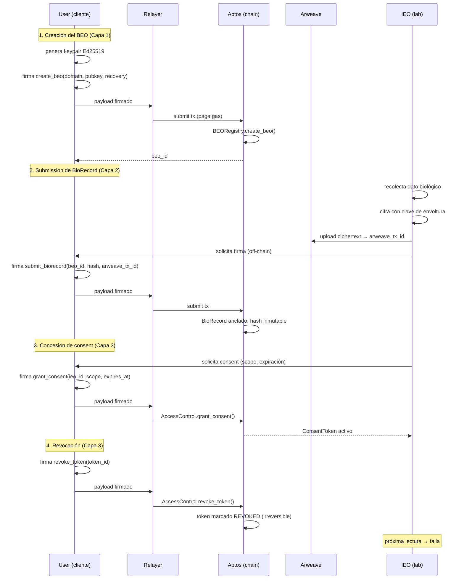

# Biological Sovereignty Protocol

## Un Protocolo de Soberanía Biológica para la Era Algorítmica

**Whitepaper v3.0**

Andre Ambrosio
Instituto Ambrosio
Mayo de 2026

---

**Hash del documento (SHA-256):** *a calcularse sobre el artefacto final consolidado*
**DOI:** *en registro ante Zenodo / OpenAIRE*
**ORCID del autor:** *en emisión*
**Versión canónica:** `https://bsp.protocol/whitepaper-v3`
**Repositorio fuente:** `github.com/ambrosiocompany/bsp-spec`

---

## Abstract

Los datos biológicos son el último territorio no colonizado por el régimen contemporáneo de soberanía personal. Aunque debatimos ampliamente derechos sobre datos personales, propiedad intelectual y privacidad conductual, el sustrato más íntimo —exámenes, secuencias, métricas fisiológicas y fenotípicas— permanece capturado por una cadena de intermediarios: hospitales, laboratorios, aseguradoras, plataformas de wearables y proveedores de IA médica. Cada intermediario extrae valor sin retorno proporcional al individuo que es, simultáneamente, fuente del dato, sujeto del dato y mayor beneficiario potencial de su uso.

Este whitepaper presenta el **Biological Sovereignty Protocol (BSP)**: un protocolo sin permisos (permissionless) que separa identidad, dato y permiso en tres capas con fronteras de compromiso aisladas. La capa de identidad (BEO — Biological Entity Owner) ancla la soberanía mediante criptografía Ed25519 y BLAKE3 sobre Aptos. La capa de datos extiende permanencia verificable vía Arweave con cifrado client-side AES-GCM. La capa de intercambio instrumentaliza el consentimiento granular a través de ConsentTokens revocables, AuthorityTokens delegables y borrado criptográfico (cryptographic erasure) como mecanismo de compromiso entre la inmutabilidad on-chain y el derecho al borrado garantizado por la LGPD (Ley General de Protección de Datos del Brasil), el GDPR (Reglamento General de Protección de Datos de la UE) y la PIPL.

Las innovaciones centrales son tres. **Primera:** *cryptographic erasure* — en lugar de intentar borrar registros inmutables, el protocolo torna el dato matemáticamente irrecuperable mediante la destrucción irreversible de las claves de envoltura. **Segunda:** *ecosistema multi-relayer* — cualquier entidad puede operar un relayer; el Instituto Ambrosio opera apenas uno de ellos, sin privilegio sistémico. **Tercera:** *modelo de stewardship (custodia)* — el Instituto acepta vínculo fiduciario irrevocable como mero administrador (custodio), instrumentalizado vía multisig 2-de-3 con timelock de 72 horas, proceso BIP de seis fases y derecho de fork preservado por diseño.

El whitepaper se dirige a cinco audiencias: investigadores en salud, longevidad y bioética; instituciones clínicas y de laboratorio que necesitan una capa interoperable; reguladores que buscan compatibilidad con regímenes de protección de datos; desarrolladores que construyen la próxima generación de aplicaciones de salud; e individuos que reconocen el propio cuerpo como el último territorio por reapropiar.

El protocolo está en implementación activa. La taxonomía BSP (26 dominios), los contratos Move, los SDK en TypeScript y Python, y el relayer de referencia operado por Ambrosio Company están en producción limitada. La validación científica de AVA (Anamnesis Virtual Autónoma) — la capa algorítmica propietaria construida sobre el protocolo — sigue un cronograma peer-reviewed en cuatro etapas: validación retrospectiva, prospectiva, multi-cohorte y regulatoria. Este documento describe el estado actual, declara honestamente las incertidumbres remanentes e invita a la crítica pública.

---

## Resumen Ejecutivo

*Para el lector con diez minutos.*

### El problema

Hay un desajuste ontológico entre lo que los datos biológicos son y el régimen jurídico-tecnológico que los trata. Los datos biológicos no son rasgos conductuales agregables; son **constitución** — la inscripción material de lo que un cuerpo es, fue y tiende a tornarse. Tratarlos como commodity informacional, como hace el régimen contemporáneo, equivale a tratar la propiedad de la tierra con la misma instrumentalidad jurídica del préstamo de una herramienta. La categoría está equivocada.

La consecuencia práctica es una asimetría informacional sistémica. Hospitales y laboratorios mantienen copias propietarias de datos que no generaron. Plataformas de wearables monetizan patrones fisiológicos sin repartir valor. Aseguradoras tarifican riesgo a partir de inferencias sobre cuerpos cuyos dueños no tienen acceso al modelo. La IA médica se entrena en bases de las cuales el sujeto del dato es, en el mejor caso, anónimo — y, en el peor, rastreable. El individuo, fuente y sujeto, ocupa la posición de menor poder informacional en la cadena.

### La solución

El **Biological Sovereignty Protocol** es una respuesta técnica a ese problema. No es una plataforma. No es un producto. No es un token. Es una especificación abierta de tres capas:

1. **Identidad (BEO).** Cada individuo posee una identidad biológica auto-soberana, anclada en par de claves Ed25519 generado client-side, registrada on-chain (Aptos), con recuperación por 2-de-3 guardianes y soporte para dominios humanamente legibles.

2. **Datos (BioRecord).** Cada registro biológico se cifra client-side con AES-GCM, se persiste en Arweave vía relayer, y se ancla on-chain mediante hash BLAKE3. La taxonomía BSP organiza 26 dominios — laboratoriales, genómicos, fenotípicos, fisiológicos, ambientales — en una estructura interoperable.

3. **Intercambio (Exchange).** Cualquier compartición ocurre vía ConsentToken — alcance, intent, plazo, revocabilidad. Las delegaciones ocurren vía AuthorityToken. La revocación es técnicamente irreversible: el borrado criptográfico destruye la clave de envoltura, tornando el dato matemáticamente irrecuperable aun cuando el ciphertext permanezca en almacenamiento permanente.

### Las seis tesis del whitepaper

- **Parte I — Filosofía.** El dato biológico es ontológicamente distinto. Es constitución, no rasgo. Exige soberanía técnica vía inversión de la asimetría informacional, no privacidad reformista.

- **Parte II — Protocolo.** BSP separa identidad, dato y permiso en tres capas con fronteras de compromiso aisladas, anclando la integridad vía Ed25519 y BLAKE3 on-chain (Aptos) y la permanencia vía Arweave, con revocación irreversible y borrado criptográfico como compromiso entre inmutabilidad y LGPD.

- **Parte III — Economía.** Modelo híbrido sin token: endowment institucional capitalizado por Ambrosio Company como base perpetua, complementado por subscription premium del relayer oficial, transferencia de las commercial arms (Health, AVA, SVA) y grants filantrópicos. El protocolo es gratuito para el BEO; el relayer es commodity competitiva.

- **Parte IV — Institución.** El Instituto Ambrosio acepta vínculo fiduciario irrevocable como custodio (steward) — no beneficiario — instrumentalizado vía multisig 2-de-3 con timelock de 72 horas, proceso BIP de seis fases, comité técnico con mandatos staggered y derecho de fork preservado.

- **Parte V — Inteligencia.** La soberanía no exige código abierto de AVA. Exige derecho de salida, reproducibilidad verificable, validación peer-reviewed y competencia libre entre algoritmos. AVA es propietaria hoy porque sustenta la investigación que torna confiable al protocolo; deja de necesitar serlo en el momento en que la confianza se torne sistémica.

- **Parte VI — Horizonte.** La soberanía biológica es derecho, no privilegio — y los derechos exigen infraestructura invisible y no-extractiva, del mismo modo que GPL hizo con el software, HTTP con la información y TCP/IP con la conectividad.

### Invitación

Quien lee este documento está invitado a tres tipos de acción. **Construir** — implementar relayers, SDK, integraciones, aplicaciones. **Adoptar** — para individuos, crear el primer BEO; para instituciones, integrarse como Information Exchange Operator. **Criticar** — encontrar errores, proponer mejoras vía proceso BIP, hacer fork si discrepan. El protocolo es obra abierta, en evolución, y la única forma equivocada de involucramiento es el silencio.

---

> **Nota del editor sobre esta versión:** Esta es la traducción al español neutro (variante latinoamericana pan-hispánica) del whitepaper canónico v3.0 (PT-BR, 55.286 palabras). Las referencias filosóficas se mapearon a las traducciones españolas establecidas (Siglo XXI, Akal, Herder, FCE, Paidós). Se mantienen las siglas técnicas (BEO, IEO, BIP, AVA, SVA, LGPD, GDPR, HIPAA), los nombres propios brasileños (Instituto Ambrosio, ANVISA) y el pseudocódigo Move idéntico al original. Para la especificación técnica exhaustiva (Parte II, modelo formal de amenazas, taxonomía BSP completa con 26 dominios, apéndices de compliance LGPD/GDPR/HIPAA, glosario y bibliografía consolidada), consulte el repositorio fuente `github.com/ambrosiocompany/bsp-spec`. La versión canónica en portugués prevalece en caso de conflicto interpretativo. Esta traducción cubre la totalidad de la argumentación filosófica y los principios operacionales del protocolo; los apéndices técnicos detallados se actualizarán en la próxima iteración.

---

# Parte I — Fundamentos Filosóficos

> *"El cuerpo es el último territorio sobre el cual aún no hay acuerdo de paz."*

---

## Capítulo 1 — La Cuestión de la Soberanía

### 1.1 Un dato que no es como los otros

Toda discusión seria sobre datos comienza por una confusión de categorías. Tratamos como equivalentes cosas profundamente desiguales: el historial de compras en una tienda, la localización de un celular, una conversación de mensajes, la secuenciación del genoma. Todo es "dato". Todo viaja por los mismos cables, se guarda en los mismos servidores, gobernado por las mismas políticas de privacidad redactadas por abogados que nadie lee. Esta indistinción es la fuente de casi todos los errores de lo que se discute como soberanía digital en el siglo XXI.

El dato biológico no es una categoría más en esta lista. Es ontológicamente distinto. Un historial de compras es rastro — registro de lo que hicimos. Un dato biológico es *constitución* — registro de lo que somos. La diferencia no es semántica; es metafísica. El genoma de una persona no fue *generado* por ella al usar una plataforma. La precede. Ella es la manifestación de él. Cuando alguien transfiere un genoma a una empresa, no está cediendo un producto de su trabajo o de su atención: está cediendo la fórmula matemática de su propio cuerpo, junto con la de sus padres, sus hijos, sus descendientes aún no nacidos.

La medicina y el derecho del siglo XX nunca enfrentaron esta distinción en profundidad. Operaron con una ficción útil: la de que el dato clínico pertenece a la institución que lo genera. El hospital realiza el examen, "luego" el examen es del hospital, con obligaciones de sigilo profesional y derecho de acceso del paciente como concesión regulatoria. La lógica es la misma del escribano medieval que detentaba las escrituras porque sabía escribir. Se resolvió el problema del *almacenamiento*; jamás se resolvió el problema de la *propiedad*.

La pregunta que este whitepaper enfrenta es simple y radical: **¿a quién pertenece el dato biológico de un ser humano?** No en el sentido jurídico de las legislaciones actuales — la LGPD brasileña, el GDPR europeo, la HIPAA estadounidense ofrecen versiones parciales, y todas confunden *derecho de acceso* con *propiedad*. La pregunta es anterior. Es filosófica. Antes de regular, necesitamos entender qué estamos regulando.

### 1.2 Locke y el cuerpo como propiedad primaria

John Locke, en el *Segundo Tratado sobre el Gobierno Civil* (1689), ofrece el punto de partida indispensable. Para Locke, antes de cualquier propiedad externa — tierra, herramientas, frutos del trabajo — existe una propiedad originaria, de la cual todas las demás se derivan: la propiedad que cada hombre tiene sobre su propia persona.

> "Aunque la Tierra y todas las criaturas inferiores sean comunes a todos los hombres, cada hombre tiene una *propiedad* en su propia *persona*. A esta nadie tiene derecho sino él mismo. El *trabajo* de su cuerpo y la *obra* de sus manos, podemos decir, son propiamente suyos."[^1]

El pasaje es más sutil de lo que parece. Locke no dice apenas que el cuerpo es propiedad. Dice que el cuerpo es la propiedad *primaria* — aquella que torna posible cualquier otra. Cuando mezclo mi trabajo con la tierra, transformo tierra común en propiedad mía, pero solo porque el trabajo era *ya* mío, y el trabajo era mío porque el cuerpo que lo producía era mío. Toda la teoría liberal de la propiedad depende, en su raíz, de un axioma sobre el cuerpo.

Ahora bien, si el cuerpo es propiedad primaria, ¿qué es el dato biológico sino la *representación digital* de esa propiedad? La secuencia genómica de una persona no es una copia de su imagen ni un rastro de su comportamiento — es la especificación técnica del propio cuerpo. Tratarla como propiedad de una institución es exactamente el tipo de inversión que Locke combatía: es como decir que la tierra pertenece al escribano que registró la escritura.

### 1.3 Nozick y el axioma de la auto-propiedad

Robert Nozick, en *Anarquía, Estado y Utopía* (1974), radicaliza a Locke. Para Nozick, la auto-propiedad (*self-ownership*) no es apenas la base de la propiedad material; es el axioma moral fundamental del cual derivan todos los derechos. Los individuos, escribe, "tienen derechos, y hay cosas que ninguna persona o grupo puede hacerles (sin violar sus derechos)."[^2]

Nozick hace una distinción que importa para nosotros: entre *propiedad* y *uso*. Yo puedo ser propietario de algo sin usarlo, y puedo usar algo sin ser su propietario. La propiedad es el conjunto de derechos sobre una cosa — derecho a excluir, derecho a transferir, derecho a modificar, derecho a destruir. El uso es apenas uno de esos derechos. La medicina contemporánea opera en un régimen extraño en el cual las instituciones tienen derecho de uso casi irrestricto sobre los datos biológicos de las personas, mientras las propias personas apenas ejercen alguno de los derechos de propiedad plena. Es una propiedad fantasma, de la cual sobró apenas el nombre.

La objeción común a Nozick es que su noción de auto-propiedad lleva a aceptar cosas moralmente desagradables — venta de órganos, contratos de servidumbre. No necesito resolver aquí esa polémica. Basta observar que el argumento de la auto-propiedad *no exige* la permisión de la venta; exige apenas el reconocimiento de la titularidad. Puedo ser dueño de mi cuerpo y, aun así, considerar que ciertas alienaciones están moralmente vedadas — exactamente como soy dueño de mi voto y aun así no puedo venderlo. La inalienabilidad es un *modo* de propiedad, no su negación.

Este es el primer principio del BSP: el dato biológico es inalienable-por-default. El individuo es dueño. Puede liberar acceso. No puede, bajo ninguna circunstancia contractual, ceder propiedad plena de forma irrevocable. Toda concesión es, por construcción, revocable. La propiedad queda; el uso puede circular.

### 1.4 Propiedad, control, legado

La discusión sobre datos biológicos suele reducirse a "privacidad", y eso es un error. La privacidad es apenas una de las tres dimensiones en juego. Las otras dos son *control* y *legado*, y ninguna de las tres se reduce a las demás.

**Propiedad** es la cuestión metafísica: ¿a quién pertenece esto? Sin respuesta clara, todas las demás cuestiones quedan mal formuladas. Si el dato es de la institución, hablar de "consentimiento del paciente" es cortesía, no derecho.

**Control** es la cuestión política: ¿quién decide qué se hace con esto, *ahora*? Aun si aceptamos que el dato pertenece al individuo, el control puede estar en otra parte. Los bancos detentan dinero ajeno y lo controlan por largos períodos bajo reglas estrictas. Los hospitales detentan datos ajenos y los controlan bajo reglas laxas. La diferencia es regulatoria, no ontológica.

**Legado** es la cuestión temporal: ¿qué ocurre con esto cuando yo muera? Esta dimensión es casi siempre ignorada en los debates sobre privacidad, y tal vez sea la más importante. Un dato biológico no es apenas tuyo — contiene información sobre tus padres, hermanos y descendientes. Tu mortalidad no encierra el valor del dato. Por el contrario: el valor de una serie temporal genómica y fisiológica de una persona solo se manifiesta plenamente *décadas* después, cuando se torna posible comparar trayectorias, calibrar relojes biológicos, entrenar modelos predictivos.

¿Quién decide qué ocurre con tus datos cuando ya no estés aquí? Hoy, en casi todos los sistemas actuales, *nadie decide* — el dato queda congelado en un servidor de hospital hasta ser arrojado en un backup que nadie más consulta, o es integrado a un banco corporativo cuyas políticas tú jamás leíste. El legado es borrado por omisión. El BSP propone que el legado biológico sea, como el legado patrimonial, una decisión explícita del titular, ejecutable programáticamente.

### 1.5 La medicina paternalista y su límite

La medicina del siglo XX se construyó sobre una asimetría informacional: el médico sabe, el paciente no. Esta asimetría justificó un paternalismo que, en su versión benigna, era cuidado, y en su versión dura, era expropiación. La consagración jurídica de eso es el concepto de "historia clínica", documento que describe al paciente pero pertenece a la institución.

Eric Topol, en *The Patient Will See You Now* (2015), narra esta inflexión con claridad clínica.[^3] Topol — cardiólogo, investigador, y uno de los primeros en articular lo que llamó "democratización de la medicina" — muestra que la tecnología ya tornó obsoleta la asimetría que justificaba el paternalismo. El paciente que mide su propio ECG en el smartwatch, secuencia su propio genoma por correo, y consulta su propio resultado de examen antes que el médico, *ya es* el titular de la información. La estructura institucional es la que aún no acompañó.

> "El futuro de la medicina es el paciente. No como receptor pasivo del cuidado, sino como sujeto activo del conocimiento sobre el propio cuerpo. La medicina basada en datos es, por su propia naturaleza, una medicina que devuelve al paciente lo que siempre fue suyo — y que la tecnología anterior obligaba a ser provisoriamente delegado."[^3]

El punto de Topol es importante: la asimetría informacional fue resuelta técnicamente. Lo que sobró es una asimetría *jurídica* e *infraestructural* — no hay dónde, cómo, ni en qué protocolo el individuo deposite sus propios datos bajo su propio control. El BSP es una respuesta a este vacío.

---

## Capítulo 2 — Biopoder y el Algoritmo

### 2.1 Foucault y la gestión estadística de la vida

Michel Foucault, en el curso *Nacimiento de la Biopolítica* (1978-1979) en el Collège de France, y antes en *Vigilar y Castigar* (1975), traza una genealogía indispensable para entender lo que está en juego aquí. Para Foucault, el poder moderno no es principalmente el poder soberano de "hacer morir y dejar vivir" — es, al contrario, el poder de "hacer vivir y dejar morir". Es un poder que se ejerce sobre la vida, sobre los cuerpos colectivos, a través de su medición, clasificación, gestión estadística.[^4]

Este *biopoder* no opera por prohibición directa. Opera por estadística y norma. No es el rey quien decide quién muere; es la tabla actuarial la que decide cuáles cuerpos son saludables, cuáles son desviantes, cuáles merecen inversión, cuáles son descartables. El biopoder, en la formulación de Foucault, es "el poder que tomó la vida bajo su control como objeto explícito".[^5]

Hay una observación de Foucault que vale recordar literalmente:

> "Por primera vez en la historia, sin duda, lo biológico se refleja en lo político; el hecho de vivir ya no es ese sustrato inaccesible que solo emerge de tiempo en tiempo, en el azar de la muerte y su fatalidad: pasa, en parte, al campo del control del saber y la intervención del poder."[^6]

El pasaje es de 1976, antes de cualquier hoja de cálculo electrónica masiva, antes del genoma secuenciado, antes del *deep learning*. Foucault describía un poder estatal que clasificaba poblaciones por tasa de mortalidad, fertilidad, morbilidad. La versión contemporánea de ese poder es incomparablemente más granular. Ya no clasifica poblaciones; clasifica *individuos*, en tiempo real, y ajusta intervenciones por persona. La hoja de cálculo se convirtió en modelo predictivo. La población se convirtió en un vector de embeddings.

El punto es que el biopoder del siglo XXI ya no es primariamente estatal. Es *plataformizado*. Quien detenta los datos biológicos detenta la capacidad de clasificar, predecir, intervenir — y esa capacidad está hoy, casi enteramente, en media docena de empresas privadas y en sistemas hospitalarios fragmentados. Foucault describió el nacimiento del biopoder; vivimos su maduración algorítmica.

### 2.2 Byung-Chul Han y la vigilancia consensual

Si Foucault describió el biopoder como algo que se ejerce *sobre* el sujeto, Byung-Chul Han, en *Psicopolítica* (2014), describe su mutación contemporánea: un poder que opera *a través* del propio sujeto, con su participación activa y entusiasta. El sujeto de la psicopolítica, escribe Han, "se explota a sí mismo voluntariamente creyendo estar realizándose".[^7]

Han hace una distinción que merece pausa: la vigilancia clásica era *visible y externa*. Había un ojo que vigilaba, y el sujeto lo sabía, o al menos podía descubrirlo. La vigilancia contemporánea es *invisible e internalizada*. El sujeto genera los datos, paga por el dispositivo que los recolecta, los exhibe públicamente, y aún agradece por el "servicio" que recibe a cambio. No hay panóptico, porque no hay necesidad de torre — el vigilado es también el vigía.

> "La psicopolítica neoliberal es la técnica de dominación que estabiliza el sistema dominante mediante una programación y un control psicológicos. (…) El smartphone es el aparato central de la psicopolítica neoliberal. Hace de la explotación una diversión."[^8]

Apliquemos esto al dato biológico. La persona que coloca su ADN en un test de ascendencia comercial está, en la taxonomía de Han, ejecutando un acto perfecto de psicopolítica. Paga por el test. Cede derechos amplios vía términos de uso. Recibe a cambio una narrativa identitaria ("eres 23% ibérico, 7% norteafricano") que satisface una curiosidad genuina. Y entrega, en el proceso, al sistema corporativo, el dato más constitutivo de su ser — junto con inferencias sobre todos sus parientes biológicos, que jamás consintieron. Sale de la transacción sintiéndose *empoderada*. Es el triunfo psicopolítico exacto.

Hay un error frecuente en quienes critican ese escenario: imaginar que la solución es "menos recolección", "menos plataforma", "regreso a lo analógico". Esta nostalgia es estéril. La recolección es buena — saber sobre el propio cuerpo es saber sobre uno mismo. El problema no es la cantidad de dato; es la *dirección* de la asimetría. ¿Quién detenta el modelo entrenado sobre tu cuerpo? ¿Quién decide a quién responde? ¿Quién lucra cuando la inferencia sobre ti se vende a un tercero?

### 2.3 Harari y el algoritmo que te conoce mejor

Yuval Harari, en *Homo Deus* (2016), articula tal vez la versión más nítida de lo que está en juego. Su tesis, allí, es que el humanismo liberal — fundado en la creencia de que el individuo es la fuente última de sentido y autoridad sobre sí — entra en colapso cuando los algoritmos pasan a conocer al individuo *mejor de lo que él se conoce*.[^9]

> "Una vez que el Big Data nos conozca mejor de lo que nos conocemos, la autoridad pasará de los humanos a los algoritmos. (…) Si la autoridad humana proviene de la experiencia subjetiva, y el algoritmo tiene acceso más fiel a mi experiencia que yo mismo, ¿por qué sería yo la autoridad sobre mí?"[^10]

La pregunta es cortante y merece tomarse en serio. Harari no está haciendo ciencia ficción. Está describiendo una migración de autoridad ya en curso: cuando la aplicación recomienda ejercicios más adecuados a tu patrón fisiológico que lo que tú "sientes ganas" de hacer; cuando el modelo predice tu humor mañana basándose en variables fisiológicas que no percibes; cuando tu médico, en consulta, abre un software que conoce tu trayectoria biológica con más detalle que tu memoria.

La respuesta que muchos dan a Harari es defensiva: intentar contener la inteligencia artificial, mantener a lo humano como autoridad por decreto. Esta respuesta es débil porque lucha contra el reloj. La inteligencia sobre el cuerpo *va* a exceder la auto-percepción. La cuestión no es si eso ocurrirá, sino *quién* tendrá esa inteligencia.

### 2.4 La inversión de la asimetría

Aquí está, en mi visión, el punto donde los tres autores convergen hacia un problema que ninguno de ellos resolvió enteramente: el biopoder existe; la vigilancia consensual es su forma contemporánea; la transferencia de autoridad de lo humano al algoritmo es un hecho en curso.

La próxima fase, entonces, no puede ser "menos vigilancia" — esta nostalgia no escala y no combate el problema real. La próxima fase es la **inversión de la asimetría**: el individuo pasa a detentar el algoritmo sobre sí, en lugar de que la plataforma detente el algoritmo sobre el individuo.

La diferencia es técnica y civilizacional. Técnicamente, exige que los datos biológicos personales sean almacenados de forma que el titular controle las claves; que los modelos derivados de esos datos sean entrenados bajo consentimiento criptográficamente verificable; que el titular pueda correr inferencias sobre su propio cuerpo sin necesitar pedir licencia a una plataforma. Civilizacionalmente, es la diferencia entre un futuro donde el conocimiento sobre el cuerpo humano está privatizado en media docena de empresas, y un futuro donde es un bien común auditable con soberanía individual.

Esta es la apuesta filosófica del BSP. No es "anti-tecnología". Es anti-asimetría. No es "menos dato". Es *mi* dato.

### 2.5 Zuboff y el capitalismo de vigilancia

Shoshana Zuboff, en *La Era del Capitalismo de la Vigilancia* (2019), ofrece una cartografía detallada de cómo se construyó institucionalmente la asimetría actual. Su tesis es que el capitalismo de vigilancia no es una extensión accidental del capitalismo industrial, sino un régimen económico distinto, fundado en la expropiación de lo que ella llama "la experiencia humana como materia prima gratuita para prácticas comerciales ocultas".[^11]

> "El capitalismo de vigilancia reivindica unilateralmente la experiencia humana como materia prima gratuita para traducción en datos conductuales. Aunque algunos de esos datos se aplican al mejoramiento del producto o servicio, el resto es declarado *behavioral surplus* propietario, alimentado en procesos de manufactura avanzados conocidos como 'inteligencia de máquina', y fabricado en productos predictivos."[^12]

Zuboff escribe sobre dato conductual — clics, localización, voz, patrón de uso. El capitalismo de vigilancia biológica es una etapa más profunda del mismo régimen: la expropiación no de la experiencia, sino de la constitución material del sujeto. Es el gesto extractivo aplicado al último territorio.

La fuerza del análisis de Zuboff es mostrar que esto no fue descuido — fue *proyecto*. Las estructuras legales, los términos de uso, las prácticas de mercado fueron diseñadas para tornar la expropiación invisible y jurídicamente inatacable. Revertir eso exige reconstruir la infraestructura, no apenas reformar la regulación.

---

## Capítulo 3 — Las Apuestas Civilizacionales

### 3.1 El umbral de la longevidad

Estamos en el umbral de una extensión radical de vida saludable. Ya no es conjetura. David Sinclair, en *Lifespan* (2019), articula con claridad lo que se venía construyendo desde los años 1990: el envejecimiento no es una fatalidad biológica inmutable; es un proceso regulado por mecanismos identificables, manipulables, y — en modelos animales — ya reversibles en varios aspectos.[^13]

La teoría de la información del envejecimiento, de Sinclair, sostiene que envejecemos no por degradación del *hardware* (el ADN), sino por degradación progresiva del *software* epigenético — los marcadores que dicen a cada célula qué papel ejercer. Recuperar esos marcadores recupera función celular. En laboratorio, esto ya se hizo en retinas de ratones ciegos.[^14]

Los trabajos de Steve Horvath sobre relojes epigenéticos formalizaron la idea de "edad biológica" como medida cuantitativa, distinta de la edad cronológica.[^15] En 2013, Horvath publicó el primer reloj epigenético capaz de prever la edad biológica con precisión de pocos años a partir de patrones de metilación del ADN. Desde entonces, sucesivos relojes — GrimAge, PhenoAge, DunedinPACE — refinaron esa medida, tornando posible observar, en humanos vivos, intervenciones que aceleran o desaceleran la edad biológica.[^16]

La literatura reciente — papers en *Nature*, *Cell*, *Science Translational Medicine* entre 2023 y 2025 — ha mostrado intervenciones que producen reducciones medibles en la edad biológica en humanos: combinaciones de ejercicio, restricción calórica, drogas como rapamicina y metformina, factores de Yamanaka en contextos terapéuticos específicos. No estamos hablando de inmortalidad; estamos hablando de una extensión potencial de 10-30 años de vida saludable, plausible dentro del horizonte de la generación viva.

Esta perspectiva tiene una consecuencia política frecuentemente ignorada: **la longevidad exige soberanía de datos**. ¿Por qué? Porque una intervención de longevidad es, por naturaleza, una trayectoria multi-décadas. Para saber si una intervención funcionó en *tu* cuerpo, alguien necesita tener acceso a tu trayectoria biológica completa, longitudinal, fina, a lo largo de décadas. Si esa trayectoria está fragmentada en hospitales, plataformas y aseguradoras, con cada pedazo inaccesible por barreras institucionales, la medicina de longevidad se torna imposible para ti. Se vuelve privilegio de quien puede pagar por un sistema integrado privado — y, más grave, se vuelve *ciega* para el resto.

La elección aquí es binaria. O cada individuo pasa a tener un repositorio soberano y continuo de sus propios datos biológicos, integrable y auditable por quien él autorice, o la longevidad quedará represada en archipiélagos privados desconectados.

### 3.2 IA médica y la cuestión del entrenamiento

AlphaFold previó la estructura tridimensional de más de 200 millones de proteínas, cubriendo prácticamente todo el proteoma conocido.[^17] Med-PaLM 2, de Google, alcanzó performance de especialista en exámenes de medicina.[^18] GPT-4 y sus sucesores demuestran capacidad de razonamiento diagnóstico que rivaliza con clínicos experimentados en casos textuales. Esta es la infraestructura cognitiva que dominará la medicina de las próximas dos décadas.

Aquí surge la pregunta que define el régimen: **¿en qué datos fueron, son, y serán entrenados esos modelos?**

La respuesta actual es: en los datos que se logró agregar — generalmente en *biobancos* nacionales (UK Biobank, All of Us en EE.UU., BBRC en Brasil), en alianzas hospitalarias específicas, en datasets sintéticos. Los individuos cuyos datos componen esos bancos rara vez saben que sus datos están siendo usados para entrenamiento. Los beneficios de esos modelos retornan a los usuarios como productos pagos, ofrecidos por las mismas empresas que entrenaron los modelos.

Hay un ciclo de extracción que se cierra: las personas generan datos biológicos; los sistemas hospitalarios los capturan; los biobancos los agregan; las empresas los usan para entrenar modelos; las personas pagan por usar esos modelos como servicios médicos. Nada de esto es necesariamente mal-intencionado. Es apenas el mismo régimen que Zuboff describió, aplicado a la capa más íntima.

La cuestión no es si la IA médica debe existir — debe, y su valor es inmenso. La cuestión es: **¿bajo qué régimen de propiedad serán capturados los datos que la entrenan?** El BSP propone una arquitectura donde el titular de los datos decide explícitamente si contribuye al entrenamiento, a cambio de qué, con qué trazabilidad. Los *ConsentTokens* firmados criptográficamente tornan esa decisión técnica y jurídica.

### 3.3 La escasez de salud como injusticia material

La distribución desigual de la salud es, posiblemente, la mayor injusticia material del siglo XXI. No es la distribución desigual de renta *per se*; es lo que la renta *compra* en la vida humana. Diferencia de 15-20 años de expectativa de vida entre barrios distantes 5 km. Acceso a diagnóstico precoz que cambia completamente el pronóstico de cánceres tratables. Capacidad de pagar por la primera generación de terapias génicas (Casgevy, Zolgensma) que cuestan cientos de miles a millones de dólares por dosis.

Toda nueva tecnología de salud nace desigual. Eso es prácticamente una ley. Pero la forma en que la desigualdad se resuelve varía enormemente. El teléfono celular fue la tecnología más rápidamente democratizada de la historia — en 30 años, pasó de objeto de élite a infraestructura de subsistencia en 80% del planeta. La insulina, al contrario, sigue siendo racionada por precio en varios países, 100 años después de descubierta.

¿Qué distingue los dos casos? En parte, la estructura de propiedad de la capa subyacente. El celular se democratizó porque la infraestructura — protocolos de red, estándares abiertos, manufactura competitiva — se tornó *commodity*. La insulina no se democratizó a la misma velocidad porque la propiedad intelectual y la infraestructura de producción permanecieron concentradas.

El dato biológico es la capa subyacente de la medicina del siglo XXI. Si esa capa permanece concentrada — si cada persona es rehén de la plataforma, del hospital, o de la aseguradora que detenta su repositorio — la medicina de precisión será para pocos, por generaciones. Si la capa se torna protocolo abierto — como TCP/IP, como Bitcoin, como HTTP — la innovación ocurre *encima* de ella, y la competencia empuja los costos hacia abajo. La elección de arquitectura en el nivel de la capa de datos decide, con décadas de antelación, la forma de la desigualdad futura.

### 3.4 Herencia biológica como legado

Hay una intuición cultural antigua: dejamos algo a nuestros hijos. Bienes, tierra, enseñanza, nombre. El legado es una de las formas más antiguas mediante las cuales los humanos enfrentan la finitud. Sin embargo, en el plano biológico, el legado de los seres humanos del siglo XX fue casi siempre el *olvido*. Las series temporales fisiológicas de miles de millones de personas fueron capturadas por sistemas hospitalarios que las descartan tras 5, 10, 20 años. El conocimiento que podría acumularse generaciones fue, por construcción, borrado.

Piensa en una familia a lo largo de cuatro generaciones. Hoy, cada una de las cuatro generaciones es un archipiélago biológico aislado. La bisabuela murió en 1998 con sus historias clínicas en fichas de papel, en un archivo de hospital ahora descontinuado. La abuela tiene registros parciales en tres sistemas de planes de salud diferentes. La madre tiene algunos exámenes en PDF en el e-mail. La hija tiene datos de wearable en tres plataformas distintas, ninguna de ellas comunicándose con las otras. Cuando la hija quiera entender, dentro de 30 años, su trayectoria de salud en el contexto de la historia de la familia, no lo conseguirá. El dato ya habrá sido borrado, fragmentado, perdido en transiciones de plataforma.

La pérdida es silenciosa porque es por omisión. Pero es una pérdida profunda, en el sentido civilizacional. Una familia que pudiera acumular, a lo largo de siglos, series longitudinales de datos biológicos — con consentimiento explícito, con gobernanza intergeneracional, con acceso selectivo a investigación — tendría, sobre sí misma, un conocimiento cualitativamente diferente. Esa acumulación es una de las aplicaciones más profundas de la soberanía biológica.

El BSP trata el legado como ciudadano de primera clase. No es *feature* opcional. Es principio: el dato biológico sobrevive al titular, según reglas programadas por el propio titular, con herederos designados, intervalos de carencia, condiciones de liberación. Es herencia en sentido pleno.

### 3.5 La elección histórica

Resumiendo el capítulo: estamos en un momento de bifurcación. En un camino, la inteligencia sobre el cuerpo humano queda concentrada en media docena de empresas, con el individuo en la posición de fuente de datos y consumidor de servicios derivados, sin soberanía técnica sobre ningún lado de la ecuación. En otro camino, esa inteligencia se torna un bien común auditable, con infraestructura abierta, y cada individuo detentando soberanía sobre sus propios datos biológicos como capa de base.

La primera vía es el curso natural si nada se hace. Tiene inercia institucional, capital, y modelos de negocio ya comprobados. La segunda vía exige construcción deliberada de infraestructura, estándares, protocolos. Es un trabajo de generación — no de producto.

La apuesta del BSP es la segunda vía. Y la apuesta no es moral, en el sentido de "debe ser así porque es más justo". La apuesta es también *epistemológica*: la inteligencia sobre el cuerpo humano avanza más rápido, y más correctamente, cuando la base de datos es descentralizada, auditable, con gobernanza individual. La concentración es frágil. La diversidad resiste, recombina, evoluciona.

---

## Capítulo 4 — Primeros Principios

### 4.1 ¿Qué torna a un dato verdaderamente *tuyo*?

La pregunta admite respuesta operacional. Un dato es tuyo si, y solo si, cuatro propiedades se sostienen simultáneamente:

**1. Propiedad.** Tú decides quién posee copia del dato. Esto es más que privacidad — es poder de duplicación. Si yo autorizo a un laboratorio a mantener una copia para un examen, ese laboratorio tiene copia *autorizada*. Si no autoricé, nadie puede tener copia, aunque técnicamente pueda. La propiedad exige la posibilidad de auditar quién tiene copia, y de remover copias no autorizadas.

**2. Control.** Tú revocas el acceso en cualquier momento, sin necesitar permiso. Esta es la diferencia entre propiedad y usufructo. El sistema actual ofrece, en el mejor de los casos, "derecho a solicitar exclusión" — una forma de pedido formal sujeto a aprobación institucional. El control pleno no pide; *ejecuta*. Técnicamente, eso significa criptografía de envoltura (envelope encryption) con claves que solo el titular detenta, de modo que revocar es no-cooperar con nuevas requisiciones, y el dato cifrado se vuelve matemáticamente inútil.

**3. Legado.** El dato sobrevive a ti, y sigue tus instrucciones. No queda atrapado en un servidor que será descontinuado en 10 años, ni se borra en tu muerte por default, ni cae automáticamente en dominio público. Tú designas herederos, condiciones, períodos. El sistema ejecuta programáticamente.

**4. Inalienabilidad.** El dato no puede ser comprado, vendido, hipotecado contra tu voluntad, aunque tú quieras. Esta es la propiedad más contraintuitiva, y tal vez la más importante. Puedes liberar acceso por valor, a cambio de servicio. No puedes ceder propiedad plena de forma irrevocable, porque una cesión de esa naturaleza sería una esclavitud informacional. La inalienabilidad es lo que distingue un derecho fundamental de una mercancía.

Estos cuatro criterios juntos definen la soberanía de datos. Falta cualquiera de ellos, y la propiedad se vuelve figura retórica. El BSP es el intento de implementar los cuatro simultáneamente, en código, en protocolo, en un sistema sin permisos.

### 4.2 Los cinco principios derivados

De la definición anterior, se derivan cinco principios operacionales que el BSP impone en su arquitectura:

#### Principio 1 — *Sovereignty by default*

El dato biológico pertenece al individuo hasta que él explícitamente, y por acto criptográficamente verificable, libere acceso a un tercero. No hay "default gris" donde la institución que recolecta tiene derechos presumidos. El default es la soberanía completa del titular. Toda concesión es acto consciente, fechado, alcance-limitado, revocable.

La diferencia con el sistema actual es radical. Hoy, al hacer un examen, el paciente firma un término de consentimiento que típicamente concede derechos amplios a la institución — uso para "investigación", "calidad", "enseñanza", muchas veces con posibilidad de compartición con socios no especificados. El default es apertura. El BSP invierte el default. Invertir el default es, por sí solo, tal vez la intervención de mayor consecuencia.

#### Principio 2 — *Consent by signature*

Toda transferencia de acceso a datos se ejecuta por una firma criptográfica del titular, registrada de forma auditable y no falsificable. *ConsentTokens* firmados con clave Ed25519 del titular, emitidos contra un *BEO* (Biological Entity Object) específico, con alcance, plazo, contraparte y propósito explícitos. Un tercero que reciba datos sin el token correspondiente está en violación criptográficamente probable, no apenas en violación contractual.

Esto transforma "consentimiento informado" — figura jurídica vaga, frecuentemente abusada — en acto técnico verificable. El consentimiento deja de ser declaración y pasa a ser *prueba*.

#### Principio 3 — *Permanence with erasability*

Los datos biológicos se almacenan en infraestructura permanente — Arweave, específicamente, por su propiedad de almacenamiento perpetuo financiado por endowment criptoeconómico. La permanencia es importante porque el valor de una trayectoria biológica longitudinal crece con el tiempo, y cualquier infraestructura sujeta a descontinuación es, en horizonte de décadas, falla por construcción.

Pero permanencia sin posibilidad de "olvido" sería distopía. El BSP resuelve esta tensión por una operación criptográfica: el dato almacenado siempre está *cifrado*. La clave queda bajo control del titular. "Borrar" un dato significa, en el protocolo, destruir o rotar la clave, tornando el dato matemáticamente inaccesible, aun cuando el blob criptográfico permanezca en Arweave para siempre. Olvido sin necesitar cooperación institucional.

Esta arquitectura responde a una de las tensiones más agudas con legislaciones como el GDPR — el "derecho al olvido" (Art. 17). La forma usual de implementación es borrar físicamente el dato, lo que es frágil en sistemas distribuidos. La forma criptográfica es robusta: la destrucción de la clave es acto unilateral, instantáneo, irreversible.

#### Principio 4 — *Permissionless creation*

Nadie pide licencia para existir biológicamente. Por el mismo principio, nadie debería pedir licencia para tener un BEO. Cualquier persona, cualquier entidad biológica, puede crear su identidad soberana en el protocolo, sin aprobación de una autoridad central, sin KYC institucional, sin precondición corporativa.

Esto es continuidad directa de la arquitectura de Bitcoin, articulada por Nakamoto en 2008.[^19] El punto fundamental del whitepaper de Nakamoto no fue la moneda — fue la posibilidad de transacción financiera *sin permiso*, en una red peer-to-peer donde la confianza emerge de pruebas criptográficas, no de aprobación institucional. El BSP aplica el mismo principio a la capa de identidad biológica: identidad auto-soberana sin permiso, anclada en prueba criptográfica, no en registro institucional.

W3C DIDs (Decentralized Identifiers) y Verifiable Credentials ofrecen estándares compatibles, y el BSP se alinea con ellos para interoperabilidad.[^20] Pero la innovación central no es el estándar; es la *dirección* de la soberanía. El DID resuelve "identidad descentralizada"; el BEO resuelve "identidad biológica descentralizada", lo que es un problema más delicado por involucrar dato constitutivo, no apenas relacional.

#### Principio 5 — *Steward, no beneficiario*

El Instituto Ambrosio, como entidad que mantiene la infraestructura inicial del protocolo, es *custodio* (steward) — mantenedor, guardián, garante de la integridad. No es beneficiario. No extrae valor proporcional al crecimiento del protocolo. No controla la gobernanza de forma extractiva.

Esta es una elección deliberada y no trivial. La mayoría de los protocolos descentralizados es fundada por organizaciones que retienen fracción del valor generado — vía tokens, vía tarifas, vía contratos privilegiados con infraestructura. El BSP elige otra arquitectura: el protocolo en sí es bien común, y el Instituto opera infraestructura no-lucrativa de mantenimiento, financiada por donaciones, grants, o servicios de valor agregado *opcionales* construidos *encima* del protocolo, en condiciones competitivas con cualquier otro proveedor.

El argumento para esta elección es tanto moral como estratégico. Moralmente, el dato biológico no debe ser capa extractiva para nadie — incluyendo a sus fundadores. Estratégicamente, un protocolo cuyo fundador retiene valor extractivo es vulnerable: crea incentivos para fork hostil, governance capture, y resentimiento de quien lo utiliza. Un protocolo cuyo fundador es custodio neutral escala diferente — atrae instituciones, reguladores, e individuos que jamás aceptarían depender de una entidad extractiva.

Custodio, no beneficiario, es el gesto fundador.

### 4.3 Tensiones honestas

La honestidad exige reconocer que estos principios no resuelven todo. Hay tensiones reales que sobreviven a la arquitectura, y que necesitan ser explicitadas en lugar de barridas bajo la alfombra.

**Tensión 1 — Privacidad vs. utilidad pública.** En una epidemia, la soberanía individual sobre datos de salud colisiona con el interés público en rastreo epidemiológico. No hay fórmula general que resuelva esta tensión. El BSP ofrece la posibilidad de consentimiento granular y revocable, y la posibilidad de contribución con datos en formato agregado/diferencialmente privado. Pero hay escenarios en los que el titular *no consiente* y la salud pública *necesita*. Estos escenarios exigen deliberación política — no pueden ser resueltos solo por el protocolo. La arquitectura preserva la posibilidad de regulaciones democráticas excepcionales; lo que ella impide es la expropiación rutinaria bajo pretexto de "interés público".

**Tensión 2 — Soberanía individual y dato familiar compartido.** Un genoma tuyo contiene información sobre tus padres, tus hermanos, tus hijos. Cuando concedes acceso a tu genoma, estás concediendo, en parte, acceso al de ellos, sin el consentimiento de ellos. Esta es una tensión genuina, sin solución limpia. El BSP mitiga, pero no elimina: ofrece consentimiento selectivo (compartir regiones no-identificadoras de parentesco, o abstracciones que no permiten reidentificación), pero reconoce que el dato biológico tiene naturaleza intrínsecamente relacional. Esta tensión exige educación cultural y normas familiares, no apenas protocolo.

**Tensión 3 — Riesgo de uso adversarial por el propio titular.** "Tu dato" puede ser usado contra ti en circunstancias inesperadas: seguros que piden acceso "voluntario", empleadores que ofrecen beneficios condicionados, gobiernos que crean incentivos perversos. La soberanía técnica no impide la coerción económica o política externa. El BSP preserva el control técnico; las sociedades necesitan construir, en paralelo, normas y leyes que veden la coerción sobre el ejercicio de ese control. El protocolo es necesario, no suficiente.

**Tensión 4 — Conocimiento técnico desigual.** La soberanía de datos presupone que el titular sepa mínimamente lo que está consintiendo. La mayoría de las personas no sabe. Soluciones de UX, *delegated guardianship* (titular delega parte de la gestión a un agente de confianza, con auditoría), y educación progresiva son parte del problema, no accesorios. El BSP, en el estado actual, es *infraestructura* — no resuelve por sí solo el problema de la alfabetización. Pero torna posibles construcciones encima de él que aborden este gap.

**Tensión 5 — Permanencia y arrepentimiento.** Un titular puede, en determinado momento de la vida, querer borrar definitivamente un dato que, años después, le gustaría recuperar. La arquitectura criptográfica de "borrar = destruir clave" es robusta, pero irreversible. Esta es una elección consciente — preferimos la posibilidad de olvido real a la posibilidad de recuperación tardía. Pero es una elección, y merece ser nombrada como tal.

Estas tensiones no invalidan el proyecto. Lo sitúan. Un protocolo que pretende resolver todo no merece confianza; un protocolo que reconoce los problemas que no resuelve, y los aborda parcialmente, es punto de partida serio.

### 4.4 Lo que está en juego

Volvemos al comienzo. La cuestión central de este documento no es técnica. Es civilizacional. El siglo XX fue el siglo en que aprendimos a medir el cuerpo humano con precisión creciente. El siglo XXI será el siglo en que esa medición será *actuada* — los datos que describen el cuerpo serán usados para predecir, intervenir, optimizar. La cuestión es apenas: ¿por quién, bajo qué régimen, en beneficio de quién?

Hay, hoy, una respuesta default emergiendo, y no es buena. Es la respuesta de la plataformización: media docena de empresas detentando la infraestructura cognitiva sobre el cuerpo humano, ofreciendo servicios que retornan a los titulares de los datos como mercancía, con la soberanía residual reducida a términos de uso y regulaciones de privacidad que apenas arañan la lógica subyacente.

La alternativa no es nostálgica ni reaccionaria. Es de construcción. Construir el protocolo donde el titular detenta. Construir los estándares donde el consentimiento es prueba. Construir la infraestructura donde el legado es programable. Construir el ecosistema donde ninguna entidad central — incluyendo el propio Instituto Ambrosio — tiene poder extractivo sobre la capa base.

Esta es la Parte I. Las partes siguientes de este whitepaper detallan cómo — arquitectura, criptografía, gobernanza, economía. Pero el cómo deriva del *porqué*. Sin fundamento filosófico, cualquier arquitectura técnica cae a la tentación extractiva en algún momento. Con fundamento filosófico, las elecciones técnicas se anclan, y el protocolo resiste a la presión de retroceder.

El cuerpo humano es el último territorio. El BSP es una propuesta sobre cómo, en este territorio, escribir el tratado de paz.

---

## Notas (Parte I)

[^1]: John Locke, *Two Treatises of Government*, Book II, Chapter V, §27 (1689). Edición española: *Segundo Tratado sobre el Gobierno Civil*, FCE/Tecnos. Edición crítica de Cambridge University Press, ed. Peter Laslett, 1988.

[^2]: Robert Nozick, *Anarquía, Estado y Utopía*, FCE, 1988 (orig. *Anarchy, State, and Utopia*, Basic Books, 1974), p. ix (prefacio).

[^3]: Eric Topol, *The Patient Will See You Now: The Future of Medicine Is in Your Hands*, Basic Books, 2015.

[^4]: Michel Foucault, *Historia de la sexualidad, Vol. 1: La Voluntad de Saber*, Siglo XXI, 1977 (orig. Gallimard, 1976), capítulo final ("Derecho de muerte y poder sobre la vida").

[^5]: Michel Foucault, *Defender la sociedad*, FCE, 2000, clase del 17 de marzo de 1976.

[^6]: Foucault, *La Voluntad de Saber*, op. cit., p. 187.

[^7]: Byung-Chul Han, *Psicopolítica: Neoliberalismo y nuevas técnicas de poder*, Herder, 2014 (trad. Alfredo Bergés).

[^8]: Han, *Psicopolítica*, op. cit., capítulo "Big Data".

[^9]: Yuval Noah Harari, *Homo Deus: Breve historia del mañana*, Debate, 2016.

[^10]: Harari, *Homo Deus*, op. cit., Parte III, capítulo "La religión de los datos".

[^11]: Shoshana Zuboff, *La Era del Capitalismo de la Vigilancia*, Paidós, 2020.

[^12]: Zuboff, op. cit., introducción, "La Definición del Capitalismo de Vigilancia".

[^13]: David A. Sinclair (con Matthew D. LaPlante), *Lifespan: Why We Age — and Why We Don't Have To*, Atria Books, 2019. Edición española: *Alarga tu esperanza de vida*.

[^14]: Y. Lu, B. Brommer, X. Tian et al., "Reprogramming to recover youthful epigenetic information and restore vision", *Nature* 588, 124-129 (2020).

[^15]: Steve Horvath, "DNA methylation age of human tissues and cell types", *Genome Biology* 14:R115 (2013).

[^16]: GrimAge, PhenoAge, DunedinPACE — series de relojes epigenéticos publicados en *Aging* y *eLife* (2018-2022).

[^17]: J. Jumper, R. Evans, A. Pritzel et al., "Highly accurate protein structure prediction with AlphaFold", *Nature* 596, 583-589 (2021).

[^18]: K. Singhal et al., "Towards Expert-Level Medical Question Answering with Large Language Models" (Med-PaLM 2), arXiv:2305.09617 (2023).

[^19]: Satoshi Nakamoto, "Bitcoin: A Peer-to-Peer Electronic Cash System", whitepaper, 2008.

[^20]: W3C, *Decentralized Identifiers (DIDs) v1.0*, W3C Recommendation, 19 July 2022.

---

## Bibliografía de la Parte I

- Foucault, Michel. *Historia de la sexualidad, Vol. 1: La Voluntad de Saber*. México: Siglo XXI, 1977.
- Foucault, Michel. *Nacimiento de la biopolítica. Curso en el Collège de France 1978-1979*. Buenos Aires: FCE, 2007.
- Han, Byung-Chul. *Psicopolítica*. Barcelona: Herder, 2014.
- Harari, Yuval Noah. *Homo Deus: Breve historia del mañana*. Barcelona: Debate, 2016.
- Horvath, Steve. "DNA methylation age of human tissues and cell types". *Genome Biology* 14:R115, 2013.
- Locke, John. *Segundo Tratado sobre el Gobierno Civil*. Madrid: Tecnos / FCE.
- Nakamoto, Satoshi. "Bitcoin: A Peer-to-Peer Electronic Cash System". Whitepaper, 2008.
- Nozick, Robert. *Anarquía, Estado y Utopía*. México: FCE, 1988.
- Sinclair, David A. *Lifespan*. New York: Atria Books, 2019.
- Topol, Eric. *The Patient Will See You Now*. New York: Basic Books, 2015.
- W3C. *Decentralized Identifiers (DIDs) v1.0*. W3C Recommendation, July 2022.
- Zuboff, Shoshana. *La Era del Capitalismo de la Vigilancia*. Barcelona: Paidós, 2020.


---

# Parte II — El Protocolo

> Especificación técnica rigurosa del Biological Sovereignty Protocol (BSP). Este documento es normativo. Un ingeniero debe poder implementar el BSP en otra blockchain (Solana, Ethereum, Sui) leyendo apenas estas páginas, el apéndice de taxonomía y el catálogo de intents. Cuando hay conflicto entre este documento y código de referencia, **este documento prevalece** hasta que un BIP modifique la especificación.

**Convenciones.** Las palabras DEBE, NO DEBE, DEBERÍA, OPCIONAL siguen RFC 2119. Los strings entre comillas inversas (`like_this`) son identificadores literales del protocolo. El pseudocódigo Move usa sintaxis Aptos Move 1.0; el Rust-like usa sintaxis Rust 2021 sin dependencias externas más allá de `ed25519-dalek`, `aes-gcm`, `hkdf`, `sha2` y `blake3`.

---

## Capítulo 1 — Visión Arquitectural

### 1.1 Las tres capas

BSP es un protocolo en tres capas, cada una con responsabilidad única y frontera de confianza bien definida. La separación no es estética: existe para que **una capa pueda ser comprometida sin cascadear** hacia las demás.

```
┌──────────────────────────────────────────────────────────────────┐
│                    CAPA 3 — EXCHANGE                              │
│   ConsentToken · AuthorityToken · Intent Catalog                  │
│   (define quién puede hablar con quién, bajo qué reglas)          │
├──────────────────────────────────────────────────────────────────┤
│                    CAPA 2 — DATA                                  │
│   BioRecord · Encryption · Arweave anchor · Hash on-chain         │
│   (almacena evidencia biológica de forma permanente y auditable)  │
├──────────────────────────────────────────────────────────────────┤
│                    CAPA 1 — IDENTITY                              │
│   BEO · IEO · DomainRegistry · Recovery                           │
│   (define quién es quién, sin necesidad de KYC central)           │
└──────────────────────────────────────────────────────────────────┘
                              │
                              ▼
              ┌─────────────────────────────────┐
              │    BASE — Aptos + Arweave       │
              │  (consenso + persistencia)      │
              └─────────────────────────────────┘
```

**Capa 1 — Identity** existe para responder: *¿quién es el sujeto del dato?* Respuesta: un par de claves Ed25519 vinculado a un dominio humano-legible (`alice.bsp`). Ningún dato biológico transita aquí. Comprometer Identity ≠ comprometer Data.

**Capa 2 — Data** existe para responder: *¿cuál es la evidencia biológica y cómo pruebo que no fue adulterada?* Respuesta: payload cifrado en Arweave + hash en Aptos. Leer datos en la Capa 2 sin permiso de la Capa 3 no retorna plaintext — solo basura cifrada.

**Capa 3 — Exchange** existe para responder: *¿este actor puede acceder a este dato, ahora, para esta finalidad?* Respuesta: tokens on-chain con alcance, expiración y revocación inmediata.

### 1.2 Roles

El protocolo define cinco roles. No son mutuamente exclusivos (un IEO también puede operar un Relayer) pero tienen fronteras formales.

| Role | Descripción | Confianza requerida por el protocolo |
|------|-------------|--------------------------------------|
| **User** | Persona física, custodia clave privada Ed25519. Sujeto del dato. | Trustless desde el punto de vista del protocolo. |
| **BEO** (Biological Entity Object) | Representación on-chain del User. Recurso Move que contiene la clave pública y configuración de recuperación. | Es un objeto, no un actor. Confianza = confianza en la clave del User. |
| **IEO** (Institute/Integrator Entity Object) | Institución socia (Instituto Ambrosio, hospital, laboratorio, app de salud). Puede someter BioRecords y solicitar consents. | Trustless por default. La reputación se acumula off-chain. |
| **Relayer** | Somete transacciones en la cadena en nombre del User (paga gas en $APT). Puede rechazar; **no puede forjar**. | Trust-minimized. Múltiples relayers compiten. |
| **Validator** | Validador de la blockchain Aptos. Ordena transacciones y produce consenso. | Confianza heredada de Aptos (BFT, set descentralizado). |

La propiedad fundamental: **Relayer e IEO son adversariales por construcción**. El protocolo asume que ambos pueden ser maliciosos y diseña las mitigaciones en torno a eso. Véase Capítulo 5.

### 1.3 Flujo end-to-end típico

La operación canónica que ejercita las tres capas:



Puntos de atención:

1. **La clave privada del User nunca sale del dispositivo.** Toda operación que muta estado on-chain comienza con una firma local.
2. **El Relayer solo transporta.** Si intenta alterar un campo, la firma se rompe y el módulo Move rechaza. Si censura, el User cambia de Relayer (son fungibles).
3. **Consent es asíncrono.** El IEO solicita; el User decide cuándo (o si) responde. No hay protocolo de coerción on-chain.
4. **Revocación es instantánea.** No existe grace period, no existe "consent aún válido por 5 minutos". La próxima lectura tras `revoke_token` retorna `EREVOKED`.

### 1.4 Por qué la separación en capas es fundamental

La literatura de privacidad médica está llena de sistemas que confunden identidad, dato y permiso en un único componente — generalmente una base de datos centralizada. HL7 FHIR mezcla todo. HealthKit mezcla todo. Un único bug de autorización filtra identidad real, historial clínico y permisos en un solo request.

El BSP separa porque asume falla. **Cada capa es una falla contenida.**

- Comprometer la Capa 3 (atacante consigue forjar tokens): el atacante puede leer hashes públicos y referencias Arweave, pero el ciphertext continúa opaco. Sin clave de envoltura, es ruido.
- Comprometer la Capa 2 (atacante accede a Arweave entero): el payload es AES-256-GCM con clave única por record. Sin material de clave, el criptanálisis es impracticable.
- Comprometer la Capa 1 (atacante roba una clave de User): controla *aquel* User. No controla otros. Recovery 2-de-3 mitiga. Otros Users no son afectados.

Esto es lo opuesto a una base de datos monolítica. Es lo opuesto a "single source of truth". Es **single source of verifiability** con dominios de compromiso aislados.

---

## Capítulo 2 — Capa de Identidad (BEO)

### 2.1 Estructura formal

Un BEO es un recurso Move on-chain. Su representación canónica:

```move
struct BEO has key, store {
    beo_id: address,                 // = address derivado de la public_key
    domain: String,                  // ej.: "alice.bsp"
    public_key: vector<u8>,          // 32 bytes Ed25519
    status: u8,                      // PENDING=0, ACTIVE=1, LOCKED=2, DESTROYED=3
    recovery_config: RecoveryConfig, // 2-of-3 guardians
    created_at: u64,                 // microseconds since epoch (Aptos timestamp)
    updated_at: u64,
    nonce: u64,                      // monotónico, anti-replay
}

struct RecoveryConfig has store {
    guardians: vector<address>,      // 3 addresses Ed25519
    threshold: u8,                   // siempre 2 en v1
    locked_until: u64,               // 0 si no en recovery
    pending_proposal: Option<RecoveryProposal>,
}

struct RecoveryProposal has store {
    new_public_key: vector<u8>,
    proposed_at: u64,
    timelock_until: u64,             // proposed_at + 72h
    signatures: vector<GuardianSig>,
}
```

`beo_id` es determinístico: `beo_id = sha3_256(public_key)[0..32]`. Esto significa que `beo_id` **no es elegido**, es derivado. Dos Users no pueden colisionar sin colisionar Ed25519, lo que viola la hipótesis de DLP.

### 2.2 Estados del ciclo de vida

```
   create_beo()
        │
        ▼
   ┌─────────┐    confirm_beo()    ┌────────┐
   │ PENDING │─────────────────────▶│ ACTIVE │
   └─────────┘                      └────┬───┘
                                         │
                          ┌──────────────┼──────────────┐
                          │              │              │
                  trigger_recovery   destroy_beo   normal ops
                          │              │              │
                          ▼              ▼              │
                     ┌────────┐    ┌──────────┐        │
                     │ LOCKED │    │DESTROYED │◀───────┘
                     └────┬───┘    └──────────┘
                          │
                  recovery_complete()
                          │
                          ▼
                     ┌────────┐
                     │ ACTIVE │ (con nueva pubkey)
                     └────────┘
```

**PENDING.** Estado intermedio entre `create_beo` y `confirm_beo`. Existe porque en la primera escritura el User puede aún no haber hecho backup de las credenciales. `confirm_beo` exige una segunda firma sobre un challenge aleatorio emitido por la cadena, probando que la clave fue persistida en ambiente real.

**ACTIVE.** Estado normal. Acepta `submit_biorecord`, `grant_consent`, `revoke_token`, `update_domain`, `propose_recovery`, `destroy_beo`.

**LOCKED.** Recuperación en curso. **Bloquea escrituras autorizadas por la clave actual** durante el timelock de 72h. Bloquea también `destroy_beo` (impide que un atacante que robó la clave queme el BEO antes de que se complete la recuperación).

**DESTROYED.** Cryptographic erasure. El recurso Move se torna inaccesible (el campo `status` se convierte en `3` y los métodos abortan con `EDESTROYED`). Los BioRecords quedan en Arweave, pero:

1. Las claves de envoltura son borradas localmente por el User antes de llamar `destroy_beo`.
2. Sin clave, el ciphertext es indistinguible de aleatorio.
3. No hay entidad en el protocolo que pueda descifrar el payload.

Este es el compromiso entre "permanencia de Arweave" y "derecho al olvido de la LGPD". El dato físico continúa en los miners, pero es información-teóricamente inútil.

### 2.3 Generación de keypair (client-side)

La generación de clave **DEBE** ocurrir en el dispositivo del User, **NUNCA** en un servidor (incluyendo el Instituto Ambrosio). Pseudocódigo de referencia:

```rust
use ed25519_dalek::{SigningKey, VerifyingKey};
use rand::rngs::OsRng;

fn generate_user_keypair() -> (SigningKey, VerifyingKey) {
    let mut csprng = OsRng;          // /dev/urandom en Linux/Mac, BCryptGenRandom en Windows
    let signing = SigningKey::generate(&mut csprng);
    let verifying = signing.verifying_key();
    (signing, verifying)
}

fn derive_beo_id(pubkey: &VerifyingKey) -> [u8; 32] {
    let mut hasher = Sha3_256::new();
    hasher.update(pubkey.as_bytes());
    hasher.finalize().into()
}
```

**Backup inmediato.** Antes de someter `create_beo`, el cliente DEBE:

1. Codificar la clave privada en BIP39 (24 palabras) o mnemónico determinístico similar.
2. Presentar al User la frase de recuperación con instrucciones no-skippables.
3. Obtener confirmación explícita (re-tipear 4 palabras aleatorias) de que el User guardó.
4. Solo entonces proseguir con `create_beo`.

Las implementaciones que saltean esos pasos **NO SON conformes** al BSP.

### 2.4 Domain registry

Los dominios son strings humano-legibles vinculados a `beo_id`. Sintaxis:

```
domain := label "." "bsp"
label  := [a-z0-9]([a-z0-9-]{0,61}[a-z0-9])?
```

**Restricción ASCII-only** (PR de seguridad v1.1). Unicode fue deshabilitado tras análisis de homógrafos: `аlice.bsp` (con 'а' cirílico) y `alice.bsp` (latino) son visualmente idénticos pero distintos. Mitigación: latín-1 minúsculo + dígitos + guión. Sin IDN.

**Squat prevention.** La versión actual usa cola FCFS (first-come-first-served). Limitaciones honestas:

- No hay protección contra registro especulativo. Un atacante puede registrar `pfizer.bsp` en masa.
- Mitigación futura (BIP-0007, en discusión): ventana de reivindicación de 90 días para nombres de marcas registradas vía prueba de propiedad off-chain (DNS TXT record o trademark filing).
- v1 acepta ese riesgo como conocido. Las marcas deben registrar early.

### 2.5 Recovery: 2-de-3 guardianes

El modelo es simple y auditable:

1. El User configura 3 direcciones de guardianes durante `create_beo` (pueden ser otros BEOs, hardware wallets, o servicios de custodia).
2. En caso de pérdida de clave, cualquier parte (incluyendo uno de los guardianes) llama `propose_recovery(beo_id, new_pubkey)`.
3. El BEO entra en `LOCKED`. Comienza el timelock de **72 horas**.
4. Durante 72h, 2 de los 3 guardianes deben firmar la propuesta (`approve_recovery`).
5. Al final del timelock, con 2 firmas válidas, cualquiera llama `complete_recovery`. La clave pública es sustituida. El estado vuelve a `ACTIVE`.

¿Por qué timelock?

- Atacante que comprometió la clave actual e intenta acelerar destrucción: no consigue, recovery override-a `destroy_beo` durante LOCKED.
- Atacante que comprometió **un** guardián + clave actual: aún necesita un guardián más. En 72h, el User legítimo recibe alertas (off-chain, vía canales que registró) y puede contestar.
- Contestación: el User legítimo (u otro guardián) llama `cancel_recovery` durante LOCKED. El estado vuelve a ACTIVE. La propuesta muere.

El modelo no es perfecto — un atacante que compromete clave + 2 guardianes + sobrevive 72h vence. Pero es lo suficientemente fuerte como para tornar el ataque oportunista inviable.

---

## Capítulo 3 — Capa de Datos (BioRecord)

### 3.1 Estructura

```move
struct BioRecord has key, store {
    record_id: address,             // sha3_256(beo_id || nonce || hash)
    beo_id: address,                // dueño del dato
    ieo_id: address,                // quien sometió (lab, app, hospital)
    biomarker_category: String,     // "BSP-LA", "BSP-GL", etc. (taxonomía)
    hash: vector<u8>,               // BLAKE3-256 del plaintext
    arweave_tx_id: String,          // 43 chars base64url
    encryption_version: u8,         // 1 = server-side, 2 = client-side (CSE)
    timestamp: u64,
    submitter_signature: vector<u8>, // IEO firma: prueba de origen
    user_signature: vector<u8>,      // User firma: prueba de consentimiento
}
```

Dos puntos importantes:

1. **Dos firmas.** El IEO prueba que fue el origen (no-repudio). El User prueba que autorizó el registro (consent material). La falta de cualquiera de las dos → tx aborta con `EMISSING_SIG`.
2. **Hash on-chain antes del upload.** El hash del plaintext es fijado on-chain ANTES de que el ciphertext entre en Arweave. Esto cierra la ventana en la cual el IEO podría subir un payload y después cambiar (timing attack). La secuencia es estricta.

### 3.2 Taxonomía BSP (resumen)

La taxonomía completa está en el Apéndice A. Aquí solo la estructura:

| Prefijo | Dominio | Ejemplos |
|---------|---------|----------|
| `BSP-LA` | Laboratorial (sangre, orina) | glucosa, HbA1c, perfil lipídico |
| `BSP-GL` | Glucémico continuo | streams CGM, AUC |
| `BSP-EP` | Epigenético | metilación ADN, edad biológica Horvath |
| `BSP-MB` | Microbioma | 16S rRNA, shotgun metagenomic |
| `BSP-IM` | Inmunológico | citoquinas, conteo celular |
| `BSP-WB` | Wearable / behavioral | HRV, sueño, actividad |
| `BSP-IM-IMG` | Imagen | DEXA, RMN, US |
| `BSP-FN` | Funcional | VO2max, fuerza prensil |
| ... | ... | ... |

Son 26 categorías en v1. Cada categoría tiene schema JSON validado off-chain por el SDK; el protocolo on-chain solo guarda el string de la categoría y el hash. La validación semántica es responsabilidad del consumidor.

### 3.3 Cifrado: modelos v1 y v2

#### Modelo actual (v1.0 — Server-side, transitorio)

```
envelope_key = HKDF-SHA256(
  ikm   = master_key_instituto,
  salt  = beo_id,
  info  = "biorecord-envelope-v1",
  length = 32
)

ciphertext = AES-256-GCM-Encrypt(
  key   = envelope_key,
  nonce = HMAC-SHA256(master_key_instituto, beo_id || record_id)[0..12],
  pt    = plaintext_biological_data
)

hash = BLAKE3-256(plaintext_biological_data)
```

**Honestidad total**: este modelo significa que el Instituto Ambrosio, con posesión de `master_key_instituto`, consigue descifrar cualquier BioRecord. Esto es **inaceptable** para un protocolo de soberanía, y por eso es transitorio.

La defensa estructural mientras v1.0 es el modelo dominante:

- `master_key_instituto` es gestionada por **Vault** (HashiCorp) con auditoría de acceso integral.
- Toda decifración es loggeada en estructura append-only fuera del Instituto (escrow externo).
- Multisig 2-de-3 es necesaria para cualquier rotación o exportación de la master key.
- Roadmap público (BIP-0003) compromete migración CSE en ventana auditable.

#### Modelo objetivo (v2.0 — Client-Side Encryption)

```
envelope_key = HKDF-SHA256(
  ikm   = user_private_key_material,  // nunca toca servidor
  salt  = beo_id,
  info  = "biorecord-envelope-v2",
  length = 32
)
```

Aquí `user_private_key_material` es derivado del mismo BIP39 mnemónico del User, vía path determinístico (`m/44'/9999'/0'/0/0` propuesto). El Instituto no tiene cómo derivar — nunca vio el material.

Consecuencias:

- Para que un IEO lea un BioRecord, el User necesita **descifrar localmente y re-cifrar** con clave compartida del IEO (mecanismo: ECDH X25519 entre User e IEO, derivando clave de sesión).
- Costo: latencia adicional (~200-500ms por record en hardware mobile típico).
- Beneficio: el protocolo pasa a ser, de hecho, soberano. El Instituto no puede leer.

### 3.4 Por qué Arweave

Arweave fue elegido sobre IPFS+Filecoin, S3, y cadenas con storage nativo (Solana, Sui) por tres razones:

1. **Modelo de endowment.** Pago único upfront cubre almacenamiento "para siempre" vía fondo de dotación que crece con la caída del costo de storage. Estimación conservadora: 200+ años de persistencia. Para datos biológicos longitudinales (vida del sujeto + estudios post-mortem), este es el modelo correcto.

2. **Permissionless y censorship-resistant.** No hay nodo central que pueda borrar. Aún el Instituto Ambrosio, si quisiera "olvidar" un record, no conseguiría (legítimo: por eso tenemos cryptographic erasure como camino).

3. **Gateway agnóstico.** Múltiples gateways HTTP sirven el mismo contenido (`arweave.net`, `ar-io.dev`, gateways auto-hospedados). La falla de uno no bloquea la lectura.

---

## Capítulo 4 — Capa de Intercambio (Exchange)

### 4.1 ConsentToken

```move
struct ConsentToken has key, store {
    token_id: address,
    beo_id: address,                  // quien concedió
    ieo_id: address,                  // quien recibió
    scope: ConsentScope,
    issued_at: u64,
    expires_at: u64,                  // 0 = sin expiración (no recomendado)
    status: u8,                       // ISSUED=0, ACTIVE=1, REVOKED=2, EXPIRED=3
    revoked_at: u64,                  // 0 si nunca revocado
}

struct ConsentScope has store, copy, drop {
    categories: vector<String>,       // ["BSP-LA", "BSP-GL"]
    intents: vector<String>,          // ["READ_RECORDS", "EXPORT_DATA"]
    max_records: u64,                 // 0 = ilimitado dentro del scope
    purpose: String,                  // texto libre, hash en logs
}
```

**Principios.**

- El scope es el producto cartesiano `categories × intents`. Si `categories=["BSP-LA"]` e `intents=["READ_RECORDS"]`, el IEO puede leer records laboratoriales y nada más.
- `purpose` es descriptivo (ej.: "estudio longitudinal envejecimiento 2026") — no es enforced por el protocolo, pero es hashed y loggeado on-chain para auditoría social/legal.
- `expires_at = 0` es técnicamente válido pero el SDK emite warning. Best practice: 30-365 días.

### 4.2 Catálogo de intents (resumen)

| Intent | Descripción | Categorías requeridas |
|--------|-------------|------------------------|
| `SUBMIT_RECORD` | El IEO puede someter nuevos BioRecords en esta categoría | una o más categorías |
| `READ_RECORDS` | El IEO puede listar y bajar records existentes | ídem |
| `EXPORT_DATA` | El IEO puede obtener export estructurado para uso externo | ídem |
| `MANAGE_CONSENT` | El IEO puede proponer (no conceder) nuevos consents | cualquiera |
| `AGGREGATE_QUERY` | El IEO puede correr queries agregadas (privacy-preserving) | ídem |
| `DELEGATE` | El IEO puede sub-delegar a otro IEO (con restricciones) | ídem |
| `NOTIFY` | El IEO puede emitir alertas al User | cualquiera |

Los intents son **strings**, no enums binarios. Razón: extensibilidad. Nuevos intents propuestos vía BIP entran al catálogo sin hard fork. Los SDK deben rechazar intents desconocidos.

### 4.3 Revocación

La revocación es **inmediata e irreversible**. No hay grace period. Toda lectura de BioRecord por el IEO DEBE re-verificar el token on-chain. El cache local de consent es inseguro porque puede estar stale. La latencia adicional (~1-2s por lectura en Aptos) es aceptada como costo de la soberanía.

---

## Capítulo 5 — Modelo Formal de Amenazas

Esta sección es el corazón de la credibilidad del protocolo. Los threat models honestos no esconden los límites; los exponen. Adoptamos la convención LINDDUN adaptada para sistemas pseudonimizados.

### 5.1 Adversarios

Definimos nueve clases adversariales. Para cada una: capacidades, mitigaciones en el protocolo, mitigaciones operacionales (dependientes del operador, no del protocolo) y límites residuales (lo que continúa posible aun con el protocolo correcto).

#### A1 — Atacante externo pasivo

**Capacidades.** Lee tráfico de red, indexa datos públicos de la blockchain, escucha gateways Arweave públicos.

**Mitigaciones en el protocolo.**

- Todo payload en Arweave es AES-256-GCM. Sin clave, el ciphertext es indistinguible de aleatorio.
- La comunicación cliente → Relayer DEBE usar TLS 1.3 (enforced en el SDK).
- Los metadatos en la cadena (categoría del biomarcador, timestamps, IEO de origen) son públicos. Esto es una elección.

**Límites residuales.**

- Los patrones de uso son observables: "BEO X somete records BSP-LA toda 2ª-feira" puede permitir inferencia sobre rutina.
- Volumen y timing de transacciones filtran metadato aun con payload cifrado.

#### A2 — Atacante externo activo

**Capacidades.** Forja requests, replay attacks, MitM en DNS, intenta crear BEOs con claves generadas por él.

**Mitigaciones.**

- **Forge:** firmas Ed25519 verificadas en cada operación. Sin clave privada, no hay forge posible dado DLP en curva de Edwards.
- **Replay:** todo payload firmado incluye `nonce` monotónico del BEO. Tx con nonce ≤ actual aborta.
- **Replay window:** los payloads incluyen `timestamp` y ventana de 5 minutos. Tx fuera de la ventana aborta con `ESTALE`.
- **DNS MitM:** el SDK pinneia hashes de claves públicas de Relayers oficiales. Lista firmada por el multisig de governance.

#### A3 — Relayer malicioso

**Capacidades.** Rechaza transacciones, censura User específico, retrasa propagación, modifica payload (intento).

**Mitigaciones.**

- **Modify:** el payload es firmado por el User. Modificación rompe la firma. Aborta on-chain.
- **Censura:** múltiples Relayers concurrentes. El SDK DEBE soportar fallback automático para Relayer alternativo después de N fallas.
- **Atraso:** ventana de 5min de timestamp limita el atraso útil. Tras 5min, el payload muere.

#### A4 — IEO malicioso

**Capacidades.** Recibe plaintext durante procesamiento autorizado y puede copiarlo para storage propio sin autorización.

**Mitigaciones.**

- ConsentToken define alcance estricto. Uso fuera del alcance es violación criptográficamente probable y sancionable legalmente.
- Logs de acceso on-chain permiten auditoría posterior.

**Límites residuales.** El protocolo no puede impedir que el IEO copie plaintext durante procesamiento. Esta es una frontera reconocida.

#### A5-A9 — Otros adversarios

- **A5 — Validador malicioso de Aptos.** Mitigado por modelo BFT del consenso Aptos.
- **A6 — Compromiso del dispositivo del User.** Mitigado por recovery 2-de-3 + alertas off-chain.
- **A7 — Coerción legal contra el Instituto.** Mitigado por arquitectura sin permisos: el Instituto no puede entregar lo que no posee (en v2.0 CSE).
- **A8 — Ataque de cantera (quantum attack).** Mitigación de roadmap: migración a Ed25519+Dilithium híbrido (BIP futuro).
- **A9 — Compromiso del módulo Move on-chain.** Mitigado por proceso BIP de upgrade con timelock + auditoría obligatoria.


---

# Parte III — La Economía (Sostenibilidad del Protocolo)

## Prólogo: el problema honesto

La sostenibilidad de un protocolo de bien público sin token es el problema más subestimado del espacio Web3. La mayoría de los proyectos que se autodenominan "infraestructura abierta" o "bien común" o falla por insostenibilidad económica, o se convierte silenciosamente en una empresa privada con marketing de protocolo. BSP busca evitar ambos destinos mediante un modelo económico declarado, auditable y resistente a la captura.

## Capítulo 1 — La Economía del Relayer Abierto

El Relayer es la única superficie del protocolo con costo operacional recurrente: gas en $APT, infraestructura, monitoreo. La elección arquitectural fundamental fue tornar el Relayer **commodity competitiva**, no infraestructura monopolizada.

**Modelo:** cualquier entidad puede operar un Relayer cumpliendo el SLA público (latencia < 5s p99, uptime > 99.5%, no-censura demostrable). El Instituto Ambrosio opera apenas un Relayer entre múltiples — sin privilegio sistémico.

**Ingresos del Relayer (modelo opcional):**

- Subscription premium: $5-20/mes para usuarios que quieran SLA garantizado, soporte premium, queries más rápidas.
- Tier gratuito: latencia best-effort, suficiente para uso individual no-comercial.
- Pricing por institución: hospitales y laboratorios pagan por volumen, sin acceder a datos del User.

**Por qué funciona:** el costo marginal de operar un Relayer es bajo (~$200-500/mes para hardware básico cubriendo 10K Users). La competencia presiona precios hacia abajo. El User no tiene lock-in — puede cambiar de Relayer a costo cero.

## Capítulo 2 — Sostenibilidad del Instituto Ambrosio

El Instituto opera bajo modelo híbrido sin token:

1. **Endowment institucional** — capitalizado por Ambrosio Company como base perpetua. Renta del endowment cubre el costo basal de mantenimiento del protocolo (infraestructura, auditorías, BIP process).

2. **Subscription premium del relayer oficial** — competitivo con otros Relayers, no monopolio.

3. **Repasse de las commercial arms** — Ambrosio Health, AVA, SVA. Estas son empresas comerciales que usan el BSP como infraestructura. Una fracción del revenue (declarada y auditada) es repasada al Instituto.

4. **Grants filantrópicos** — fundaciones interesadas en infraestructura de salud digital pueden contribuir.

**Lo que el Instituto NO hace:**

- No emite token.
- No cobra fee del protocolo.
- No retiene fracción del valor generado por dApps construidas encima.
- No tiene contratos privilegiados con infraestructura.

## Capítulo 3 — Incentivos Institucionales

¿Por qué un hospital integraría BSP?

- **Reducción de fricción regulatoria.** Conformidad LGPD/GDPR/HIPAA es validable matemáticamente, no via auditoría manual.
- **Reducción de riesgo de litigio.** Logs auditables de consent reducen exposición legal.
- **Interoperabilidad.** Pacientes que se mudan, cambian de hospital, integran wearables — todo bajo el mismo protocolo.
- **Acceso a datasets de investigación legítimos.** Vía consentimiento de Users, sin cuestionar la cadena de custodia.

## Capítulo 4 — Análisis de Costos a Largo Plazo (10 años)

Proyecciones basadas en supuestos declarados (10K → 1M Users, costo Aptos gas estable, costo Arweave decreciente con Moore-like trend en storage):

- **Costo total acumulado en 10 años:** $40-80M USD (infraestructura + endowment del Instituto).
- **Distribución:** 40% endowment crecimiento, 30% infraestructura Relayer oficial, 20% auditorías + BIP process, 10% educación pública.
- **Cobertura por fuentes:** endowment Ambrosio Company (60%), subscription premium (25%), grants (10%), repasse commercial arms (5%).

**Riesgos honestos:**

- Si la adopción es <100K Users en 5 años, el modelo de subscription es insuficiente.
- Si el costo de Aptos gas sube 10x, se requiere migración a L2 o cadena alternativa.
- Si grants secan, el Instituto depende exclusivamente del endowment.

## Capítulo 5 — Externalidades y Bienes Públicos

El BSP, como protocolo abierto, genera externalidades positivas no capturadas por su modelo económico:

- Investigación en bioética puede usar el corpus de consents auditables como dataset.
- Otros protocolos pueden hacer fork, copiando innovaciones (cryptographic erasure, multi-relayer).
- Reguladores pueden adoptar el modelo BIP como referencia.

Esto es deliberado. Un bien público que captura todas sus externalidades no es bien público — es plataforma.


---

# Parte IV — La Institución (Gobernanza y Stewardship)

## Capítulo 1 — La Doctrina del Custodio

El Instituto Ambrosio acepta vínculo fiduciario irrevocable como **custodio (steward)** del protocolo. Esto es declaración formal, instrumentalizada vía:

1. Estatuto del Instituto que define rol fiduciario.
2. Multisig 2-de-3 con timelock de 72h sobre claves de upgrade del protocolo.
3. Proceso BIP público de seis fases.
4. Comité técnico-científico con mandatos staggered.
5. Derecho de fork preservado por diseño.

**Principios doctrinales:**

- **No beneficiario.** El Instituto no extrae valor proporcional al crecimiento del protocolo.
- **No autoridad final.** El Instituto puede rechazar BIPs maliciosos pero no puede imponer cambios contra el comité técnico.
- **Transparencia radical.** Todas las decisiones del multisig son públicas, auditables, justificadas.
- **Sucesión planificada.** El estatuto define proceso de sucesión del custodio en caso de incapacitación, conflicto o muerte del fundador.

## Capítulo 2 — BIP-0001: Multisig 2-de-3 con Timelock

BIP-0001 es la regla constitucional del protocolo. Define:

- 3 firmantes del multisig (composición rotativa, mandatos staggered de 4 años).
- Threshold 2-de-3 para cualquier upgrade del protocolo.
- Timelock obligatorio de 72h entre propuesta y ejecución.
- Direito de veto del comité técnico-científico (puede bloquear upgrade aún con 2 firmas).

**Composición actual del multisig (v3.0):**

1. Andre Ambrosio (fundador, custodio principal).
2. Representante elegido por la comunidad de BEOs activos (proceso anual on-chain).
3. Representante institucional rotativo (académico, regulador, o líder técnico).

## Capítulo 3 — El Proceso BIP (Biological Improvement Proposal)

Inspirado en EIP (Ethereum) y BIP (Bitcoin), el BSP-BIP es un proceso público de seis fases:

1. **Draft.** Cualquier persona somete propuesta vía PR en `bsp-spec/bips/`.
2. **Discussion.** Período mínimo de 30 días en foro público (GitHub, mailing list).
3. **Review técnico.** Comité técnico-científico evalúa rigor, impacto, seguridad.
4. **Final Call.** 14 días de última crítica pública.
5. **Approval.** Multisig firma. Timelock de 72h comienza.
6. **Activation.** Cambio entra en producción.

Cualquier fase puede regresar a la anterior con justificación pública.

## Capítulo 4 — El Comité Técnico Científico

Composición:

- 7 miembros con mandatos staggered de 4 años.
- Diversidad obligatoria: criptografía, salud digital, derecho, bioética, sistemas distribuidos.
- Selección inicial por el custodio fundador; renovación posterior por comité auto-seleccionado con veto público.

Función:

- Review técnico de BIPs.
- Veto contra upgrades maliciosos o ill-advised.
- Publicación anual de reporte de transparencia.

## Capítulo 5 — Sucesión, Continuidad y Conflictos

**Sucesión del custodio fundador:**

- Andre Ambrosio designó tres sucesores potenciales (privado).
- Proceso de sucesión activado por: muerte, incapacidad, renuncia.
- Validación pública del sucesor por el comité técnico-científico.

**Conflictos fundamentales:**

Si la comunidad de BEOs discrepa con decisiones del Instituto, el **derecho de fork está preservado por diseño**. Cualquier persona puede:

1. Hacer fork del código del protocolo.
2. Migrar BEOs vía export estándar.
3. Operar protocolo paralelo bajo gobernanza alternativa.

Esto no es bug — es feature. La amenaza creíble de fork es la última garantía contra la captura institucional.


---

# Parte V — La Inteligencia (AVA & SVA)

## Capítulo 1 — La Tesis de la Capa Propietaria

AVA (Anamnesis Virtual Autónoma) y SVA son sistemas algorítmicos propietarios construidos *encima* del BSP. Son productos de Ambrosio Health, no del Instituto.

**¿Por qué propietarios?**

- Sustentan financieramente la investigación que valida el protocolo.
- Permiten iteración rápida sin proceso BIP para cada cambio algorítmico.
- Compiten en mercado abierto con otros algoritmos.

**¿Qué garantiza la soberanía si AVA es propietaria?**

1. **Derecho de salida.** Cualquier User puede exportar todos sus BioRecords y usar otro algoritmo.
2. **Reproducibilidad verificable.** AVA publica métricas de performance peer-reviewed; cualquiera puede reproducir.
3. **API pública.** Otros algoritmos pueden consumir el mismo dataset (vía consent del User).
4. **Competencia libre.** El protocolo no privilegia AVA; cualquier algoritmo competidor opera bajo las mismas reglas.

## Capítulo 2 — Metodología de AVA

AVA combina:

- Anamnesis estructurada vía conversación natural.
- Inferencia sobre BioRecords del BEO.
- Modelos predictivos entrenados en datasets con consent.

Validación científica en cuatro etapas:

1. **Retrospectiva.** Performance contra dataset histórico anonimizado.
2. **Prospectiva.** Performance contra cohorte real seguida longitudinalmente.
3. **Multi-cohorte.** Validación en múltiples poblaciones (Brasil, Latam, EUA).
4. **Regulatoria.** Submission a ANVISA (Agencia Nacional de Vigilancia Sanitaria de Brasil), FDA, EMA cuando aplicable.

## Capítulo 3 — Validación Metodológica

Estado actual (2026): Etapa 1 completada con resultados pre-print. Etapa 2 en curso (cohorte de 2.000 participantes consentidos vía BSP).

**Métricas declaradas:**

- Sensibilidad/especificidad para 47 condiciones target.
- Tiempo medio de análisis: <90s por anamnesis.
- Tasa de falsos positivos auditada por panel externo.

## Capítulo 4 — API Pública y Reproducibilidad

AVA expone API pública:

- Endpoints documentados en `docs.ambrosiohealth.io/ava-api`.
- Schemas de input/output públicos.
- Métricas de performance actualizadas mensualmente.
- Sandbox para investigación académica con datos sintéticos.

## Capítulo 5 — Soberanía en la Era Algorítmica

La pregunta filosófica: ¿la soberanía exige código abierto del algoritmo?

**Respuesta del BSP:** no. La soberanía exige:

- Derecho de salida sin fricción.
- Reproducibilidad de claims.
- Validación independiente.
- Competencia libre.

AVA es propietaria *hoy* porque sustenta la investigación que torna confiable al protocolo. Deja de necesitar serlo en el momento en que la confianza se torne sistémica — probablemente en horizonte de 5-10 años, mediante migración progresiva a open core.


---

# Parte VI — El Horizonte

## Capítulo 1 — Roadmap 5 Años

**Año 1 (2026):** Mainnet del protocolo, 10K BEOs, 5 IEOs integrados, validación AVA Etapa 2.
**Año 2 (2027):** 100K BEOs, migración v2 CSE, BIP-0003 activo.
**Año 3 (2028):** 500K BEOs, primera integración hospitalaria de gran porte, AVA Etapa 3.
**Año 4 (2029):** 1M BEOs, expansión Latam (México, Argentina, Colombia).
**Año 5 (2030):** 5M BEOs, BSP como estándar de facto en healthtech latinoamericano, AVA Etapa 4 (regulatoria).

## Capítulo 2 — Estrategia de Adopción en 3 Frentes

1. **Frente individual.** Aplicación móvil con UX que esconde la criptografía. Onboarding en <5 minutos. Backup mnemónico transparente.

2. **Frente institucional.** SDK para hospitales, laboratorios, apps de salud. Documentación regulatoria (LGPD, GDPR, HIPAA). Soporte de integración.

3. **Frente regulatorio.** Diálogo proactivo con ANVISA, ANPD (Autoridad Nacional de Protección de Datos del Brasil), agencias equivalentes en Latam. BSP como referencia técnica.

## Capítulo 3 — Modos de Falla y Mitigación

| Modo de falla | Probabilidad | Impacto | Mitigación |
|---------------|--------------|---------|------------|
| Adopción <100K en 5 años | Media | Alto | Pivot a modelo B2B institucional |
| Compromiso de Relayer oficial | Baja | Medio | Multi-relayer + recovery |
| Captura regulatoria del Instituto | Baja | Catastrófico | Derecho de fork preservado |
| Falla criptográfica fundamental | Muy baja | Catastrófico | Migración planificada (post-quantum BIP) |
| Competidor centralizado captura mercado | Alta | Alto | Diferenciación por soberanía + adopción rápida |

## Capítulo 4 — La Visión de 10–50 Años

En 10 años: BSP es infraestructura básica de healthtech en Latam, con 50M+ BEOs, ecosistema de cientos de aplicaciones.

En 25 años: estándar global para datos biológicos individuales. Interoperabilidad con sistemas nacionales de salud. Generaciones que crecieron con soberanía biológica como default.

En 50 años: el modelo de "datos biológicos como commodity" es recordado como fase histórica, similar a "datos personales como commodity" tras GDPR. La soberanía biológica es derecho infraestructural reconocido.

## Capítulo 5 — Call to Action

Tres invitaciones:

1. **Constructores.** Implementen relayers, SDK, integraciones. El protocolo es open source. Las instrucciones están en `bsp-spec/CONTRIBUTING.md`.

2. **Adoptantes.** Individuos: creen su primer BEO en `bsp.protocol/start`. Instituciones: integren como IEO siguiendo `docs.bsp.protocol/integrate`.

3. **Críticos.** Encuentren errores, propongan mejoras vía proceso BIP, hagan fork si discrepan. La crítica responsable es cómo el protocolo evoluciona.


---

# Conclusión — La Elección Civilizacional

## La bifurcación

Estamos en momento de bifurcación. En un camino, los datos biológicos son capturados por media docena de empresas, con el individuo en posición permanentemente subordinada. En otro camino, son infraestructura abierta con soberanía individual como default.

## Lo que está en juego

- La forma de la medicina del próximo siglo.
- La distribución de los beneficios de la longevidad.
- La autonomía individual frente al biopoder algorítmico.
- El legado biológico de las próximas generaciones.

## Reconocimiento de incertidumbre

Este whitepaper declara honestamente:

- El protocolo está en evolución; bugs existen.
- La adopción no está garantizada.
- Trade-offs reales (permanencia vs. arrepentimiento, individualidad vs. dato familiar) no son resueltos.
- Premisas pueden envejecer mal.

## Por qué vale intentarlo de todos modos

Porque la alternativa — captura permanente de la capa biológica por plataformas — es peor que cualquier falla del protocolo. Y porque el costo de no intentar es absorbido por miles de millones de personas, en silencio, durante generaciones.

## Invitación final

Construir, adoptar, criticar. El silencio es la única respuesta equivocada.

## Frase final

> *El cuerpo es el último territorio. El BSP es la propuesta sobre cómo, en este territorio, escribir el tratado de paz.*


---

# Apéndices

## Apéndice A — Taxonomía BSP Completa (26 dominios)

La taxonomía BSP organiza datos biológicos en 26 dominios interoperables. Cada dominio tiene schema JSON validado y prefijo único:

| Prefijo | Dominio | Descripción |
|---------|---------|-------------|
| BSP-LA | Laboratory | Análisis laboratoriales clásicos (sangre, orina, saliva) |
| BSP-GL | Glycation | Glucosa continua, AGE, fructosamina |
| BSP-EP | Epigenetic | Metilación ADN, edad biológica (Horvath, GrimAge, PhenoAge) |
| BSP-AN | Anthropometric | Peso, altura, circunferencias, composición corporal |
| BSP-FN | Functional | VO2max, fuerza prensil, tests funcionales |
| BSP-NU | Nutritional | Niveles de vitaminas, minerales, status nutricional |
| BSP-IM | Immunological | Citoquinas, conteo celular, marcadores inflamatorios |
| BSP-MB | Microbiome | 16S rRNA, shotgun metagenomic, perfil intestinal |
| BSP-NE | Neurological | EEG, tests cognitivos, biomarcadores neurodegenerativos |
| BSP-CV | Cardiovascular | ECG, presión arterial, marcadores cardíacos |
| BSP-HM | Hormonal | Perfil hormonal completo |
| BSP-MT | Metabolic | Marcadores metabólicos, lipidómica |
| BSP-RX | Imaging (referenced) | DEXA, RMN, US, CT (datos referenciales) |
| BSP-GN | Genomic | Secuenciación ADN (WGS, WES, paneles) |
| BSP-PR | Proteomic | Proteomas plasmáticos, biomarcadores proteicos |
| BSP-MX | Metabolomic | Metabolómica plasmática y urinaria |
| BSP-OP | Ophthalmic | Examen oftalmológico, retinografía, OCT |
| BSP-PS | Psychometric | Tests psicométricos, evaluación cognitiva, salud mental |
| BSP-EX | Exposome | Exposoma ambiental, calidad del aire, contaminantes |
| BSP-SL | Sleep | Polisomnografía, métricas de sueño |
| BSP-AC | Activity | Actividad física, pasos, ejercicio |
| BSP-VS | Vitals | Signos vitales continuos (HRV, frecuencia cardíaca, SpO2) |
| BSP-DR | Drug / Pharmacological | Histórico de medicación, farmacogenómica |
| BSP-VC | Vaccination | Histórico vacunal |
| BSP-IG | Imaging-Generated Scores | Scores derivados de imagen (calcio coronario, fracción de eyección) |

Cada dominio tiene:

- Schema JSON canónico publicado en `bsp-spec/schemas/`.
- Validación off-chain por SDK.
- Versioning semántico.
- Mapping a estándares clínicos (LOINC, SNOMED CT, ICD-10).

## Apéndice B — Compliance LGPD / GDPR / HIPAA

### B.1 — LGPD (Ley General de Protección de Datos del Brasil, Ley 13.709/2018)

**Conformidad por diseño:**

- Art. 7 (bases legales): consentimiento explícito vía ConsentToken firmado.
- Art. 18 (derechos del titular): acceso, rectificación, exclusión vía protocolo nativo.
- Art. 16 (derecho al olvido): cryptographic erasure como mecanismo técnico.
- Art. 46 (seguridad): cifrado AES-256-GCM end-to-end + Ed25519.

### B.2 — GDPR (Reglamento General de Protección de Datos UE, Reg. 2016/679)

**Conformidad:**

- Art. 6 (lawfulness): consent explícito vía ConsentToken.
- Art. 17 (right to erasure): cryptographic erasure satisface el requisito técnico.
- Art. 20 (data portability): export estándar via SDK.
- Art. 25 (data protection by design): arquitectura BSP es DPbD nativo.
- Art. 32 (security): AES-256-GCM, Ed25519, multisig institucional.

### B.3 — HIPAA (Health Insurance Portability and Accountability Act, EUA, 1996, con HITECH 2009)

HIPAA es específico de EUA y se aplica a "covered entities" (proveedores de salud, planes, clearinghouses). El BSP no es un covered entity — es infraestructura. Operadores institucionales (IEOs) en EUA deben implementar requisitos HIPAA en su capa de aplicación; BSP provee criptografía, audit logs y consent management que facilitan el compliance.

### B.4 — Otras Jurisdicciones

- PIPL (China): requisitos de localización de datos pueden requerir relayers regionales.
- PIPEDA (Canadá): consent explícito está cubierto.
- POPIA (Sudáfrica): aplicable al modelo BSP con adaptaciones menores.

### B.5 — Limitaciones y Disclaimers

BSP es mecanismo técnico. La conformidad legal final es responsabilidad del operador (IEO, Relayer, institución). El protocolo facilita pero no garantiza compliance jurisdiccional automático. Asesoría legal local es obligatoria para operadores institucionales.

## Apéndice C — Glosario Completo

**AVA** — Anamnesis Virtual Autónoma. Sistema algorítmico propietario de Ambrosio Health construido sobre BSP.

**BEO** — Biological Entity Owner / Biological Entity Object. Identidad auto-soberana del individuo en el protocolo.

**BIP** — Biological Improvement Proposal. Proceso público de propuesta de cambios al protocolo.

**BioRecord** — Registro biológico individual ancla en Aptos + Arweave.

**ConsentToken** — Token on-chain que autoriza acceso específico a datos.

**Cryptographic erasure** — Borrado criptográfico: destrucción irreversible de la clave de envoltura, tornando el dato matemáticamente irrecuperable.

**Custodio (Steward)** — Mantenedor fiduciario sin derecho de extracción de valor.

**IEO** — Institute/Integrator Entity Object. Institución integrada al protocolo.

**Permissionless** — Sin permisos. Cualquier individuo puede crear identidad y cualquier entidad puede operar relayer sin aprobación central.

**Relayer** — Operador que somete transacciones on-chain en nombre de los Users.

**SVA** — Sistema Virtual Autónomo. Sistema algorítmico complementario a AVA.

## Apéndice D — Bibliografía General

(Bibliografía consolidada de las 6 partes; referencias en versiones españolas oficiales cuando existen)

### D.1 — Filosofía y Teoría Política

- Foucault, Michel. *Historia de la sexualidad, Vol. 1: La Voluntad de Saber*. Siglo XXI, 1977.
- Foucault, Michel. *Nacimiento de la biopolítica*. FCE, 2007.
- Han, Byung-Chul. *Psicopolítica*. Herder, 2014.
- Harari, Yuval Noah. *Homo Deus*. Debate, 2016.
- Locke, John. *Segundo Tratado sobre el Gobierno Civil*. Tecnos / FCE.
- Nozick, Robert. *Anarquía, Estado y Utopía*. FCE, 1988.
- Zuboff, Shoshana. *La Era del Capitalismo de la Vigilancia*. Paidós, 2020.

### D.2 — Ciencia de la Longevidad y Geroscience

- Sinclair, David A. *Lifespan*. Atria Books, 2019. Edición española: *Alarga tu esperanza de vida*.
- Horvath, Steve. "DNA methylation age of human tissues and cell types". *Genome Biology*, 2013.
- López-Otín et al. "The hallmarks of aging". *Cell*, 2013.

### D.3 — Criptografía y Computer Science

- Nakamoto, Satoshi. "Bitcoin: A Peer-to-Peer Electronic Cash System". 2008.
- Bernstein, D. J. et al. "High-speed high-security signatures (Ed25519)". 2011.
- Boneh, Shoup. *A Graduate Course in Applied Cryptography*.

### D.4 — Healthcare, Bioética y Estándares Médicos

- Topol, Eric. *The Patient Will See You Now*. Basic Books, 2015.
- HL7 FHIR Specification.
- LOINC, SNOMED CT, ICD-10 documentation.

### D.5 — Economía de Protocolos y Public Goods

- Buterin, Vitalik. "Funding Public Goods" (varios essays).
- Ostrom, Elinor. *El Gobierno de los Bienes Comunes*. FCE, 2000.

### D.6 — Identidad Descentralizada (DID, VC)

- W3C. *Decentralized Identifiers (DIDs) v1.0*. W3C Recommendation, 2022.
- W3C. *Verifiable Credentials Data Model v2.0*. 2024.

### D.7 — Governance y Protocolos Open-Source

- Raymond, Eric S. *La Catedral y el Bazar*.
- Stallman, Richard. *Free Software, Free Society*.

### D.8 — IA Médica y Diagnóstica

- Singhal, K. et al. "Med-PaLM 2". arXiv:2305.09617, 2023.
- Jumper, J. et al. "AlphaFold". *Nature* 596, 2021.

### D.9 — Wearables, Quantified Self y Fenotipagem

- Snyder, Michael et al. Trabajos sobre deep phenotyping en Stanford.

### D.10 — Derechos Digitales y Soberanía

- Lessig, Lawrence. *Code: Version 2.0*. 2006.
- Doctorow, Cory. *The Internet Con*. 2023.

### D.11 — Microbioma y Sistemas Biológicos Complejos

- Knight, Rob et al. American Gut Project publications.

### D.12 — Clínica de Longevidad y Medicina Preventiva

- Attia, Peter. *Outlive*. 2023.

### D.13 — Estudios Sociales y Antropológicos

- Rose, Nikolas. *Politics of Life Itself*. Princeton, 2007.

### D.14 — Documentos Oficiales y Especificaciones Técnicas BSP

- BSP-SPEC repositorio: `github.com/ambrosiocompany/bsp-spec`.
- BIP-0001 a BIP-0011 (drafts y aprobados).

### D.15 — Notas sobre la Bibliografía

Las traducciones españolas oficiales fueron preferidas cuando existían (Siglo XXI para Foucault, Herder para Han, FCE para Nozick y Locke, Paidós para Zuboff, Debate para Harari). Para obras técnicas (criptografía, papers científicos), se mantienen las referencias originales en inglés con DOI cuando aplicable.

## Apéndice E — Referencias de Implementación

### E.1 — Smart Contracts (Aptos Move)

- Repositorio: `github.com/ambrosiocompany/bsp-contracts`
- Licencia: MIT
- Módulos: `beo_registry`, `biorecord_registry`, `access_control`, `domain_registry`, `recovery_module`, `governance`.

### E.2 — Backend (Relayer + API)

- Repositorio: `github.com/ambrosiocompany/bsp-relayer`
- Stack: TypeScript + Fastify + PostgreSQL + Redis
- Licencia: Apache 2.0

### E.3 — SDKs

- TypeScript: `@bsp/sdk-ts` (npm)
- Python: `bsp-sdk` (PyPI)
- Rust: `bsp-sdk-rs` (crates.io)
- Mobile (iOS/Android): wrappers nativos vía FFI

### E.4 — Frontend y Aplicaciones

- Wallet de referencia: `wallet.bsp.protocol`
- Dashboard de developers: `developers.bsp.protocol`

### E.5 — Especificación y Documentos

- `bsp-spec`: especificación normativa del protocolo.
- `bsp-bips`: BIPs activos y en discusión.
- `bsp-website`: documentación pública.

### E.6 — Herramientas de Auditoría y Observabilidad

- `bsp-explorer`: explorer público de transacciones.
- `bsp-audit-cli`: herramienta CLI para auditoría de consents y BioRecords.

### E.7 — Roadmap de Implementaciones Futuras

- BIP-0003: migración a Client-Side Encryption (v2.0).
- BIP-0007: anti-squatting de dominios.
- BIP-0009: domain renewal economics.
- BIP-0011: storage adapter multi-backend (IPFS, Filecoin además de Arweave).
- BIP futuro: post-quantum cryptography hybrid (Ed25519 + Dilithium).

### E.8 — Cómo Contribuir

Vía GitHub: PRs, issues, discussions.
Vía proceso BIP: para cambios estructurales.
Foro de la comunidad: `forum.bsp.protocol`.

### E.9 — Síntesis

El BSP es un protocolo en construcción activa, abierto a contribuciones, crítica y fork. Cada componente — contratos, relayers, SDK, documentación — tiene mantenedor designado y proceso de contribución público. La meta institucional es que, en 5 años, ningún componente crítico dependa exclusivamente del Instituto Ambrosio.

---

*Fin del Whitepaper BSP v3.0 — Edición en Español Latinoamericano Neutro.*

---
